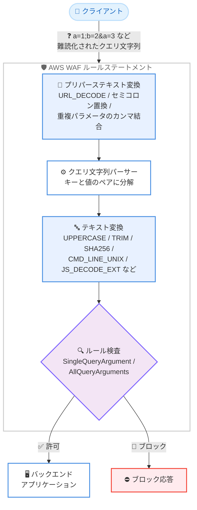

# AWS WAF - プリパーステキスト変換と 10 種類の新テキスト変換

**リリース日**: 2026 年 7 月 29 日
**サービス**: AWS WAF
**機能**: プリパーステキスト変換 (Pre-parse Text Transformations) および新規テキスト変換

📊 [このアップデートのインフォグラフィックを見る](https://takech9203.github.io/aws-news-summary/20260729-aws-waf.html)

## 概要

AWS WAF が、クエリ文字列をパース (解析) する前に正規化を行う「プリパーステキスト変換」と、あらゆるルールステートメントで利用可能な 10 種類の新しいテキスト変換を発表しました。これらの機能により、AWS WAF はアプリケーションがリクエストを解釈するのと同じ方法でリクエストを検査できるようになり、WAF とバックエンドのパーサーの解釈差を悪用する攻撃への防御が強化されます。

プリパーステキスト変換は、AWS WAF が生のクエリ文字列をキーと値のペアに分解する前に正規化を適用する機能です。これにより、HTTP パラメータ汚染 (HTTP Parameter Pollution、HPP) やパーサー差分 (parser differential) を悪用した検査回避のギャップを塞ぐことができます。最大 10 個の変換をチェーンでき、単一のルールステートメント内で従来のパース後テキスト変換と組み合わせて使用できます。

また、新たに追加された 10 種類のテキスト変換には、Uppercase、Trim、Remove Whitespace、SHA256 といった業界標準のオプションに加え、Amazon Threat Research Team が開発した OS を考慮したコマンドライン変換 (Unix/Windows) や JavaScript デコード関数が含まれます。これらは ModSecurity v3 との互換性 (パリティ) を意識したオプションであり、既存の WAF ルールからの移行にも有効です。

**アップデート前の課題**

- クエリ文字列のパース方法が WAF とバックエンドアプリケーションで異なる場合 (パーサー差分)、攻撃者がその差を悪用して検査を回避できる可能性があった
- 重複したクエリパラメータ (例: `a=1&a=3`) を .NET、API Gateway、Express.js などのバックエンドが結合して解釈する一方、WAF は個別に検査するため、HTTP パラメータ汚染攻撃への対策が難しかった
- セミコロンをパラメータ区切り文字として扱うフレームワーク (API Gateway REST API など) と WAF の解釈が一致せず、検査の抜け道となり得た
- Uppercase、Trim、SHA256 など ModSecurity v3 で利用可能な一部のテキスト変換が AWS WAF になく、移行や高度な正規化に制約があった
- OS 固有のコマンドラインエスケープ (Windows のキャレット継続行など) を考慮したデコードができなかった

**アップデート後の改善**

- 生のクエリ文字列に対して URL デコード、重複パラメータのカンマ結合、セミコロンからアンパサンドへの置換などをパース前に適用でき、バックエンドと同じ解釈で検査できるようになった
- 最大 10 個のプリパース変換をチェーンし、さらにパース後のテキスト変換を同一ルールステートメント内で重ねられるようになった
- UPPERCASE、TRIM、TRIM_LEFT、TRIM_RIGHT、REMOVE_WHITESPACE、SHA256、REMOVE_COMMENTS_CHAR、JS_DECODE_EXT、CMD_LINE_UNIX、CMD_LINE_WIN の 10 種類の変換が追加され、ModSecurity v3 相当の正規化が可能になった
- Amazon Threat Research Team 開発の OS 対応コマンドライン変換により、Unix/Windows それぞれのコマンドインジェクション難読化への耐性が向上した

## アーキテクチャ図



プリパーステキスト変換は生のクエリ文字列に対してパース前に適用され、その後パーサーがキーと値のペアに分解し、従来のテキスト変換を経てルール検査が行われます。これによりバックエンドのパース挙動と WAF の検査を一致させることができます。

## サービスアップデートの詳細

### 主要機能

1. **プリパーステキスト変換 (Pre-parse Text Transformations)**
   - 生のクエリ文字列を WAF がパースする前に正規化する新しい変換ステージ
   - リクエストコンポーネントが `SingleQueryArgument` または `AllQueryArguments` の場合にのみ使用可能
   - 1 つのルールステートメントあたり最大 10 個までチェーン可能
   - API では `PreParseTextTransformations` 設定 (オプション) で構成し、未指定時は `NONE` (無変換) がデフォルト

2. **利用可能なプリパース変換タイプ**
   - `URL_DECODE`: %HH シーケンスをデコード (例: %26 → &、%3D → =)。エンコードで隠されていたパラメータ境界を露出させる
   - `URL_DECODE_UNI`: `URL_DECODE` に加え、Unicode エンコード (%uHHHH) もデコード
   - `COMBINE_DUPLICATE_QUERY_ARGS_BY_COMMA`: 重複するキーの値をカンマで結合 (例: `a=1&b=2&a=3` → `a=1,3&b=2`)。.NET、API Gateway、Express.js のように重複パラメータを配列として結合するバックエンド向け
   - `REPLACE_SEMICOLONS_WITH_AMPERSANDS`: セミコロン (0x3B) をアンパサンド (0x26) に置換。セミコロンを区切り文字として扱う API Gateway REST API などとパースを一致させる

3. **10 種類の新テキスト変換 (すべてのルールステートメントで利用可能)**
   - `UPPERCASE`: 小文字 (a-z) を大文字 (A-Z) に変換
   - `TRIM` / `TRIM_LEFT` / `TRIM_RIGHT`: 入力の両端 / 左端 / 右端の空白を削除
   - `REMOVE_WHITESPACE`: すべての空白文字を削除
   - `SHA256`: 入力データから SHA-256 ハッシュを計算 (raw バイナリ形式)
   - `REMOVE_COMMENTS_CHAR`: 一般的なコメント文字 (`/*`、`*/`、`--`、`#`) を削除
   - `JS_DECODE_EXT`: JavaScript エスケープシーケンスを寛容な実装でデコードし、Windows ファイルパス (`\default` など) を破壊しない
   - `CMD_LINE_UNIX`: Unix/Linux のコマンドライン難読化を正規化 (引用符削除、制御文字のスペース化、小文字化など)
   - `CMD_LINE_WIN`: Windows/PowerShell のコマンドライン難読化を正規化 (キャレット継続行の削除、連続バックスラッシュの単一化など)

4. **変換の組み合わせ**
   - 単一のルールステートメント内で、プリパース変換とパース後のテキスト変換を重ねて適用可能
   - 複数の変換を指定する場合は適用順序 (Priority) を設定

## 技術仕様

### プリパーステキスト変換の仕様

| 項目 | 詳細 |
|------|------|
| 対象リクエストコンポーネント | `SingleQueryArgument`、`AllQueryArguments` のみ |
| 最大チェーン数 | ルールステートメントあたり 10 個 |
| WCU コスト | 変換 1 つあたり 10 WCU |
| デフォルト動作 | `NONE` (生のクエリ文字列をそのままパーサーへ渡す) |
| 適用順序 | プリパース変換 → パース → 通常のテキスト変換 → 検査 |
| 追加料金 | なし (標準の AWS WAF 料金のみ) |

### 新テキスト変換一覧

| 変換タイプ | 説明 |
|-----------|------|
| `UPPERCASE` | 小文字を大文字に変換 |
| `TRIM` | 両端の空白を削除 |
| `TRIM_LEFT` | 左端の空白を削除 |
| `TRIM_RIGHT` | 右端の空白を削除 |
| `REMOVE_WHITESPACE` | すべての空白文字を削除 |
| `SHA256` | SHA-256 ハッシュを計算 |
| `REMOVE_COMMENTS_CHAR` | コメント文字を削除 |
| `JS_DECODE_EXT` | JavaScript エスケープを寛容にデコード |
| `CMD_LINE_UNIX` | Unix コマンドライン難読化を正規化 |
| `CMD_LINE_WIN` | Windows コマンドライン難読化を正規化 |

### API変更履歴

| 日付 | サービス | 変更内容 |
|------|----------|----------|
| 2026/07/29 | [wafv2](https://awsapichanges.com/archive/changes/391890-wafv2.html) | 8 updated api methods - `CheckCapacity`、`CreateRuleGroup`、`CreateWebACL`、`GetRuleGroup`、`GetWebACL`、`GetWebACLForResource`、`UpdateRuleGroup`、`UpdateWebACL` に `PreParseTextTransformations` パラメータと新しい `TextTransformations` タイプが追加 |

### ルールステートメントの設定例

```json
{
  "Name": "block-sqli-with-preparse",
  "Priority": 1,
  "Statement": {
    "SqliMatchStatement": {
      "FieldToMatch": {
        "AllQueryArguments": {}
      },
      "PreParseTextTransformations": [
        {
          "Priority": 0,
          "Type": "REPLACE_SEMICOLONS_WITH_AMPERSANDS"
        },
        {
          "Priority": 1,
          "Type": "COMBINE_DUPLICATE_QUERY_ARGS_BY_COMMA"
        }
      ],
      "TextTransformations": [
        {
          "Priority": 0,
          "Type": "URL_DECODE"
        },
        {
          "Priority": 1,
          "Type": "CMD_LINE_UNIX"
        }
      ]
    }
  },
  "Action": {
    "Block": {}
  },
  "VisibilityConfig": {
    "SampledRequestsEnabled": true,
    "CloudWatchMetricsEnabled": true,
    "MetricName": "block-sqli-with-preparse"
  }
}
```

## 設定方法

### 前提条件

1. AWS WAF (WAFV2) の Web ACL またはルールグループが作成済みであること
2. `wafv2:UpdateWebACL` または `wafv2:UpdateRuleGroup` の IAM 権限があること
3. Web ACL の WCU 上限に追加分 (変換 1 つあたり 10 WCU) の余裕があること

### 手順

#### ステップ1: 現在の Web ACL 設定を取得

```bash
aws wafv2 get-web-acl \
  --name my-web-acl \
  --scope REGIONAL \
  --id <web-acl-id>
```

既存の Web ACL の定義と `LockToken` を取得します。`LockToken` は更新時に必要です。CloudFront 用の場合は `--scope CLOUDFRONT` を指定します。

#### ステップ2: 必要な WCU を事前に確認

```bash
aws wafv2 check-capacity \
  --scope REGIONAL \
  --rules file://rules-with-preparse.json
```

プリパーステキスト変換と新しいテキスト変換を追加したルール定義に必要な WCU を計算します。各変換は 10 WCU を消費するため、Web ACL の上限を超えないことを確認します。

#### ステップ3: Web ACL を更新

```bash
aws wafv2 update-web-acl \
  --name my-web-acl \
  --scope REGIONAL \
  --id <web-acl-id> \
  --lock-token <lock-token> \
  --default-action Allow={} \
  --visibility-config SampledRequestsEnabled=true,CloudWatchMetricsEnabled=true,MetricName=my-web-acl \
  --rules file://rules-with-preparse.json
```

`PreParseTextTransformations` を含むルール定義で Web ACL を更新します。適用後は CloudWatch メトリクスとサンプルリクエストで、意図したとおりにリクエストが検査されているかを確認します。

#### ステップ4: Count モードでの検証 (推奨)

新しい変換を追加したルールは、まず `Count` アクションで動作を検証し、誤検知がないことを確認してから `Block` に切り替えることを推奨します。

## メリット

### ビジネス面

- **セキュリティ回避リスクの低減**: HTTP パラメータ汚染やパーサー差分を悪用した WAF 回避攻撃への防御が強化され、Web アプリケーションの保護水準が向上する
- **追加コストなし**: 標準の AWS WAF 料金内で利用でき、追加料金は発生しない
- **移行の容易さ**: ModSecurity v3 相当の変換が揃ったことで、オンプレミスやサードパーティ WAF からの移行時にルールの互換性を保ちやすい

### 技術面

- **バックエンドとの解釈一致**: .NET、API Gateway、Express.js など重複パラメータを結合するフレームワークや、セミコロン区切りを許容するサービスと同じ解釈で検査できる
- **柔軟な変換チェーン**: プリパース変換 (最大 10 個) とパース後変換を単一ルールステートメント内で組み合わせられる
- **OS を考慮した正規化**: Amazon Threat Research Team 開発の `CMD_LINE_UNIX` / `CMD_LINE_WIN` により、OS 固有のコマンドインジェクション難読化 (キャレット継続行、連続バックスラッシュなど) に対応できる

## デメリット・制約事項

### 制限事項

- プリパーステキスト変換は `SingleQueryArgument` または `AllQueryArguments` をフィールドに指定した場合のみ使用可能 (Body や Header には適用不可)
- プリパース変換はルールステートメントあたり最大 10 個まで
- 各変換は 10 WCU を消費するため、多用すると Web ACL の WCU 上限に影響する

### 考慮すべき点

- バックエンドの実際のパース挙動 (重複パラメータの扱い、セミコロンの解釈) を確認したうえで、それに一致する変換を選択する必要がある
- 変換の適用順序 (Priority) によって検査結果が変わるため、設計時に順序を明確にする
- 新しい変換の適用直後は誤検知の可能性があるため、Count モードでの検証を経てから Block へ移行することが望ましい

## ユースケース

### ユースケース1: HTTP パラメータ汚染 (HPP) 対策

**シナリオ**: Express.js ベースの API で、攻撃者が `id=1&id=1' OR '1'='1` のように同名パラメータを複数送信し、バックエンドでは配列として結合されるが WAF は個別に検査するため SQL インジェクションが検出されない。

**実装例**:
```json
"PreParseTextTransformations": [
  { "Priority": 0, "Type": "COMBINE_DUPLICATE_QUERY_ARGS_BY_COMMA" }
]
```

**効果**: WAF がバックエンドと同様に重複パラメータを結合した状態 (`id=1,1' OR '1'='1`) で検査するため、分割による回避を防止できる。

### ユースケース2: API Gateway のセミコロン区切りを悪用した回避の防止

**シナリオ**: API Gateway REST API はセミコロンをパラメータ区切りとして扱うが、WAF は既定ではそう解釈しないため、`q=safe;cmd=rm -rf` のような攻撃ペイロードが検査をすり抜ける。

**実装例**:
```json
"PreParseTextTransformations": [
  { "Priority": 0, "Type": "REPLACE_SEMICOLONS_WITH_AMPERSANDS" }
],
"TextTransformations": [
  { "Priority": 0, "Type": "URL_DECODE" },
  { "Priority": 1, "Type": "CMD_LINE_UNIX" }
]
```

**効果**: セミコロンをアンパサンドに正規化してからパースし、さらに Unix コマンドライン正規化を適用することで、区切り文字の解釈差とコマンド難読化の両方に対処できる。

### ユースケース3: Windows 環境向けコマンドインジェクション対策

**シナリオ**: Windows サーバー上で稼働するアプリケーションに対し、攻撃者がキャレット (`^`) による行継続や連続バックスラッシュを使って PowerShell コマンドを難読化して注入を試みる。

**実装例**:
```json
"TextTransformations": [
  { "Priority": 0, "Type": "URL_DECODE" },
  { "Priority": 1, "Type": "CMD_LINE_WIN" }
]
```

**効果**: キャレット継続行の削除、連続バックスラッシュの単一化、小文字化などにより難読化が解除され、正規表現やマッチルールで攻撃パターンを確実に検出できる。

## 料金

追加料金はありません。標準の AWS WAF 料金 (Web ACL、ルール、リクエスト数に基づく課金) の範囲内で利用できます。

なお、各テキスト変換およびプリパーステキスト変換は 1 つあたり 10 WCU を消費します。WCU は Web ACL のキャパシティ管理に影響しますが、既定の WCU 上限内であれば追加費用は発生しません。

## 利用可能リージョン

すべての AWS リージョンで利用可能です (CloudFront スコープを含む)。

## 関連サービス・機能

- **Amazon CloudFront**: CloudFront ディストリビューションに関連付けた Web ACL でも本機能を利用可能
- **Amazon API Gateway**: セミコロン区切りや重複パラメータの結合など、API Gateway 固有のパース挙動に合わせた正規化が可能
- **Application Load Balancer / AWS AppSync / Amazon Cognito**: AWS WAF を関連付け可能なリソースすべてで新しい変換を活用できる
- **AWS Firewall Manager**: 組織全体の WAF ポリシーに新しい変換を組み込んで一元管理できる

## 参考リンク

- 📊 [インフォグラフィック](https://takech9203.github.io/aws-news-summary/20260729-aws-waf.html)
- [公式発表 (What's New)](https://aws.amazon.com/about-aws/whats-new/2026/07/aws-waf/)
- [ドキュメント: プリパーステキスト変換](https://docs.aws.amazon.com/waf/latest/developerguide/waf-rule-statement-preparse-transformation.html)
- [ドキュメント: テキスト変換](https://docs.aws.amazon.com/waf/latest/developerguide/waf-rule-statement-transformation.html)
- [ドキュメント: AWS WAF の開始方法](https://docs.aws.amazon.com/waf/latest/developerguide/getting-started.html)
- [API 変更履歴 (awsapichanges.com)](https://awsapichanges.com/archive/changes/391890-wafv2.html)
- [料金ページ](https://aws.amazon.com/waf/pricing/)

## まとめ

本アップデートにより、AWS WAF はクエリ文字列のパース前正規化と ModSecurity v3 相当の豊富なテキスト変換を備え、パーサー差分や HTTP パラメータ汚染を悪用した WAF 回避攻撃への防御が大きく強化されました。API Gateway、Express.js、.NET など重複パラメータやセミコロン区切りを許容するバックエンドを保護している場合は、バックエンドのパース挙動を確認のうえ、Count モードでの検証を経てプリパーステキスト変換の導入を検討することを推奨します。
