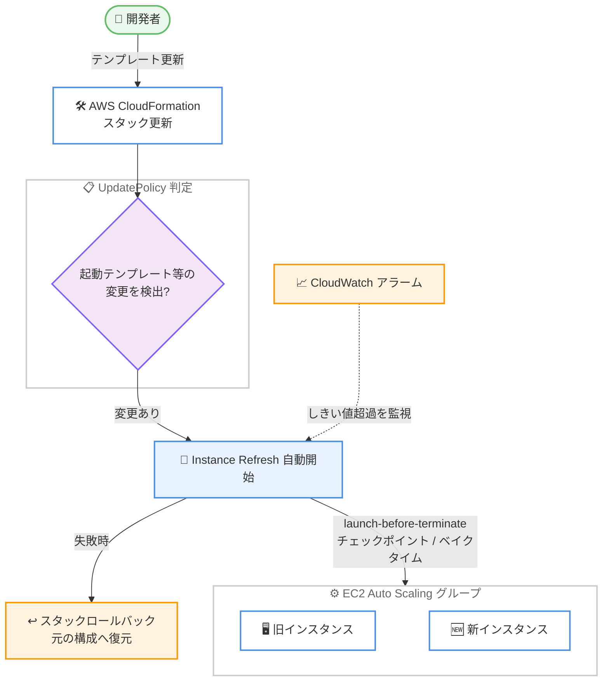

# Amazon EC2 Auto Scaling - CloudFormation での Instance Refresh サポート

**リリース日**: 2026 年 7 月 29 日
**サービス**: Amazon EC2 Auto Scaling / AWS CloudFormation
**機能**: AutoScalingInstanceRefresh 更新ポリシー (CloudFormation UpdatePolicy)

📊 [このアップデートのインフォグラフィックを見る](https://takech9203.github.io/aws-news-summary/20260729-ec2-auto-scaling-instance-refresh-cloudformation.html)

## 概要

Amazon EC2 Auto Scaling が、AWS CloudFormation の新しい更新ポリシー `AutoScalingInstanceRefresh` をサポートしました。CloudFormation スタックの更新でインスタンスの置き換えが必要なプロパティ (起動テンプレートやサブネット構成など) が変更されると、CloudFormation が自動的に Instance Refresh をトリガーし、Auto Scaling グループ内のインスタンスを安全にローリング置換します。

この統合により、Instance Refresh が持つ豊富なデプロイ制御機能 (ルートボリューム置換によるインプレース更新、起動後終了 (launch-before-terminate) による容量維持、CloudWatch アラームによる監視、チェックポイントとベイクタイムによる段階的ロールアウト) を CloudFormation のワークフロー内で直接利用できるようになります。更新中もスケーリングポリシーやヘルスチェックなどの Auto Scaling 機能は有効なまま維持され、問題が発生した場合は CloudFormation の標準的なスタックロールバックによって元の構成に復元されます。

Infrastructure as Code (IaC) で EC2 Auto Scaling を管理しているユーザーにとって、AMI 更新やインスタンスタイプ変更のデプロイを CloudFormation だけで完結できる、待望のアップデートです。

**アップデート前の課題**

- CloudFormation で Auto Scaling グループのインスタンスを置き換えるには、`AutoScalingRollingUpdate` または `AutoScalingReplacingUpdate` ポリシーを使う必要があり、Instance Refresh 固有の機能 (スキップマッチング、チェックポイント、アラームベースの自動監視、ルートボリューム置換など) を利用できなかった
- Instance Refresh を使いたい場合は、スタック更新後に `StartInstanceRefresh` API を別途呼び出す運用 (カスタムリソースや CI/CD パイプラインでの追加ステップ) が必要だった
- `AutoScalingRollingUpdate` では更新中に一部の Auto Scaling プロセスを停止 (SuspendProcesses) することが一般的で、更新中のスケーリング動作に制約があった

**アップデート後の改善**

- CloudFormation テンプレートの `UpdatePolicy` に `AutoScalingInstanceRefresh` を宣言するだけで、スタック更新時に Instance Refresh が自動実行されるようになった
- launch-before-terminate (MinHealthyPercentage 100 / MaxHealthyPercentage 最大 200) により、容量を維持したままインスタンスを置き換えられるようになった
- CloudWatch アラーム監視、チェックポイントとベイクタイムによる段階的デプロイを IaC で宣言的に構成できるようになった
- 更新中もスケーリングポリシーとヘルスチェックが有効なまま維持され、失敗時は CloudFormation スタックロールバックで自動復旧できるようになった

## アーキテクチャ図



CloudFormation スタック更新でインスタンス置き換えが必要なプロパティ変更を検出すると、Instance Refresh が自動的に開始され、CloudWatch アラーム監視のもとで段階的にインスタンスが置き換えられる流れを示しています。

## サービスアップデートの詳細

### 主要機能

1. **AutoScalingInstanceRefresh 更新ポリシー**
   - `AWS::AutoScaling::AutoScalingGroup` リソースの `UpdatePolicy` 属性に宣言する新しいポリシー
   - 以下のプロパティが変更された場合に Instance Refresh を自動トリガー: `LaunchTemplate`、`MixedInstancesPolicy`、`VPCZoneIdentifier`、`AvailabilityZones`、`AvailabilityZoneIds`、`PlacementGroup`
   - `Strategy` として `Rolling` (通常のインスタンス置換) と `ReplaceRootVolume` (ルートボリュームのみ置換するインプレース更新) を選択可能

2. **柔軟なデプロイ制御 (Preferences)**
   - `MinHealthyPercentage` / `MaxHealthyPercentage`: 健全なインスタンスの下限・上限割合を指定。100/200 の組み合わせで launch-before-terminate (新インスタンス起動後に旧インスタンスを終了) を実現
   - `CheckpointPercentages` / `CheckpointDelay`: 置き換えの進捗しきい値ごとに一時停止する段階的デプロイ
   - `BakeTime`: リフレッシュ完了前の待機時間 (最大 172,800 秒 = 48 時間) を設けて安定性を確認
   - `SkipMatching` (デフォルト `true`): テンプレートの構成にすでに一致しているインスタンスの置き換えをスキップ
   - `ScaleInProtectedInstances` / `StandbyInstances`: スケールイン保護中や Standby 状態のインスタンスの扱いを指定 (Refresh / Ignore / Wait、デフォルト Wait)

3. **CloudWatch アラームによる監視とロールバック**
   - `AlarmSpecification` に最大 10 個の CloudWatch アラームを指定可能
   - リフレッシュ中にアラームのしきい値を超えた場合、CloudFormation がスタックをロールバックし、新しい Instance Refresh を開始して元の構成へ復元
   - 更新中もスケーリングポリシーとヘルスチェックは有効なまま維持される

4. **インスタンス準備完了の確認 (lifecycle hook 連携)**
   - Instance Refresh は `cfn-signal` ヘルパースクリプトをサポートしない
   - アプリケーションのブートストラップ完了を待つには `autoscaling:EC2_INSTANCE_LAUNCHING` ライフサイクルフックを使用し、`CompleteLifecycleAction` API で完了を通知する

## 技術仕様

### AutoScalingInstanceRefresh ポリシーのプロパティ

| プロパティ | 説明 | デフォルト / 制約 |
|------|------|------|
| `Strategy` (必須) | `Rolling` または `ReplaceRootVolume` | - |
| `Preferences.MinHealthyPercentage` | 稼働を維持する健全インスタンスの最小割合 | Rolling: 100、ReplaceRootVolume: 90 (0-100) |
| `Preferences.MaxHealthyPercentage` | 置き換え中に許容する最大割合 | Rolling: 110、ReplaceRootVolume: 100 (100-200) |
| `Preferences.InstanceWarmup` | 新インスタンス InService 後の待機時間 (秒) | 未指定時は `DefaultInstanceWarmup` → `HealthCheckGracePeriod` の順に使用 |
| `Preferences.CheckpointPercentages` | チェックポイントのしきい値 (昇順、全置換には最後を 100 に) | - |
| `Preferences.CheckpointDelay` | チェックポイント後の待機時間 (秒) | 3,600 (0-172,800) |
| `Preferences.BakeTime` | 完了前の待機時間 (秒) | 0 (0-172,800) |
| `Preferences.AlarmSpecification.Alarms` | 監視する CloudWatch アラーム名 | 最大 10 個 |
| `Preferences.SkipMatching` | 構成が一致するインスタンスの置換をスキップ | `true` |
| `Preferences.ScaleInProtectedInstances` | スケールイン保護インスタンスの扱い | `Wait` (Refresh / Ignore / Wait) |
| `Preferences.StandbyInstances` | Standby インスタンスの扱い | `Wait` (Terminate / Ignore / Wait) |

### テンプレート構文 (YAML)

```yaml
UpdatePolicy:
  AutoScalingInstanceRefresh:
    Strategy: Rolling
    Preferences:
      AlarmSpecification:
        Alarms:
          - my-cloudwatch-alarm
      BakeTime: 600
      CheckpointDelay: 300
      CheckpointPercentages:
        - 33
        - 66
        - 100
      InstanceWarmup: 120
      MaxHealthyPercentage: 200
      MinHealthyPercentage: 100
      ScaleInProtectedInstances: Wait
      SkipMatching: true
      StandbyInstances: Wait
```

## 設定方法

### 前提条件

1. `AWS::AutoScaling::AutoScalingGroup` リソースを含む CloudFormation スタックがあること
2. 同一の Auto Scaling グループに `AutoScalingRollingUpdate` ポリシーを併用していないこと (併用するとスタック更新が失敗する)
3. アラームベースのロールバックを使用する場合は、監視対象の CloudWatch アラームを事前に作成しておくこと

### 手順

#### ステップ 1: テンプレートに UpdatePolicy を追加

```yaml
ASG:
  Type: AWS::AutoScaling::AutoScalingGroup
  Properties:
    VPCZoneIdentifier:
      - subnet-aaa
      - subnet-bbb
    LaunchTemplate:
      LaunchTemplateId: !Ref MyLaunchTemplate
      Version: !GetAtt MyLaunchTemplate.LatestVersionNumber
    MaxSize: '4'
    MinSize: '1'
  UpdatePolicy:
    AutoScalingInstanceRefresh:
      Strategy: Rolling
      Preferences:
        MinHealthyPercentage: 100
        MaxHealthyPercentage: 200
        SkipMatching: true
```

Auto Scaling グループのリソース定義に `AutoScalingInstanceRefresh` ポリシーを追加します。この例では launch-before-terminate 構成 (新インスタンスの起動後に旧インスタンスを終了) で容量を維持しながら置き換えを行います。

#### ステップ 2: スタックを更新

```bash
aws cloudformation update-stack \
  --stack-name my-asg-stack \
  --template-body file://template.yaml \
  --capabilities CAPABILITY_IAM
```

起動テンプレートの AMI 変更など、Instance Refresh のトリガー対象プロパティを変更してスタックを更新します。CloudFormation が変更を検出し、Instance Refresh を自動的に開始します。

#### ステップ 3: 進捗の確認

```bash
aws autoscaling describe-instance-refreshes \
  --auto-scaling-group-name my-asg
```

Instance Refresh の進捗状況 (置き換え済みインスタンスの割合、ステータス) を確認します。スタックイベント (`aws cloudformation describe-stack-events`) からも更新の進行状況を追跡できます。

## メリット

### ビジネス面

- **デプロイの安全性向上**: アラーム監視、チェックポイント、ベイクタイムにより、問題を早期に検出して自動ロールバックできるため、AMI 更新に伴う障害リスクを低減できる
- **運用工数の削減**: スタック更新後に Instance Refresh を手動または CI/CD で別途起動する追加ステップが不要になる
- **可用性の維持**: launch-before-terminate により、置き換え中も必要な容量を維持したままデプロイできる

### 技術面

- **IaC の一貫性**: インスタンス置き換えの戦略までテンプレートで宣言的に管理でき、環境間の構成差異を防げる
- **スケーリング機能の継続**: `AutoScalingRollingUpdate` と異なり、更新中もスケーリングポリシーやヘルスチェックが有効なまま動作する
- **効率的な置き換え**: `SkipMatching` により、すでに目的の構成に一致するインスタンスの不要な置き換えをスキップできる
- **インプレース更新**: `ReplaceRootVolume` 戦略により、AMI の変更のみの場合はインスタンス自体を置き換えずルートボリュームだけを更新できる

## デメリット・制約事項

### 制限事項

- `AutoScalingInstanceRefresh` と `AutoScalingRollingUpdate` を同じ Auto Scaling グループに同時指定できない (指定するとスタック更新が失敗)
- CloudFormation が開始した Instance Refresh に対して Auto Scaling の `RollbackInstanceRefresh` API は使用できない (取り消しは `CancelInstanceRefresh` API またはスタックロールバックで行う)
- Auto Scaling グループで同時に実行できる Instance Refresh は 1 つのみ。ユーザーが開始した Instance Refresh の実行中にスタック更新を開始すると失敗する可能性がある
- `ReplaceRootVolume` 戦略では、起動テンプレートまたは混合インスタンスポリシー内の `ImageId` の変更のみが許可される
- Instance Refresh は `cfn-signal` ヘルパースクリプトをサポートしない (代わりにライフサイクルフックを使用)
- スタック更新の各方向 (フォワード / ロールバック) は CloudFormation のリソースタイムアウトである 36 時間が上限

### 考慮すべき点

- 長時間の Instance Refresh は CloudFormation が使用する一時認証情報の有効期限を超える可能性があるため、スタックにサービスロールを設定することが推奨される
- `InstanceWarmup` を指定しない場合、`DefaultInstanceWarmup` → `HealthCheckGracePeriod` の順で値が使用される。すべてのケースで `DefaultInstanceWarmup` の設定が推奨される
- 既存の `AutoScalingRollingUpdate` からの移行時は、`SuspendProcesses` や `WaitOnResourceSignals` に依存した運用 (cfn-signal ベースの検証) をライフサイクルフックベースへ見直す必要がある

## ユースケース

### ユースケース 1: AMI の定期更新を安全にデプロイ

**シナリオ**: セキュリティパッチ適用済みのゴールデン AMI を毎月ロールアウトする。デプロイ起因のエラー増加を自動検出してロールバックしたい。

**実装例**:
```yaml
UpdatePolicy:
  AutoScalingInstanceRefresh:
    Strategy: Rolling
    Preferences:
      CheckpointPercentages: [33, 66, 100]
      CheckpointDelay: 300
      BakeTime: 600
      AlarmSpecification:
        Alarms:
          - high-5xx-error-rate-alarm
```

**効果**: 33%、66%、100% の各チェックポイントで 5 分間停止し、エラー率アラームが発火した場合は自動的にスタックロールバックが実行され、旧 AMI の構成に復元される。

### ユースケース 2: 容量を維持したままインスタンスタイプを変更

**シナリオ**: ピークトラフィックを処理中のサービスで、旧世代インスタンスから Graviton ベースのインスタンスへ移行したい。置き換え中も処理能力を落とせない。

**実装例**:
```yaml
UpdatePolicy:
  AutoScalingInstanceRefresh:
    Strategy: Rolling
    Preferences:
      MinHealthyPercentage: 100
      MaxHealthyPercentage: 200
      InstanceWarmup: 180
```

**効果**: launch-before-terminate 動作により、新インスタンスが InService になってから旧インスタンスが終了するため、置き換え中も希望容量の 100% を常に維持できる。

### ユースケース 3: AMI のみの変更をルートボリューム置換で高速適用

**シナリオ**: インスタンスストアのローカルデータやネットワーク接続を維持したまま、OS イメージのみを更新したい。

**実装例**:
```yaml
UpdatePolicy:
  AutoScalingInstanceRefresh:
    Strategy: ReplaceRootVolume
    Preferences:
      MinHealthyPercentage: 90
      MaxHealthyPercentage: 100
```

**効果**: インスタンス自体を置き換えずにルートボリュームのみを新しい AMI の内容に置換するインプレース更新が行われ、置き換えに伴うインスタンス起動のオーバーヘッドを削減できる。

## 料金

追加料金なしで利用できます。CloudFormation および EC2 Auto Scaling 自体にも追加料金はなく、起動される EC2 インスタンスや EBS ボリュームなどの基盤リソースに対する通常の料金のみが発生します。launch-before-terminate (MaxHealthyPercentage が 100 超) を使用する場合、置き換え中は一時的にインスタンス数が増加するため、その分の EC2 料金が発生する点に留意してください。

## 利用可能リージョン

すべての AWS リージョンで利用可能です。

## 関連サービス・機能

- **AWS CloudFormation**: `UpdatePolicy` 属性のひとつとして今回の `AutoScalingInstanceRefresh` ポリシーが追加された。既存の `AutoScalingRollingUpdate` / `AutoScalingReplacingUpdate` に代わる選択肢となる
- **EC2 Auto Scaling Instance Refresh**: 本アップデートの基盤機能。API (`StartInstanceRefresh` など) から直接利用する方法は従来どおり利用可能
- **Amazon CloudWatch**: `AlarmSpecification` によるデプロイ監視と自動ロールバックのトリガーとして連携
- **EC2 Auto Scaling ライフサイクルフック**: cfn-signal の代替として、インスタンスのブートストラップ完了を Instance Refresh に通知する手段

## 参考リンク

- 📊 [インフォグラフィック](https://takech9203.github.io/aws-news-summary/20260729-ec2-auto-scaling-instance-refresh-cloudformation.html)
- [公式発表 (What's New)](https://aws.amazon.com/about-aws/whats-new/2026/07/ec2-auto-scaling-instance-refresh-cloudformation)
- [AutoScalingInstanceRefresh 更新ポリシー (CloudFormation Template Reference)](https://docs.aws.amazon.com/AWSCloudFormation/latest/TemplateReference/aws-attribute-updatepolicy.html#cfn-attributes-updatepolicy-instancerefresh)
- [Instance Refresh を使用した Auto Scaling グループのインスタンス更新 (EC2 Auto Scaling User Guide)](https://docs.aws.amazon.com/autoscaling/ec2/userguide/asg-instance-refresh.html)
- [Instance Refresh 中のルートボリューム置換 (EC2 Auto Scaling User Guide)](https://docs.aws.amazon.com/autoscaling/ec2/userguide/replace-root-volume.html)
- [自動ロールバック付き Instance Refresh の開始 (EC2 Auto Scaling User Guide)](https://docs.aws.amazon.com/autoscaling/ec2/userguide/instance-refresh-rollback.html)

## まとめ

CloudFormation の `AutoScalingInstanceRefresh` 更新ポリシーにより、Instance Refresh の高度なデプロイ制御 (launch-before-terminate、チェックポイント、アラーム監視、ルートボリューム置換) を IaC で宣言的に利用できるようになりました。現在 `AutoScalingRollingUpdate` を使用している場合は、スケーリング機能を維持したまま更新できる本ポリシーへの移行を検討する価値があります。まずは非本番環境のスタックで `Strategy: Rolling` と `SkipMatching` を有効にした構成から試すことを推奨します。
