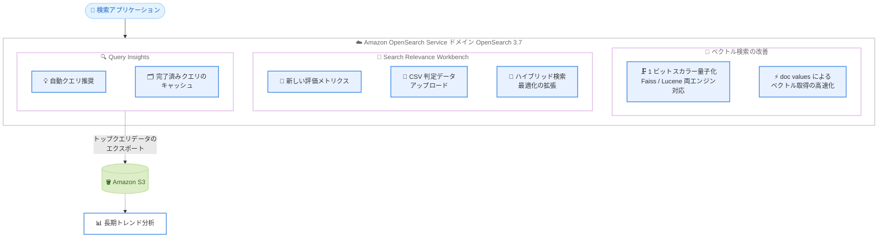

# Amazon OpenSearch Service - OpenSearch 3.7 サポート

**リリース日**: 2026 年 7 月 30 日
**サービス**: Amazon OpenSearch Service
**機能**: OpenSearch バージョン 3.7 のサポート

📊 [このアップデートのインフォグラフィックを見る](https://takech9203.github.io/aws-news-summary/20260730-amazon-opensearch-service.html)

## 概要

Amazon OpenSearch Service が OpenSearch バージョン 3.7 をサポートしました。OpenSearch 3.7 は、ベクトル検索のパフォーマンス、検索関連性 (Search Relevance)、Query Insights の 3 つの領域で大きな改善をもたらすリリースです。

ベクトル検索では、Faiss および Lucene の両エンジンで 1 ビットスカラー量子化 (1-bit Scalar Quantization) が利用可能になり、検索精度を維持しながらベクトルワークロードのストレージとメモリ使用量を大幅に削減できます。また、ドキュメントソースではなく doc values からベクトルを取得する方式により、再インデックスなしでベクトル取得が高速化されます。生成 AI アプリケーションのセマンティック検索や RAG (検索拡張生成) 基盤として OpenSearch を利用しているユーザーにとって、コスト効率とパフォーマンスの両面で恩恵があるアップデートです。

さらに、検索品質の評価と改善を支援する Search Relevance Workbench の機能拡張や、高コストなクエリの特定と長期的なトレンド分析を可能にする Query Insights の強化も含まれており、検索アプリケーションの運用者と開発者の双方に価値があります。

**アップデート前の課題**

- ベクトルデータは float32 などの高精度形式で保持され、大規模なベクトルワークロードではメモリとストレージのコストが高くなりがちだった
- ベクトルの取得はドキュメントソース (_source) 経由で行われ、大量のベクトル取得時にオーバーヘッドが発生していた
- Search Relevance Workbench での検索品質評価は、利用できる評価メトリクスや判定データの取り込み手段が限られていた
- Query Insights で確認できるのは主に実行中や直近のクエリ情報であり、完了済みクエリの参照や長期トレンド分析のためのデータエクスポート手段が不足していた

**アップデート後の改善**

- 1 ビットスカラー量子化により、検索精度を犠牲にすることなくベクトルのストレージとメモリ要件を削減できるようになった
- doc values を利用したベクトル取得により、再インデックス不要でベクトル取得のパフォーマンスが向上した
- Search Relevance Workbench に新しい評価メトリクス、CSV 形式の判定データアップロード、ハイブリッド検索最適化の拡張が追加され、検索品質の評価と改善が容易になった
- Query Insights に自動クエリ推奨、完了済みクエリのキャッシュ、トップクエリデータの Amazon S3 エクスポートが追加され、高コストクエリの特定と長期分析が可能になった

## アーキテクチャ図



OpenSearch 3.7 で強化された 3 つの領域 (ベクトル検索、Search Relevance Workbench、Query Insights) と、Query Insights から Amazon S3 へのトップクエリデータエクスポートの流れを示しています。

## サービスアップデートの詳細

### 主要機能

1. **1 ビットスカラー量子化によるベクトル圧縮**
   - Faiss エンジンと Lucene エンジンの両方で 1 ビットスカラー量子化が利用可能
   - ベクトルを 1 ビット表現に圧縮することで、ベクトルワークロードのストレージとメモリ要件を削減
   - 検索精度を維持したままコスト効率を改善できるため、大規模なベクトルデータベース用途に有効

2. **doc values を利用したベクトル取得の高速化**
   - ドキュメントソース (_source) ではなく doc values からベクトルを取得する方式をサポート
   - ベクトル取得のパフォーマンスが向上
   - 既存インデックスの再インデックスは不要で、この改善を利用可能

3. **Search Relevance Workbench の機能拡張**
   - 新しい評価メトリクスの追加により、検索品質の多角的な評価が可能
   - CSV 形式での判定データ (judgment) アップロードに対応し、既存の評価データセットを取り込みやすくなった
   - ハイブリッド検索 (キーワード検索とベクトル検索の組み合わせ) の最適化機能が拡張され、検索品質の評価と改善を支援

4. **Query Insights の強化**
   - 自動クエリ推奨により、クエリ改善のための提案を自動的に取得可能
   - 完了済みクエリのキャッシュにより、最近完了したクエリを確認可能
   - トップクエリデータを Amazon S3 にエクスポートでき、高コストなクエリの特定や長期的なトレンド分析に活用可能

## 技術仕様

### OpenSearch 3.7 の改善領域

| 領域 | 改善内容 |
|------|----------|
| ベクトル検索 | 1 ビットスカラー量子化 (Faiss / Lucene)、doc values によるベクトル取得 |
| 検索関連性 | Search Relevance Workbench の評価メトリクス追加、CSV 判定データアップロード、ハイブリッド検索最適化の拡張 |
| クエリ運用 | Query Insights の自動クエリ推奨、完了済みクエリキャッシュ、S3 へのトップクエリエクスポート |

### サポートされるアップグレードパス

| 現行バージョン | アップグレード先 | 備考 |
|----------------|------------------|------|
| OpenSearch 3.x | OpenSearch 3.7 | インプレースアップグレードが可能 |
| OpenSearch 2.19 | OpenSearch 3.7 | 非互換のインデックス設定の事前削除が必要な場合がある |
| OpenSearch 1.3 / 2.x (2.19 未満) | OpenSearch 2.19 経由 | まず 2.19 にアップグレードしてから 3.x へ |

**注意**: OpenSearch 1.3、Elasticsearch 7.10 以前で作成されたインデックスが存在する場合、3.x へのアップグレード前に再インデックスが必要です (ホット、UltraWarm、コールドストレージのいずれに配置されていても対象)。

### インプレースアップグレードのプロセス

1. **アップグレード前チェック**: アップグレードを妨げる問題がないか検証
2. **スナップショット取得**: 失敗時の復元用に自動スナップショットを取得
3. **アップグレード実行**: 15 分から数時間程度で完了 (この間 OpenSearch Dashboards が利用できない場合がある)

## 設定方法

### 前提条件

1. Amazon OpenSearch Service ドメインを操作できる IAM 権限があること
2. 既存ドメインをアップグレードする場合、現行バージョンが OpenSearch 2.19 または 3.x であること
3. ドメインのクラスターステータスが正常 (グリーン) であり、構成変更中でないこと

### 手順

#### ステップ 1: 新規ドメインを OpenSearch 3.7 で作成する場合

```bash
aws opensearch create-domain \
  --domain-name my-domain-37 \
  --engine-version "OpenSearch_3.7" \
  --cluster-config InstanceType=r7g.large.search,InstanceCount=3 \
  --ebs-options EBSEnabled=true,VolumeType=gp3,VolumeSize=100
```

`create-domain` API でエンジンバージョンに `OpenSearch_3.7` を指定し、新しいドメインを作成します。

#### ステップ 2: 既存ドメインのアップグレード適格性を確認する場合

```bash
aws opensearch get-compatible-versions \
  --domain-name my-existing-domain
```

`get-compatible-versions` API で、既存ドメインからアップグレード可能なバージョンの一覧を確認します。

#### ステップ 3: 既存ドメインを OpenSearch 3.7 にアップグレード

```bash
aws opensearch upgrade-domain \
  --domain-name my-existing-domain \
  --target-version "OpenSearch_3.7"
```

`upgrade-domain` API でインプレースアップグレードを開始します。アップグレード前チェック、スナップショット取得、アップグレードの順に自動で実行されます。ドライラン (`--perform-check-only`) で事前検証のみ実行することも可能です。

## メリット

### ビジネス面

- **インフラコストの削減**: 1 ビットスカラー量子化によりベクトルワークロードのメモリ・ストレージ要件が下がり、より小さいインスタンス構成での運用が可能になる
- **検索品質の継続的改善**: Search Relevance Workbench の拡張により、検索品質をデータに基づいて評価・改善するサイクルを構築しやすくなる
- **運用コストの可視化**: Query Insights のデータを S3 にエクスポートすることで、高コストクエリの特定と長期的なコスト最適化が可能になる

### 技術面

- **再インデックス不要の性能改善**: doc values によるベクトル取得は既存インデックスのままで利用でき、移行作業なしにパフォーマンスが向上する
- **両エンジン対応の量子化**: Faiss と Lucene のどちらのエンジンを採用していても 1 ビットスカラー量子化を利用できる
- **ハイブリッド検索の最適化**: キーワード検索とベクトル検索を組み合わせたハイブリッド検索の品質評価・最適化手段が拡充される

## デメリット・制約事項

### 制限事項

- OpenSearch 2.19 未満のバージョン (1.3、2.x の旧バージョン) からは、直接 3.7 にアップグレードできず、まず 2.19 へのアップグレードが必要
- OpenSearch 1.3 や Elasticsearch 7.10 以前で作成されたインデックスは 3.x で非サポートのため、アップグレード前に再インデックスまたは削除が必要
- 2.x で非推奨となった一部のインデックス設定が残っていると、アップグレード前チェックで検証エラーになる

### 考慮すべき点

- 1 ビットスカラー量子化は精度への影響が小さいとされるが、ワークロードによってリコール (再現率) への影響度は異なるため、本番適用前に自身のデータセットで検索精度を検証することを推奨
- インプレースアップグレード中は OpenSearch Dashboards が一時的に利用できない場合があるため、メンテナンスウィンドウを考慮する
- Amazon Data Firehose や CloudWatch Logs などからデータをストリーミングしている場合、それらのサービスが新バージョンをサポートしているか事前に確認する
- OpenSearch 3.x には破壊的変更が含まれるため、公式の Breaking Changes ドキュメントの確認が必要

## ユースケース

### ユースケース 1: 大規模 RAG 基盤のメモリコスト削減

**シナリオ**: 数億件の埋め込みベクトルを保持する RAG (検索拡張生成) 基盤で、ベクトルインデックスのメモリコストが課題になっている。

**実装例**:
```json
PUT /my-vector-index
{
  "settings": {
    "index.knn": true
  },
  "mappings": {
    "properties": {
      "my_vector": {
        "type": "knn_vector",
        "dimension": 768,
        "method": {
          "name": "hnsw",
          "engine": "faiss",
          "parameters": {
            "encoder": {
              "name": "sq",
              "parameters": {
                "bits": 1
              }
            }
          }
        }
      }
    }
  }
}
```

**効果**: 1 ビットスカラー量子化によりベクトルのメモリフットプリントを大幅に削減し、検索精度を維持しながらインフラコストを抑制できる。

### ユースケース 2: E コマース検索の品質改善サイクル構築

**シナリオ**: E コマースサイトでキーワード検索とベクトル検索を組み合わせたハイブリッド検索を運用しており、検索品質を定量的に評価・改善したい。

**実装例**:
```
1. 既存の検索評価データ (クエリと正解ドキュメントの判定) を CSV で用意
2. Search Relevance Workbench に CSV 判定データをアップロード
3. 新しい評価メトリクスで現行の検索設定を評価
4. ハイブリッド検索最適化機能で重み付けなどのパラメータを調整
5. 評価メトリクスの改善を確認して本番反映
```

**効果**: 手作業に頼らないデータドリブンな検索品質改善サイクルを構築し、コンバージョン率向上につなげられる。

### ユースケース 3: 高コストクエリの特定と長期トレンド分析

**シナリオ**: ログ分析基盤でクラスター負荷が断続的に上昇しており、原因となるクエリを特定して長期的な傾向を分析したい。

**実装例**:
```
1. Query Insights でトップクエリ (レイテンシー、CPU、メモリ) を確認
2. 完了済みクエリのキャッシュで最近実行されたクエリの詳細を確認
3. トップクエリデータの Amazon S3 エクスポートを設定
4. Amazon Athena などで S3 上のデータをクエリし、長期トレンドを分析
5. 自動クエリ推奨に基づいてクエリを改善
```

**効果**: 高コストなクエリを迅速に特定し、長期データに基づく容量計画とクエリ最適化が可能になる。

## 料金

OpenSearch 3.7 の利用自体に追加料金はありません。Amazon OpenSearch Service の標準料金 (インスタンス時間、EBS ストレージ、データ転送) が適用されます。

なお、1 ビットスカラー量子化によるメモリ・ストレージ要件の削減は、インスタンスサイズやストレージ容量の最適化を通じた間接的なコスト削減につながる可能性があります。また、標準サポートが終了した旧バージョンを使い続けると延長サポート料金が発生するため、最新バージョンへのアップグレードはコスト面でも推奨されます。

詳細は [Amazon OpenSearch Service 料金ページ](https://aws.amazon.com/opensearch-service/pricing/) を参照してください。

## 利用可能リージョン

Amazon OpenSearch Service が利用可能なすべての AWS リージョンで OpenSearch 3.7 を利用できます (東京、大阪リージョンを含む)。

## 関連サービス・機能

- **Amazon S3**: Query Insights のトップクエリデータのエクスポート先として利用
- **Amazon Bedrock**: 埋め込みモデルで生成したベクトルを OpenSearch のベクトル検索と組み合わせて RAG を構築可能
- **Amazon OpenSearch Serverless**: サーバーレスでのベクトル検索・ログ分析の選択肢
- **Amazon CloudWatch**: ドメインのメトリクス監視とアラーム設定

## 参考リンク

- 📊 [インフォグラフィック](https://takech9203.github.io/aws-news-summary/20260730-amazon-opensearch-service.html)
- [公式発表 (What's New)](https://aws.amazon.com/about-aws/whats-new/2026/07/amazon-opensearch-service/)
- [Amazon OpenSearch Service ドメインのアップグレード](https://docs.aws.amazon.com/opensearch-service/latest/developerguide/version-migration.html)
- [OpenSearch ドキュメント: Faiss スカラー量子化](https://docs.opensearch.org/latest/field-types/supported-field-types/knn-methods-engines/)
- [OpenSearch ドキュメント: Search Relevance Workbench](https://docs.opensearch.org/latest/search-plugins/search-relevance/using-search-relevance-workbench/)
- [OpenSearch ドキュメント: Query Insights](https://docs.opensearch.org/latest/observing-your-data/query-insights/index/)
- [料金ページ](https://aws.amazon.com/opensearch-service/pricing/)

## まとめ

OpenSearch 3.7 のサポートにより、Amazon OpenSearch Service 上のベクトル検索ワークロードは 1 ビットスカラー量子化と doc values によるベクトル取得でコスト効率とパフォーマンスが大きく向上します。Search Relevance Workbench と Query Insights の強化は、検索品質とクエリコストの継続的な改善を支援します。ベクトル検索や RAG を運用しているユーザーは、検索精度の検証を行ったうえで、2.19 または 3.x からのインプレースアップグレードによる 3.7 への移行を検討することを推奨します。
