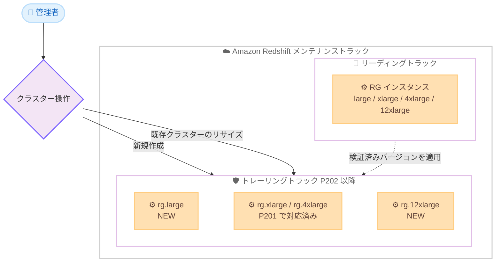

# Amazon Redshift - RG large / 12xlarge インスタンスのトレーリングトラック対応

**リリース日**: 2026 年 7 月 30 日
**サービス**: Amazon Redshift
**機能**: rg.large および rg.12xlarge インスタンスのトレーリングトラック (P202 以降) 提供開始

📊 [このアップデートのインフォグラフィックを見る](https://takech9203.github.io/aws-news-summary/20260730-amazon-redshift-rg-large-12xlarge-trailing-track.html)
<!-- INFOGRAPHIC_BASE_URL は環境変数から取得 -->

## 概要

Amazon Redshift は、AWS Graviton ベースの RG インスタンスのうち、rg.large および rg.12xlarge インスタンスタイプをトレーリングトラック (trailing track) で利用できるようにしました。トレーリングトラックのパッチ P202 以降を実行しているお客様が対象です。

トレーリングトラックは、本番ワークロードの安定性を重視するお客様向けに設計されたメンテナンストラックです。リーディングトラック (leading track) で先行して検証済みのクラスターバージョンが適用されるため、新しいバージョンの成熟を待ってから採用したいお客様に適しています。2026 年 7 月上旬に rg.xlarge および rg.4xlarge がトレーリングトラック (P201) に対応しており、今回のアップデートで小規模向けの rg.large と大規模向けの rg.12xlarge が加わったことで、トレーリングトラックにおける RG インスタンスのサイズ選択肢が拡大しました。

RG インスタンスは AWS Graviton プロセッサを基盤とし、RA3 インスタンスと比較して最大 2.4 倍高速なクエリパフォーマンスを、vCPU あたり 30% 低い価格で提供します。安定性を優先する本番環境でも、小規模から大規模まで幅広いワークロードで Graviton 世代のコストパフォーマンスの恩恵を受けられるようになります。

**アップデート前の課題**

- トレーリングトラックで利用できる RG インスタンスは rg.xlarge と rg.4xlarge に限られ、小規模 (large) や大規模 (12xlarge) のサイズは選択できなかった
- 小規模な開発・検証クラスターや、大規模な本番データウェアハウスをトレーリングトラックで運用するお客様は、RG インスタンスへの移行が難しく RA3 インスタンスを継続利用する必要があった
- リーディングトラックとトレーリングトラックで選択可能な RG インスタンスサイズに差異があった

**アップデート後の改善**

- トレーリングトラック (P202 以降) でも rg.large および rg.12xlarge を利用可能になった
- 小規模から大規模まで、トレーリングトラック上でワークロード規模に応じた RG インスタンスサイズを選択できるようになった
- 安定性を優先する本番ワークロードでも、RA3 比で最大 2.4 倍のクエリ性能と vCPU あたり 30% のコスト削減を幅広いサイズで実現できるようになった

## アーキテクチャ図



リーディングトラックで先行検証されたバージョンがトレーリングトラックへ適用され、今回のアップデートにより rg.large と rg.12xlarge がトレーリングトラックの選択肢に加わったことを示しています。

## サービスアップデートの詳細

### 主要機能

1. **トレーリングトラックでの rg.large / rg.12xlarge 提供**
   - トレーリングトラックのパッチ P202 以降で rg.large および rg.12xlarge を選択可能
   - 2026 年 7 月上旬の rg.xlarge / rg.4xlarge 対応に続くサイズ拡充
   - 小規模から大規模まで、トレーリングトラック上での RG インスタンスサイズの選択肢が拡大

2. **AWS Graviton による性能とコストの両立**
   - RA3 インスタンスと比較して最大 2.4 倍高速なクエリパフォーマンス
   - vCPU あたり 30% 低い価格を実現
   - Redshift マネージドストレージにより、コンピューティングとストレージを独立してスケール・課金

3. **柔軟なプロビジョニング方法**
   - 新規クラスターの作成、または既存クラスターのリサイズで導入可能
   - AWS Management Console、AWS CLI、AWS SDK から操作可能

## 技術仕様

### メンテナンストラックとインスタンスタイプ

| 項目 | 詳細 |
|------|------|
| 今回追加されたインスタンスタイプ | rg.large、rg.12xlarge |
| 対応済みインスタンスタイプ | rg.xlarge、rg.4xlarge (P201 以降) |
| 必要パッチ | トレーリングトラック P202 以降 |
| 基盤プロセッサ | AWS Graviton |
| ストレージ | Redshift マネージドストレージ (RMS) |
| クエリ性能 | RA3 比で最大 2.4 倍高速 |
| 価格 | RA3 比で vCPU あたり 30% 低価格 |

### メンテナンストラックの考え方

Amazon Redshift はクラスターバージョンを定期的にリリースします。メンテナンストラックは、メンテナンスウィンドウ中にどのクラスターバージョンが適用されるかを決定します。

- **リーディングトラック**: 最新のクラスターバージョンが適用され、新機能や修正を最も早く利用できる
- **トレーリングトラック**: リーディングトラックで検証済みの一世代前のバージョンが適用され、本番ワークロードの安定性を優先できる

## 設定方法

### 前提条件

1. Amazon Redshift を利用可能な AWS アカウント
2. クラスターの作成・リサイズを行うための IAM 権限
3. トレーリングトラックのクラスターがパッチ P202 以降を実行していること

### 手順

#### ステップ1: クラスターのパッチバージョンとトラックを確認する

```bash
aws redshift describe-clusters \
  --cluster-identifier my-existing-cluster \
  --query "Clusters[0].{Track:MaintenanceTrackName,Version:ClusterVersion}"
```

対象クラスターのメンテナンストラックとクラスターバージョンを確認します。トレーリングトラックで P202 以降が適用されていることを確認します。

#### ステップ2: 新規クラスターをトレーリングトラックで作成する

```bash
aws redshift create-cluster \
  --cluster-identifier my-rg-cluster \
  --node-type rg.12xlarge \
  --number-of-nodes 2 \
  --master-username admin \
  --master-user-password <YourSecurePassword> \
  --maintenance-track-name trailing
```

rg.12xlarge を使用し、トレーリングトラックで新しいクラスターを作成します。`--maintenance-track-name` に trailing を指定することで、検証済みバージョンが適用されます。小規模ワークロードの場合は `--node-type rg.large` を指定します。

#### ステップ3: 既存クラスターを RG インスタンスへリサイズする

```bash
aws redshift resize-cluster \
  --cluster-identifier my-existing-cluster \
  --node-type rg.large \
  --number-of-nodes 2 \
  --classic
```

既存クラスターを RG インスタンスタイプへリサイズします。既存の RA3 クラスターから RG へ移行することで、Graviton による性能とコストの改善を得られます。

## メリット

### ビジネス面

- **コスト削減**: RA3 インスタンス比で vCPU あたり 30% 低価格となり、小規模から大規模までデータウェアハウスの運用コストを削減できる
- **安定性の確保**: トレーリングトラックにより、検証済みバージョンで本番ワークロードを安定運用できる
- **スモールスタートの実現**: rg.large により、安定性を重視しつつ小規模構成から Graviton 世代を採用できる

### 技術面

- **高速なクエリ処理**: RA3 比で最大 2.4 倍のクエリパフォーマンスを実現
- **サイズ選択肢の拡大**: トレーリングトラックで large から 12xlarge まで、ワークロード規模に応じたサイズ設計が可能
- **柔軟な移行**: 新規作成またはリサイズで RG インスタンスへ移行可能

## デメリット・制約事項

### 制限事項

- rg.large および rg.12xlarge の利用には、トレーリングトラックのパッチ P202 以降が必要
- トレーリングトラックは一世代前の検証済みバージョンが適用されるため、最新機能の利用はリーディングトラックより遅れる

### 考慮すべき点

- 既存の RA3 クラスターから RG へ移行する場合は、リサイズ時間やワークロードへの影響を事前に評価する
- クラスターに適用されているパッチバージョンを確認し、P202 未満の場合はメンテナンスウィンドウでの更新を待つか計画する
- リージョンごとの提供状況を AWS Management Console や料金ページで確認する

## ユースケース

### ユースケース1: 大規模本番データウェアハウスの Graviton 移行

**シナリオ**: 大規模な基幹データウェアハウスをトレーリングトラックで運用しており、安定性を維持したまま性能とコストを改善したい。

**効果**: rg.12xlarge がトレーリングトラックで利用可能になったため、検証済みバージョンの安定性を保ちつつ、RA3 比で最大 2.4 倍のクエリ性能と vCPU あたり 30% のコスト削減を大規模構成で享受できます。

### ユースケース2: 小規模クラスターのコスト最適化

**シナリオ**: 開発・検証環境や部門単位の小規模な分析クラスターを、本番と同じトレーリングトラックで運用したい。

**効果**: rg.large により、小規模構成でも Graviton 世代のコストパフォーマンスを活用しながら、本番環境と同じメンテナンストラックで運用の一貫性を確保できます。

### ユースケース3: 複数環境でのインスタンス構成統一

**シナリオ**: 開発環境をリーディングトラック、本番環境をトレーリングトラックで運用しており、環境間で同じインスタンスタイプ・サイズを使いたい。

**効果**: トレーリングトラックの RG インスタンスサイズが拡充されたことで、環境間のインスタンス構成を統一でき、移行やテストの一貫性が向上します。

## 料金

RG インスタンスはオンデマンド料金およびリザーブドインスタンスで提供され、コンピューティングと Redshift マネージドストレージを独立して課金します。RA3 インスタンス比で vCPU あたり 30% 低い価格が設定されています。rg.large および rg.12xlarge のリージョンごとの料金は、Amazon Redshift 料金ページで確認してください。

## 利用可能リージョン

RG インスタンスが一般提供されているすべての AWS リージョンで利用可能です。トレーリングトラックのパッチ P202 以降が必要です。提供リージョンの詳細は AWS Management Console および Amazon Redshift 料金ページで確認してください。

## 関連サービス・機能

- **AWS Graviton**: RG インスタンスの基盤となる AWS 設計のプロセッサ。高いコストパフォーマンスを実現
- **Amazon Redshift マネージドストレージ (RMS)**: コンピューティングとストレージを独立してスケール・課金できるストレージ層
- **RA3 インスタンス**: 従来世代のインスタンスタイプ。RG インスタンスは RA3 比で性能とコストが改善
- **メンテナンストラック**: クラスターに適用されるバージョンを制御する仕組み。リーディングとトレーリングを選択可能

## 参考リンク

- 📊 [インフォグラフィック](https://takech9203.github.io/aws-news-summary/20260730-amazon-redshift-rg-large-12xlarge-trailing-track.html)
- [公式発表 (What's New)](https://aws.amazon.com/about-aws/whats-new/2026/07/amazon-redshift-rg-large-12xlarge-trailing-track)
- [Amazon Redshift メンテナンストラック (ドキュメント)](https://docs.aws.amazon.com/redshift/latest/mgmt/tracks.html)
- [Amazon Redshift クラスターバージョン (ドキュメント)](https://docs.aws.amazon.com/redshift/latest/mgmt/cluster-versions.html)
- [Amazon Redshift 料金ページ](https://aws.amazon.com/redshift/pricing/)

## まとめ

rg.large と rg.12xlarge がトレーリングトラック (P202 以降) で利用可能になり、安定性を重視する環境でも小規模から大規模まで RG インスタンスを選択できるようになりました。RA3 クラスターをトレーリングトラックで運用中のお客様は、Graviton による最大 2.4 倍の性能と vCPU あたり 30% のコスト削減を得るための移行を検討する価値があります。まずはクラスターのパッチバージョンが P202 以降であることを確認し、開発環境での検証から移行を進めることを推奨します。
