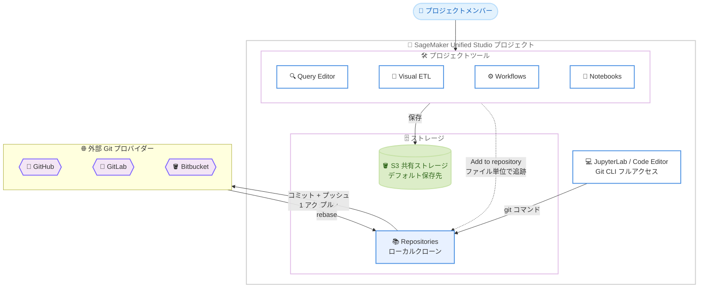

# Amazon SageMaker Unified Studio - 全プロジェクトツールでのリッチな Git バージョン管理

**リリース日**: 2026年7月30日
**サービス**: Amazon SageMaker Unified Studio
**機能**: 全プロジェクトツール (Query Editor、Visual ETL、Workflows、Notebooks) に対するファイル単位の Git バージョン管理

📊 [このアップデートのインフォグラフィックを見る](https://takech9203.github.io/aws-news-summary/20260730-amazon-sagemaker-unified-studio-git.html)

## 概要

Amazon SageMaker Unified Studio は、プロジェクトメンバーが普段使用しているツール (Query Editor、Visual ETL、Workflows、Notebooks) の中で直接利用できる、完全な Git バージョン管理機能を発表しました。特に Notebooks はこれまで Git サポートがなかったため、今回のアップデートで初めてバージョン管理が可能になります。

刷新された「Repositories」エクスペリエンスでは、従来の自動同期 (force-push ベース) のアプローチに代わり、柔軟なファイル単位のバージョン管理が導入されました。バージョン管理はプロジェクトレベルで強制されるものではなく、追跡したいファイルを GitHub、GitLab、Bitbucket 上のリポジトリに追加することで、ユーザー自身がどのファイルを管理するかを選択できます。すべての変更のコミットとプッシュは 1 回のアクションで実行できます。

リポジトリはプロジェクト作成とは切り離されているため、必要になったタイミングでいつでもプロジェクトにアタッチできます。プロジェクトは複数のリポジトリと複数のブランチに同時にリンクでき、ブランチの作成、リモート更新のプル、競合の解決もプロジェクト内で完結します。JupyterLab と Code Editor のユーザーは、引き続きビルトインターミナルから完全な Git CLI アクセスを利用できます。

**アップデート前の課題**

- 以前は保存のたびにコミットメッセージやブランチなしでリモートへ直接プッシュされる自動同期 (force-push) モデルであり、柔軟なバージョン管理ができなかった
- Notebooks には Git サポートがなく、ノートブックの変更履歴を管理できなかった
- どのファイルをバージョン管理するかをユーザーが選択できず、変更の意図をコミットメッセージとして残すことが困難だった
- ブランチベースの安全なコラボレーションや、変更の帰属 (誰がいつ何を変更したか) の追跡が難しかった

**アップデート後の改善**

- Query Editor、Visual ETL、Workflows、Notebooks の全ツールで統一された Git バージョン管理体験が利用可能になった
- ファイル単位で追跡対象を選択でき、コミットメッセージ付きのコミットとプッシュを 1 アクションで実行できるようになった
- 1 つのプロジェクトで複数のリポジトリ・複数のブランチを同時に利用でき、ブランチ作成、プル、競合解決をプロジェクト内で完結できるようになった
- リポジトリのアタッチが任意のタイミングで可能になり、既存プロジェクトもプロジェクト更新により新しいエクスペリエンスへ移行できるようになった

## アーキテクチャ図



プロジェクト内の各ツールで作成したアーティファクトは、デフォルトで S3 共有ストレージに保存され、「Add to repository」アクションでファイル単位にリポジトリ追跡を追加できます。追跡された変更はコミットとプッシュの 1 アクションで外部 Git プロバイダーへ反映されます。

## サービスアップデートの詳細

### 主要機能

1. **全プロジェクトツールでの Git バージョン管理**
   - Query Editor、Visual ETL、Workflows、Notebooks の 4 ツールでリポジトリ追跡が利用可能
   - Notebooks は今回初めて Git サポートに対応
   - JupyterLab と Code Editor はビルトインターミナル経由で完全な Git CLI 操作をサポートし、ターミナルでの変更は Repositories ページにも反映される

2. **ファイル単位の柔軟なバージョン管理**
   - バージョン管理はプロジェクトレベルで強制されず、アーティファクトごとに「Add to repository」アクションで追跡対象を選択
   - クローンしたリポジトリ由来のファイルはツールで開いた時点で自動的に追跡される
   - 「Remove from repository」で追跡を解除してもアーティファクト自体はプロジェクトに残る

3. **複数リポジトリ・複数ブランチの同時利用**
   - 1 つのプロジェクトに追加できるリポジトリ数に固定の上限なし (推奨サイズはリポジトリあたり 1 GB、最大 20,000 ファイル)
   - ブランチの作成はリモート側に先に作成された後、プロジェクトにクローンされる
   - ブランチを切り替えることなく、任意のブランチのアーティファクトを各ツールで同時に開ける

4. **プロジェクト内で完結するコミット・プッシュ・プル・競合解決**
   - コミットとプッシュは「Push」ボタンによる 1 つの統合アクション (変更アーティファクトの選択とコミットメッセージ入力が可能)
   - プルは rebase として動作し、ローカル変更はリモート変更の上に再適用される
   - 競合発生時は JSON diff が表示され、アーティファクト単位でローカル / リモートを選択して解決可能

5. **既存プロジェクトの移行**
   - 従来の自動同期 (force-push) エクスペリエンスを使用中の既存プロジェクトは、プロジェクトを更新することで新しいエクスペリエンスにオプトイン可能

## 技術仕様

### 対応 Git プロバイダー

| プロバイダー | 対応状況 |
|------|------|
| GitHub Cloud | 対応 |
| GitHub Enterprise Server | 対応 |
| GitLab Cloud | 対応 |
| GitLab Self-Managed | 対応 |
| Bitbucket Cloud | 対応 |
| AWS CodeCommit | 新規プロジェクトでは非対応 |

すべての接続は AWS CodeConnections を通じて管理されます。IAM ドメインと IAM Identity Center (IDC) ドメインの両方で利用可能です。

### ツールごとの動作

| ツール | ファイル形式 | 保存モデル |
|------|------|------|
| Query Editor | .sqlnb | 明示的な保存 |
| Notebooks | notebook_name (notebook_ID).ipynb | 自動保存 (コミット時点の状態がリポジトリに反映) |
| Visual ETL | .py スクリプト + .vetl グラフ定義の 2 ファイルをセットで追跡 | 明示的な保存 |
| Workflows | .yaml (サーバーレスワークフローのみ対応) | 明示的な保存 |
| JupyterLab / Code Editor | 任意 | Git CLI |

### アーティファクトのステータス

| ステータス | 意味 |
|------|------|
| Added | 新規追跡され、まだリモートへプッシュされていない |
| Modified | 最後のプッシュ以降に変更あり |
| Deleted | ローカルで削除され、次回プッシュでリモートから削除される |

### S3 共有ストレージとの比較

| 項目 | S3 共有ストレージ | Repositories |
|------|------|------|
| セットアップ | 不要 (プロジェクト作成時から有効) | ドメイン管理者による Git 接続の設定が必要 |
| バージョン履歴 | なし | あり (完全なコミット履歴) |
| ブランチ | なし | あり (リポジトリごとに無制限) |
| コラボレーションモデル | 後勝ち (last-write-wins) | ブランチベース (コミットとプッシュ) |
| 変更の帰属 | なし | あり (コミット単位) |
| CI/CD 連携 | なし | あり (Git プロバイダー経由) |

## 設定方法

### 前提条件

1. ドメイン管理者が AWS CodeConnections を通じて Git 接続を作成し、有効化していること
2. リポジトリを追加するプロジェクトオーナーまたはメンバー権限を持っていること
3. GitHub、GitLab、Bitbucket のいずれかにリポジトリが存在すること (プロジェクトから新規作成も可能)

### 手順

#### ステップ1: リポジトリの追加

1. 左側ナビゲーションから「Repositories」ページを開く
2. 「Add Repository」を選択する
3. 接続を選択し、既存リポジトリの選択または新規作成を行う
4. デフォルトブランチを選択し、「Add」を選択する

リポジトリを追加すると、プロジェクトメンバー全員で共有されるローカルクローンが作成されます。クローンはプロジェクトの S3 バケットに保存されます。

#### ステップ2: アーティファクトの追跡

1. アーティファクトをツール (Query Editor、Visual ETL、Workflows、Notebooks) で開く
2. 「Add to repository」アイコンを選択する
3. 対象のリポジトリとブランチを選択する

以降の変更は自動的にローカルにステージングされ、コミットとプッシュの準備が整った状態になります。

#### ステップ3: コミットとプッシュ

1. 「Repositories」ページを開く
2. 未コミットの変更があるリポジトリで「Push」を選択する
3. 変更アーティファクトの一覧を確認し、含める項目を選択する
4. コミットメッセージを入力し、「Push」を選択する

リモートに未プルの変更がある場合は Push できないため、先に Pull を実行する必要があります。Pull は rebase として動作します。

## メリット

### ビジネス面

- **ガバナンスと監査性の向上**: コミット単位の変更帰属により、誰がいつ何を変更したかを追跡でき、本番ワークロードの変更管理要件に対応できる
- **チームコラボレーションの安全性**: ブランチベースのワークフローにより、メンバーごとに独立した作業環境を確保し、他メンバーの作業を誤って上書きするリスクを低減できる
- **CI/CD 連携による自動化**: Git プロバイダー経由で既存の CI/CD パイプラインと統合し、データ分析・ML 資産のデリバリーを自動化できる

### 技術面

- **統一されたバージョン管理体験**: Query Editor、Visual ETL、Workflows、Notebooks で同一の操作感でバージョン管理を実行できる
- **ファイル単位の柔軟な選択**: 試行錯誤中の一時的な作業は S3 共有ストレージに、本番資産はリポジトリにと、アーティファクトごとに使い分けられる
- **プロジェクト内で完結する Git 操作**: ブランチ作成、プル、競合解決 (JSON diff によるローカル / リモート選択) をツールを離れずに実行できる

## デメリット・制約事項

### 制限事項

- プロダクト内でのプルリクエストやコードレビューは非対応 (Git プロバイダー側で実施)
- コミット履歴の閲覧や UI からの revert は非対応 (ターミナルまたは Git プロバイダーを使用)
- アーティファクトの自動追跡はなく、新規アーティファクトは手動で「Add to repository」が必要
- リポジトリ操作のプログラマティック API はなく、リポジトリ管理はコンソールのみ
- Managed / Provisioned ワークフローと Jobs はリポジトリ追跡非対応 (ワークフローはサーバーレスのみ対応)
- コミットのみの実行は不可 (コミットとプッシュは常に 1 つの統合アクション)
- AWS CodeCommit は新規プロジェクトでは非対応
- Git worktree は非対応

### 考慮すべき点

- サードパーティ Git リポジトリへの接続を作成すると、そのアカウント内の任意のドメインにサインインできるすべてのユーザーが、その接続上のすべてのリポジトリへの読み書きアクセスを持つ。リポジトリ間の分離を強制するには、別々の AWS アカウントを使用する必要がある
- Notebooks はロックにより同時編集が 1 ユーザーに制限され、Studio 上でのリネームはリポジトリ内のファイル名に反映されない
- Visual ETL は .py と .vetl の 2 ファイルがセットで追跡されるため、個別に削除してはならない
- 未コミットのローカル変更がリモートと競合する状態では Pull できず、JupyterLab / Code Editor のターミナルでの対処が必要になる場合がある
- 推奨リポジトリサイズはリポジトリあたり 1 GB、最大 20,000 ファイル

## ユースケース

### ユースケース1: データ分析チームの SQL 資産の版管理

**シナリオ**: 分析チームが Query Editor で作成した本番レポート用 SQL を GitHub で管理し、変更の経緯をコミット履歴として残したい。

**実装例**:
```
1. ドメイン管理者が AWS CodeConnections で GitHub 接続を設定
2. プロジェクトの Repositories ページで分析用リポジトリを追加
3. 本番レポート用の .sqlnb を「Add to repository」で追跡対象に追加
4. 修正のたびにコミットメッセージ付きで Push
```

**効果**: 一時的な探索クエリは S3 共有ストレージに残しつつ、本番 SQL のみを版管理でき、変更理由をコミット履歴から追跡できる。

### ユースケース2: ノートブックのブランチベース開発

**シナリオ**: ML エンジニアのチームが Notebooks で特徴量エンジニアリングのノートブックを共同開発する。メンバー間の作業の上書きを避けたい。

**実装例**:
```
1. プロジェクトにリポジトリを追加し、ノートブックを追跡対象に設定
2. メンバーごとにブランチを作成 (ベストプラクティス)
3. 各自のブランチで開発し、Push でリモートに反映
4. Git プロバイダー側でプルリクエストを作成しレビュー・マージ
```

**効果**: これまで Git サポートがなかった Notebooks でブランチベースの安全な共同開発が可能になり、レビュープロセスを既存の Git ワークフローに統合できる。

### ユースケース3: Visual ETL ジョブの CI/CD 連携

**シナリオ**: データエンジニアリングチームが Visual ETL で構築した ETL ジョブを GitLab で管理し、マージをトリガーに検証パイプラインを実行したい。

**実装例**:
```
1. GitLab 接続を設定し、ETL 用リポジトリをプロジェクトに追加
2. Visual ETL ジョブを追跡対象に追加 (.py と .vetl がセットで追跡される)
3. 変更を Push すると GitLab CI パイプラインが起動し、.py スクリプトを静的解析・テスト
4. 検証済みの変更のみ本番ブランチへマージ
```

**効果**: ETL ジョブの変更に対する自動検証が実現し、品質ゲートを通過した変更のみを本番環境に反映できる。

## 料金

この機能に追加料金はありません。SageMaker Unified Studio の利用料金 (基盤となるコンピューティングおよびストレージリソースの料金) が適用されます。リポジトリのローカルクローンはプロジェクトの S3 バケットに保存されるため、S3 のストレージ料金が発生します。

## 利用可能リージョン

Amazon SageMaker Unified Studio がサポートされているすべての AWS リージョンで利用可能です。IAM ドメインと IAM Identity Center ドメインの両方に対応しています。

## 関連サービス・機能

- **AWS CodeConnections**: GitHub、GitLab、Bitbucket への接続を管理するサービス。本機能のすべての Git 接続はこのサービスを通じて構成される
- **Amazon S3**: プロジェクトのデフォルトストレージである S3 共有ストレージと、リポジトリのローカルクローンの保存先として使用される
- **Amazon SageMaker Unified Studio プロジェクト**: データ、分析、AI/ML の各ツールを統合するワークスペース。本機能はプロジェクト単位でリポジトリをアタッチする

## 参考リンク

- 📊 [インフォグラフィック](https://takech9203.github.io/aws-news-summary/20260730-amazon-sagemaker-unified-studio-git.html)
- [公式発表 (What's New)](https://aws.amazon.com/about-aws/whats-new/2026/07/amazon-sagemaker-unified-studio-git/)
- [ドキュメント: Source control and file storage (User Guide)](https://docs.aws.amazon.com/sagemaker-unified-studio/latest/userguide/storage.html)
- [ドキュメント: Git repositories (User Guide)](https://docs.aws.amazon.com/sagemaker-unified-studio/latest/userguide/working-with-repositories.html)
- [ドキュメント: Configuring Git connections (Admin Guide)](https://docs.aws.amazon.com/sagemaker-unified-studio/latest/adminguide/smus-admin-storage-guide.html)

## まとめ

Amazon SageMaker Unified Studio の新しい Repositories エクスペリエンスにより、Query Editor、Visual ETL、Workflows、Notebooks のすべてで、ファイル単位の柔軟な Git バージョン管理が利用できるようになりました。従来の自動同期モデルからコミットメッセージとブランチを備えた本格的な Git ワークフローに進化したことで、本番ワークロードの変更管理や CI/CD 連携が現実的になります。既存プロジェクトを利用中の場合は、プロジェクトの更新により新しいエクスペリエンスへの移行を検討することを推奨します。
