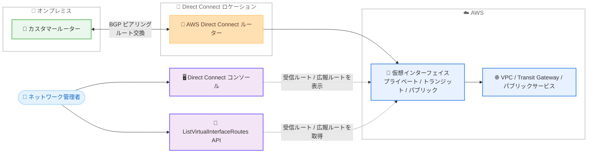

# AWS Direct Connect - 仮想インターフェイスの BGP ルート可視化

**リリース日**: 2026 年 7 月 30 日
**サービス**: AWS Direct Connect
**機能**: 仮想インターフェイス (VIF) における BGP ルート可視化 (BGP Route Visibility)

📊 [このアップデートのインフォグラフィックを見る](https://takech9203.github.io/aws-news-summary/20260730-aws-direct-connect-bgp-visibility.html)

## 概要

AWS Direct Connect が、仮想インターフェイス (VIF) 上で AWS とオンプレミスルーター間で交換される BGP ルートを確認できる「BGP ルート可視化」機能をサポートしました。プライベート VIF、トランジット VIF、パブリック VIF のすべての VIF タイプが対象です。

この機能により、AWS がお客様のルーターから受信したルート (accepted routes) と、AWS がお客様のルーターへ広報しているルート (advertised routes) の両方を、Direct Connect コンソールまたは新しい `ListVirtualInterfaceRoutes` API アクションで確認できます。各ルートエントリには、プレフィックス、アドレスファミリー、AS パス、BGP コミュニティ値、インストールされたタイムスタンプが表示されます。

ハイブリッドネットワークを運用するネットワーク管理者にとって、ルーティングの問題調査、ルート伝播の検証、BGP ポリシー設定の妥当性確認、予期しないトラフィックパターンの診断が大幅に容易になるアップデートです。特に複数リージョンにまたがる複雑なアーキテクチャを管理する場合に有効です。

**アップデート前の課題**

- 以前は AWS 側が実際に受信・広報している BGP ルートを AWS 上で直接確認する手段がなく、オンプレミスルーター側の情報や AWS サポートへの問い合わせに頼る必要があった
- ルート伝播やフィルタリングの問題が発生した際、AWS 側とオンプレミス側のどちらに原因があるのかの切り分けに時間がかかっていた
- BGP コミュニティや AS パスによるルーティングポリシーが意図通りに適用されているかを AWS 側の視点で検証できなかった

**アップデート後の改善**

- Direct Connect コンソールまたは API から、AWS が受信したルートと広報しているルートをセルフサービスで確認できるようになった
- プレフィックス、AS パス、コミュニティ、アドレスファミリーによるフィルタリングにより、特定のルーティング動作を迅速に特定できるようになった
- 各ルートのインストールタイムスタンプにより、ルート変更のタイミングを把握できるようになった

## アーキテクチャ図



オンプレミスルーターと AWS の間で BGP により交換されるルートを、コンソールまたは API から直接確認できるようになりました。

## サービスアップデートの詳細

### 主要機能

1. **受信ルートと広報ルートの可視化**
   - AWS がお客様のルーターから受信 (accept) したルートを確認可能
   - AWS がお客様のルーターへ広報 (advertise) しているルートを確認可能
   - プライベート VIF、トランジット VIF、パブリック VIF のすべてに対応

2. **詳細なルート属性の表示**
   - プレフィックス
   - アドレスファミリー (IPv4 / IPv6)
   - AS パス
   - BGP コミュニティ値
   - ルートがインストールされたタイムスタンプ

3. **フィルタリングによる迅速な調査**
   - プレフィックス、AS パス、コミュニティ、アドレスファミリーによるフィルタリングに対応
   - 特定のルーティング動作を素早く特定可能

4. **2 つのアクセス方法**
   - Direct Connect コンソールからの GUI 操作
   - 新しい `ListVirtualInterfaceRoutes` API アクションによるプログラムからのアクセス

## 技術仕様

### 機能の対象と確認できる情報

| 項目 | 詳細 |
|------|------|
| 対象 VIF タイプ | プライベート VIF、トランジット VIF、パブリック VIF |
| ルートの方向 | 受信ルート (accepted)、広報ルート (advertised) |
| 表示属性 | プレフィックス、アドレスファミリー、AS パス、BGP コミュニティ、インストールタイムスタンプ |
| フィルタリング | プレフィックス、AS パス、コミュニティ、アドレスファミリー |
| アクセス方法 | Direct Connect コンソール、`ListVirtualInterfaceRoutes` API |

## 設定方法

### 前提条件

1. AWS Direct Connect 接続と仮想インターフェイス (VIF) が作成済みであること
2. VIF 上で BGP ピアリングが確立されていること
3. Direct Connect の該当 API を呼び出す IAM 権限があること

### 手順

#### ステップ1: コンソールで BGP ルートを確認

Direct Connect コンソールで対象の仮想インターフェイスを選択し、BGP ルート情報を表示します。受信ルートと広報ルートを切り替えて確認できます。

#### ステップ2: API で BGP ルートを取得

```bash
# 仮想インターフェイスの BGP ルートを一覧取得
aws directconnect list-virtual-interface-routes \
  --virtual-interface-id dxvif-xxxxxxxx
```

新しい `ListVirtualInterfaceRoutes` API アクションを使用して、指定した仮想インターフェイスのルート情報をプログラムから取得します。実際のパラメーター仕様は最新の AWS CLI / API リファレンスを確認してください。

#### ステップ3: フィルタリングで特定ルートを調査

コンソールまたは API のフィルター機能で、プレフィックス、AS パス、コミュニティ、アドレスファミリーを条件に絞り込み、意図したルートが交換されているかを検証します。

## メリット

### ビジネス面

- **障害対応時間の短縮**: ルーティング問題の切り分けをセルフサービスで実施でき、ハイブリッドネットワークのダウンタイムやサポート問い合わせを削減
- **運用コストの削減**: AWS 側のルート状態確認のために追加ツールや手作業での突き合わせが不要
- **監査・コンプライアンス対応**: 広報・受信ルートの実態を確認でき、ネットワークポリシーの遵守状況を検証可能

### 技術面

- **双方向のルート可視性**: AWS 視点での受信・広報ルートを直接確認でき、オンプレミス側の情報と突き合わせた正確な切り分けが可能
- **BGP ポリシー検証**: AS パスプリペンドや BGP コミュニティによる経路制御が意図通りに反映されているかを検証可能
- **自動化との親和性**: API 経由で取得できるため、定期的なルート監視や構成検証の自動化に組み込み可能

## デメリット・制約事項

### 制限事項

- 表示されるのは BGP ルート情報であり、実際のトラフィックフローの統計情報ではない
- API の詳細仕様 (ページネーション、フィルターパラメーターなど) は最新のドキュメントでの確認が必要

### 考慮すべき点

- ルート情報の確認には適切な IAM 権限の設定が必要
- 複数の VIF や Direct Connect ゲートウェイを利用する大規模構成では、確認対象の VIF を体系的に管理する運用が必要

## ユースケース

### ユースケース1: ルート伝播のトラブルシューティング

**シナリオ**: オンプレミスから特定の VPC サブネットへ通信できない。オンプレミスルーターではルートを広報しているつもりだが、AWS 側で受信されているか不明。

**実装例**:
```bash
aws directconnect list-virtual-interface-routes \
  --virtual-interface-id dxvif-xxxxxxxx
# 出力から対象プレフィックスが受信ルートに含まれるかを確認
```

**効果**: AWS 側で受信されているルートを直接確認でき、オンプレミス側のフィルター設定ミスか AWS 側の問題かを迅速に切り分けられる。

### ユースケース2: BGP ポリシー設定の検証

**シナリオ**: アクティブ / スタンバイ構成のため、スタンバイ側 VIF で AS パスプリペンドと BGP コミュニティを設定した。意図通り AWS に伝わっているかを確認したい。

**実装例**:
```
Direct Connect コンソールで対象 VIF の受信ルートを表示し、
AS パスとコミュニティ値でフィルタリングして設定値を確認
```

**効果**: フェイルオーバー設計が意図通りに機能することをリリース前に検証でき、切り替えテスト時の想定外動作を防止できる。

### ユースケース3: マルチリージョン構成でのルート監査

**シナリオ**: Direct Connect ゲートウェイと複数リージョンの Transit Gateway を組み合わせた構成で、各トランジット VIF で交換されるルートを定期的に監査したい。

**実装例**:
```bash
# 各 VIF のルートを定期取得して差分を監視するスクリプトの例
for vif in dxvif-aaaa dxvif-bbbb; do
  aws directconnect list-virtual-interface-routes \
    --virtual-interface-id "$vif" > "routes_${vif}_$(date +%Y%m%d).json"
done
```

**効果**: ルート数の増減や意図しないプレフィックスの混入を早期に検知し、複雑なマルチリージョン構成の健全性を継続的に確認できる。

## 料金

公式発表では本機能に関する追加料金の記載はありません。AWS Direct Connect 自体の料金は、従来どおりポート時間とアウトバウンドデータ転送に基づいて課金されます。詳細は [AWS Direct Connect 料金ページ](https://aws.amazon.com/directconnect/pricing/) を参照してください。

## 利用可能リージョン

すべての AWS 商用リージョン、および AWS 中国リージョン (Sinnet が運営する北京リージョン、NWCD が運営する寧夏リージョン) で利用可能です。

## 関連サービス・機能

- **AWS Direct Connect ゲートウェイ**: 複数リージョンの VPC や Transit Gateway と VIF を接続する構成で、本機能によるルート確認が特に有効
- **AWS Transit Gateway**: トランジット VIF 経由で接続する Transit Gateway のルート伝播状況の切り分けに活用可能
- **Amazon CloudWatch**: Direct Connect の接続・VIF メトリクス監視と組み合わせることで、ネットワークの状態をより包括的に把握可能

## 参考リンク

- 📊 [インフォグラフィック](https://takech9203.github.io/aws-news-summary/20260730-aws-direct-connect-bgp-visibility.html)
- [公式発表 (What's New)](https://aws.amazon.com/about-aws/whats-new/2026/07/aws-direct-connect-bgp-visibility/)
- [AWS Direct Connect ユーザーガイド](https://docs.aws.amazon.com/directconnect/latest/UserGuide/Welcome.html)
- [AWS Direct Connect 料金ページ](https://aws.amazon.com/directconnect/pricing/)

## まとめ

AWS Direct Connect の BGP ルート可視化により、これまでブラックボックスになりがちだった AWS 側の BGP ルート状態をコンソールと API から直接確認できるようになりました。ハイブリッドネットワークを運用しているお客様は、ルーティング障害時の切り分け手順に本機能を組み込むとともに、BGP ポリシー変更時の検証プロセスへの活用を検討することを推奨します。
