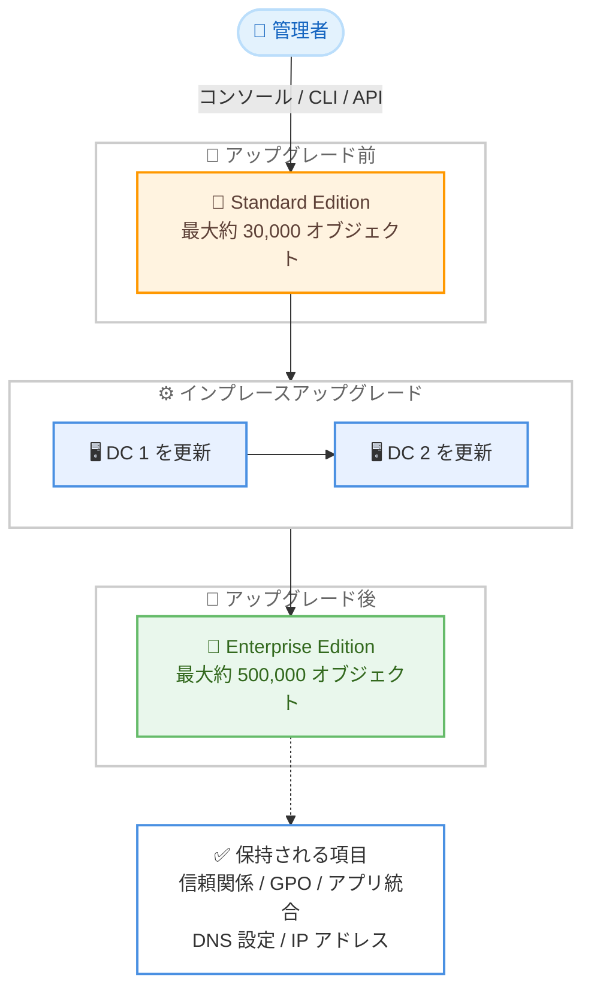

# AWS Directory Service - AWS Managed Microsoft AD の Standard から Enterprise Edition へのアップグレード対応

**リリース日**: 2026 年 7 月 30 日
**サービス**: AWS Directory Service (AWS Managed Microsoft AD)
**機能**: Standard Edition から Enterprise Edition へのインプレースアップグレード

📊 [このアップデートのインフォグラフィックを見る](https://takech9203.github.io/aws-news-summary/20260730-aws-microsoft-ad-edition-upgrade.html)

## 概要

AWS Directory Service は、AWS Managed Microsoft AD のディレクトリを Standard Edition から Enterprise Edition へ直接アップグレードする機能を発表しました。AWS Management Console、AWS CLI、API のいずれからでも実行でき、新しいディレクトリへの移行や既存ワークロードのドメイン再参加は不要です。

Standard Edition は中小規模の組織向けに最適化されており、約 30,000 個のディレクトリオブジェクト (ユーザー、グループ、コンピュータなど) をサポートします。一方、Enterprise Edition は最大約 500,000 個のオブジェクトに対応し、大規模なデプロイに必要なスケーラビリティを提供します。今回のアップデートにより、組織の成長に合わせてディレクトリをシームレスに拡張できるようになりました。

アップグレードはインプレースで実行され、既存の信頼関係 (トラスト)、アプリケーション統合、グループポリシーがすべて保持されます。DNS 設定や接続済みの AWS ワークロードへの変更も不要です。

**アップデート前の課題**

このアップデート以前は、Standard Edition のオブジェクト数上限に達した場合に大きな移行作業が必要でした。

- Standard Edition から Enterprise Edition へ直接アップグレードする手段がなく、新しい Enterprise Edition ディレクトリを別途作成する必要があった
- ユーザー、グループ、グループポリシーなどのオブジェクトを新ディレクトリへ移行する作業が必要だった
- EC2 インスタンスや Amazon RDS、Amazon FSx などの既存ワークロードを新しいドメインへ再参加させる必要があり、ダウンタイムや運用負荷が大きかった
- オンプレミス AD との信頼関係やアプリケーション統合を再構築する必要があった

**アップデート後の改善**

今回のアップデートにより、以下が可能になりました。

- コンソール、CLI、API からワンステップで Standard Edition を Enterprise Edition にアップグレードできるようになった
- 既存の信頼関係、アプリケーション統合、グループポリシーが保持されるため、再設定が不要になった
- DNS 設定や接続済み AWS ワークロードの変更 (ドメイン再参加) が不要になった
- ドメインコントローラーの IP アドレスが維持されるため、ネットワーク設定の変更が不要になった

## アーキテクチャ図



アップグレードはドメインコントローラーを 1 台ずつ順番に更新するインプレース方式で実行され、信頼関係やグループポリシー、IP アドレスなどが保持されたまま Enterprise Edition へ移行します。

## サービスアップデートの詳細

### 主要機能

1. **インプレースエディションアップグレード**
   - Standard Edition のディレクトリをそのまま Enterprise Edition へアップグレード
   - 新しいディレクトリの作成やオブジェクトの移行が不要
   - 既存の信頼関係、アプリケーション統合、グループポリシーを保持
   - DNS 設定や接続済み AWS ワークロードへの変更が不要

2. **複数の操作インターフェース**
   - AWS Management Console: ディレクトリの詳細ページから [Actions] > [Upgrade edition] を選択
   - AWS CLI: `aws ds update-directory-setup` コマンド
   - API: `UpdateDirectorySetup` API
   - PowerShell: `Update-DSDirectorySetup` コマンドレット

3. **ドメインコントローラーの順次更新**
   - アップグレード中、ドメインコントローラーは 1 台ずつ更新される
   - 各ドメインコントローラーの IP アドレスは変更されない (ホスト名は変更される)
   - アップグレード処理には 4〜5 時間程度が必要

## 技術仕様

### エディション比較

| 項目 | Standard Edition | Enterprise Edition |
|------|------------------|--------------------|
| 対象組織 | 従業員数 5,000 人程度までの中小規模組織 | 大規模エンタープライズ組織 |
| ディレクトリオブジェクト数の目安 | 最大約 30,000 個 | 最大約 500,000 個 |
| マルチリージョンレプリケーション | 非対応 | 対応 |

*オブジェクト数の上限は目安であり、オブジェクトのサイズやアプリケーションの動作・パフォーマンス要件によって変動します。

### API リクエスト例

`UpdateDirectorySetup` API で `UpdateType` に `SIZE` を指定し、`DirectorySize` を `Large` に設定します。

```json
{
   "DirectoryId": "d-1234567890",
   "UpdateType": "SIZE",
   "DirectorySizeUpdateSettings": {
      "DirectorySize": "Large"
   }
}
```

## 設定方法

### 前提条件

1. アップグレード対象の AWS Managed Microsoft AD (Standard Edition) ディレクトリが存在すること
2. アップグレードに伴う制限事項 (不可逆性、追加コスト、所要時間など) を確認済みであること
3. メンテナンスウィンドウ内での実施を計画していること (パフォーマンス影響が発生する可能性があるため)

### 手順

#### ステップ 1: コンソールからアップグレードを開始

1. [Directory Service コンソール](https://console.aws.amazon.com/directoryservicev2/) を開く
2. ナビゲーションペインで [Directories] を選択
3. アップグレードするディレクトリの ID リンクを選択して詳細ページを開く
4. [Actions] から [Upgrade edition] を選択
5. [Enterprise edition] を選択し、制限事項を確認
6. 確認フィールドに `confirm` と入力して [Upgrade] を選択

コンソールの操作のみでアップグレードが開始されます。

#### ステップ 2: CLI からアップグレードを実行 (代替方法)

```bash
aws ds update-directory-setup \
    --directory-id d-1234567890 \
    --update-type SIZE \
    --directory-size-update-settings DirectorySize=Large
```

`update-directory-setup` コマンドで、指定したディレクトリのサイズ設定を `Large` (Enterprise Edition) に変更するアップグレードを開始します。

#### ステップ 3: PowerShell からアップグレードを実行 (代替方法)

```powershell
Update-DSDirectorySetup `
    -DirectoryId d-1234567890 `
    -UpdateType SIZE `
    -DirectorySizeUpdateSettings_DirectorySize Large
```

AWS Tools for PowerShell の `Update-DSDirectorySetup` コマンドレットでも同様のアップグレードを実行できます。

## メリット

### ビジネス面

- **組織の成長への柔軟な対応**: ユーザー数やオブジェクト数の増加に合わせて、ディレクトリを再構築せずにスケールアップできる
- **移行コストの削減**: 新ディレクトリの構築、オブジェクト移行、ワークロード再参加といった大規模な移行プロジェクトが不要になる
- **ビジネス継続性の確保**: 既存のアプリケーション統合や信頼関係が保持されるため、業務への影響を最小限に抑えられる

### 技術面

- **運用負荷の大幅軽減**: EC2、RDS、FSx などのドメイン参加済みリソースの再参加作業が不要
- **ネットワーク設定の維持**: ドメインコントローラーの IP アドレスと DNS 設定が変更されないため、ファイアウォールルールや条件付きフォワーダーの変更が不要
- **Enterprise Edition 固有機能の利用**: アップグレード後はマルチリージョンレプリケーションなど Enterprise Edition の機能が利用可能になる

## デメリット・制約事項

### 制限事項

- アップグレードは不可逆であり、Enterprise Edition から Standard Edition へ戻すことはできない
- アップグレード前に取得したスナップショットは、アップグレード後のディレクトリの復元に使用できない
- アップグレード処理には 4〜5 時間程度を要する
- Enterprise Edition の料金が適用されるため、追加コストが発生する

### 考慮すべき点

- アップグレード中はドメインコントローラーが 1 台ずつ更新されるため、パフォーマンス低下やダウンタイムが発生する可能性がある。メンテナンスウィンドウ内での実施を推奨
- 各ドメインコントローラーのホスト名が変更される (IP アドレスは維持される)
- LDAPS を使用している場合、ドメインコントローラーに新しい証明書が必要になる

## ユースケース

### ユースケース 1: 事業成長に伴うディレクトリの拡張

**シナリオ**: Standard Edition で運用してきた企業が M&A や事業拡大によりユーザー数が急増し、オブジェクト数の上限 (約 30,000 個) に近づいている。

**実装例**:
```bash
# 現在のディレクトリ情報を確認
aws ds describe-directories --directory-ids d-1234567890

# Enterprise Edition へアップグレード
aws ds update-directory-setup \
    --directory-id d-1234567890 \
    --update-type SIZE \
    --directory-size-update-settings DirectorySize=Large
```

**効果**: ディレクトリ移行プロジェクトを実施することなく、最大約 500,000 オブジェクトまで対応可能なディレクトリへ拡張できる。

### ユースケース 2: マルチリージョン展開への対応

**シナリオ**: 国内で Standard Edition を利用してきた企業が海外拠点を展開することになり、Enterprise Edition 限定のマルチリージョンレプリケーションが必要になった。

**実装例**:
```bash
# Enterprise Edition へアップグレード後、リージョンを追加
aws ds add-region \
    --directory-id d-1234567890 \
    --region-name eu-west-1 \
    --vpc-settings VpcId=vpc-xxxx,SubnetIds=subnet-aaaa,subnet-bbbb
```

**効果**: 既存ディレクトリを維持したまま Enterprise Edition の機能を有効化し、複数リージョンにまたがる AD 基盤を構築できる。

### ユースケース 3: ドメイン参加済みワークロードを維持したスケールアップ

**シナリオ**: Amazon FSx for Windows File Server や Amazon RDS for SQL Server など、多数の AWS リソースがディレクトリに統合されており、ドメイン再参加による移行が現実的でない。

**実装例**:
```
1. メンテナンスウィンドウを計画し、関係者に通知
2. コンソールの [Actions] > [Upgrade edition] からアップグレードを実行
3. アップグレード完了後 (4〜5 時間)、各ワークロードの接続を確認
4. LDAPS 利用時はドメインコントローラーの証明書を更新
```

**効果**: FSx や RDS などの統合済みリソースを一切変更せずにディレクトリをスケールアップでき、移行に伴う障害リスクを回避できる。

## 料金

アップグレード後は Enterprise Edition の時間単位料金が適用されます。前払いや最低料金はなく、使用した分のみの課金です。各ディレクトリには高可用性のため最低 2 台のドメインコントローラーが含まれます。

### 料金例 (米国東部オハイオリージョンの場合)

| 項目 | 料金 (概算) |
|--------|------------------|
| Enterprise Edition ディレクトリ (ドメインコントローラー 2 台含む) | 0.40 USD/時間 |
| 追加ドメインコントローラー (1 台あたり) | 0.20 USD/時間 |
| ディレクトリ共有 (追加アカウントごと) | 0.06 USD/時間 |

最新の料金およびリージョンごとの料金は [AWS Directory Service 料金ページ](https://aws.amazon.com/directoryservice/pricing/) を参照してください。

## 利用可能リージョン

AWS Directory Service が提供されているすべての AWS リージョンで利用可能です。対象リージョンの一覧は [リージョン別の可用性ドキュメント](https://docs.aws.amazon.com/directoryservice/latest/admin-guide/regions.html) を参照してください。

## 関連サービス・機能

- **Amazon EC2**: ドメイン参加済みの Windows / Linux インスタンスは、アップグレード後も再参加不要でそのまま利用可能
- **Amazon FSx for Windows File Server**: AWS Managed Microsoft AD と統合したファイルサーバーもアップグレードの影響を受けずに継続利用可能
- **Amazon RDS for SQL Server**: Windows 認証に AWS Managed Microsoft AD を使用している場合も設定変更は不要
- **AWS IAM Identity Center**: AWS Managed Microsoft AD を ID ソースとして利用している構成にも影響なし

## 参考リンク

- 📊 [インフォグラフィック](https://takech9203.github.io/aws-news-summary/20260730-aws-microsoft-ad-edition-upgrade.html)
- [公式発表 (What's New)](https://aws.amazon.com/about-aws/whats-new/2026/08/aws-microsoft-ad-edition-upgrade/)
- [ドキュメント: AWS Managed Microsoft AD のアップグレード](https://docs.aws.amazon.com/directoryservice/latest/admin-guide/ms_ad_upgrade_edition.html)
- [UpdateDirectorySetup API リファレンス](https://docs.aws.amazon.com/directoryservice/latest/devguide/API_UpdateDirectorySetup.html)
- [料金ページ](https://aws.amazon.com/directoryservice/pricing/)

## まとめ

AWS Managed Microsoft AD の Standard Edition から Enterprise Edition へのインプレースアップグレードにより、これまで必要だったディレクトリ移行やワークロードのドメイン再参加が不要になりました。オブジェクト数の上限に近づいている場合やマルチリージョンレプリケーションが必要な場合は、不可逆性や 4〜5 時間の所要時間、LDAPS 証明書の更新といった制約を確認したうえで、メンテナンスウィンドウ内でのアップグレードを計画することを推奨します。
