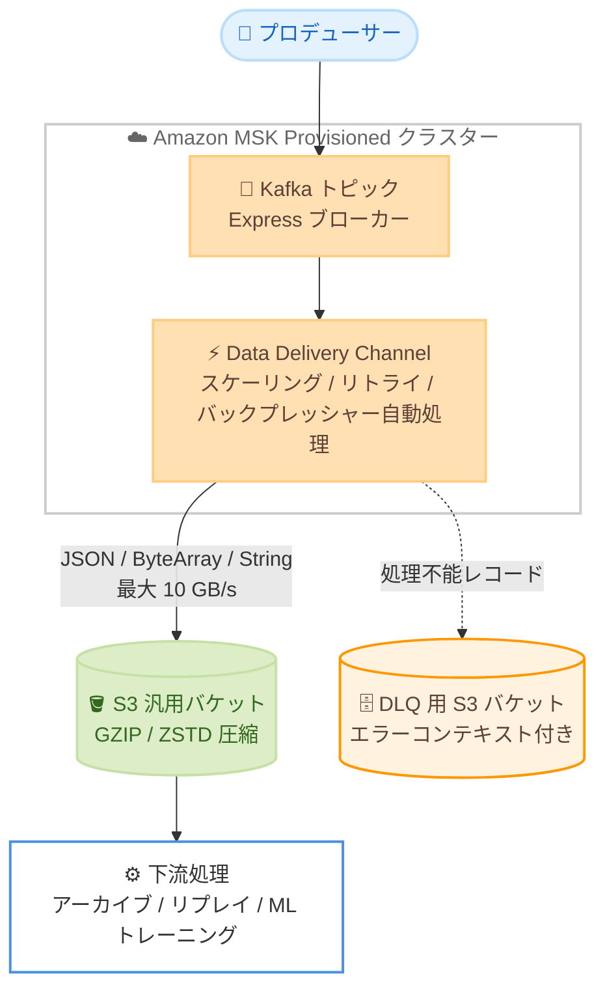

# Amazon MSK - Express ブローカーによる Amazon S3 へのデータ配信

**リリース日**: 2026 年 7 月 30 日
**サービス**: Amazon Managed Streaming for Apache Kafka (Amazon MSK)
**機能**: Amazon MSK Data Delivery (Amazon S3 汎用バケットへのデータ配信)

📊 [このアップデートのインフォグラフィックを見る](https://takech9203.github.io/aws-news-summary/20260730-aws-msk-express-brokers-delivers-to-amazon-s3.html)

## 概要

Amazon MSK Express ブローカーが、Apache Kafka のデータを Amazon S3 汎用バケットへ直接配信するフルマネージド機能「Amazon MSK Data Delivery」をサポートしました。コネクタや追加インフラを管理することなく、Kafka トピックのデータをソース形式のまま S3 に配信できます。セルフマネージドの代替手段と比較して、取り込みと配信のコストを最大 60% 削減できるとされています。

本機能はブローカーのネイティブ機能として実装されており、スケーリング、リトライ、バックプレッシャーを自動的に処理します。キャパシティのスケーリングやバージョンアップグレードといった定常運用も、配信の中断なしにサービス側で管理されます。ブローカーのエグレススループットを追加でプロビジョニングする必要がないため、ピークキャパシティに合わせた事前確保ではなく、実際のワークロード需要に基づいた支払いが可能です。

ログのアーカイブ、コンプライアンス目的の保持、Kafka のリプレイ、AI/ML モデルのトレーニングなど、Kafka データを S3 に蓄積するユースケースに最適です。これまでこれらのパイプラインをセルフマネージドコネクタで構築していたチームにとって、運用負荷とコストを大幅に削減できるアップデートです。

**アップデート前の課題**

Kafka データを S3 に配信するには、セルフマネージドのコネクタパイプラインを構築する必要がありました。

- Kafka Connect などのコネクタフリートを自前で運用し、プラグインの調達、デプロイ承認、チーム間のデプロイ調整が必要だった
- ワークロードの増加に合わせてコネクタのキャパシティスケーリングやセキュリティパッチ適用を継続的に行う必要があった
- コネクタ経由の読み取りがブローカーのエグレススループットを消費し、ピークに合わせたキャパシティのプロビジョニングが必要でコストが増大した

**アップデート後の改善**

- Channel を作成するだけで、コネクタや追加インフラなしに Kafka データを S3 汎用バケットへ配信できるようになった
- スケーリング、リトライ、バックプレッシャー、バージョンアップグレードがフルマネージドで処理され、最大 10 GB/s のスループットまで手動スケーリング不要になった
- ブローカーのエグレススループットを消費しないため、プロデューサーやコンシューマーのワークロードに影響を与えず、実際の使用量に基づくコストモデルで最大 60% のコスト削減が可能になった

## アーキテクチャ図



Express ブローカー上の Kafka トピックから Data Delivery Channel がレコードを読み取り、S3 汎用バケットにオブジェクトとして配信します。処理できないレコードは必須のデッドレターキュー (DLQ) 用 S3 バケットにエラーコンテキスト付きでルーティングされ、配信は中断されません。

## サービスアップデートの詳細

### 主要機能

1. **Channel によるフルマネージド配信**
   - Express ブローカーを使用する MSK Provisioned クラスター上に Channel を作成するだけで配信を開始できる
   - Channel が Kafka トピックからレコードを読み取り、設定可能な出力キーテンプレートを使用して S3 汎用バケットにオブジェクトとして書き込む
   - JSON、ByteArray、String 形式のトピックデータに対応し、ソース形式のまま配信される
   - GZIP または ZSTD によるオプションの圧縮、STANDARD / INTELLIGENT_TIERING / GLACIER_IR のストレージクラス指定が可能

2. **自動スケーリングとブローカー非依存の設計**
   - 最大 10 GB/s のスループットまで手動スケーリングなしで対応
   - Channel はブローカーのスループットを消費せずにトピックから読み取るため、プロデューサーとコンシューマーのワークロードに影響を与えない
   - 単一トピックを複数の宛先にファンアウトしてもブローカーに負荷が加わらない

3. **組み込みのエラーハンドリングとデータ鮮度**
   - 処理不能なレコードはエラーコンテキスト付きで DLQ (S3 バケット) にルーティングされ、配信は中断しない
   - データ鮮度 (Data Freshness) は 5 分から 15 分の間で設定可能で、生成されたデータは 5〜15 分以内にクエリや処理に利用可能になる
   - CloudWatch によるメトリクスと運用ログ、CloudTrail による API 監査、AWS KMS によるカスタマーマネージドキー暗号化をサポート

4. **Apache Iceberg ストリーミングテーブルへの配信 (同時発表)**
   - 同じ Channel の仕組みで、Kafka トピックを Amazon S3 Tables 上の Apache Iceberg テーブルとして継続的にマテリアライズする機能も同時に発表された
   - インラインコンパクションにより小さいファイルによる性能劣化を防ぎ、Athena や Spark などのエンジンからクエリ可能なストリーミングレイクハウスを構築できる

## 技術仕様

### 宛先タイプの比較

| 項目 | S3 汎用バケット | S3 Tables (Iceberg) |
|------|----------------|---------------------|
| 宛先 | 汎用 S3 バケット内のオブジェクト | S3 Table バケット内のマネージド Iceberg テーブル |
| 入力形式 | JSON、ByteArray、String | JSON または JSON_SCHEMA_GSR |
| AWS Glue Schema Registry | 不要 | 必須 |
| 出力 | オブジェクト (オプションで GZIP / ZSTD 圧縮) | Parquet ファイル (ZSTD / Snappy 圧縮) |
| パーティショニング | オブジェクトキーテンプレート (時間プレースホルダー) | 時間ベース |
| スキーマ進化 | 該当なし | 非サポート |
| DLQ | 必須 | 必須 |

### 主な仕様

| 項目 | 詳細 |
|------|------|
| 対応ブローカー | MSK Express ブローカーのみ (Standard ブローカー、MSK Serverless は非対応) |
| 最大スループット | 10 GB/s |
| データ鮮度 | 5〜15 分で設定可能 |
| バックフィル | 非対応 (Channel 有効化後に生成されたデータのみ配信) |
| ストレージクラス | STANDARD、INTELLIGENT_TIERING、GLACIER_IR |
| 圧縮 | NONE、GZIP、ZSTD |
| 暗号化 | AWS KMS カスタマーマネージドキー対応 |

### API変更履歴

| 日付 | サービス | 変更内容 |
|------|----------|----------|
| 2026/07/30 | [kafka](https://awsapichanges.com/archive/changes/c60f41-kafka.html) | 5 new api methods - `CreateChannel`、`DescribeChannel`、`UpdateChannel`、`DeleteChannel`、`ListChannels` が追加され、S3 汎用バケットおよび Iceberg 宛先の Channel 管理が可能に |

### CreateChannel の設定例 (boto3)

```python
client.create_channel(
    ChannelName='my-s3-delivery-channel',
    ClusterArn='arn:aws:kafka:ap-northeast-1:123456789012:cluster/my-cluster/...',
    S3DestinationConfiguration={
        'DataFreshnessInSeconds': 300,
        'DeadLetterQueueS3': {
            'BucketArn': 'arn:aws:s3:::my-dlq-bucket',
            'ErrorOutputPrefix': 'errors/'
        },
        'ServiceExecutionRoleArn': 'arn:aws:iam::123456789012:role/msk-delivery-role',
        'Storage': {
            'BucketArn': 'arn:aws:s3:::my-archive-bucket',
            'CompressionType': 'ZSTD',
            'OutputPrefix': 'kafka-data/',
            'StorageClass': 'STANDARD'
        }
    },
    TopicConfigurationList=[
        {
            'RecordConverter': {'ValueConverter': 'JSON'},
            'TopicArn': 'arn:aws:kafka:ap-northeast-1:123456789012:topic/my-cluster/.../my-topic'
        }
    ]
)
```

## 設定方法

### 前提条件

1. MSK Express ブローカーを使用する Amazon MSK Provisioned クラスター (Standard ブローカーおよび MSK Serverless は非対応)
2. 配信対象の Kafka トピック (JSON、ByteArray、String 形式のデータ)
3. 配信先の S3 汎用バケットと、DLQ 用の S3 バケット (DLQ は必須)
4. Channel が引き受ける IAM サービスロール (S3 への書き込み権限を付与)

### 手順

#### ステップ1: IAM サービスロールの作成

```bash
aws iam create-role \
  --role-name msk-delivery-role \
  --assume-role-policy-document file://trust-policy.json
```

Channel がデータ配信時に引き受ける IAM サービスロールを作成します。信頼ポリシーで MSK サービスからの引き受けを許可し、配信先バケットと DLQ バケットへの `s3:PutObject` などの権限をアタッチします。

#### ステップ2: Channel の作成

```bash
aws kafka create-channel \
  --channel-name my-s3-delivery-channel \
  --cluster-arn <クラスター ARN> \
  --s3-destination-configuration '{
    "DataFreshnessInSeconds": 300,
    "DeadLetterQueueS3": {"BucketArn": "arn:aws:s3:::my-dlq-bucket"},
    "ServiceExecutionRoleArn": "<IAM ロール ARN>",
    "Storage": {
      "BucketArn": "arn:aws:s3:::my-archive-bucket",
      "CompressionType": "ZSTD",
      "OutputPrefix": "kafka-data/"
    }
  }' \
  --topic-configuration-list '[{"RecordConverter": {"ValueConverter": "JSON"}, "TopicArn": "<トピック ARN>"}]'
```

S3 汎用バケットを宛先とする Channel を作成します。データ鮮度 (この例では 300 秒)、圧縮タイプ、出力プレフィックス、DLQ を指定します。

#### ステップ3: Channel の状態確認とモニタリング

```bash
aws kafka describe-channel \
  --channel-arn <Channel ARN> \
  --cluster-arn <クラスター ARN>
```

Channel のステータスが `ACTIVE` になったことを確認します。以降、トピックに生成されたデータが 5〜15 分以内に S3 に配信されます。CloudWatch メトリクスで配信状況を監視し、DLQ バケットにエラーレコードが出力されていないか定期的に確認します。

## メリット

### ビジネス面

- **最大 60% のコスト削減**: セルフマネージドのコネクタパイプラインと比較して、取り込みと配信のコストを最大 60% 削減できる
- **運用負荷の解消**: コネクタフリートの構築、プラグイン調達、デプロイ調整、セキュリティパッチ適用といった継続的な運用作業が不要になる
- **需要ベースの支払い**: ピークキャパシティに合わせた事前プロビジョニングではなく、実際のワークロード需要に基づいて支払える

### 技術面

- **ブローカーへの影響なし**: ネイティブブローカー機能としてエグレススループットを消費せず、既存のプロデューサー / コンシューマーに影響を与えない
- **高スループットの自動スケーリング**: 最大 10 GB/s まで手動スケーリングなしで対応し、配信の中断なくバージョンアップグレードも処理される
- **組み込みの信頼性**: リトライ、バックプレッシャー、DLQ によるエラーハンドリングが標準装備され、ミッションクリティカルなワークロードにもエンドツーエンドの信頼性を提供する

## デメリット・制約事項

### 制限事項

- Express ブローカーを使用する MSK Provisioned クラスターのみ対応 (Standard ブローカー、MSK Serverless は非対応)
- バックフィルは非対応で、Channel 有効化後に生成されたデータのみが配信される
- データ鮮度は最短 5 分のため、秒単位のリアルタイム配信が必要なユースケースには適さない
- DLQ 用の S3 バケットの設定が必須

### 考慮すべき点

- 既存の Kafka Connect ベースのパイプラインから移行する場合、出力キーテンプレートやオブジェクト形式が下流の処理と互換性があるか確認が必要
- 低スループットのトピックでは、データ鮮度を長め (最大 15 分) に設定することが推奨される
- 変換や加工が必要な場合は本機能のスコープ外であり、配信後に下流で処理するか、別のストリーム処理サービスを検討する必要がある

## ユースケース

### ユースケース1: ログアーカイブとコンプライアンス保持

**シナリオ**: 金融サービス企業が、監査要件を満たすためにすべてのトランザクションイベントを長期保存する必要がある。

**実装例**:
```
Channel 設定:
- 宛先: S3 汎用バケット (StorageClass: GLACIER_IR)
- 圧縮: ZSTD
- OutputPrefix: compliance/transactions/
- S3 ライフサイクルルールと組み合わせて長期保存
```

**効果**: コネクタインフラなしで全イベントを低コストのストレージクラスに自動アーカイブでき、コンプライアンス要件を満たしながら運用負荷を最小化できる。

### ユースケース2: AI/ML モデルトレーニング用データレイクの構築

**シナリオ**: e コマース企業が、クリックストリームデータを ML モデルのトレーニングに活用するため S3 に蓄積したい。

**実装例**:
```
Channel 設定:
- 宛先: S3 汎用バケット
- RecordConverter: JSON
- 出力キーテンプレートで時間ベースのパーティショニングを設定
- SageMaker AI のトレーニングジョブから S3 データを直接参照
```

**効果**: ストリーミングデータが 5〜15 分以内に S3 に到着し、追加インフラなしで継続的にトレーニングデータセットを更新できる。

### ユースケース3: Kafka リプレイ用のバックアップ

**シナリオ**: SaaS 事業者が、障害復旧やデータ再処理のために Kafka トピックのデータを S3 に退避しておきたい。

**実装例**:
```
Channel 設定:
- 宛先: S3 汎用バケット
- RecordConverter: BYTE_ARRAY (ソース形式のまま保存)
- 圧縮: GZIP
- 再処理時は S3 から読み取り、プロデューサー経由でトピックに再投入
```

**効果**: トピックの保持期間を超えたデータも S3 から復元でき、Kafka クラスターのストレージコストを抑えながらリプレイ可能性を確保できる。

## 料金

Amazon MSK Data Delivery はフルマネージド機能として提供され、ブローカーのエグレススループットを追加でプロビジョニングする必要はありません。実際のワークロード需要に基づく課金で、セルフマネージドの代替手段と比較して最大 60% のコスト削減が可能とされています。配信先の S3 のストレージ料金とリクエスト料金は別途発生します。

詳細は [Amazon MSK 料金ページ](https://aws.amazon.com/msk/pricing/) を参照してください。

## 利用可能リージョン

MSK Express ブローカーが利用可能なすべての AWS リージョンで利用できます。最新のリージョン対応状況は [AWS リージョン別サービス一覧](https://aws.amazon.com/about-aws/global-infrastructure/regional-product-services/) を参照してください。

## 関連サービス・機能

- **Amazon S3**: 配信先となる汎用バケット。ストレージクラス (STANDARD / INTELLIGENT_TIERING / GLACIER_IR) を指定可能
- **Amazon S3 Tables**: 同時発表された Iceberg ストリーミングテーブル配信の宛先となるマネージド Iceberg テーブルストレージ
- **AWS Glue Schema Registry**: Iceberg 宛先を使用する場合のスキーマ管理 (S3 汎用バケット宛先では不要)
- **Amazon CloudWatch / AWS CloudTrail**: Channel のメトリクス監視と API 監査ログ
- **Amazon Data Firehose**: 従来から提供されている MSK から S3 への配信手段。本機能はブローカーネイティブでエグレススループットを消費しない点が異なる

## 参考リンク

- 📊 [インフォグラフィック](https://takech9203.github.io/aws-news-summary/20260730-aws-msk-express-brokers-delivers-to-amazon-s3.html)
- [公式発表 (What's New)](https://aws.amazon.com/about-aws/whats-new/2026/07/aws-msk-express-brokers-delivers-to-amazon-s3)
- [ドキュメント: Amazon MSK Data Delivery](https://docs.aws.amazon.com/msk/latest/developerguide/msk-data-delivery.html)
- [Express brokers for Amazon MSK](https://aws.amazon.com/msk/features/express-brokers-for-amazon-msk/)
- [料金ページ](https://aws.amazon.com/msk/pricing/)
- [API 変更履歴 (awsapichanges.com)](https://awsapichanges.com/archive/changes/c60f41-kafka.html)

## まとめ

Amazon MSK Express ブローカーのネイティブ機能として、Kafka データを S3 汎用バケットへコネクタレスで配信できるようになり、セルフマネージドパイプラインの運用負荷とコストを大幅に削減できます。Kafka Connect や独自コンシューマーで S3 へのアーカイブパイプラインを運用しているチームは、本機能への移行によるコスト削減効果 (最大 60%) を評価することを推奨します。まずは開発環境の Express ブローカークラスターで Channel を作成し、出力形式と下流処理の互換性を検証するとよいでしょう。
