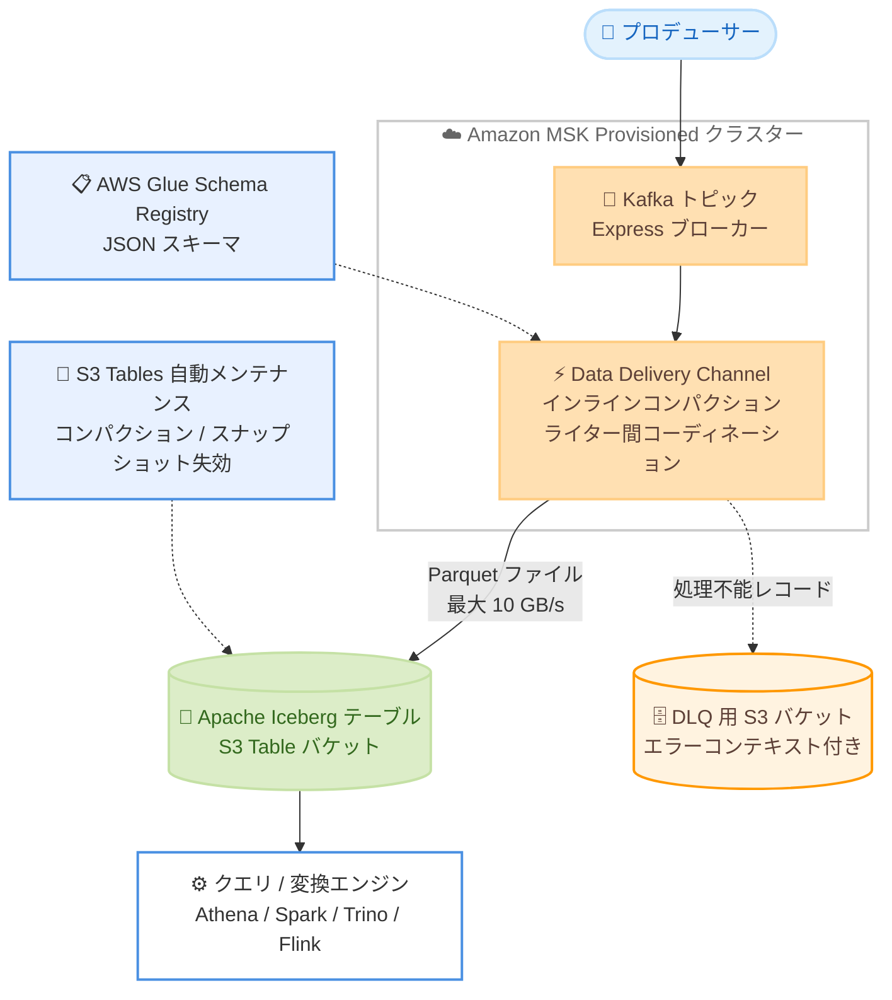

# Amazon MSK - Express ブローカーによる Apache Iceberg ストリーミングテーブルへのデータ配信

**リリース日**: 2026 年 7 月 30 日
**サービス**: Amazon Managed Streaming for Apache Kafka (Amazon MSK)
**機能**: Amazon MSK Data Delivery (Apache Iceberg ストリーミングテーブルへのデータ配信)

📊 [このアップデートのインフォグラフィックを見る](https://takech9203.github.io/aws-news-summary/20260730-aws-msk-streaming-tables-for-apache-iceberg.html)

## 概要

Amazon MSK Express ブローカーが、Apache Kafka トピックを Amazon S3 Tables 上の Apache Iceberg テーブルとして継続的にマテリアライズする新機能をサポートしました。コネクタや追加インフラを管理することなく、Kafka のストリーミングデータをクエリ可能な Iceberg テーブルとして自動的に蓄積できます。AWS によると、セルフマネージドのデプロイと比較して取り込み・配信コストを最大 60%、下流のクエリコストを最大 30% 削減できるとされています。

本機能の大きな特徴は、ストリーミングから Iceberg テーブルへの書き込みで課題となる「スモールファイル問題」を、インテリジェントなインラインコンパクションによって解決している点です。データ鮮度を犠牲にすることなくクエリ性能を予測可能に保ち、高スループットな並行書き込みにおける競合も組み込みのコーディネーションで解決します。さらに S3 Tables 側の自動テーブルメンテナンス (コンパクション、スナップショット失効、未参照ファイルのクリーンアップ) と組み合わせることで、テーブル運用の負荷を最小化できます。

配信されたストリーミングテーブルは、Amazon Athena、Apache Spark、Trino、Apache Flink などのエンジンからクエリ・変換が可能です。Kafka Connect の Iceberg Sink や独自のストリーム処理ジョブでレイクハウスへの取り込みパイプラインを運用してきたチームにとって、アーキテクチャを大幅に簡素化できるアップデートです。

**アップデート前の課題**

Kafka データを Iceberg テーブルに取り込むには、セルフマネージドのパイプラインを構築・運用する必要がありました。

- Kafka Connect の Iceberg Sink コネクタや Spark / Flink のストリーミングジョブを自前で構築し、スケーリングやパッチ適用を継続的に行う必要があった
- ストリーミング書き込みで発生する大量の小さいファイルがクエリ性能を劣化させ、コンパクションジョブを別途設計・運用する必要があった
- 複数ライターの並行書き込みによるコミット競合への対処が必要で、コネクタ経由の読み取りがブローカーのエグレススループットを消費するため、ピークに合わせたキャパシティのプロビジョニングが必要だった

**アップデート後の改善**

- Channel を作成するだけで、Kafka トピックが S3 Tables 上の Iceberg テーブルとして継続的にマテリアライズされるようになった
- インラインコンパクションと組み込みのライター間コーディネーションにより、スモールファイル問題とコミット競合をサービス側で自動的に解決できるようになった
- ブローカーのエグレススループットを消費せず、最大 10 GB/s まで手動スケーリング不要となり、セルフマネージド比で取り込みコストを最大 60%、クエリコストを最大 30% 削減できるようになった

## アーキテクチャ図



Express ブローカー上の Kafka トピックから Data Delivery Channel がレコードを読み取り、AWS Glue Schema Registry のスキーマを使用して Parquet ファイルに変換し、S3 Table バケット内の Iceberg テーブルに登録します。処理できないレコードは必須のデッドレターキュー (DLQ) 用 S3 バケットにルーティングされ、配信は中断されません。

## サービスアップデートの詳細

### 主要機能

1. **Kafka トピックの Iceberg テーブルへの継続的マテリアライズ**
   - Express ブローカーを使用する MSK Provisioned クラスター上に Channel を作成するだけで配信を開始できる
   - Channel が JSON レコードを AWS Glue Schema Registry のスキーマで変換し、Parquet データファイル (ZSTD / Snappy 圧縮) として書き込み、S3 Table バケット内の新規 Iceberg テーブルに登録する
   - 入力形式は JSON (GSR スキーマ ARN を指定) または JSON_SCHEMA_GSR (GSR シリアライズ済みでスキーマ ID を埋め込み) に対応
   - 生成されたデータは 5〜15 分以内 (設定可能なデータ鮮度) にクエリ可能になる

2. **インテリジェントなインラインコンパクション**
   - ストリーミング書き込みで課題となるスモールファイル問題を配信時のインラインコンパクションで解消し、クエリ性能を予測可能に保つ
   - 組み込みのコーディネーションにより、高スループットな並行書き込みにおけるライター間のコミット競合を自動解決する
   - S3 Tables のオプションの自動メンテナンス (コンパクション、スナップショット失効、未参照ファイルのクリーンアップ) と組み合わせることで、継続書き込みでもメタデータの肥大化を防止できる

3. **自動スケーリングとブローカー非依存の設計**
   - 最大 10 GB/s のスループットまで手動スケーリングなしで対応
   - ネイティブブローカー機能としてエグレススループットを消費せず、プロデューサーとコンシューマーのワークロードに影響を与えない
   - キャパシティスケーリングやバージョンアップグレードといった定常運用も配信の中断なしにサービス側で処理される

4. **組み込みのエラーハンドリングと運用統合**
   - 処理不能なレコードはエラーコンテキスト付きで DLQ (S3 バケット) にルーティングされ、配信は中断しない
   - CloudWatch によるメトリクスと運用ログ、CloudTrail による API 監査、AWS KMS によるカスタマーマネージドキー暗号化をサポート
   - MSK コンソールから数クリックで有効化できるほか、MSK API や MCP サーバーからも設定可能

## 技術仕様

### 主な仕様

| 項目 | 詳細 |
|------|------|
| 対応ブローカー | MSK Express ブローカーのみ (Standard ブローカー、MSK Serverless は非対応) |
| 宛先 | S3 Table バケット内のマネージド Iceberg テーブル (MSK クラスターと同一リージョン) |
| 入力形式 | JSON または JSON_SCHEMA_GSR |
| AWS Glue Schema Registry | 必須 (トピックデータと一致するスキーマの登録が必要) |
| 出力 | Apache Parquet ファイル (ZSTD / Snappy 圧縮) |
| パーティショニング | 時間ベース |
| スキーマ進化 | 非サポート |
| 最大スループット | 10 GB/s |
| データ鮮度 | 5〜15 分で設定可能 (最短 5 分にはトピックあたり非圧縮 2.4 MB/s 以上の生成が目安) |
| バックフィル | 非対応 (Channel 有効化後に生成されたデータのみ配信) |
| 既存テーブルへの配信 | 非対応 (Channel は設定ごとに新規 Iceberg テーブルを作成) |
| DLQ | 必須 (S3 バケット) |
| 暗号化 | AWS KMS カスタマーマネージドキー対応 |

### 宛先タイプの比較

同時発表された S3 汎用バケット宛先との比較は以下のとおりです。

| 項目 | S3 Tables (Iceberg) | S3 汎用バケット |
|------|---------------------|----------------|
| 宛先 | S3 Table バケット内のマネージド Iceberg テーブル | 汎用 S3 バケット内のオブジェクト |
| 入力形式 | JSON または JSON_SCHEMA_GSR | JSON、ByteArray、String |
| AWS Glue Schema Registry | 必須 | 不要 |
| 出力 | Parquet ファイル (ZSTD / Snappy 圧縮) | オブジェクト (オプションで GZIP / ZSTD 圧縮) |
| パーティショニング | 時間ベース | オブジェクトキーテンプレート |
| スキーマ進化 | 非サポート | 該当なし |
| 主な用途 | 分析用ストリーミングレイクハウス | アーカイブ、リプレイ、ML トレーニング |

### API変更履歴

| 日付 | サービス | 変更内容 |
|------|----------|----------|
| 2026/07/30 | [kafka](https://awsapichanges.com/archive/changes/c60f41-kafka.html) | 5 new api methods - `CreateChannel`、`DescribeChannel`、`UpdateChannel`、`DeleteChannel`、`ListChannels` が追加され、Iceberg および S3 汎用バケット宛先の Channel 管理が可能に |

### マネージドテーブルに関する注意

Channel が S3 Tables 内に作成する Iceberg テーブルは Amazon MSK サービスによって管理されます。AWS の分析サービスや互換性のあるクエリエンジンからのクエリは可能ですが、スキーマの更新、テーブルプロパティの変更、データの直接的な書き込み・削除は行うべきではありません。

## 設定方法

### 前提条件

1. MSK Express ブローカーを使用する Amazon MSK Provisioned クラスター (Standard ブローカーおよび MSK Serverless は非対応)
2. JSON または JSON_SCHEMA_GSR 形式のデータを持つ Kafka トピック
3. トピックデータと一致するスキーマが AWS Glue Schema Registry に登録済みであること
4. MSK クラスターと同一リージョンの S3 Table バケット
5. DLQ 用の S3 バケット (必須) と、Channel が引き受ける IAM サービスロール

### 手順

#### ステップ1: スキーマと S3 Table バケットの準備

```bash
# AWS Glue Schema Registry にスキーマを登録
aws glue create-schema \
  --schema-name my-topic-schema \
  --registry-id RegistryName=my-registry \
  --data-format JSON \
  --compatibility BACKWARD \
  --schema-definition file://schema.json

# S3 Table バケットを作成
aws s3tables create-table-bucket --name my-streaming-tables
```

トピックデータの構造を定義する JSON スキーマを Glue Schema Registry に登録し、Iceberg テーブルの格納先となる S3 Table バケットを MSK クラスターと同一リージョンに作成します。

#### ステップ2: IAM サービスロールの作成

```bash
aws iam create-role \
  --role-name msk-iceberg-delivery-role \
  --assume-role-policy-document file://trust-policy.json
```

Channel がデータ配信時に引き受ける IAM サービスロールを作成します。信頼ポリシーで MSK サービスからの引き受けを許可し、S3 Tables への書き込み、Glue Schema Registry の読み取り、DLQ バケットへの書き込み権限をアタッチします。

#### ステップ3: Channel の作成と確認

```bash
# MSK コンソールの場合: クラスターを選択し、数クリックで有効化
# CLI の場合: Iceberg 宛先を指定して Channel を作成
aws kafka create-channel \
  --channel-name my-iceberg-channel \
  --cluster-arn <クラスター ARN> \
  --topic-configuration-list '[{"RecordConverter": {"ValueConverter": "JSON"}, "TopicArn": "<トピック ARN>"}]' \
  ...

# 状態確認
aws kafka describe-channel \
  --channel-arn <Channel ARN> \
  --cluster-arn <クラスター ARN>
```

S3 Tables を宛先とする Channel を作成し、ステータスが `ACTIVE` になったことを確認します。以降、トピックに生成されたデータが設定したデータ鮮度 (5〜15 分) 以内に Iceberg テーブルに反映され、Athena や Spark からクエリできるようになります。あわせて S3 Tables の自動メンテナンスジョブの有効化が推奨されます。

## メリット

### ビジネス面

- **最大 60% の取り込みコスト削減**: セルフマネージドのデプロイと比較して、取り込みと配信のコストを最大 60% 削減できる
- **最大 30% のクエリコスト削減**: インラインコンパクションによりファイルが最適化され、セルフマネージド Kafka と比較して下流のクエリコストを最大 30% 削減できる
- **運用負荷の解消**: コネクタフリートやコンパクションジョブの構築・運用が不要になり、レイクハウス取り込みパイプラインの人的コストを削減できる

### 技術面

- **スモールファイル問題の自動解決**: インラインコンパクションによりデータ鮮度を犠牲にせずクエリ性能を予測可能に保てる
- **ブローカーへの影響なし**: エグレススループットを消費しないため、既存のプロデューサー / コンシューマーに影響を与えず、実需要に合わせたキャパシティ設計が可能
- **オープンなエコシステム**: Iceberg 標準に準拠しており、Athena、Apache Spark、Trino、Apache Flink など幅広いエンジンからクエリ・変換できる

## デメリット・制約事項

### 制限事項

- Express ブローカーを使用する MSK Provisioned クラスターのみ対応 (Standard ブローカー、MSK Serverless は非対応)
- 入力は JSON 系形式のみで、AWS Glue Schema Registry へのスキーマ登録が必須 (Avro や Protobuf のネイティブ対応は明記されていない)
- スキーマ進化 (schema evolution) は非サポート
- Channel は設定ごとに新規 Iceberg テーブルを作成し、既存の Iceberg テーブルへの配信は不可
- バックフィルは非対応で、Channel 有効化後に生成されたデータのみが配信される
- パーティショニングは時間ベースのみで、任意のカラムによるパーティショニングは選択できない

### 考慮すべき点

- 作成される Iceberg テーブルは MSK 管理のマネージドテーブルであり、スキーマ変更やデータの直接更新・削除を行うべきではない
- 最短 5 分のデータ鮮度を得るには、トピックあたり非圧縮 2.4 MB/s 以上のデータ生成が目安となる。低スループットのトピックでは鮮度を長め (最大 15 分) に設定する
- スキーマ変更が頻繁なワークロードでは、スキーマ進化非対応の制約を踏まえたテーブルの再作成・移行戦略を検討する必要がある
- ストレージ最適化とコスト管理のため、S3 Tables の自動メンテナンスジョブ (コンパクション、スナップショット失効、未参照ファイルクリーンアップ) の有効化が推奨される

## ユースケース

### ユースケース1: ニアリアルタイム分析基盤の構築

**シナリオ**: e コマース企業が、注文イベントやクリックストリームを数分以内に BI ダッシュボードへ反映したい。

**実装例**:
```
Channel 設定:
- 入力: JSON トピック + Glue Schema Registry スキーマ
- データ鮮度: 5 分 (高スループットトピック)
- 宛先: S3 Table バケット内の Iceberg テーブル
- Athena / QuickSight からストリーミングテーブルを直接クエリ
```

**効果**: ETL ジョブやコネクタなしで、生成から 5〜15 分以内のデータを SQL でクエリでき、ニアリアルタイムのダッシュボードを低運用負荷で実現できる。

### ユースケース2: ストリーミングレイクハウスの簡素化

**シナリオ**: データプラットフォームチームが、Kafka Connect の Iceberg Sink と Spark コンパクションジョブで運用してきたレイクハウス取り込みを簡素化したい。

**実装例**:
```
移行手順:
1. 対象トピックのスキーマを Glue Schema Registry に登録
2. Express ブローカークラスターに Channel を作成
3. 新規 Iceberg テーブルへの配信を検証後、下流のクエリを切り替え
4. Kafka Connect フリートとコンパクションジョブを廃止
```

**効果**: コネクタとコンパクションジョブの運用が不要になり、取り込みコストを最大 60% 削減。ライター競合やスモールファイル問題への個別対処からも解放される。

### ユースケース3: IoT テレメトリの時系列分析

**シナリオ**: 製造業企業が、工場設備のセンサーデータを Kafka で収集し、時系列分析と異常検知に活用したい。

**実装例**:
```
Channel 設定:
- 入力: JSON_SCHEMA_GSR 形式のテレメトリトピック
- パーティショニング: 時間ベース (自動)
- S3 Tables のレコード失効ジョブで保持期間を自動管理
- Spark / Flink で異常検知モデルの特徴量を生成
```

**効果**: 時間ベースパーティションにより期間指定クエリが効率化され、レコード失効ジョブと組み合わせてストレージコストとデータ保持要件を自動的に管理できる。

## 料金

本機能はフルマネージド機能として提供され、ブローカーのエグレススループットを追加でプロビジョニングする必要はありません。セルフマネージドのデプロイと比較して取り込み・配信コストを最大 60%、下流のクエリコストを最大 30% 削減できるとされています。S3 Tables のストレージ料金、リクエスト料金、メンテナンスジョブの料金は別途発生します。

詳細は [Amazon MSK 料金ページ](https://aws.amazon.com/msk/pricing/) を参照してください。

## 利用可能リージョン

MSK Express ブローカーが利用可能なすべての AWS リージョンで利用できます。最新のリージョン対応状況は [AWS リージョン別サービス一覧](https://aws.amazon.com/about-aws/global-infrastructure/regional-product-services/) を参照してください。

## 関連サービス・機能

- **Amazon S3 Tables**: 配信先となるマネージド Iceberg テーブルストレージ。自動コンパクション、スナップショット失効、レコード失効などのメンテナンスジョブを提供
- **AWS Glue Schema Registry**: トピックデータのスキーマ管理 (Iceberg 宛先では必須)
- **Amazon Athena / Apache Spark / Trino / Apache Flink**: ストリーミングテーブルのクエリ・変換に使用できるエンジン
- **Amazon MSK Data Delivery (S3 汎用バケット宛先)**: 同時発表された姉妹機能。ソース形式のまま S3 にアーカイブする用途向け
- **Amazon Data Firehose**: 従来から提供されている Iceberg テーブルへの配信手段。本機能はブローカーネイティブでエグレススループットを消費しない点が異なる

## 参考リンク

- 📊 [インフォグラフィック](https://takech9203.github.io/aws-news-summary/20260730-aws-msk-streaming-tables-for-apache-iceberg.html)
- [公式発表 (What's New)](https://aws.amazon.com/about-aws/whats-new/2026/07/aws-msk-streaming-tables-for-apache-iceberg)
- [ドキュメント: Amazon MSK Data Delivery](https://docs.aws.amazon.com/msk/latest/developerguide/msk-data-delivery.html)
- [ドキュメント: Iceberg behaviors (S3 Tables destination)](https://docs.aws.amazon.com/msk/latest/developerguide/msk-data-delivery-iceberg.html)
- [Express brokers for Amazon MSK](https://aws.amazon.com/msk/features/express-brokers-for-amazon-msk/)
- [料金ページ](https://aws.amazon.com/msk/pricing/)
- [API 変更履歴 (awsapichanges.com)](https://awsapichanges.com/archive/changes/c60f41-kafka.html)

## まとめ

Amazon MSK Express ブローカーのネイティブ機能として、Kafka トピックを S3 Tables 上の Apache Iceberg テーブルとして継続的にマテリアライズできるようになり、コネクタやコンパクションジョブを自前で運用することなくストリーミングレイクハウスを構築できます。Kafka から Iceberg への取り込みパイプラインをセルフマネージドで運用しているチームは、コスト削減効果 (取り込み最大 60%、クエリ最大 30%) と運用簡素化の観点から本機能への移行を評価することを推奨します。スキーマ進化非対応や新規テーブル作成のみといった制約があるため、まずは開発環境でスキーマ設計と下流クエリの互換性を検証するとよいでしょう。
