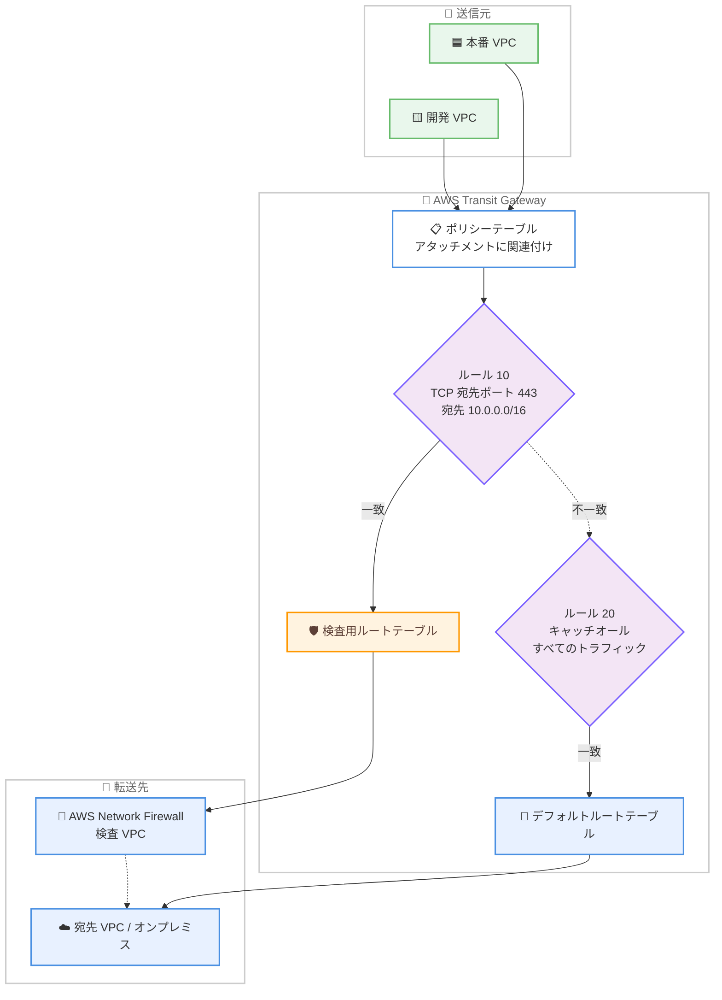

# AWS Transit Gateway - ポリシーベースルーティング (PBR) の一般提供開始

**リリース日**: 2026 年 7 月 30 日
**サービス**: AWS Transit Gateway
**機能**: Policy-Based Routing (PBR) on AWS Transit Gateway

📊 [このアップデートのインフォグラフィックを見る](https://takech9203.github.io/aws-news-summary/20260730-aws-transit-gateway-policy-based-routing.html)

## 概要

AWS Transit Gateway でポリシーベースルーティング (PBR) が一般提供開始されました。従来の宛先 IP アドレスのみに基づくルーティングに加えて、送信元 IP アドレス、宛先 IP アドレス、送信元ポート、宛先ポート、プロトコルの 5 タプルによるマッチングでフォワーディング先を制御できるようになります。ネットワーク管理者は、Transit Gateway アタッチメントにポリシーテーブルを関連付け、順序付きルールセットを定義することで、最初に一致したルール (first-match-wins) に従ってトラフィックを指定のルートテーブルへ振り分けられます。

この機能により、同じ宛先へ向かうトラフィックであっても、送信元やポート、プロトコルに応じて異なる転送動作を適用できます。たとえば、機密性の高いワークロードのトラフィックのみを AWS Network Firewall やサードパーティ製検査アプライアンスへ誘導したり、アプリケーションごとに AWS Direct Connect と VPN の経路を使い分けたりといった、これまで追加のインフラを必要としていた高度なトラフィック制御をインラインで実現できます。

大規模なハイブリッドネットワークやマルチ VPC 環境を運用する Solutions Architect、ネットワーク管理者にとって、アーキテクチャの簡素化とセキュリティセグメンテーションの強化につながる重要なアップデートです。

**アップデート前の課題**

Transit Gateway のルーティングは宛先 IP アドレスベースのルートテーブルに限定されていました。

- 送信元やポート、プロトコルに基づくトラフィック制御ができず、同じ宛先へのフローを区別できなかった
- 特定のトラフィックのみを検査アプライアンスへ誘導するには、複数 VPC を組み合わせた追加のルーティングホップを持つアーキテクチャが必要で、複雑さと運用負荷が増大していた
- 本番環境と開発環境のトラフィック分離にも、アタッチメント単位のルートテーブル分割など間接的な手法しか選択できなかった

**アップデート後の改善**

- 送信元 / 宛先 IP、送信元 / 宛先ポート、プロトコルの 5 タプルマッチングによるルールベースのトラフィック分類と転送が可能になった
- 追加インフラなしで、機密トラフィックのみを AWS Network Firewall やサードパーティ検査アプライアンス経由に誘導できるようになった
- 送信元、ポート、プロトコルに基づいて AWS Direct Connect または VPN 経路へトラフィックを振り分けられるようになった
- 本番環境と開発環境を別々のルーティングドメインに分離し、ラテラルムーブメント (横方向の侵害拡大) を制限できるようになった

## アーキテクチャ図



アタッチメントに関連付けたポリシーテーブルが、5 タプルの一致条件でトラフィックを分類し、一致した最初のルールのターゲットルートテーブル (検査用またはデフォルト) へ転送する流れを示しています。

## サービスアップデートの詳細

### 主要機能

1. **5 タプルマッチングによるルールベース転送**
   - 送信元 CIDR、宛先 CIDR、送信元ポート範囲、宛先ポート範囲、プロトコルの組み合わせでトラフィックを分類
   - すべてのフィールドは省略可能で、省略したフィールドは Any (`*`) として扱われる
   - 一致したパケットは、ルールで指定した Transit Gateway ルートテーブルへ転送される

2. **順序付きルール評価 (first-match-wins)**
   - ルールはルール番号の昇順 (1 から) に評価され、最初に一致したルールが適用される
   - 一致後は後続ルールを評価しないため、より具体的なルールを小さい番号に配置する
   - どのルールにも一致しないトラフィックは破棄される (暗黙の Deny)

3. **顧客管理エントリとシステム管理エントリ**
   - 顧客管理エントリ: ユーザーが定義するルール (ルール番号 1〜50,000)
   - システム管理エントリ: AWS Cloud WAN のセグメント分離などのために AWS が自動作成 (ルール番号 `*` で表示)
   - システム管理エントリは常に顧客管理エントリより先に評価され、変更・削除は不可

4. **アタッチメント単位の関連付け**
   - ポリシーテーブルはアタッチメントの標準ルートテーブルの代わりとして関連付ける
   - 1 つのアタッチメントに関連付けられるのはポリシーテーブルまたはルートテーブルのいずれか一方のみ

## 技術仕様

### ポリシーテーブルエントリの構成要素

| 項目 | 詳細 |
|------|------|
| ルール番号 | 1〜50,000。昇順に評価され、最初の一致で評価終了 |
| 送信元 CIDR | 例: `10.1.0.0/16`。省略時は Any (`*`) |
| 宛先 CIDR | 例: `10.0.0.0/16`。省略時は Any (`*`) |
| 送信元 / 宛先ポート範囲 | 例: `1024-65535`。TCP (`6`) と UDP (`17`) のみ指定可能 |
| プロトコル | TCP、UDP、ICMPv4、GRE、Any など。ICMPv4 / GRE / Any の場合ポート範囲は自動的に Any |
| ターゲットルートテーブル | 一致したトラフィックの転送に使用する Transit Gateway ルートテーブル |
| MetaData | エントリに付与できるキーと値のメタデータ |

### API変更履歴

| 日付 | サービス | 変更内容 |
|------|----------|----------|
| 2026/07/29 | [Amazon EC2](https://awsapichanges.com/archive/changes/391890-ec2.html) | 3 new 2 updated api methods - Transit Gateway のポリシーベースルーティング対応。ポリシーテーブルエントリの作成・変更・削除 API を追加 |

**新規 API:**

- `CreateTransitGatewayPolicyTableEntry`: ポリシーテーブルにルールエントリを作成
- `ModifyTransitGatewayPolicyTableEntry`: 既存のポリシーテーブルエントリを変更
- `DeleteTransitGatewayPolicyTableEntry`: ポリシーテーブルエントリを削除

**更新 API:**

- `DescribeTransitGatewayAttachments`: アタッチメントの関連付け情報に `TransitGatewayPolicyTableId` を追加
- `GetTransitGatewayPolicyTableEntries`: エントリの `State` (`active` / `deleted`) を返却

### ポリシーテーブルエントリの例

```json
{
  "TransitGatewayPolicyTableEntry": {
    "PolicyRuleNumber": "10",
    "PolicyRule": {
      "SourceCidrBlock": "0.0.0.0/0",
      "SourcePortRange": "1024-65535",
      "DestinationCidrBlock": "10.0.0.0/16",
      "DestinationPortRange": "80",
      "Protocol": "6"
    },
    "TargetRouteTableId": "tgw-rtb-inspection",
    "State": "active"
  }
}
```

## 設定方法

### 前提条件

1. Transit Gateway と対象のアタッチメント (VPC、VPN、Direct Connect Gateway など) が作成済みであること
2. 転送先となる Transit Gateway ルートテーブル (検査用、デフォルト用など) が作成済みであること
3. 対象アタッチメントに既存のルートテーブルが関連付いている場合は、事前に関連付けを解除できること (ポリシーテーブルとルートテーブルは同時に関連付け不可)

### 手順

#### ステップ1: ポリシーテーブルの作成

```bash
aws ec2 create-transit-gateway-policy-table \
  --transit-gateway-id tgw-0123456789abcdef0 \
  --tag-specifications 'ResourceType=transit-gateway-policy-table,Tags=[{Key=Name,Value=pbr-policy-table}]'
```

指定した Transit Gateway に新しいポリシーテーブルを作成します。作成されたポリシーテーブル ID (`tgw-ptb-xxxx`) は以降のステップで使用します。

#### ステップ2: ポリシーテーブルエントリの作成

```bash
# HTTP トラフィックを検査用ルートテーブルへ誘導するルール
aws ec2 create-transit-gateway-policy-table-entry \
  --transit-gateway-policy-table-id tgw-ptb-0123456789abcdef0 \
  --policy-rule-number 10 \
  --policy-rule 'DestinationCidrBlock=10.0.0.0/16,DestinationPortRange=80,Protocol=6' \
  --target-route-table-id tgw-rtb-inspection

# それ以外のトラフィックをデフォルトルートテーブルへ送るキャッチオールルール
aws ec2 create-transit-gateway-policy-table-entry \
  --transit-gateway-policy-table-id tgw-ptb-0123456789abcdef0 \
  --policy-rule-number 1000 \
  --policy-rule 'DestinationCidrBlock=0.0.0.0/0' \
  --target-route-table-id tgw-rtb-default
```

1 つ目のコマンドは、宛先 `10.0.0.0/16` へ向かう TCP ポート 80 のトラフィックを検査用ルートテーブルへ転送するルールを作成します。2 つ目のコマンドは、どのルールにも一致しなかったトラフィックが暗黙の Deny で破棄されないよう、大きいルール番号でキャッチオールルールを作成します。

#### ステップ3: アタッチメントへのポリシーテーブルの関連付け

```bash
# 既存のルートテーブル関連付けを解除
aws ec2 disassociate-transit-gateway-route-table \
  --transit-gateway-route-table-id tgw-rtb-0123456789abcdef0 \
  --transit-gateway-attachment-id tgw-attach-0123456789abcdef0

# ポリシーテーブルを関連付け
aws ec2 associate-transit-gateway-policy-table \
  --transit-gateway-policy-table-id tgw-ptb-0123456789abcdef0 \
  --transit-gateway-attachment-id tgw-attach-0123456789abcdef0
```

アタッチメントはポリシーテーブルとルートテーブルを同時に関連付けられないため、先に既存のルートテーブル関連付けを解除してから、ポリシーテーブルを関連付けます。

#### ステップ4: 設定の確認

```bash
aws ec2 get-transit-gateway-policy-table-entries \
  --transit-gateway-policy-table-id tgw-ptb-0123456789abcdef0
```

ポリシーテーブル内のすべてのエントリ (顧客管理・システム管理の両方) を一覧表示し、ルール番号と一致条件が意図した評価順序になっているかを本番トラフィック投入前に確認します。

## メリット

### ビジネス面

- **アーキテクチャの簡素化**: 選択的なトラフィック検査のために必要だった複数 VPC + 追加ルーティングホップの構成が不要になり、運用負荷とコストを削減できる
- **追加料金なし**: 標準の Transit Gateway 料金以外の追加費用なしで利用でき、既存環境への導入障壁が低い
- **コンプライアンス対応の強化**: 機密ワークロードのトラフィックのみを検査経路へ強制でき、規制要件への対応を簡素化できる

### 技術面

- **きめ細かなトラフィック制御**: 5 タプルベースの分類により、同一宛先へのフローでもアプリケーションやユーザー集団ごとに異なる経路を適用できる
- **セキュリティセグメンテーション**: 本番と開発のルーティングドメインを分離し、ラテラルムーブメントを制限できる
- **柔軟な経路選択**: 送信元、ポート、プロトコルに基づき Direct Connect / VPN などの経路を使い分けるトラフィックエンジニアリングが可能

## デメリット・制約事項

### 制限事項

- Transit Gateway と AWS Cloud WAN のピアリングアタッチメントでは、顧客管理エントリによる PBR は非対応 (システム管理エントリのみが適用され、読み取り専用)
- ポリシーテーブルを BGP スピーカーのアタッチメント (Site-to-Site VPN、Connect アプライアンス) に関連付けると、Transit Gateway からピアへの BGP ルート広報がすべて停止する (Direct Connect は Direct Connect Gateway 関連付けの許可プレフィックスリストで制御されるため広報が継続)
- 1 つのアタッチメントにはポリシーテーブルまたはルートテーブルのいずれか一方しか関連付けられない (既存のルートテーブル関連付けがある場合は先に解除が必要)
- システム管理エントリは変更・削除ができない

### 考慮すべき点

- どのルールにも一致しないトラフィックは暗黙の Deny で破棄されるため、意図しない通信断を避けるにはキャッチオールルールを大きいルール番号で必ず定義する
- ルール番号は 10 や 100 刻みなど間隔を空けて採番し、後からのルール挿入時に再採番が不要になるよう設計する
- ポート範囲は TCP と UDP のみで指定可能。ICMPv4、GRE、Any の場合はポート範囲が自動的に Any になる
- BGP ルート広報に依存する設計の場合は、影響を検証してからポリシーテーブルを関連付ける

## ユースケース

### ユースケース1: 機密トラフィックのファイアウォール検査への選択的誘導

**シナリオ**: 金融系ワークロードの VPC 間通信のうち、データベースセグメントへ向かう通信のみを AWS Network Firewall で検査したい。全トラフィックを検査経路に通すとレイテンシーとファイアウォール処理コストが増大する。

**実装例**:
```
ルール 10: 宛先 10.10.0.0/16 (DB セグメント)、TCP、宛先ポート 5432 → tgw-rtb-inspection (検査 VPC 経由)
ルール 100: 宛先 0.0.0.0/0 → tgw-rtb-default (直接転送)
```

**効果**: 検査が必要なトラフィックのみをファイアウォールへ誘導し、セキュリティ要件を満たしつつレイテンシーと検査コストを最小化できる。

### ユースケース2: アプリケーション別の Direct Connect / VPN 経路の使い分け

**シナリオ**: オンプレミスとの接続に Direct Connect と Site-to-Site VPN の両方を保有しており、基幹システムのトラフィックは低レイテンシーな Direct Connect 経由、バックアップ転送などのバルクトラフィックは VPN 経由に振り分けたい。

**実装例**:
```
ルール 10: 送信元 10.1.0.0/16 (基幹システム VPC) → tgw-rtb-dx (Direct Connect 経路)
ルール 20: 送信元 10.2.0.0/16、TCP、宛先ポート 443 (バックアップ転送) → tgw-rtb-vpn (VPN 経路)
ルール 100: キャッチオール → tgw-rtb-default
```

**効果**: 宛先が同じオンプレミスネットワークであっても、送信元やポートに応じて最適な経路を選択でき、帯域とコストの効率的な利用が可能になる。

### ユースケース3: 本番環境と開発環境のルーティングドメイン分離

**シナリオ**: 同一 Transit Gateway に本番 VPC 群と開発 VPC 群が接続されており、開発環境から本番環境へのラテラルムーブメントを防止したい。

**実装例**:
```
本番アタッチメント用ポリシーテーブル:
  ルール 10: 送信元 10.100.0.0/16 (本番 CIDR) → tgw-rtb-prod
  ※ 開発 CIDR からの通信に一致するルールを定義しない → 暗黙の Deny で破棄

開発アタッチメント用ポリシーテーブル:
  ルール 10: 宛先 10.200.0.0/16 (開発 CIDR) → tgw-rtb-dev
```

**効果**: 環境間のトラフィックをルーティングレイヤーで分離し、万一の侵害時にも横方向の拡大を制限できる。

## 料金

ポリシーベースルーティングの利用に追加料金はかかりません。標準の Transit Gateway 料金 (アタッチメント時間料金およびデータ処理料金) のみが適用されます。

## 利用可能リージョン

AWS Transit Gateway が提供されているすべての商用 AWS リージョンで利用可能です。AWS Management Console、AWS CLI、AWS SDK から設定できます。

## 関連サービス・機能

- **AWS Network Firewall**: PBR で機密トラフィックのみを Network Firewall の検査経路へ選択的に誘導できる
- **AWS Cloud WAN**: Transit Gateway と Cloud WAN のピアリングにおけるセグメント分離はシステム管理エントリとしてポリシーテーブルに表示される (顧客管理エントリは非対応)
- **AWS Direct Connect / AWS Site-to-Site VPN**: 送信元やポート、プロトコルに基づくハイブリッド接続経路の使い分けが可能。ただし BGP 広報への影響に注意が必要
- **Amazon VPC**: Transit Gateway に接続する VPC アタッチメント単位でポリシーテーブルを関連付けて利用する

## 参考リンク

- 📊 [インフォグラフィック](https://takech9203.github.io/aws-news-summary/20260730-aws-transit-gateway-policy-based-routing.html)
- [公式発表 (What's New)](https://aws.amazon.com/about-aws/whats-new/2026/07/aws-transit-gateway-policy-based-routing/)
- [ドキュメント: Transit gateway policy tables](https://docs.aws.amazon.com/vpc/latest/tgw/tgw-policy-tables.html)
- [ドキュメント: Policy table concepts](https://docs.aws.amazon.com/vpc/latest/tgw/tgw-policy-tables-concepts.html)
- [ドキュメント: Limitations](https://docs.aws.amazon.com/vpc/latest/tgw/tgw-policy-tables-limitations.html)
- [AWS Transit Gateway 製品ページ](https://aws.amazon.com/transit-gateway/)
- [料金ページ](https://aws.amazon.com/transit-gateway/pricing/)

## まとめ

AWS Transit Gateway のポリシーベースルーティングにより、5 タプルマッチングに基づくきめ細かなトラフィック制御が追加料金なしで利用可能になりました。従来は複数 VPC と追加ルーティングホップで実現していた選択的なトラフィック検査や経路制御をインラインで構成でき、ネットワークアーキテクチャを大幅に簡素化できます。導入時は暗黙の Deny によるトラフィック破棄と BGP 広報停止の制約を理解した上で、キャッチオールルールを含めた評価順序を設計し、`GetTransitGatewayPolicyTableEntries` で構成を検証してから本番トラフィックへ適用することを推奨します。
