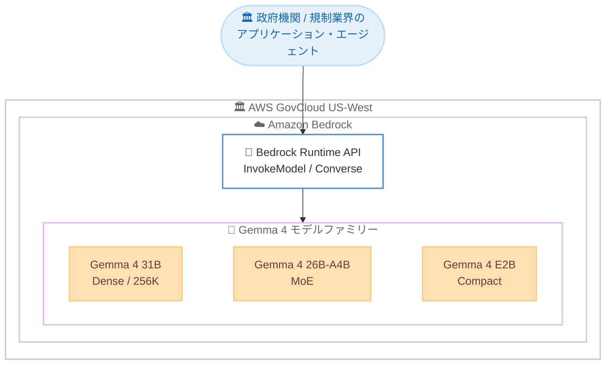

# Amazon Bedrock - Gemma 4 モデルが AWS GovCloud (US-West) で利用可能に

**リリース日**: 2026 年 7 月 30 日
**サービス**: Amazon Bedrock
**機能**: Google DeepMind 製 Gemma 4 オープンウェイトモデルの AWS GovCloud (US-West) での提供開始

📊 [このアップデートのインフォグラフィックを見る](https://takech9203.github.io/aws-news-summary/20260730-gemma-4-bedrock-govcloud.html)
<!-- INFOGRAPHIC_BASE_URL は環境変数から取得 -->

## 概要

AWS は、Google DeepMind が開発するオープンウェイトモデルファミリー Gemma 4 が、AWS GovCloud (US-West) リージョンの Amazon Bedrock で利用可能になったことを発表しました。これにより、米国政府機関や規制の厳しい業界のお客様も、コンプライアンス要件を満たした環境で最新の Gemma 4 を利用した生成 AI アプリケーションを構築できるようになります。

Gemma 4 ファミリーには 3 つのバリアントが含まれます。推論やコーディングが中心の負荷の高いワークロード向けで 256K トークンのコンテキストウィンドウを持つ Gemma 4 31B、コストとレイテンシーに敏感なワークロード向けの Gemma 4 26B-A4B、低レイテンシーのインタラクティブなユースケース向けの最小バリアントである Gemma 4 E2B です。Dense と Mixture-of-Experts (MoE) の両アーキテクチャをカバーし、組み込みの推論機能、ネイティブな関数呼び出し (function calling)、35 以上の言語のサポート、マルチモーダル入力を備えています。

Gemma 4 は 2026 年 6 月に商用リージョンの Amazon Bedrock で提供が開始されており、今回のアップデートで AWS GovCloud (US-West) にも提供範囲が拡大されました。Amazon Bedrock 上では、ツール呼び出し、構造化出力、推論、レスポンスストリーミングのサポートが強化されています。

**アップデート前の課題**

このアップデート以前は、AWS GovCloud (US) 環境で Gemma 4 を利用できませんでした。

- 以前は Gemma 4 が商用リージョン (バージニア北部、オハイオ、オレゴン、フランクフルトなど) のみの提供であり、GovCloud 環境では利用できなかった
- 以前は政府機関や規制業界のワークロードで最新の Gemma 系オープンウェイトモデルを Bedrock のフルマネージド環境で利用する選択肢がなかった
- 以前はコンプライアンス要件のあるワークロードで、推論重視・コスト重視・低レイテンシー重視といった特性に応じた Gemma 4 バリアントの使い分けができなかった

**アップデート後の改善**

今回のアップデートにより、AWS GovCloud (US-West) で Gemma 4 を利用できるようになりました。

- 今回のアップデートにより、GovCloud 環境でも推論、マルチモーダル理解、エージェント、ソフトウェアエンジニアリングのワークフローに Gemma 4 を利用できるようになった
- 今回のアップデートにより、政府機関や規制業界のワークロードでも Dense と MoE の両アーキテクチャから 3 つのバリアントを選択できるようになった
- 今回のアップデートにより、コンプライアンス要件を満たした環境で、ネイティブな関数呼び出しと構造化出力を活用したエージェントワークフローを構築できるようになった

## アーキテクチャ図



政府機関や規制業界のアプリケーションは、AWS GovCloud (US-West) 内の Amazon Bedrock Runtime API を通じて、ワークロード特性に応じた 3 つの Gemma 4 バリアントを呼び出せます。

## サービスアップデートの詳細

### 主要機能

1. **Gemma 4 31B の GovCloud (US-West) 提供**
   - 256K トークンのコンテキストウィンドウをサポートする Dense モデル
   - 推論やコーディングが中心の負荷の高いワークロードに最適
   - 大規模ドキュメントの分析や複雑な推論を要するタスクに対応

2. **Gemma 4 26B-A4B の GovCloud (US-West) 提供**
   - Mixture-of-Experts (MoE) アーキテクチャを採用したモデル
   - コストとレイテンシーに敏感なワークロードを対象
   - コスト効率の高い推論を実現

3. **Gemma 4 E2B の GovCloud (US-West) 提供**
   - ファミリー最小のコンパクトモデル
   - 低レイテンシーのインタラクティブなユースケース向け
   - チャットボットなどの応答速度が重要な用途に対応

4. **強化された機能サポート**
   - ツール呼び出し (tool calling)、構造化出力 (structured output)、推論 (reasoning)、レスポンスストリーミングのサポートを強化
   - 組み込みの推論機能とネイティブな関数呼び出しに対応
   - 35 以上の言語をサポート
   - What's New では価格性能を重視した Amazon Bedrock の新しい仕組みの上で動作すると説明されている

## 技術仕様

### モデルバリアント比較

| バリアント | アーキテクチャ | コンテキストウィンドウ | 主な用途 |
|------|------|------|------|
| Gemma 4 31B | Dense | 256K トークン | 推論・コーディング中心の高負荷ワークロード |
| Gemma 4 26B-A4B | MoE | 256K トークン | コスト・レイテンシーに敏感なワークロード |
| Gemma 4 E2B | コンパクト | 128K トークン | 低レイテンシーのインタラクティブ用途 |

### 共通機能

| 項目 | 詳細 |
|------|------|
| 推論 | 組み込みの推論機能 |
| 関数呼び出し | ネイティブな function calling に対応 |
| 言語サポート | 35 以上の言語 |
| 入力モダリティ | マルチモーダル入力 (詳細はモデルカードで確認) |
| 出力 | 構造化出力、レスポンスストリーミング |

<!-- What's New ページでは text, image, video, audio のマルチモーダル入力と記載されていますが、Bedrock で実際にサポートされるモダリティは最新のモデルカードで確認してください -->

### API 呼び出し例

```python
import boto3

# AWS GovCloud (US-West) の Amazon Bedrock Runtime クライアントを作成する
client = boto3.client("bedrock-runtime", region_name="us-gov-west-1")

# Converse API を使用して Gemma 4 を呼び出す
response = client.converse(
    modelId="google.gemma-4-31b",  # 実際のモデル ID はモデルカードで確認する
    messages=[
        {
            "role": "user",
            "content": [{"text": "この技術文書の要点を 3 点にまとめてください。"}],
        }
    ],
    inferenceConfig={"maxTokens": 1024, "temperature": 0.7},
)

print(response["output"]["message"]["content"][0]["text"])
```

上記は AWS GovCloud (US-West) リージョン (us-gov-west-1) の Amazon Bedrock Converse API を使用して Gemma 4 にプロンプトを送信し、レスポンスを取得する例です。モデル ID は AWS のモデルカードページで正確な値を確認してください。

## 設定方法

### 前提条件

1. AWS GovCloud (US) アカウントを保有し、AWS GovCloud (US-West) リージョンで Amazon Bedrock を利用できること
2. 対象モデルへのアクセスを Amazon Bedrock コンソールのモデルアクセスから有効化していること
3. Bedrock の InvokeModel / Converse を呼び出すための IAM 権限を持つこと

### 手順

#### ステップ1: モデルアクセスの有効化

AWS GovCloud (US-West) の Amazon Bedrock コンソールの「モデルアクセス」画面で、Gemma 4 の各バリアントへのアクセスを有効化します。これにより、API からモデルを呼び出せるようになります。

#### ステップ2: バリアントの選択

```text
推論・コーディング中心の高負荷ワークロード  -> Gemma 4 31B
コスト・レイテンシーに敏感なワークロード      -> Gemma 4 26B-A4B
低レイテンシーのインタラクティブ用途          -> Gemma 4 E2B
```

ワークロードの特性に応じて適切なバリアントを選択します。コストとレイテンシーを重視する場合は MoE モデルやコンパクトモデルを検討します。

#### ステップ3: アプリケーションへの組み込み

InvokeModel または Converse API (`us-gov-west-1` エンドポイント) を通じてアプリケーションにモデルを組み込みます。エージェントワークフローでは、ネイティブな関数呼び出しと構造化出力を活用してツール連携を実装します。

## メリット

### ビジネス面

- **コンプライアンス対応環境での生成 AI 活用**: 米国政府のコンプライアンス要件に対応する AWS GovCloud (US) 環境で、最新の Gemma 4 を利用した生成 AI アプリケーションを構築できる
- **モデル選択肢の拡大**: GovCloud 環境の Amazon Bedrock で利用できるオープンウェイトモデルの選択肢が広がり、ユースケースに応じた最適なモデルを選択できる
- **コスト最適化**: MoE モデルやコンパクトモデルの選択により、コストとレイテンシーに敏感なワークロードのコストを抑えられる

### 技術面

- **長いコンテキスト**: Gemma 4 31B は 256K トークンのコンテキストウィンドウをサポートし、大量のドキュメントや長い会話を扱える
- **エージェント構築**: ネイティブな関数呼び出しと構造化出力により、エージェントワークフローを構築しやすい
- **フルマネージド運用**: Amazon Bedrock のフルマネージド環境で、インフラ管理なしにオープンウェイトモデルを利用できる

## デメリット・制約事項

### 制限事項

- 今回の発表で対象となる GovCloud リージョンは AWS GovCloud (US-West) のみであり、AWS GovCloud (US-East) は含まれていない
- AWS GovCloud (US) の利用には、通常の AWS アカウントとは別に GovCloud アカウントの取得が必要
- 入力モダリティなどの詳細仕様は、利用前に最新のモデルカードでサポート範囲を確認する必要がある

### 考慮すべき点

- モデル ID や正確なパラメータ、料金は AWS のモデルカードおよび料金ページで確認すること
- 商用リージョンと GovCloud で利用可能な Bedrock の機能に差異がある場合があるため、必要な機能 (ツール呼び出し、構造化出力など) が GovCloud でサポートされているか事前に検証すること
- 推論重視・コスト重視・低レイテンシー重視のいずれを優先するかでバリアントを選定すること

## ユースケース

### ユースケース1: 政府機関における大規模文書の分析

**シナリオ**: 政府機関が、規制文書や調達仕様書などの大量の文書をコンプライアンス要件を満たした環境で分析・要約したい。

**実装例**:
```text
AWS GovCloud (US-West) で Gemma 4 31B を使用し、
256K トークンのコンテキストに複数ドキュメントを投入して要約・質問応答を行う
```

**効果**: データを GovCloud 環境内に保持したまま、大量のコンテキストを一度に処理する高度な文書分析が可能になる。

### ユースケース2: 規制業界向けのコスト効率の高い社内アシスタント

**シナリオ**: 政府向けサービスを提供する事業者が、高トラフィックな社内ナレッジアシスタントをコストを抑えて GovCloud 環境で運用したい。

**実装例**:
```text
Gemma 4 26B-A4B (MoE) を使用し、コスト効率の高い推論で
社内ドキュメント検索と組み合わせた質問応答を提供する
```

**効果**: MoE アーキテクチャによりコスト効率を高めつつ、コンプライアンス要件を満たした環境で品質を維持した応答を提供できる。

### ユースケース3: 低レイテンシーのエージェントワークフロー

**シナリオ**: GovCloud 環境で、ツールを呼び出しながら短い応答を高速に返すインタラクティブな業務エージェントを構築したい。

**実装例**:
```text
Gemma 4 E2B を使用し、ネイティブな関数呼び出しと構造化出力で
社内 API との連携を実装する
```

**効果**: コンパクトモデルによる低レイテンシー応答と、構造化されたツール呼び出しを両立したエージェントを GovCloud 内で完結して運用できる。

## 料金

Gemma 4 は価格性能を重視して設計された Amazon Bedrock の仕組みの上で提供されます。料金は使用するモデルバリアントおよび入力・出力トークン数に基づきます。AWS GovCloud (US) リージョンの正確な料金は Amazon Bedrock の料金ページで確認してください。

## 利用可能リージョン

今回の発表により、以下のリージョンで新たに利用可能になりました。

- AWS GovCloud (US-West)

なお、Gemma 4 は商用リージョン (米国東部 (バージニア北部)、米国東部 (オハイオ)、米国西部 (オレゴン)、欧州 (フランクフルト)) でも提供されています。

## 関連サービス・機能

- **Amazon Bedrock**: Gemma 4 を含む各種基盤モデルをフルマネージドで提供する基盤
- **AWS GovCloud (US)**: 米国政府のコンプライアンス要件に対応した分離された AWS リージョン
- **Amazon Bedrock Agents**: ネイティブな関数呼び出しを活用したエージェントワークフローの構築に関連
- **Amazon SageMaker AI / JumpStart**: Gemma 4 を自己管理型でデプロイする場合の選択肢

## 参考リンク

- 📊 [インフォグラフィック](https://takech9203.github.io/aws-news-summary/20260730-gemma-4-bedrock-govcloud.html)
- [公式発表 (What's New)](https://aws.amazon.com/about-aws/whats-new/2026/07/gemma-4-bedrock-govcloud/)
- [モデルカード (Google)](https://docs.aws.amazon.com/bedrock/latest/userguide/model-cards-google.html)
- [Amazon Bedrock 製品ページ](https://aws.amazon.com/bedrock/)
- [Amazon Bedrock 料金ページ](https://aws.amazon.com/bedrock/pricing/)
- [関連レポート: Gemma 4 モデルの提供開始 (2026 年 6 月)](./2026-06-10-gemma-4-amazon-bedrock.md)

## まとめ

今回のアップデートにより、Google DeepMind の最新オープンウェイトモデル Gemma 4 が AWS GovCloud (US-West) の Amazon Bedrock で利用可能になり、米国政府機関や規制業界のお客様もコンプライアンス要件を満たした環境で最新の生成 AI モデルを活用できるようになりました。GovCloud 環境で生成 AI アプリケーションやエージェントの構築を検討している場合は、まずモデルアクセスを有効化し、推論重視・コスト重視・低レイテンシー重視のワークロード特性に合わせて 3 つのバリアントを検証することを推奨します。
