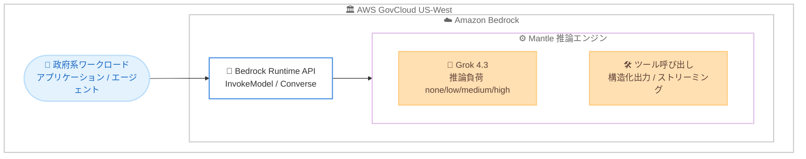

# Amazon Bedrock - xAI 製 Grok 4.3 が AWS GovCloud (US-West) で利用可能に

**リリース日**: 2026 年 7 月 30 日
**サービス**: Amazon Bedrock
**機能**: xAI 製 Grok 4.3 モデルの AWS GovCloud (US-West) での提供開始

📊 [このアップデートのインフォグラフィックを見る](https://takech9203.github.io/aws-news-summary/20260730-grok-4-3-bedrock-govcloud.html)

## 概要

AWS は、xAI が開発する Grok 4.3 モデルを AWS GovCloud (US-West) リージョンの Amazon Bedrock で利用可能にしたことを発表しました。今回のリリースにより、xAI が AWS GovCloud (US-West) における Amazon Bedrock のモデルプロバイダーとして初めて加わりました。厳格なコンプライアンス要件を持つ米国政府機関やその関連組織は、GovCloud 環境内で Grok 4.3 を活用した生成 AI ワークロードを構築できます。

Grok 4.3 は推論を中心に設計されたモデルであり、推論の負荷 (reasoning effort) を none、low、medium、high の 4 段階で設定できます。強力なツール利用と指示追従の能力を備え、信頼性の高いエージェントの構築を支援します。また、トークン効率が高く、大量のリクエストを処理する推論でもコスト効率を維持しやすくなっています。

Grok 4.3 は、価格性能を重視して設計された Amazon Bedrock の新しい推論エンジン Mantle 上で動作し、ツール呼び出し、構造化出力、レスポンスストリーミングをサポートします。カスタマーサポート、Web 開発、判例調査、財務文書の Q&A、会話型 AI、検索、チャット、マルチターンのワークフローといったエンタープライズユースケースに適しています。

**アップデート前の課題**

このアップデート以前は、AWS GovCloud (US-West) の Amazon Bedrock で xAI 製モデルを利用することができませんでした。

- 以前は AWS GovCloud (US-West) の Amazon Bedrock に xAI がモデルプロバイダーとして含まれておらず、Grok 4.3 を利用できなかった
- 以前は政府系のコンプライアンス要件を満たす GovCloud 環境内で、推論負荷を段階的に調整できる Grok 系モデルを選択できなかった
- 以前は GovCloud 環境で Grok 4.3 を利用する経路がなく、商用リージョンとは異なるモデル選択肢の中で設計する必要があった

**アップデート後の改善**

今回のアップデートにより、AWS GovCloud (US-West) の Amazon Bedrock で Grok 4.3 を利用できるようになりました。

- 今回のアップデートにより、GovCloud (US-West) のフルマネージドな Amazon Bedrock 環境で Grok 4.3 を呼び出せるようになった
- 今回のアップデートにより、政府系ワークロードでも推論負荷を 4 段階で調整し、コストと品質のバランスを取れるようになった
- 今回のアップデートにより、ツール呼び出し、構造化出力、レスポンスストリーミングを活用したエージェントワークフローを GovCloud 環境内で構築できるようになった

## アーキテクチャ図



AWS GovCloud (US-West) 内のアプリケーションやエージェントは、Amazon Bedrock の Runtime API を通じて、Mantle 推論エンジン上で動作する Grok 4.3 を呼び出します。処理は GovCloud リージョン内で完結します。

## サービスアップデートの詳細

### 主要機能

1. **AWS GovCloud (US-West) での提供開始**
   - xAI が AWS GovCloud (US-West) における Amazon Bedrock のモデルプロバイダーとして初めて参加
   - 厳格なコンプライアンス要件を持つ組織が GovCloud 環境内で Grok 4.3 を利用可能
   - 商用リージョンと同様のフルマネージドな Bedrock の操作性で利用できる

2. **推論中心の設計と調整可能な推論負荷**
   - 推論を中心に設計されたモデル
   - 推論の負荷を none、low、medium、high の 4 段階で設定可能
   - ワークロードに応じてコストと回答品質のバランスを調整できる

3. **強力なツール利用と指示追従**
   - 強力なツール利用 (tool use) の能力を備える
   - 指示追従 (instruction-following) に優れる
   - 信頼性の高いエージェントの構築を支援

4. **トークン効率と Mantle 推論エンジン**
   - トークン効率が高く、大量リクエストの推論でもコスト効率を維持しやすい
   - 価格性能を重視して設計された新しい推論エンジン Mantle 上で動作
   - ツール呼び出し、構造化出力、レスポンスストリーミングをサポート

## 技術仕様

### モデルの概要

| 項目 | 詳細 |
|------|------|
| モデルプロバイダー | xAI |
| モデル | Grok 4.3 |
| 提供リージョン (今回追加) | AWS GovCloud (US-West) |
| 推論エンジン | Mantle (Amazon Bedrock の新しい推論エンジン) |
| 推論負荷の設定 | none / low / medium / high の 4 段階 |
| サポート機能 | ツール呼び出し、構造化出力、レスポンスストリーミング |
| 主なユースケース | カスタマーサポート、Web 開発、判例調査、財務文書 Q&A、会話型 AI、検索、チャット、マルチターン |

<!-- What's New ページでは、コンテキストウィンドウのサイズ、入力モダリティ、具体的な料金は明記されていません。モデル詳細ページおよび料金ページで確認してください -->

### API 呼び出し例

```python
import boto3

# AWS GovCloud (US-West) の Amazon Bedrock Runtime クライアントを作成する
client = boto3.client("bedrock-runtime", region_name="us-gov-west-1")

# Converse API を使用して Grok 4.3 を呼び出す
response = client.converse(
    modelId="xai.grok-4-3",  # 実際のモデル ID はモデル詳細ページで確認する
    messages=[
        {
            "role": "user",
            "content": [{"text": "この規程文書の要点を 3 点で要約してください。"}],
        }
    ],
    inferenceConfig={"maxTokens": 1024, "temperature": 0.7},
)

print(response["output"]["message"]["content"][0]["text"])
```

上記は AWS GovCloud (US-West) リージョン (`us-gov-west-1`) の Amazon Bedrock Converse API を使用して Grok 4.3 にプロンプトを送信し、レスポンスを取得する例です。モデル ID は AWS のモデル詳細ページで正確な値を確認してください。

## 設定方法

### 前提条件

1. AWS GovCloud (US) アカウントを保有し、AWS GovCloud (US-West) リージョンを利用できること
2. Grok 4.3 へのアクセスを Amazon Bedrock コンソールのモデルアクセスからリクエストして有効化していること
3. Bedrock の InvokeModel / Converse を呼び出すための IAM 権限を持つこと

### 手順

#### ステップ1: リージョンとモデル対応状況の確認

AWS GovCloud (US-West) で Grok 4.3 が利用可能であることを、Amazon Bedrock のリージョン対応ドキュメントで確認します。GovCloud アカウントで対象リージョンにアクセスできることも確認します。

#### ステップ2: モデルアクセスの有効化

AWS GovCloud (US-West) の Amazon Bedrock コンソールの「モデルアクセス」画面で Grok 4.3 へのアクセスを有効化します。これにより、API からモデルを呼び出せるようになります。

#### ステップ3: 推論負荷の選定とアプリケーションへの組み込み

```text
高速・低コスト重視       -> 推論負荷 none / low
品質と推論深度のバランス   -> 推論負荷 medium
複雑な推論タスク重視      -> 推論負荷 high
```

ワークロードの特性に応じて推論負荷を選定します。InvokeModel または Converse API を通じてアプリケーションにモデルを組み込み、エージェントワークフローではツール呼び出しと構造化出力を活用します。

## メリット

### ビジネス面

- **政府系ワークロードでのモデル選択肢の拡大**: 厳格なコンプライアンス要件を持つ組織が、GovCloud 環境内で xAI 製の Grok 4.3 を選択できるようになる
- **コスト最適化**: 推論負荷の調整とトークン効率の高さにより、大量リクエストを処理する推論のコストを抑えられる
- **幅広いエンタープライズ用途**: カスタマーサポート、判例調査、財務文書の Q&A など、政府機関や規制産業の幅広い業務での活用が見込める

### 技術面

- **調整可能な推論負荷**: none/low/medium/high の 4 段階で推論の深さを制御し、レイテンシーと品質のトレードオフを管理できる
- **エージェント構築**: 強力なツール利用と指示追従、構造化出力により、信頼性の高いエージェントワークフローを構築しやすい
- **フルマネージド運用**: GovCloud 環境でも Amazon Bedrock のフルマネージドな環境で、インフラ管理なしに Grok 4.3 を利用できる

## デメリット・制約事項

### 制限事項

- 今回の GovCloud での提供対象は AWS GovCloud (US-West) であり、その他の提供リージョンはリージョン対応ドキュメントで確認する必要がある
- コンテキストウィンドウのサイズや入力モダリティは公式発表で明記されておらず、モデル詳細ページで確認する必要がある
- 具体的な料金は公式発表に記載されていないため、料金ページで確認する必要がある

### 考慮すべき点

- AWS GovCloud (US) の利用には専用アカウントが必要であり、利用資格の要件を満たす必要がある
- モデル ID や正確な仕様、料金は AWS のモデル詳細ページおよび料金ページで確認すること
- 推論負荷を高く設定すると回答品質が向上する一方、レイテンシーやコストが増える可能性があるため、ワークロードに応じて選定すること

## ユースケース

### ユースケース1: 政府機関向け問い合わせ対応の自動化

**シナリオ**: 政府機関やその関連組織が、コンプライアンス要件を満たす環境内で市民や職員からの問い合わせ対応を自動化したい。

**実装例**:
```text
GovCloud (US-West) の Bedrock 上で Grok 4.3 を推論負荷 low / medium で利用し、
ツール呼び出しで内部システムと連携した応答を生成する
```

**効果**: GovCloud 環境内で処理を完結させながら、トークン効率の高い推論により大量の問い合わせをコスト効率よく処理できる。

### ユースケース2: 判例・規程文書の調査支援

**シナリオ**: 法務部門が、判例や規程文書に対する調査・質問応答を支援するアプリケーションを GovCloud 環境で構築したい。

**実装例**:
```text
Grok 4.3 を推論負荷 high で利用し、複雑な文書理解を要する質問に対して構造化出力で回答する
```

**効果**: 推論負荷を高めることで、複雑な法務文書に対する精度の高い回答を得られる。

### ユースケース3: GovCloud 環境でのエージェントワークフロー

**シナリオ**: 複数のツールを呼び出しながらタスクを遂行するエージェントを、コンプライアンス要件を満たす環境内で構築したい。

**実装例**:
```text
Grok 4.3 のツール呼び出しと構造化出力、レスポンスストリーミングを組み合わせて
GovCloud (US-West) 内でエージェントを実装する
```

**効果**: 強力なツール利用と指示追従により、GovCloud 環境内で信頼性の高いエージェントワークフローを実現できる。

## 料金

Grok 4.3 が動作する Mantle 推論エンジンは価格性能を重視して設計されています。具体的な料金は、利用するリージョンおよび入力・出力トークン数に基づきます。正確な料金は Amazon Bedrock の料金ページで確認してください。

## 利用可能リージョン

今回のアップデートにより、AWS GovCloud (US-West) で Grok 4.3 が利用可能になりました。その他の提供リージョンを含む最新の対応状況は、Amazon Bedrock のリージョン対応ドキュメントで確認してください。

## 関連サービス・機能

- **Amazon Bedrock**: Grok 4.3 を含む各種基盤モデルをフルマネージドで提供する基盤
- **AWS GovCloud (US)**: 米国政府機関などの厳格なコンプライアンス要件に対応するために設計された AWS リージョン
- **Amazon Bedrock Agents**: ツール呼び出しと構造化出力を活用したエージェントワークフローの構築に関連

## 参考リンク

- 📊 [インフォグラフィック](https://takech9203.github.io/aws-news-summary/20260730-grok-4-3-bedrock-govcloud.html)
- [公式発表 (What's New)](https://aws.amazon.com/about-aws/whats-new/2026/07/grok-4-3-bedrock-govcloud/)
- [Amazon Bedrock リージョン対応ドキュメント](https://docs.aws.amazon.com/bedrock/latest/userguide/models-region-compatibility.html)
- [Amazon Bedrock モデル詳細ページ](https://docs.aws.amazon.com/bedrock/latest/userguide/model-cards.html)
- [Amazon Bedrock 料金ページ](https://aws.amazon.com/bedrock/pricing/)

## まとめ

今回のアップデートにより、xAI 製の Grok 4.3 が AWS GovCloud (US-West) の Amazon Bedrock で利用可能になり、xAI が同リージョンのモデルプロバイダーとして初めて加わりました。推論負荷を 4 段階で調整できる推論中心のモデルを、厳格なコンプライアンス要件を満たす GovCloud 環境内で利用できます。政府機関や規制産業のワークロードを GovCloud で運用している場合は、モデルアクセスを有効化し、自社のユースケースに合わせて Grok 4.3 を検証することを推奨します。
