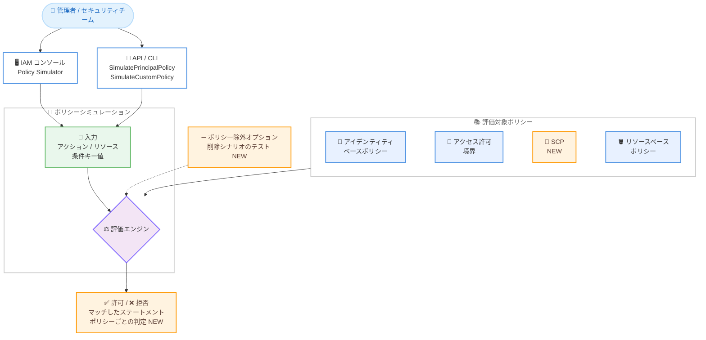

# AWS IAM - IAM Policy Simulator の IAM コンソール統合と機能強化

**リリース日**: 2026 年 7 月 30 日
**サービス**: AWS Identity and Access Management (IAM)
**機能**: IAM Policy Simulator の IAM コンソールへの統合および SCP テストなどの機能追加

📊 [このアップデートのインフォグラフィックを見る](https://takech9203.github.io/aws-news-summary/20260730-iam-policy-simulator-iam-console.html)

## 概要

AWS は、IAM ポリシーを本番環境へ適用する前にテストできるツールである IAM Policy Simulator の大幅な刷新を発表しました。今回のアップデートにより、これまでスタンドアロンサイトとして提供されていたシミュレーターが IAM コンソールに統合され、IAM のナビゲーションペインから直接利用できるようになりました。アイデンティティやポリシーを管理する場所と同じコンソール内でポリシーのテストが完結します。

機能面では、AWS Organizations のサービスコントロールポリシー (SCP) をシミュレーションに含められるようになり、SCP 階層がアイデンティティベースポリシーやリソースベースポリシーとどのように相互作用するかを確認できます。さらに、条件キーのテスト、特定ポリシーを除外した「このポリシーを削除したらどうなるか」というシナリオのモデリング、クロスアカウントシミュレーションにおけるポリシーごとの判定結果の提供など、シナリオモデリングの柔軟性が向上しました。

これらの機能強化により、セキュリティチームや開発チームはポリシーのユニットテストの自動化、過剰な権限付与の検出、ガードレールの検証をより効率的に行えるようになります。

**アップデート前の課題**

- Policy Simulator は IAM コンソールとは別のスタンドアロンサイトで提供されており、ポリシー管理とテストの間で画面を行き来する必要があった
- SCP をシミュレーションに含めることができず、Organizations のガードレールがアクセス判定に与える影響を事前に確認できなかった
- 特定のポリシーを除外した削除シナリオのモデリングが難しく、ポリシー整理の影響を事前評価しにくかった
- クロスアカウントシミュレーションの結果が粗く、どのポリシーが判定を左右したのかを特定しづらかった

**アップデート後の改善**

- シミュレーターが IAM コンソールに統合され、アイデンティティとポリシーを管理する場所でそのままテストできるようになった
- SCP をシミュレーションに含められるようになり、組織の SCP 階層とアイデンティティ / リソースポリシーの相互作用を確認できるようになった
- リージョン制限やタグ要件などの条件キーが判定結果に与える影響を API 経由でテストできるようになった
- 特定のポリシーを除外するオプションが追加され、「このポリシーを削除したらどうなるか」というシナリオをモデリングできるようになった
- クロスアカウントシミュレーションでポリシーごとの判定が返され、拒否されたリクエストのマッチしたステートメントには判定を導いたポリシーのみが反映されるようになった

## アーキテクチャ図



IAM コンソールまたは API からシミュレーションを実行すると、アイデンティティベースポリシー、アクセス許可境界、SCP、リソースベースポリシーを組み合わせて評価し、実際の AWS リクエストを送信することなくアクションごとの許可 / 拒否の判定結果を返します。

## サービスアップデートの詳細

### 主要機能

1. **IAM コンソールへの統合**
   - スタンドアロンのシミュレーターサイトが廃止され、IAM コンソールに統合された
   - IAM コンソールのナビゲーションペインから [Policy simulator] を選択してアクセスできる
   - アイデンティティやポリシーを管理する場所と同じ画面でポリシーテストが完結する

2. **SCP のシミュレーション対応**
   - AWS Organizations のメンバーアカウントの場合、SCP をシミュレーションに含められる
   - 組織の SCP 階層がアイデンティティベースポリシーやリソースベースポリシーとどのように相互作用するかを確認できる
   - SCP の条件キーや Deny ステートメント内のリソーススコープも評価される
   - セキュリティ上の理由から、SCP については他のポリシータイプと異なりマッチしたステートメントの詳細は表示されない

3. **条件キーのテスト**
   - `aws:RequestedRegion` によるリージョン制限や `aws:TagKeys` などのタグ要件といった条件キーが判定結果に与える影響をテストできる
   - `aws:PrincipalAccount` や `aws:PrincipalOrgID` などのプリンシパル / 組織コンテキストキーはシミュレーターが自動的に値を設定する
   - それ以外の条件キーの値はシミュレーション入力として指定する

4. **ポリシー除外オプション**
   - 特定のポリシーをシミュレーションから除外できるオプションが追加された
   - 「このポリシーを削除したらどうなるか」というシナリオをアカウントを変更せずにモデリングできる
   - 未使用ポリシーの整理や権限の絞り込みを安全に計画できる

5. **クロスアカウントシミュレーション結果の改善**
   - クロスアカウントシミュレーションで、ポリシータイプごと (アイデンティティポリシー、リソースポリシー) の判定が `EvalDecisionDetails` として返される
   - 拒否されたリクエストのマッチしたステートメントには、判定を導いたポリシーのみが反映されるようになり、原因の特定が容易になった

## 技術仕様

### シミュレーターのモード

| モード | 説明 |
|------|------|
| Principal モード | 既存の IAM ユーザー、ロール、グループにアタッチされたポリシーをテストする。カスタムのアイデンティティポリシーやアクセス許可境界を追加 / 除外してのシミュレーションも可能 |
| Custom モード | 作成中または貼り付けたポリシーをアタッチ前にテストする。ポリシーはアカウントに保存されない |

### 評価対象のポリシータイプ

| ポリシータイプ | 対応状況 |
|------|------|
| アイデンティティベースポリシー | 対応 (アタッチ済み / 未アタッチの両方) |
| アクセス許可境界 | 対応 (一度に 1 つ) |
| サービスコントロールポリシー SCP | 対応 (今回追加。条件キーとリソーススコープも評価) |
| リソースベースポリシー | 対応 (ユーザーが指定。コンソール以外ではポリシーの自動取得なし) |
| リソースコントロールポリシー RCP | 非対応 |

### 実環境との差異

- シミュレーターは実際の AWS サービスリクエストを送信しないため、本番環境に影響を与えずにテストできる
- 本番の実際のコンテキストキー値は使用されず、結果は各アクションの許可 / 拒否のみ
- VPC エンドポイントポリシー、ロールチェーン、単一リソースへの複数のリソースベースポリシーなど、一部の高度な構成ではライブ環境と結果が異なる場合がある

## 設定方法

### 前提条件

1. AWS アカウントと IAM コンソールへのアクセス権限
2. ポリシーシミュレーターの利用に必要な IAM 権限 (`iam:SimulatePrincipalPolicy`、`iam:SimulateCustomPolicy` など)
3. SCP をシミュレーションに含める場合は、アカウントが AWS Organizations の組織のメンバーであること

### 手順

#### ステップ 1: IAM コンソールでシミュレーターを開く

IAM コンソールを開き、ナビゲーションペインから [Policy simulator] を選択します。Principal モード (既存アイデンティティのポリシーをテスト) または Custom モード (作成中のポリシーをテスト) を選択します。

#### ステップ 2: テスト対象のアクションとリソースを指定して実行

シミュレーション対象のサービス、アクション、リソース ARN を指定します。ポリシーの `Condition` 要素が参照する条件キーがある場合は、その値を入力します。除外したいポリシーがあれば選択から外して「削除シナリオ」をモデリングします。

#### ステップ 3: API / CLI でシミュレーションを自動化する

```bash
# 既存プリンシパルのポリシーをシミュレーション (SCP や条件キーも評価対象)
aws iam simulate-principal-policy \
  --policy-source-arn arn:aws:iam::123456789012:role/app-role \
  --action-names s3:CreateBucket s3:DeleteBucket \
  --resource-arns arn:aws:s3:::example-bucket \
  --context-entries ContextKeyName=aws:RequestedRegion,ContextKeyValues=ap-northeast-1,ContextKeyType=string
```

`simulate-principal-policy` は、指定したロールにアタッチされたポリシーを対象に、指定アクションが許可されるかを評価します。`--context-entries` で `aws:RequestedRegion` などの条件キー値を渡すことで、リージョン制限が判定に与える影響をテストできます。

```bash
# 作成中のカスタムポリシーをシミュレーション
aws iam simulate-custom-policy \
  --policy-input-list file://draft-policy.json \
  --action-names dynamodb:DeleteTable \
  --resource-arns arn:aws:dynamodb:ap-northeast-1:123456789012:table/prod-table
```

`simulate-custom-policy` は、アカウントに保存されていないドラフト状態のポリシーを評価します。CI/CD パイプラインに組み込むことで、ポリシーのユニットテストを自動化できます。

## メリット

### ビジネス面

- **セキュリティリスクの低減**: 過剰な権限付与を本番適用前に検出でき、最小権限の原則の徹底に貢献する
- **ガバナンスの強化**: SCP によるガードレールが意図どおりに機能するかを事前検証でき、組織全体の統制を確実にできる
- **運用効率の向上**: ポリシー管理とテストが同一コンソールで完結し、切り替えの手間と学習コストが減る

### 技術面

- **SCP を含む統合評価**: アイデンティティポリシー、アクセス許可境界、SCP、リソースポリシーを組み合わせた実際の評価ロジックに近いテストが可能
- **削除シナリオのモデリング**: ポリシー除外オプションにより、ポリシー整理の影響をアカウントを変更せずに安全に確認できる
- **原因特定の容易化**: 許可 / 明示的拒否の判定を導いたポリシーとステートメントが表示され、クロスアカウントではポリシーごとの判定も返るため、トラブルシューティングが迅速になる
- **自動化との親和性**: `SimulatePrincipalPolicy` / `SimulateCustomPolicy` API により、ポリシーのユニットテストを CI/CD に組み込める

## デメリット・制約事項

### 制限事項

- リソースコントロールポリシー (RCP) はシミュレーション対象外
- SCP については、セキュリティ上の理由からマッチしたステートメントの詳細は表示されない (許可 / 拒否の判定のみ)
- アクセス許可境界は一度に 1 つしかシミュレーションできない
- コンソールでは、SCP のみが参照する条件キーには値を設定できない (アイデンティティポリシーなど他のポリシーにも同じキーが登場する場合は、その値が SCP 評価にも使用される)

### 考慮すべき点

- シミュレーション結果はライブ環境と異なる場合がある。VPC エンドポイントポリシー、ロールチェーン、単一リソースへの複数リソースベースポリシーなどの高度な構成では特に注意が必要
- テスト後は、実際の環境で意図した結果になっているかを確認することが推奨されている
- コンソール以外 (API / CLI) では、リソースベースポリシーは自動取得されないため、シミュレーションに含めるにはポリシー本文を指定する必要がある
- スタンドアロンのシミュレーターサイトを利用していた場合は、IAM コンソール内の新しい導線に運用手順を更新する必要がある

## ユースケース

### ユースケース 1: SCP ガードレールの事前検証

**シナリオ**: マルチアカウント環境で、特定リージョン以外の利用を禁止する SCP を OU に適用する前に、既存ワークロードのロールが影響を受けないか確認したい。

**実装例**:
```bash
aws iam simulate-principal-policy \
  --policy-source-arn arn:aws:iam::123456789012:role/etl-batch-role \
  --action-names glue:StartJobRun s3:GetObject \
  --resource-arns "arn:aws:s3:::etl-data/*" \
  --context-entries ContextKeyName=aws:RequestedRegion,ContextKeyValues=ap-northeast-1,ContextKeyType=string
```

**効果**: SCP 階層とアイデンティティポリシーの相互作用を事前に確認でき、ガードレール適用による本番ワークロードの停止リスクを回避できる。

### ユースケース 2: 未使用ポリシー削除の影響評価

**シナリオ**: 長年運用してきた IAM ロールに複数のポリシーがアタッチされており、不要と思われるポリシーを削除して権限を整理したいが、業務に影響が出ないか不安がある。

**実装例**:
```text
1. IAM コンソールで [Policy simulator] を開き、Principal モードで対象ロールを選択
2. 削除候補のポリシーをシミュレーション対象から除外
3. 業務で必要なアクション一覧 (例: s3:GetObject、dynamodb:Query) を指定して実行
4. すべて「許可」のままであることを確認してからポリシーを削除
```

**効果**: 「このポリシーを削除したらどうなるか」をアカウントを変更せずに検証でき、権限整理を安全に進められる。

### ユースケース 3: CI/CD でのポリシーユニットテスト自動化

**シナリオ**: IaC でポリシーを管理しており、プルリクエストの段階で「意図しない過剰権限がないか」「必要な権限が欠けていないか」を自動チェックしたい。

**実装例**:
```bash
# パイプライン内でドラフトポリシーをテストし、拒否されるべきアクションを検証
result=$(aws iam simulate-custom-policy \
  --policy-input-list file://policy.json \
  --action-names iam:CreateUser s3:DeleteBucket \
  --query 'EvaluationResults[?EvalDecision==`allowed`].EvalActionName' \
  --output text)
if [ -n "$result" ]; then
  echo "許可されるべきでないアクションが許可されています: $result" && exit 1
fi
```

**効果**: ポリシー変更のたびに過剰権限を自動検出でき、レビュー負荷を下げながら最小権限を維持できる。

## 料金

公式発表に料金に関する記載はありません。IAM および IAM Policy Simulator は追加料金なしで利用できます。

## 利用可能リージョン

IAM Policy Simulator が利用可能なすべての AWS リージョンで利用できます。

## 関連サービス・機能

- **AWS Organizations**: SCP を管理するサービス。今回のアップデートにより SCP をシミュレーションに含められるようになり、組織のガードレール検証と直接連携する
- **IAM Access Analyzer**: 外部アクセスの検出やポリシー検証 (policy validation) を提供する。シミュレーターによる事前テストと組み合わせることで、ポリシーのライフサイクル全体をカバーできる
- **AWS CloudTrail**: 実際のアクセス履歴を記録する。シミュレーション結果と実際のアクセスパターンを突き合わせることで、権限の絞り込みに活用できる

## 参考リンク

- 📊 [インフォグラフィック](https://takech9203.github.io/aws-news-summary/20260730-iam-policy-simulator-iam-console.html)
- [公式発表 (What's New)](https://aws.amazon.com/about-aws/whats-new/2026/07/iam-policy-simulator-iam-console/)
- [ドキュメント: IAM policy testing with the IAM policy simulator](https://docs.aws.amazon.com/IAM/latest/UserGuide/access_policies_testing-policies.html)
- [API リファレンス: SimulatePrincipalPolicy](https://docs.aws.amazon.com/IAM/latest/APIReference/API_SimulatePrincipalPolicy.html)
- [API リファレンス: SimulateCustomPolicy](https://docs.aws.amazon.com/IAM/latest/APIReference/API_SimulateCustomPolicy.html)
- [AWS IAM 製品ページ](https://aws.amazon.com/iam/)

## まとめ

IAM Policy Simulator が IAM コンソールに統合され、SCP のシミュレーション、条件キーのテスト、ポリシー除外による削除シナリオのモデリング、クロスアカウント結果の改善が加わりました。マルチアカウント環境でガードレールを運用するチームや、最小権限を徹底したいセキュリティチームにとって、本番適用前のポリシー検証がより実際の評価ロジックに近い形で行えるようになる重要なアップデートです。まずは IAM コンソールの [Policy simulator] から既存ロールの権限を確認し、CI/CD へのシミュレーション API の組み込みを検討することをおすすめします。
