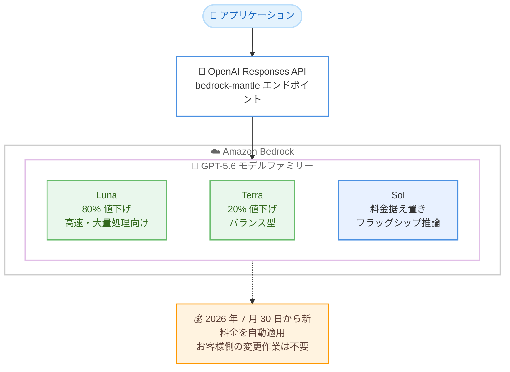

# Amazon Bedrock - OpenAI GPT-5.6 モデルの最大 80% 値下げ

**リリース日**: 2026 年 7 月 30 日
**サービス**: Amazon Bedrock
**機能**: OpenAI GPT-5.6 Luna / Terra モデルのオンデマンド推論料金の値下げ

📊 [このアップデートのインフォグラフィックを見る](https://takech9203.github.io/aws-news-summary/20260730-openai-gpt-terra-luna-pricing-bedrock.html)
<!-- INFOGRAPHIC_BASE_URL は環境変数から取得 -->

## 概要

AWS は、Amazon Bedrock で提供している OpenAI GPT-5.6 モデルのオンデマンド推論料金を値下げしたことを発表しました。GPT-5.6 Luna は 80%、GPT-5.6 Terra は 20% の値下げとなり、GPT-5.6 Sol の料金は据え置きです。今回の値下げは、OpenAI 自身のファーストパーティ料金の改定に合わせたもので、Amazon Bedrock 上でも同等の価格改定が適用されます。

新料金は 2026 年 7 月 30 日から自動的に適用され、お客様側での変更作業は一切不要です。既存のアプリケーションはそのまま、より低いコストで GPT-5.6 Luna および Terra を利用できます。

Luna は高速・大量処理向けに最適化されたモデルで、マルチステップのワークフローにおけるツール利用に対応し、コンテンツ処理、分類、カスタマーサービスの自動化、定型的な実装タスクに適しています。Terra は知能、速度、コストのバランスに優れ、より高度な推論を必要とする日常的な本番ワークロードに適しています。今回の値下げにより、これらのモデルをより多くのアプリケーションに適用し、より大きなワークロードを処理しながら、タスクあたりのコストを削減できます。

**アップデート前の課題**

- 大量のリクエストを処理するワークロードでは、推論コストがスケールに比例して増大し、適用範囲の拡大が難しかった
- コスト制約により、分類やコンテンツ処理などの高頻度タスクへの LLM 適用を見送るケースがあった
- OpenAI のファーストパーティ料金が改定されても、利用基盤側の料金が追随しなければコスト差が生じる懸念があった

**アップデート後の改善**

- 今回のアップデートにより GPT-5.6 Luna のオンデマンド推論料金が 80%、Terra が 20% 値下げされ、タスクあたりのコストを大幅に削減できるようになった
- 新料金は自動的に適用されるため、コードや設定の変更なしで値下げの恩恵を受けられるようになった
- OpenAI のファーストパーティ料金改定と一致した価格となり、Amazon Bedrock 上でも同等のコスト効率で GPT-5.6 を利用できるようになった

## アーキテクチャ図



アプリケーションは従来どおり bedrock-mantle エンドポイントの OpenAI Responses API を通じて GPT-5.6 モデルにアクセスし、Luna と Terra には値下げ後の新料金が自動的に適用される構成を示しています。

## サービスアップデートの詳細

### 主要機能

1. **GPT-5.6 Luna の 80% 値下げ**
   - オンデマンド推論料金が 80% 引き下げられた
   - 高速・大量処理向けに最適化されたモデルで、マルチステップワークフローでのツール利用に対応
   - コンテンツ処理、分類、カスタマーサービスの自動化、定型的な実装タスクに適する

2. **GPT-5.6 Terra の 20% 値下げ**
   - オンデマンド推論料金が 20% 引き下げられた
   - 知能、速度、コストのバランスに優れ、より高度な推論を必要とする日常的な本番ワークロードに適する

3. **新料金の自動適用**
   - 2026 年 7 月 30 日から新料金が有効
   - お客様側でのコードや設定の変更は一切不要で、自動的に新料金が適用される

4. **OpenAI ファーストパーティ料金との一致**
   - 今回の値下げは OpenAI 自身の料金改定に合わせたもの
   - Amazon Bedrock 上でも OpenAI 直接利用時と同等の価格水準を維持

## 技術仕様

### 値下げの概要

| 項目 | 詳細 |
|------|------|
| 対象サービス | Amazon Bedrock |
| 対象モデル | OpenAI GPT-5.6 Luna、GPT-5.6 Terra |
| 値下げ率 | Luna: 80%、Terra: 20% |
| GPT-5.6 Sol | 料金据え置き |
| 対象料金体系 | オンデマンド推論 |
| 適用開始日 | 2026 年 7 月 30 日 |
| 適用方法 | 自動適用 (お客様側の変更不要) |
| アクセス方法 | bedrock-mantle エンドポイントの OpenAI Responses API |

### API 変更履歴

今回のアップデートは料金改定であり、API の変更は伴いません。awsapichanges.com に対応するエントリはありません。

## 設定方法

### 前提条件

1. Amazon Bedrock を利用可能な AWS アカウント
2. GPT-5.6 Luna / Terra へのアクセス権限を付与する IAM ポリシー
3. 対象リージョン (US East (バージニア北部)、US East (オハイオ)、US West (オレゴン)) の利用

### 手順

#### ステップ 1: 既存利用者の対応

既存で GPT-5.6 Luna / Terra を利用している場合、対応は不要です。2026 年 7 月 30 日以降の利用分には新料金が自動的に適用されます。

#### ステップ 2: 新規利用時のモデルアクセス有効化

Amazon Bedrock コンソールでモデルアクセスを設定し、GPT-5.6 Luna / Terra の利用を有効化します。IAM ポリシーで対象モデルの呼び出しを許可する必要があります。

#### ステップ 3: コスト効果の確認

AWS Cost Explorer や AWS Cost and Usage Report で、値下げ適用後の Bedrock 利用コストを確認します。値下げにより余裕が生じた予算の範囲で、これまでコスト面で見送っていたユースケースへの適用拡大を検討します。

## メリット

### ビジネス面

- **タスクあたりのコスト削減**: Luna は 80%、Terra は 20% の値下げにより、同じワークロードをより低いコストで処理できる
- **適用範囲の拡大**: コスト制約で見送っていたアプリケーションにもモデル能力を適用しやすくなる
- **移行作業ゼロ**: 新料金は自動適用のため、値下げの恩恵を受けるための作業コストが発生しない

### 技術面

- **大量処理ワークロードのスケール**: 大幅に値下げされた Luna により、分類やコンテンツ処理などの高頻度・大量処理をスケールさせやすくなる
- **モデル選択の柔軟性向上**: 値下げ後の価格を踏まえ、Sol / Terra / Luna の使い分けをコスト効率の観点から再最適化できる
- **既存アーキテクチャの維持**: bedrock-mantle エンドポイントの OpenAI Responses API 経由のアクセス方法に変更はなく、既存実装をそのまま利用できる

## デメリット・制約事項

### 制限事項

- 値下げ対象は Luna (80%) と Terra (20%) のみで、Sol の料金は据え置き
- Luna と Terra の提供リージョンは US East (バージニア北部)、US East (オハイオ)、US West (オレゴン) の 3 リージョンに限られる
- 東京リージョンなど米国以外のリージョンでは利用できない

### 考慮すべき点

- 値下げ後の価格を前提に、現在利用中のモデルとの性能・コスト比較を改めて実施することが望ましい
- 大量処理ワークロードへ適用範囲を拡大する場合でも、クォータやスループットの制約を事前に確認する必要がある

## ユースケース

### ユースケース 1: 大量コンテンツの分類・処理

**シナリオ**: 日々大量に発生するドキュメントやユーザー生成コンテンツの分類、要約、メタデータ抽出を LLM で自動化したいが、従来はコストが障壁だった。

**実装例**:
```
GPT-5.6 Luna + OpenAI Responses API (bedrock-mantle エンドポイント)
大量のコンテンツをバッチ的に分類・処理
80% 値下げ後の料金でタスクあたりコストを大幅削減
```

**効果**: 従来コスト面で見送っていた大量処理への LLM 適用が現実的になり、処理対象を大幅に拡大できる。

### ユースケース 2: カスタマーサービスの自動化

**シナリオ**: 問い合わせ対応の一次回答やチケットの振り分けを自動化し、マルチステップのワークフローでツールを呼び出しながら処理したい。

**実装例**:
```
GPT-5.6 Luna
ツール利用によるマルチステップワークフロー
問い合わせ分類 → ナレッジ検索 → 回答生成の自動化
```

**効果**: 高速・低コストの Luna により、問い合わせ量の増加にもコスト効率よく対応できる。

### ユースケース 3: 本番ワークロードの推論コスト最適化

**シナリオ**: より高度な推論を必要とする日常的な本番ワークロードで Terra を利用しており、コストを抑えつつ品質を維持したい。

**実装例**:
```
GPT-5.6 Terra
既存の本番ワークロードをそのまま継続利用
20% 値下げが自動適用され、変更作業は不要
```

**効果**: アプリケーションの変更なしに推論コストを 20% 削減し、浮いた予算を機能拡張に充当できる。

## 料金

2026 年 7 月 30 日より、GPT-5.6 Luna のオンデマンド推論料金は 80%、GPT-5.6 Terra は 20% 値下げされました。GPT-5.6 Sol の料金は据え置きです。今回の値下げは OpenAI のファーストパーティ料金改定に合わせたもので、新料金はお客様側の変更なしに自動的に適用されます。具体的な料金は Amazon Bedrock の料金ページを参照してください。

### 値下げ率

| モデル | 値下げ率 |
|--------|----------|
| GPT-5.6 Luna | 80% |
| GPT-5.6 Terra | 20% |
| GPT-5.6 Sol | 据え置き |

## 利用可能リージョン

GPT-5.6 Luna および Terra は以下のリージョンで利用できます。

- US East (バージニア北部)
- US East (オハイオ)
- US West (オレゴン)

## 関連サービス・機能

- **Amazon Bedrock**: 基盤モデルを API 経由で利用できるフルマネージドサービス。GPT-5.6 モデルの提供基盤
- **OpenAI Responses API (bedrock-mantle エンドポイント)**: Amazon Bedrock 上で GPT-5.6 モデルにアクセスするための API
- **AWS Cost Explorer**: 値下げ適用後の Bedrock 利用コストの推移を確認できるコスト分析サービス

## 参考リンク

- 📊 [インフォグラフィック](https://takech9203.github.io/aws-news-summary/20260730-openai-gpt-terra-luna-pricing-bedrock.html)
- [公式発表 (What's New)](https://aws.amazon.com/about-aws/whats-new/2026/07/openai-gpt-terra-luna-pricing-bedrock/)
- [OpenAI の料金改定発表](https://openai.com/index/advancing-the-price-performance-frontier-with-gpt-5-6/)
- [Amazon Bedrock の OpenAI モデルドキュメント](https://docs.aws.amazon.com/bedrock/latest/userguide/model-cards-openai.html)
- [Amazon Bedrock 料金ページ](https://aws.amazon.com/bedrock/pricing/)

## まとめ

今回のアップデートにより、Amazon Bedrock 上の OpenAI GPT-5.6 Luna が 80%、Terra が 20% 値下げされ、OpenAI のファーストパーティ料金改定と同等の価格水準が維持されました。新料金は 2026 年 7 月 30 日から自動適用されるため、既存利用者に作業は不要です。大量処理や自動化のユースケースを持つお客様は、値下げ後の価格を前提にモデル選択とワークロードの適用範囲を見直し、これまでコスト面で見送っていた領域への展開を検討することを推奨します。
