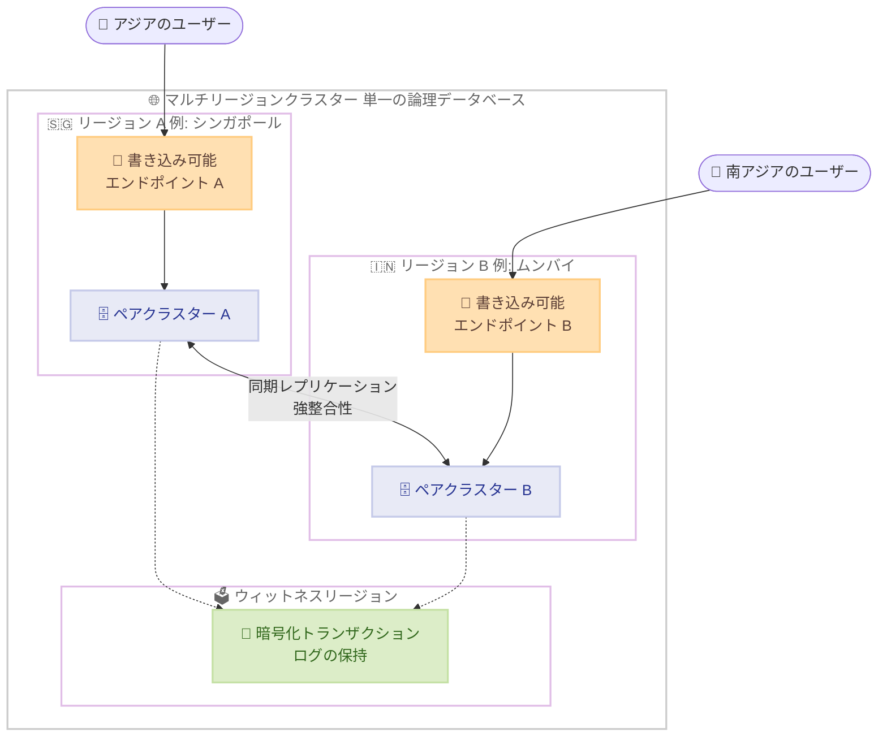

# Amazon Aurora DSQL - マルチリージョンクラスターを 4 つの追加リージョンでサポート

**リリース日**: 2026 年 7 月 31 日
**サービス**: Amazon Aurora DSQL
**機能**: マルチリージョンクラスターの対応リージョン拡大

📊 [このアップデートのインフォグラフィックを見る](https://takech9203.github.io/aws-news-summary/20260731-amazon-aurora-dsql-adds-multi-region-clusters-four-more-regions.html)

## 概要

Amazon Aurora DSQL のマルチリージョンクラスターが、新たに欧州 (ストックホルム)、欧州 (スペイン)、アジアパシフィック (ムンバイ)、アジアパシフィック (シンガポール) の 4 リージョンで利用可能になりました。これにより、マルチリージョンクラスターを作成できるリージョンは合計 16 リージョンに拡大しました。

Aurora DSQL は、アクティブ - アクティブの高可用性を備えたサーバーレス分散 SQL データベースです。マルチリージョンクラスターは、ペアリングされた 2 つのリージョンそれぞれに書き込み可能なエンドポイントを提供し、単一の論理データベースとして動作します。強整合性が保証されるため、どちらのリージョンから読み取っても常に同じデータが参照でき、一方のリージョンが利用不可になった場合でもデータベースは利用可能なまま維持されます。

欧州とアジアパシフィックでマルチリージョン構成の選択肢が広がったことで、データレジデンシー要件やユーザーへの低レイテンシー要件を満たしながら、リージョン障害に耐えるグローバルアプリケーションを構築しやすくなりました。

**アップデート前の課題**

- 以前は欧州のマルチリージョンクラスターがフランクフルト、アイルランド、ロンドン、パリの 4 リージョンに限定されており、北欧や南欧にデータを配置する構成が組めなかった
- 以前はアジアパシフィックのマルチリージョンクラスターが東京、大阪、ソウルに限定されており、ムンバイやシンガポールを含む構成が組めなかった
- 南アジア・東南アジアのユーザーに近いリージョンでアクティブ - アクティブ構成を実現するには、アプリケーション層での独自のレプリケーション設計が必要だった

**アップデート後の改善**

- 欧州ではストックホルムとスペインを含む 6 リージョンの組み合わせでマルチリージョンクラスターを作成できるようになった
- アジアパシフィックではムンバイとシンガポールを含む 5 リージョンの組み合わせでマルチリージョンクラスターを作成できるようになった
- 追加の設計や運用負担なしに、99.999% のマルチリージョン可用性と強整合性を新リージョンでも利用できるようになった

## アーキテクチャ図



マルチリージョンクラスターは、ペアリングされた 2 リージョンそれぞれに書き込み可能なエンドポイントを持ち、コミットされたトランザクションを同期レプリケーションすることで単一の論理データベースを構成します。ウィットネスリージョンは暗号化されたトランザクションログの一部を保持し、耐久性と可用性を高めます。

## サービスアップデートの詳細

### 主要機能

1. **マルチリージョンクラスターの新規対応リージョン**
   - 欧州 (ストックホルム) : eu-north-1
   - 欧州 (スペイン) : eu-south-2
   - アジアパシフィック (ムンバイ) : ap-south-1
   - アジアパシフィック (シンガポール) : ap-southeast-1

2. **アクティブ - アクティブのマルチリージョン構成**
   - ペアリングされた両リージョンに書き込み可能なエンドポイントを提供
   - 両エンドポイントは単一の論理データベースを提示し、同時読み書きが可能
   - 強整合性により、どちらのリージョンから読み取っても常に最新のデータを参照できる
   - 一方のリージョンが利用不可になってもデータベースは利用可能なまま維持される

3. **リージョンセット内での構成**
   - マルチリージョンクラスターは同一リージョンセット内 (北米、アジアパシフィック、欧州) のリージョン間でのみ作成可能
   - 大陸をまたぐマルチリージョンクラスターは現時点では非対応

## 技術仕様

### マルチリージョンクラスターのリージョンセット

| リージョンセット | 対象リージョン |
|------|------|
| 北米 | 米国東部 (バージニア北部)、米国東部 (オハイオ)、米国西部 (オレゴン)、カナダ (中部)、カナダ西部 (カルガリー) |
| アジアパシフィック | ムンバイ、大阪、ソウル、シンガポール、東京 |
| 欧州 | フランクフルト、アイルランド、ロンドン、パリ、スペイン、ストックホルム |

### 可用性の特性

| 項目 | 詳細 |
|------|------|
| シングルリージョン可用性 | 99.99% |
| マルチリージョン可用性 | 99.999% |
| 整合性モデル | 強整合性、スナップショット分離、ACID トランザクション |
| PostgreSQL 互換性 | PostgreSQL 16 ベース、psql などの既存ドライバー・ツールを利用可能 |
| エンドポイント形式 | dsql.{region}.api.aws |

## 設定方法

### 前提条件

1. AWS アカウントと Aurora DSQL を操作できる IAM 権限があること
2. マルチリージョンクラスターを作成する 2 つのリージョンが同一リージョンセットに属していること
3. AWS CLI を最新バージョンに更新していること

### 手順

#### ステップ 1: 1 つ目のリージョンにクラスターを作成

```bash
aws dsql create-cluster \
  --region ap-southeast-1 \
  --multi-region-properties '{"witnessRegion": "ap-northeast-1"}'
```

シンガポールリージョンに、ウィットネスリージョンとして東京を指定したクラスターを作成します。出力に含まれるクラスター ARN を次のステップで使用します。

#### ステップ 2: 2 つ目のリージョンにクラスターを作成しペアリング

```bash
aws dsql create-cluster \
  --region ap-south-1 \
  --multi-region-properties '{
    "witnessRegion": "ap-northeast-1",
    "clusters": ["arn:aws:dsql:ap-southeast-1:123456789012:cluster/your-cluster-id"]
  }'
```

ムンバイリージョンにクラスターを作成し、ステップ 1 で作成したシンガポールのクラスターとペアリングします。両クラスターで同じウィットネスリージョンを指定します。

#### ステップ 3: 各リージョンのエンドポイントに接続

```bash
psql "host=your-cluster-id.dsql.ap-southeast-1.on.aws user=admin dbname=postgres"
```

PostgreSQL 互換クライアントで各リージョンのエンドポイントに接続します。どちらのエンドポイントに対しても読み書きが可能で、強整合性が保証されます。

## メリット

### ビジネス面

- **可用性の向上**: マルチリージョン構成により 99.999% の可用性を実現し、リージョン規模の障害でもサービス継続が可能
- **データレジデンシー対応**: 北欧・南欧・南アジア・東南アジアにデータを配置する要件に対応しやすくなった
- **運用コスト削減**: サーバーレスかつフェイルオーバー運用が不要なため、DR 訓練やレプリケーション運用の負担を軽減できる

### 技術面

- **アクティブ - アクティブ書き込み**: 両リージョンのエンドポイントで同時に読み書きでき、フェイルオーバー処理の実装が不要
- **強整合性**: リージョン間でも常に一貫したデータを参照でき、結果整合性に起因する複雑なアプリケーション設計を回避できる
- **PostgreSQL 互換**: 既存の PostgreSQL ドライバー、ORM、ツールをそのまま利用できる

## デメリット・制約事項

### 制限事項

- マルチリージョンクラスターは同一リージョンセット内のリージョン間でのみ作成可能
- 大陸をまたぐマルチリージョンクラスター (例: 東京とフランクフルト) は現時点では非対応
- 香港、メルボルン、シドニー、サンパウロはシングルリージョンクラスターのみ対応

### 考慮すべき点

- Aurora DSQL は PostgreSQL 16 と広い互換性を持つが、一部の PostgreSQL 機能には制限があるため、既存アプリケーションの移行時は SQL 互換性の確認が必要
- リージョン間の同期レプリケーションにより、書き込みレイテンシーはリージョン間距離の影響を受ける
- ウィットネスリージョンの配置を含め、リージョンの組み合わせごとのレイテンシー特性を事前に検証することを推奨

## ユースケース

### ユースケース 1: 東南アジア・南アジア向けグローバルアプリケーション

**シナリオ**: シンガポールとムンバイの両方にユーザー基盤を持つ SaaS アプリケーションで、各拠点から低レイテンシーでアクセスしつつ、リージョン障害時もサービスを継続したい。

**実装例**:
```
シンガポール (ap-southeast-1) とムンバイ (ap-south-1) でマルチリージョンクラスターを構成し、
各リージョンのアプリケーションはローカルのエンドポイントに読み書きする。
Route 53 のレイテンシーベースルーティングでユーザーを最寄りリージョンに誘導する。
```

**効果**: 各リージョンのユーザーに低レイテンシーでサービスを提供しながら、99.999% の可用性と強整合性を確保できる。

### ユースケース 2: 欧州でのデータレジデンシーと DR の両立

**シナリオ**: 欧州の規制要件により EU 域内でのデータ保管が求められる金融系アプリケーションで、単一リージョン障害に備えた DR 構成が必要。

**実装例**:
```
ストックホルム (eu-north-1) とスペイン (eu-south-2) でマルチリージョンクラスターを構成する。
両リージョンとも書き込み可能なため、フェイルオーバー手順は不要で、
障害時は正常なリージョンのエンドポイントへトラフィックを切り替えるのみ。
```

**効果**: EU 域内にデータを保持したまま、地理的に離れた 2 リージョンによる高い耐障害性を実現できる。

### ユースケース 3: サーバーレスアーキテクチャのグローバル展開

**シナリオ**: AWS Lambda ベースのイベント駆動アプリケーションを複数リージョンに展開しており、リージョン間でデータの整合性を保ちたい。

**実装例**:
```
各リージョンの Lambda 関数がローカルの Aurora DSQL エンドポイントに接続する。
強整合性により、どのリージョンで処理されたイベントでも常に最新データを参照できるため、
リージョン間のデータ同期処理を独自に実装する必要がない。
```

**効果**: 接続プール管理やレプリケーション処理が不要になり、サーバーレスアーキテクチャ全体の運用がシンプルになる。

## 料金

Aurora DSQL の料金は、リクエストベースの分散処理ユニット (DPU) とストレージ使用量に基づく従量課金制です。マルチリージョンクラスターでは、各リージョンでの処理とレプリケーションに応じた料金が発生します。

AWS 無料利用枠を使用して Aurora DSQL を無料で試すことができます。詳細は [Aurora DSQL 料金ページ](https://aws.amazon.com/rds/aurora/dsql/pricing/)を参照してください。

## 利用可能リージョン

**マルチリージョンクラスター対応 (16 リージョン)**

- 米国東部 (バージニア北部)、米国東部 (オハイオ)、米国西部 (オレゴン)
- カナダ (中部)、カナダ西部 (カルガリー)
- アジアパシフィック (ムンバイ)、アジアパシフィック (大阪)、アジアパシフィック (ソウル)、アジアパシフィック (シンガポール)、アジアパシフィック (東京)
- 欧州 (フランクフルト)、欧州 (アイルランド)、欧州 (ロンドン)、欧州 (パリ)、欧州 (スペイン)、欧州 (ストックホルム)

今回追加されたのは、欧州 (ストックホルム)、欧州 (スペイン)、アジアパシフィック (ムンバイ)、アジアパシフィック (シンガポール) の 4 リージョンです。

**シングルリージョンクラスターのみ対応**

- アジアパシフィック (香港)、アジアパシフィック (メルボルン)、アジアパシフィック (シドニー)
- 南米 (サンパウロ)

## 関連サービス・機能

- **Amazon Aurora PostgreSQL**: プロビジョニング型・Aurora Serverless v2 が必要な場合や、PostgreSQL の全機能が必要な場合の選択肢
- **Amazon DynamoDB global tables**: NoSQL データモデルでマルチリージョンのアクティブ - アクティブ構成を実現する選択肢
- **Amazon Route 53**: レイテンシーベースルーティングやヘルスチェックにより、ユーザーを最適なリージョンのエンドポイントへ誘導
- **AWS Lambda**: サーバーレスアーキテクチャとの組み合わせで、インフラ管理不要のグローバルアプリケーションを構築可能

## 参考リンク

- 📊 [インフォグラフィック](https://takech9203.github.io/aws-news-summary/20260731-amazon-aurora-dsql-adds-multi-region-clusters-four-more-regions.html)
- [公式発表 (What's New)](https://aws.amazon.com/about-aws/whats-new/2026/07/amazon-aurora-dsql-adds-multi-region-clusters-four-more-regions/)
- [AWS Blog: Introducing Amazon Aurora DSQL](https://aws.amazon.com/blogs/database/introducing-amazon-aurora-dsql/)
- [Aurora DSQL 製品ページ](https://aws.amazon.com/rds/aurora/dsql/)
- [ドキュメント: What is Amazon Aurora DSQL?](https://docs.aws.amazon.com/aurora-dsql/latest/userguide/what-is-aurora-dsql.html)
- [料金ページ](https://aws.amazon.com/rds/aurora/dsql/pricing/)

## まとめ

Aurora DSQL のマルチリージョンクラスターが欧州とアジアパシフィックの 4 リージョンに拡大し、合計 16 リージョンで利用可能になりました。北欧・南欧・南アジア・東南アジアでのデータレジデンシー要件や低レイテンシー要件を満たすアクティブ - アクティブ構成が選択肢に加わったため、対象地域でグローバルアプリケーションを運用している場合は、マルチリージョンクラスターへの移行や新規採用の検討をお勧めします。
