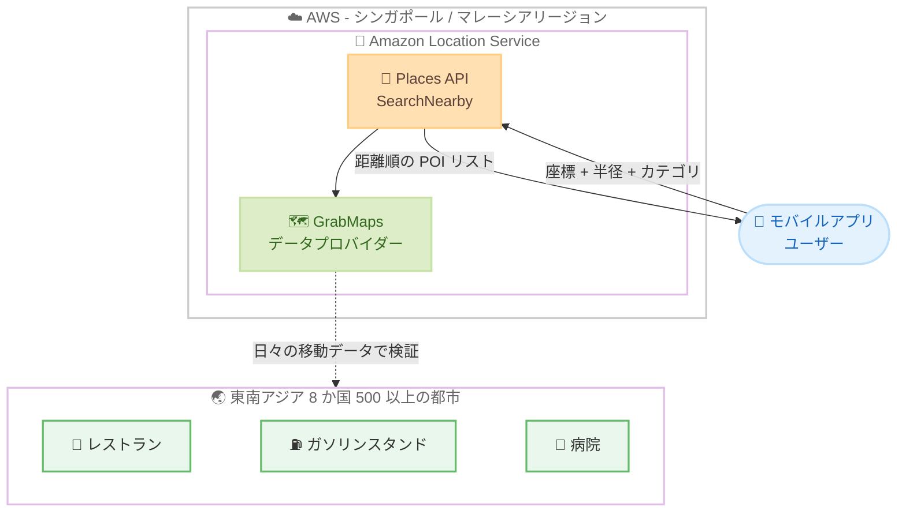

# Amazon Location Service - GrabMaps での Search Nearby サポート

**リリース日**: 2026 年 7 月 31 日
**サービス**: Amazon Location Service
**機能**: GrabMaps データプロバイダーによる SearchNearby (近隣検索) サポート

📊 [このアップデートのインフォグラフィックを見る](https://takech9203.github.io/aws-news-summary/20260731-amazon-location-service-search-nearby-grabmaps.html)

## 概要

Amazon Location Service が、東南アジア向け地図データプロバイダーである GrabMaps のデータを使用した SearchNearby (近接ベースの POI 検索) をサポートしました。アジアパシフィック (シンガポール) およびアジアパシフィック (マレーシア) リージョンで利用できます。SearchNearby は、指定した座標から一定の半径内にある場所 (POI: Point of Interest) を距離順に返す API で、ガソリンスタンド、病院、レストランなどのカテゴリによるフィルタリングにも対応しています。

GrabMaps は、東南アジア向けに構築されたハイパーローカルな地図データを提供します。毎日数百万件の Grab の移動データによって継続的に検証・更新されており、路地裏や狭い側道、バイクがアクセス可能なルートまでカバーしています。カバレッジはシンガポール、マレーシア、タイ、ベトナム、インドネシア、フィリピン、ミャンマー、カンボジアの 8 か国、500 以上の都市に及びます。

このアップデートは、東南アジアでローカル検索、配送、モビリティ関連のアプリケーションを構築する開発者を対象としており、デリバリープラットフォーム、ライドヘイリングアプリ、旅行アプリなどでの活用が期待されます。

**アップデート前の課題**

このアップデート以前に存在していた課題や制限は以下のとおりです。

- 以前は GrabMaps データで近接ベースの POI 検索 (SearchNearby) を利用できず、東南アジア特有のローカルデータを活用した「周辺検索」機能を実装できなかった
- グローバルプロバイダーのデータでは、東南アジアの路地裏や狭い側道、バイク向けルートなどのハイパーローカルな情報のカバレッジに限界があった
- 東南アジア向けアプリケーションで周辺の店舗や施設を検索するには、独自のデータ収集やサードパーティサービスとの個別統合が必要だった

**アップデート後の改善**

今回のアップデートにより可能になったことは以下のとおりです。

- GrabMaps のハイパーローカルデータを使用して、指定半径内の場所を距離順に取得できるようになった
- カテゴリフィルター (ガソリンスタンド、病院、レストランなど) により、アプリケーションに関連する結果のみを取得できるようになった
- 毎日数百万件の Grab の移動データで検証された、最新の道路網・住所・POI 情報を利用できるようになった

## アーキテクチャ図



アプリケーションは座標と検索半径を指定して SearchNearby API を呼び出し、GrabMaps データに基づく距離順の POI リストを取得します。

## サービスアップデートの詳細

### 主要機能

1. **近接ベースの POI 検索 (SearchNearby)**
   - 指定した座標 (`QueryPosition`) から検索半径 (`QueryRadius`) 内の場所を検索
   - 結果は距離順にランク付けされて返却される
   - 場所の名称、住所、電話番号、カテゴリ、営業時間などの詳細情報を含む

2. **カテゴリフィルタリング**
   - `Filter` パラメータでカテゴリ (レストラン、病院、ガソリンスタンドなど) を指定可能
   - ビジネスチェーンやフードタイプによる絞り込みにも対応
   - アプリケーションに関連する結果のみを取得でき、クライアント側の後処理が不要

3. **GrabMaps のハイパーローカルデータ**
   - 東南アジア専用に構築された地図データ
   - 毎日数百万件の Grab の移動データによる継続的な検証・更新
   - 路地裏、狭い側道、バイクがアクセス可能なルートまでカバー
   - シンガポール、マレーシア、タイ、ベトナム、インドネシア、フィリピン、ミャンマー、カンボジアの 500 以上の都市に対応

## 技術仕様

### SearchNearby API の主要パラメータ

| 項目 | 詳細 |
|------|------|
| `QueryPosition` | 検索の中心となる経度・緯度座標 (必須) |
| `QueryRadius` | 中心座標からの検索半径 |
| `Filter` | カテゴリ、ビジネスチェーン、フードタイプなどによるフィルター |
| `Language` | 結果の言語指定 |
| `PoliticalView` | 領土に関する政治的観点の適用 |
| `AdditionalFeatures` | タイムゾーン、フォニーム (音素表記) などの追加情報の要求 |
| `IntendedUse` | 結果の用途指定 (単回利用または保存)。保存する場合は Storage 料金ティアが適用 |

### レスポンスに含まれる主要データ

| 項目 | 詳細 |
|------|------|
| `Address` | 国、通りなどを含む完全な住所情報 |
| `Categories` | 場所のカテゴリ (レストラン、学校など) |
| `FoodTypes` | 飲食店の料理の種類 |
| `BusinessChains` | 関連するビジネスチェーン |
| `Contacts` | メール、電話番号、Web サイト |
| `OpeningHours` | 営業時間 |
| `TimeZone` | タイムゾーン情報 |

## 設定方法

### 前提条件

1. AWS アカウントを保有していること
2. アジアパシフィック (シンガポール) またはアジアパシフィック (マレーシア) リージョンを使用すること
3. Amazon Location Service の Places API を呼び出す IAM 権限 (`geo-places:SearchNearby`) または API キーを設定していること

### 手順

#### ステップ 1: SearchNearby API の呼び出し

```bash
aws geo-places search-nearby \
  --query-position 103.8198 1.3521 \
  --query-radius 1000 \
  --region ap-southeast-1
```

シンガポール中心部の座標 (経度 103.8198、緯度 1.3521) から半径 1,000 メートル以内の場所を検索します。結果は距離順に返却されます。

#### ステップ 2: カテゴリフィルターの適用

```bash
aws geo-places search-nearby \
  --query-position 101.6869 3.1390 \
  --query-radius 2000 \
  --filter '{"IncludeCategories": ["restaurant"]}' \
  --region ap-southeast-5
```

クアラルンプール中心部の座標から半径 2,000 メートル以内のレストランのみを検索します。マレーシアリージョン (ap-southeast-5) を使用しています。

#### ステップ 3: 結果の確認と活用

レスポンスに含まれる `Distance` (中心からの距離)、`Address`、`OpeningHours` などのフィールドを確認し、アプリケーションの UI に距離順の POI リストとして表示します。結果を保存する場合は `--intended-use Storage` を指定します (Storage 料金ティアが適用される点に注意)。

## メリット

### ビジネス面

- **東南アジア市場向けアプリの品質向上**: 現地の実情に即したハイパーローカルデータにより、検索結果の精度と鮮度が向上する
- **開発コストの削減**: 独自のデータ収集やサードパーティとの個別統合が不要になり、マネージド API のみで周辺検索機能を実装できる
- **鮮度の高いデータ**: 毎日数百万件の Grab の移動データによる検証で、道路網、住所、POI が常に最新に保たれる

### 技術面

- **距離順ランキング**: 半径内の結果が距離順に返却されるため、クライアント側でのソート処理が不要
- **柔軟なフィルタリング**: カテゴリ、ビジネスチェーン、フードタイプなど複数の条件で結果を絞り込める
- **豊富なレスポンス情報**: 住所、連絡先、営業時間、タイムゾーンなど、アプリケーションに必要な詳細情報を 1 回の API 呼び出しで取得できる

## デメリット・制約事項

### 制限事項

- GrabMaps での SearchNearby は、アジアパシフィック (シンガポール) およびアジアパシフィック (マレーシア) リージョンでのみ利用可能
- GrabMaps のデータカバレッジは東南アジア 8 か国 (シンガポール、マレーシア、タイ、ベトナム、インドネシア、フィリピン、ミャンマー、カンボジア) に限定される
- 検索結果を保存する場合は、より高い Storage 料金ティアが適用される

### 考慮すべき点

- 東南アジア以外の地域を対象とするアプリケーションでは、他のデータプロバイダーの利用を検討する必要がある
- `IntendedUse` パラメータの指定 (SingleUse / Storage) により料金が異なるため、ユースケースに応じた設計が必要
- 日本を含む他リージョンからの利用時は、対応リージョンのエンドポイントを明示的に指定する必要がある

## ユースケース

### ユースケース 1: フードデリバリーの店舗検索

**シナリオ**: 東南アジアで展開するフードデリバリープラットフォームが、配達員の現在地から最も近いピックアップポイント (レストラン) を特定する。

**実装例**:
```bash
aws geo-places search-nearby \
  --query-position 100.5018 13.7563 \
  --query-radius 1500 \
  --filter '{"IncludeCategories": ["restaurant"]}' \
  --region ap-southeast-1
```

**効果**: バンコク中心部の配達員の現在地から距離順にレストランを取得でき、ピックアップまでの時間を最小化し配達効率を向上させる。

### ユースケース 2: ライドヘイリングアプリでの周辺スポット提案

**シナリオ**: ライドヘイリングアプリが、乗車地点や降車地点の周辺にある飲食店をユーザーに提案する。

**実装例**:
```bash
aws geo-places search-nearby \
  --query-position 106.8456 -6.2088 \
  --query-radius 1000 \
  --filter '{"IncludeFoodTypes": ["indonesian"]}' \
  --region ap-southeast-1
```

**効果**: ジャカルタでの降車地点周辺のインドネシア料理店を距離順に提示し、アプリ内での回遊とユーザーエンゲージメントを高める。

### ユースケース 3: 旅行アプリでの緊急施設検索

**シナリオ**: 東南アジアを旅行中のユーザーが、現在地から一定範囲内の病院や薬局を素早く見つける。

**実装例**:
```bash
aws geo-places search-nearby \
  --query-position 103.8520 1.2966 \
  --query-radius 3000 \
  --filter '{"IncludeCategories": ["hospital"]}' \
  --region ap-southeast-1
```

**効果**: 営業時間や連絡先を含む病院情報を距離順に取得でき、緊急時にユーザーが最寄りの医療機関へ迅速にアクセスできる。

## 料金

Amazon Location Service の Places 機能は、API リクエスト数に基づく従量課金です。SearchNearby のリクエストは Places の料金体系に従って課金されます。検索結果を保存する場合 (`IntendedUse: Storage`) は、より高い Storage 料金ティアが適用されます。

最新の料金は [Amazon Location Service 料金ページ](https://aws.amazon.com/location/pricing/) を参照してください。

## 利用可能リージョン

GrabMaps データによる SearchNearby は、以下のリージョンで利用可能です。

- アジアパシフィック (シンガポール) - ap-southeast-1
- アジアパシフィック (マレーシア) - ap-southeast-5

GrabMaps のデータカバレッジは、シンガポール、マレーシア、タイ、ベトナム、インドネシア、フィリピン、ミャンマー、カンボジアの 500 以上の都市です。

## 関連サービス・機能

- **Amazon Location Service Places API**: ジオコーディング、リバースジオコーディング、テキスト検索など、SearchNearby と組み合わせて利用できる場所検索機能群
- **Amazon Location Service Maps / Routes**: GrabMaps データを使用した地図表示やルート計算と組み合わせることで、検索結果の可視化やナビゲーションを実現
- **AWS SDK / API キー認証**: モバイルアプリや Web アプリから IAM 認証または API キーで Places API を呼び出し可能

## 参考リンク

- 📊 [インフォグラフィック](https://takech9203.github.io/aws-news-summary/20260731-amazon-location-service-search-nearby-grabmaps.html)
- [公式発表 (What's New)](https://aws.amazon.com/about-aws/whats-new/2026/07/amazon-location-service-search-nearby-grabmaps)
- [Search Nearby 開発者ガイド](https://docs.aws.amazon.com/location/latest/developerguide/search-nearby.html)
- [SearchNearby API リファレンス](https://docs.aws.amazon.com/location/latest/APIReference/API_geoplaces_SearchNearby.html)
- [GrabMaps 概要 (開発者ガイド)](https://docs.aws.amazon.com/location/latest/developerguide/GrabMaps.html)
- [料金ページ](https://aws.amazon.com/location/pricing/)

## まとめ

Amazon Location Service の SearchNearby が GrabMaps データに対応し、東南アジア向けアプリケーションで高精度な周辺検索を実装できるようになりました。デリバリー、ライドヘイリング、旅行などのアプリケーションを東南アジア市場で展開している場合は、シンガポールまたはマレーシアリージョンで SearchNearby と GrabMaps の組み合わせを評価することを推奨します。
