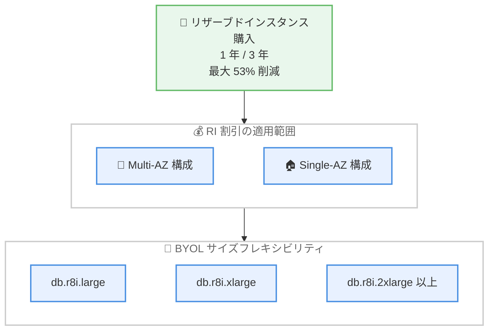

# Amazon RDS for Oracle - R8i / M8i インスタンス向けリザーブドインスタンスの提供開始

**リリース日**: 2026 年 7 月 31 日
**サービス**: Amazon RDS for Oracle
**機能**: R8i / M8i インスタンス向けリザーブドインスタンス (Reserved Instances)

📊 [このアップデートのインフォグラフィックを見る](https://takech9203.github.io/aws-news-summary/20260731-amazon-rds-oracle-r8i-m8i.html)

## 概要

Amazon RDS for Oracle において、R8i および M8i インスタンス向けの 1 年間および 3 年間のリザーブドインスタンス (RI) が購入可能になりました。オンデマンド料金と比較して最大 53% のコスト削減が可能です。

R8i / M8i インスタンスは AWS 専用にカスタマイズされた Intel Xeon 6 プロセッサを搭載しており、前世代の Intel ベースインスタンスと比較して最大 15% 優れたコストパフォーマンスと 2.5 倍のメモリ帯域幅を提供します。これまで最新世代の R8i / M8i を利用したくても、オンデマンド料金でしか利用できなかったユーザーにとって、長期利用時のコスト最適化の選択肢が広がるアップデートです。

RI の割引は Multi-AZ 構成と Single-AZ 構成の両方に適用され、同一のデータベースインスタンスクラスタイプ内であれば構成間の切り替えにも対応します。さらに、Oracle の BYOL (Bring Your Own License) モデルではサイズフレキシビリティが適用されるため、同一インスタンスファミリー内の任意のサイズに割引料金が自動的に適用されます。

**アップデート前の課題**

- 以前は R8i / M8i インスタンスをオンデマンド料金でしか利用できず、長期利用時のコスト最適化ができなかった
- 最新世代インスタンスへの移行を検討する際、RI による割引が適用されないことがコスト面での移行障壁となっていた
- コスト削減のために旧世代インスタンスの RI を継続利用すると、最新世代の性能向上 (コストパフォーマンス最大 15% 向上、メモリ帯域幅 2.5 倍) の恩恵を受けられなかった

**アップデート後の改善**

- R8i / M8i インスタンスに対して 1 年間または 3 年間の RI を購入でき、オンデマンド比で最大 53% のコスト削減が可能になった
- RI の割引が Multi-AZ / Single-AZ の両構成に適用され、ワークロードの変化に応じた構成変更にも柔軟に対応できるようになった
- BYOL モデルではサイズフレキシビリティにより、同一ファミリー内のサイズ変更時にも割引が自動適用されるようになった

## アーキテクチャ図



R8i / M8i の RI 割引は Multi-AZ / Single-AZ の両構成に適用され、BYOL モデルでは同一インスタンスファミリー内の任意のサイズに割引料金が自動的に適用されます。

## サービスアップデートの詳細

### 主要機能

1. **R8i / M8i 向け RI の提供開始**
   - 1 年間および 3 年間のリザーブドインスタンスを購入可能
   - オンデマンド料金と比較して最大 53% のコスト削減
   - AWS Management Console、AWS CLI、AWS SDK から購入可能

2. **Multi-AZ / Single-AZ 両構成への割引適用**
   - RI の割引は Multi-AZ 構成と Single-AZ 構成の両方に適用
   - 同一のデータベースインスタンスクラスタイプ内であれば、構成間の切り替えが可能
   - 本番ワークロードの要件変化に柔軟に対応できる

3. **BYOL モデルでのサイズフレキシビリティ**
   - Oracle エンジンの BYOL モデルではサイズフレキシビリティが適用される
   - 同一インスタンスファミリー内の任意のインスタンスサイズに割引料金が自動適用
   - 例: db.r8i.2xlarge の RI を保有している場合、db.r8i.xlarge を 2 台実行しても割引が適用される

4. **最新世代 Intel Xeon 6 プロセッサによる高性能**
   - AWS 専用にカスタマイズされた Intel Xeon 6 プロセッサを搭載
   - 前世代の Intel ベースインスタンス比で最大 15% 優れたコストパフォーマンス
   - 前世代比で 2.5 倍のメモリ帯域幅を実現し、メモリ集約型のデータベースワークロードに有効

## 技術仕様

### R8i / M8i インスタンスの特徴

| 項目 | 詳細 |
|------|------|
| プロセッサ | AWS 専用カスタム Intel Xeon 6 |
| コストパフォーマンス | 前世代 Intel ベースインスタンス比で最大 15% 向上 |
| メモリ帯域幅 | 前世代比 2.5 倍 |
| インスタンスファミリー | R8i (メモリ最適化)、M8i (汎用) |

### RI の購入オプション

| 項目 | 詳細 |
|------|------|
| 契約期間 | 1 年間または 3 年間 |
| 割引率 | オンデマンド比で最大 53% |
| 適用構成 | Multi-AZ / Single-AZ の両方 |
| サイズフレキシビリティ | BYOL モデルで適用 (同一ファミリー内) |
| 購入方法 | AWS Management Console、AWS CLI、AWS SDK |

## 設定方法

### 前提条件

1. Amazon RDS for Oracle を利用中、または利用を計画していること
2. 対象リージョンで R8i / M8i インスタンスが利用可能であること
3. RI の購入権限 (`rds:PurchaseReservedDBInstancesOffering` など) を持つ IAM プリンシパルであること

### 手順

#### ステップ 1: 利用可能な RI オファリングの確認

```bash
aws rds describe-reserved-db-instances-offerings \
    --product-description "oracle" \
    --db-instance-class db.r8i.2xlarge \
    --duration 31536000 \
    --multi-az
```

Oracle エンジン向けの db.r8i.2xlarge、1 年間 (31536000 秒)、Multi-AZ の RI オファリング一覧を取得します。出力に含まれる `ReservedDBInstancesOfferingId` を次のステップで使用します。

#### ステップ 2: RI の購入

```bash
aws rds purchase-reserved-db-instances-offering \
    --reserved-db-instances-offering-id <offering-id> \
    --reserved-db-instance-id my-oracle-r8i-ri \
    --db-instance-count 1
```

ステップ 1 で確認したオファリング ID を指定して RI を購入します。`--db-instance-count` で購入するインスタンス数を指定できます。

#### ステップ 3: 購入した RI の確認

```bash
aws rds describe-reserved-db-instances \
    --reserved-db-instance-id my-oracle-r8i-ri
```

購入した RI の状態 (`State`) や開始日時、適用条件を確認します。状態が `active` になると、条件に一致する稼働中の DB インスタンスに割引が自動適用されます。

## メリット

### ビジネス面

- **大幅なコスト削減**: 1 年 / 3 年のコミットメントにより、オンデマンド比で最大 53% のコスト削減が可能
- **予算の予測可能性向上**: 長期契約により、データベース運用コストの見通しが立てやすくなる
- **最新世代への移行障壁の解消**: RI による割引が利用できるため、コスト面の懸念なく最新世代へ移行できる

### 技術面

- **高いコストパフォーマンス**: カスタム Intel Xeon 6 プロセッサにより、前世代比で最大 15% 優れたコストパフォーマンスを実現
- **メモリ集約型ワークロードへの適合**: 前世代比 2.5 倍のメモリ帯域幅により、大規模な Oracle データベースの性能が向上
- **構成変更への柔軟性**: Multi-AZ / Single-AZ 間の切り替えや、BYOL でのサイズ変更時にも割引が維持される

## デメリット・制約事項

### 制限事項

- 南米 (サンパウロ) リージョンでは利用できない
- R8i / M8i インスタンスが利用可能なリージョンに限定される
- サイズフレキシビリティは BYOL モデルのみに適用され、License Included (LI) モデルでは適用されない

### 考慮すべき点

- RI は 1 年または 3 年のコミットメントが必要なため、将来のワークロード規模やエンジン移行計画を考慮して購入量を決定する必要がある
- 前払いオプション (全額前払い / 一部前払い / 前払いなし) により割引率が異なるため、キャッシュフローと割引率のバランスを検討する
- 旧世代インスタンスの RI を保有している場合、期限切れのタイミングに合わせて R8i / M8i への移行を計画すると無駄がない

## ユースケース

### ユースケース 1: 旧世代 RI の期限切れに合わせた最新世代への移行

**シナリオ**: R5 / M5 世代の RI が間もなく期限切れとなる本番 Oracle データベースを運用しており、更新のタイミングで最新世代への移行を検討している。

**実装例**:
```bash
# 既存 RI の期限を確認
aws rds describe-reserved-db-instances --query "ReservedDBInstances[*].[ReservedDBInstanceId,StartTime,Duration,State]"

# インスタンスクラスを R8i に変更後、R8i の RI を購入
aws rds modify-db-instance --db-instance-identifier mydb --db-instance-class db.r8i.2xlarge --apply-immediately
```

**効果**: 最大 15% 優れたコストパフォーマンスと 2.5 倍のメモリ帯域幅を得ながら、RI により最大 53% のコスト削減を継続できる。

### ユースケース 2: BYOL 環境でのサイズフレキシビリティ活用

**シナリオ**: BYOL モデルで複数の Oracle データベースを運用しており、開発・検証環境と本番環境でインスタンスサイズが異なる。将来的なサイズ変更の可能性もある。

**実装例**:
```bash
# db.r8i.4xlarge 相当の RI を購入すると、同一ファミリー内で柔軟に適用される
# 例: db.r8i.2xlarge x 2 台、db.r8i.xlarge x 4 台 などの組み合わせにも割引が適用
aws rds describe-reserved-db-instances-offerings \
    --product-description "oracle-ee (byol)" \
    --db-instance-class db.r8i.4xlarge
```

**効果**: サイズフレキシビリティにより、インスタンスサイズの変更や複数インスタンスへの分割時にも RI の割引が無駄なく適用される。

### ユースケース 3: Multi-AZ / Single-AZ の構成変更を伴う運用

**シナリオ**: 繁忙期は Multi-AZ で高可用性を確保し、閑散期やコスト最適化フェーズでは Single-AZ に変更する運用を行っている。

**実装例**:
```bash
# Multi-AZ から Single-AZ への変更 (RI 割引は継続適用)
aws rds modify-db-instance \
    --db-instance-identifier mydb \
    --no-multi-az \
    --apply-immediately
```

**効果**: RI の割引が Multi-AZ / Single-AZ の両構成に適用されるため、構成変更後も割引を維持しながら柔軟な運用ができる。

## 料金

R8i / M8i インスタンスの RI は、1 年間または 3 年間の契約期間でオンデマンド料金と比較して最大 53% のコスト削減が可能です。割引率は契約期間、前払いオプション、インスタンスクラス、リージョンにより異なります。

具体的な料金は [Amazon RDS for Oracle の料金ページ](https://aws.amazon.com/rds/oracle/pricing/) を参照してください。

## 利用可能リージョン

R8i および M8i インスタンスが利用可能なすべての AWS リージョンで利用できます。ただし、南米 (サンパウロ) リージョンは除きます。

## 関連サービス・機能

- **Amazon RDS for Oracle**: 本アップデートの対象サービス。マネージド型の Oracle データベースサービス
- **Amazon EC2 R8i / M8i インスタンス**: 同じカスタム Intel Xeon 6 プロセッサを搭載した EC2 インスタンスファミリー
- **AWS Cost Explorer**: RI の使用率やカバレッジの分析、RI 購入推奨の確認に活用できる

## 参考リンク

- 📊 [インフォグラフィック](https://takech9203.github.io/aws-news-summary/20260731-amazon-rds-oracle-r8i-m8i.html)
- [公式発表 (What's New)](https://aws.amazon.com/about-aws/whats-new/2026/07/amazon-rds-oracle-r8i-m8i/)
- [Amazon RDS for Oracle](https://aws.amazon.com/rds/oracle/)
- [ドキュメント: DB インスタンスクラスのサポート状況](https://docs.aws.amazon.com/AmazonRDS/latest/UserGuide/Concepts.DBInstanceClass.Support.html)
- [料金ページ](https://aws.amazon.com/rds/oracle/pricing/)

## まとめ

Amazon RDS for Oracle の R8i / M8i インスタンスに RI が提供され、最新世代の高いパフォーマンスと最大 53% のコスト削減を両立できるようになりました。旧世代インスタンスで RI を利用中のユーザーは、RI の更新タイミングに合わせて R8i / M8i への移行を検討することを推奨します。特に BYOL モデルではサイズフレキシビリティが適用されるため、将来のサイズ変更も見据えた柔軟な購入計画が可能です。
