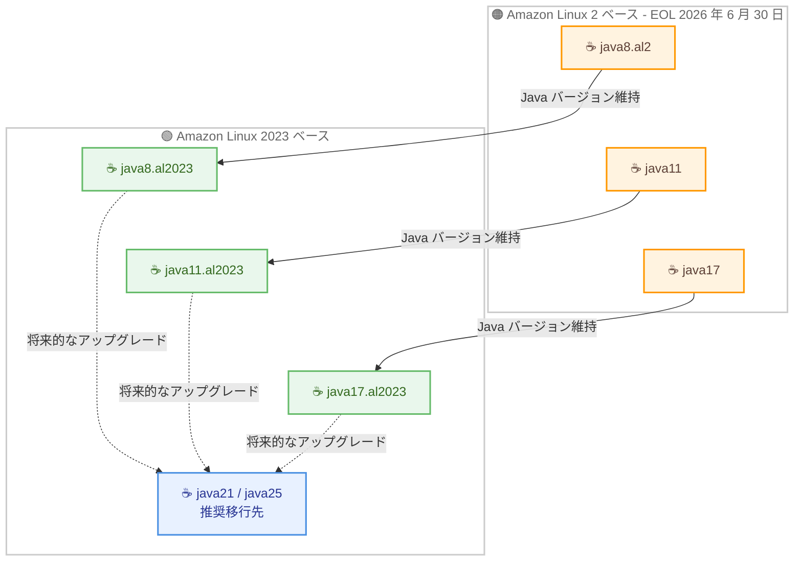

# AWS Lambda - Amazon Linux 2023 上での Java 8、11、17 ランタイムサポート

**リリース日**: 2026 年 7 月 31 日
**サービス**: AWS Lambda
**機能**: Amazon Linux 2023 ベースの Java 8 / 11 / 17 ランタイムおよびコンテナベースイメージ

📊 [このアップデートのインフォグラフィックを見る](https://takech9203.github.io/aws-news-summary/20260731-aws-lambda-java-amazon-linux.html)

## 概要

AWS Lambda が、Amazon Linux 2023 (AL2023) 上で動作する Java 8、Java 11、Java 17 のランタイムサポートを発表しました。これらはマネージドランタイムおよびコンテナベースイメージの両方で提供されます。ランタイム識別子はそれぞれ `java8.al2023`、`java11.al2023`、`java17.al2023` です。

従来の Java 8 / 11 / 17 ランタイムは Amazon Linux 2 (AL2) 上に構築されていましたが、AL2 は 2026 年 6 月 30 日にエンドオブライフ (EOL) を迎えました。今回のアップデートにより、Java バージョンのアップグレードを同時に行うことなく、オペレーティングシステムのみを AL2 から AL2023 へ移行できるようになります。レガシーな Java アプリケーションを運用しており、Java バージョンの変更に伴う互換性検証の負担が大きいユーザーにとって、有効な移行パスとなります。

なお、AWS は AL2023 上の Java 21 または Java 25 へのアップグレードを推奨移行パスとしています。新しい言語機能とパフォーマンス向上が得られるためです。Java 21 / 25 へのアップグレードには AWS Transform custom による支援も利用できます。

**アップデート前の課題**

このアップデート以前に存在していた課題や制限は以下のとおりです。

- Java 8 / 11 / 17 のマネージドランタイムは AL2 ベースのみで提供されており、AL2 の EOL (2026 年 6 月 30 日) 後は AL2023 ベースへの移行が必要だった
- AL2023 ベースの Java ランタイムは Java 21 / 25 のみであったため、OS の移行と Java メジャーバージョンアップグレードを同時に実施する必要があった
- Java バージョンアップグレードには依存ライブラリの互換性検証や回帰テストが必要であり、移行の障壁が高かった

**アップデート後の改善**

今回のアップデートにより、以下が可能になりました。

- Java バージョンを維持したまま、OS のみを AL2 から AL2023 へ移行できるようになった
- マネージドランタイム (`java8.al2023` など) とコンテナベースイメージの両方で AL2023 ベースの Java 8 / 11 / 17 が利用可能になった
- OS 移行と Java バージョンアップグレードを分離し、段階的な移行計画を立てられるようになった

## アーキテクチャ図



AL2 ベースの各 Java ランタイムから、Java バージョンを変更せずに AL2023 ベースの新ランタイムへ移行できます。推奨移行パスは AL2023 上の Java 21 / 25 です。

## サービスアップデートの詳細

### 主要機能

1. **AL2023 ベースの Java 8 / 11 / 17 マネージドランタイム**
   - 新しいランタイム識別子 `java8.al2023`、`java11.al2023`、`java17.al2023` を指定するだけで利用可能
   - Java バージョンを維持したまま OS のみを AL2023 へ移行できる
   - 廃止 (deprecation) 日は未定であり、AL2023 の廃止スケジュールに従う

2. **AL2023 ベースのコンテナベースイメージ**
   - マネージドランタイムだけでなく、コンテナイメージデプロイ向けのベースイメージも提供
   - コンテナイメージで Lambda 関数をデプロイしているユーザーも同様に移行可能

3. **AL2 ベースランタイムの延長セキュリティパッチ**
   - AL2 ベースの Java 8 / 11 / 17 ランタイムは、2027 年 6 月 30 日まで重要度の高い (critical および一部の important) セキュリティ問題に対するパッチを受領
   - AL2 の EOL 後も 1 年間の移行猶予期間が確保されている
   - サポートおよび SLA の適用を維持するには、AL2023 ベースのランタイムへの移行が必要

## 技術仕様

### Java ランタイムの比較

| ランタイム | 識別子 | OS | 廃止日 |
|------|------|------|------|
| Java 25 | `java25` | Amazon Linux 2023 | 2029 年 6 月 30 日 |
| Java 21 | `java21` | Amazon Linux 2023 | 2029 年 6 月 30 日 |
| Java 17 (新規) | `java17.al2023` | Amazon Linux 2023 | 未定 (AL2023 スケジュールに従う) |
| Java 11 (新規) | `java11.al2023` | Amazon Linux 2023 | 未定 (AL2023 スケジュールに従う) |
| Java 8 (新規) | `java8.al2023` | Amazon Linux 2023 | 未定 (AL2023 スケジュールに従う) |
| Java 17 (従来) | `java17` | Amazon Linux 2 | 2027 年 6 月 30 日 |
| Java 11 (従来) | `java11` | Amazon Linux 2 | 2027 年 6 月 30 日 |
| Java 8 (従来) | `java8.al2` | Amazon Linux 2 | 2027 年 6 月 30 日 |

### AL2 と AL2023 の主な違い

| 項目 | Amazon Linux 2 | Amazon Linux 2023 |
|------|------|------|
| glibc | 2.26 | 2.34 |
| パッケージマネージャ | yum | dnf (Lambda ベースイメージでは microdnf) |
| ベースイメージサイズ | 100 MB 超 | 40 MB 未満 (AL2023-minimal ベース) |
| EOL | 2026 年 6 月 30 日 | 継続サポート中 |

## 設定方法

### 前提条件

1. AL2 ベースの Java ランタイム (`java8.al2`、`java11`、`java17`) を使用する Lambda 関数が存在すること
2. AWS CLI または AWS マネジメントコンソールへのアクセス権限があること
3. 関数コードが AL2023 環境 (glibc 2.34 など) で動作することをテスト環境で確認すること

### 手順

#### ステップ1: 対象関数の確認

```bash
aws lambda list-functions \
  --query "Functions[?Runtime=='java17' || Runtime=='java11' || Runtime=='java8.al2'].[FunctionName,Runtime]" \
  --output table
```

アカウント内の Lambda 関数一覧から、AL2 ベースの Java ランタイムを使用している関数を抽出して表形式で表示します。

#### ステップ2: ランタイムの更新

```bash
aws lambda update-function-configuration \
  --function-name my-java-function \
  --runtime java17.al2023
```

対象関数のランタイム識別子を AL2023 ベースの `java17.al2023` へ更新します。Java バージョンは変わらないため、関数コードの変更は原則不要です。

#### ステップ3: コンテナイメージの場合はベースイメージを更新

```dockerfile
FROM public.ecr.aws/lambda/java:17.al2023
COPY target/classes ${LAMBDA_TASK_ROOT}
COPY target/dependency/* ${LAMBDA_TASK_ROOT}/lib/
CMD ["com.example.App::handleRequest"]
```

Dockerfile のベースイメージを AL2023 ベースのイメージタグへ変更し、イメージを再ビルドして再デプロイします。ネイティブライブラリを含む場合は、glibc バージョンの違いによる影響がないかテストで確認してください。

## メリット

### ビジネス面

- **移行リスクの低減**: OS 移行と Java バージョンアップグレードを分離することで、一度に変更する範囲を最小化し、障害リスクを抑えられる
- **サポート継続性の確保**: AL2023 ベースへ移行することで、サポートおよび SLA の適用対象を維持できる
- **移行計画の柔軟性**: 2027 年 6 月 30 日までの猶予期間を活用しつつ、段階的な移行スケジュールを策定できる

### 技術面

- **コード変更が原則不要**: Java バージョンが同じであるため、ランタイム識別子の変更のみで移行できるケースが多い
- **新しい OS 基盤**: glibc 2.34 など新しいシステムライブラリを利用でき、セキュリティアップデートも継続的に提供される
- **マネージドランタイムとコンテナの両対応**: Zip デプロイとコンテナイメージデプロイのどちらの方式でも移行パスが提供される

## デメリット・制約事項

### 制限事項

- AL2023 ベースの Java 8 / 11 / 17 はあくまで暫定的な移行パスであり、AWS の推奨は Java 21 / 25 へのアップグレード
- AL2 ベースのランタイムのセキュリティパッチは 2027 年 6 月 30 日で終了する
- AL2 ベースランタイムへのパッチ提供は critical および一部の important なセキュリティ問題に限定される

### 考慮すべき点

- ネイティブライブラリ (JNI 経由など) を使用する関数は、AL2 と AL2023 の glibc やシステムパッケージの違いによる影響を検証する必要がある
- Java 8 / 11 / 17 の AL2023 ランタイムの廃止日は「未定」であるが、AL2023 の廃止スケジュールに従うため、長期的には Java 21 / 25 への移行計画を並行して進めることが望ましい
- コンテナイメージを使用している場合、ベースイメージの更新・再ビルド・再デプロイはユーザーの責任範囲である

## ユースケース

### ユースケース1: レガシー Java 8 アプリケーションの延命移行

**シナリオ**: 長年運用している Java 8 ベースの基幹バッチ処理を Lambda で実行しており、依存ライブラリの制約から短期間での Java バージョンアップグレードが困難な場合。

**実装例**:
```bash
aws lambda update-function-configuration \
  --function-name legacy-batch-function \
  --runtime java8.al2023
```

**効果**: Java 8 のまま OS のみを AL2023 へ移行し、サポート対象を維持しながら Java 21 / 25 への本格移行の準備期間を確保できます。

### ユースケース2: 大規模な Java 17 関数群の一括 OS 移行

**シナリオ**: 数百個の Java 17 関数を運用しており、AL2 の EOL 対応として最小限の変更で一括移行したい場合。

**実装例**:
```bash
for fn in $(aws lambda list-functions \
  --query "Functions[?Runtime=='java17'].FunctionName" --output text); do
  aws lambda update-function-configuration \
    --function-name "$fn" --runtime java17.al2023
  echo "Updated: $fn"
done
```

**効果**: コード変更なしにランタイム識別子の更新のみで全関数を AL2023 ベースへ移行でき、移行工数を大幅に削減できます。

### ユースケース3: Java 21 / 25 への段階的アップグレード計画

**シナリオ**: まず OS 移行を完了させてサポート継続性を確保し、その後計画的に Java 21 / 25 へアップグレードしたい場合。

**実装例**:
```
フェーズ 1 (即時): java17 → java17.al2023 (OS 移行のみ、コード変更なし)
フェーズ 2 (計画的): java17.al2023 → java21 (AWS Transform custom で支援)
フェーズ 3 (検証): 関数バージョンとエイリアスを利用した段階的デプロイ
```

**効果**: リスクを分離した 2 段階移行により、各フェーズでの検証範囲を明確化し、安全にモダナイゼーションを進められます。

## 料金

追加料金はありません。AL2023 ベースの Java ランタイムを使用する Lambda 関数には、通常の Lambda 料金 (リクエスト数と実行時間に基づく従量課金) が適用されます。

## 利用可能リージョン

AWS GovCloud (US) リージョンおよび中国リージョンを含む、AWS Lambda が利用可能なすべての AWS リージョンで利用できます。

## 関連サービス・機能

- **Amazon Linux 2023**: Lambda の新しい標準 OS 基盤。glibc 2.34、dnf パッケージマネージャなどを提供
- **AWS Transform custom**: Java 21 / 25 へのアップグレードを支援する変換ツール
- **AWS Lambda コンテナイメージ**: AL2023 ベースの Java ベースイメージを使用したコンテナデプロイ
- **AWS Trusted Advisor / AWS Health Dashboard**: 廃止予定ランタイムを使用する関数の検出と通知

## 参考リンク

- 📊 [インフォグラフィック](https://takech9203.github.io/aws-news-summary/20260731-aws-lambda-java-amazon-linux.html)
- [公式発表 (What's New)](https://aws.amazon.com/about-aws/whats-new/2026/07/aws-lambda-java-amazon-linux/)
- [AWS Blog: Introducing the Amazon Linux 2023 runtime for AWS Lambda](https://aws.amazon.com/blogs/compute/introducing-the-amazon-linux-2023-runtime-for-aws-lambda/)
- [ドキュメント: Lambda runtimes](https://docs.aws.amazon.com/lambda/latest/dg/lambda-runtimes.html)
- [料金ページ](https://aws.amazon.com/lambda/pricing/)

## まとめ

AL2 の EOL (2026 年 6 月 30 日) を受けて、Java バージョンを維持したまま AL2023 へ移行できるパスが提供された重要なアップデートです。AL2 ベースの Java ランタイムを使用している場合は、2027 年 6 月 30 日のパッチ提供終了までに `java8.al2023` / `java11.al2023` / `java17.al2023` への移行を完了させてください。あわせて、AWS が推奨する Java 21 / 25 への本格的なアップグレード計画の策定も進めることを推奨します。
