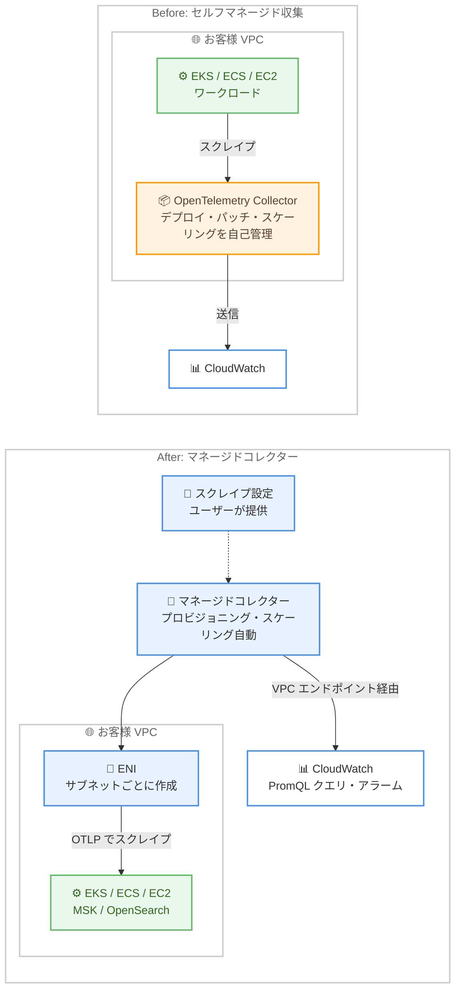

# Amazon CloudWatch - マネージド Prometheus コレクター

**リリース日**: 2026 年 7 月 31 日
**サービス**: Amazon CloudWatch
**機能**: マネージド Prometheus コレクター (Managed Prometheus Collectors)

📊 [このアップデートのインフォグラフィックを見る](https://takech9203.github.io/aws-news-summary/20260731-cloudwatch-managed-collectors.html)

## 概要

Amazon CloudWatch が、AWS インフラストラクチャから Prometheus メトリクスを収集するフルマネージドコレクターのサポートを発表しました。Amazon EKS、Amazon EC2、Amazon ECS、Amazon MSK、Amazon OpenSearch Service のワークロードを、エージェントのデプロイや管理なしでモニタリングできるようになります。

これまで Prometheus メトリクスを CloudWatch に取り込むには、セルフマネージドの OpenTelemetry Collector を自前で運用する必要がありました。今回のアップデートにより、ユーザーはスクレイプ設定と接続情報を提供するだけで、CloudWatch がコレクターのプロビジョニング、スケーリング、メトリクス収集を自動的に処理します。収集されたメトリクスは OpenTelemetry 形式で CloudWatch に配信され、PromQL を使用して AWS 提供メトリクスと一緒にクエリできるため、単一のビューで統合的なアラーム設定、ダッシュボード作成、サービス横断の相関分析が可能になります。

Kubernetes や Kafka などの OSS エコシステムで標準となっている Prometheus 形式のメトリクスを、運用負荷なしで CloudWatch に一元化したいプラットフォームチームや SRE チームに特に有用なアップデートです。

**アップデート前の課題**

- Prometheus メトリクスの収集には、セルフマネージドの OpenTelemetry Collector をデプロイ・運用する必要があった
- コレクターのインストール、パッチ適用、スケーリング、可用性確保をユーザー自身が管理する必要があった
- 収集基盤の運用負荷により、モニタリング対象の拡大に伴う管理コストが増大していた

**アップデート後の改善**

- スクレイプ設定と接続情報を提供するだけで、CloudWatch がプロビジョニング、スケーリング、収集を自動的に処理するようになった
- エージェントやコレクターの管理、インストール、パッチ適用、メンテナンスが不要になった
- 収集したメトリクスを PromQL でクエリし、AWS 提供メトリクスと組み合わせた統合的なアラーム、ダッシュボード、相関分析が可能になった

## アーキテクチャ図



従来はユーザー自身が OpenTelemetry Collector を運用する必要がありましたが、今回のアップデートにより、CloudWatch がマネージドコレクターを提供します。コレクターは指定されたサブネットに ENI を作成し、OTLP でメトリクスをスクレイプして VPC エンドポイント経由で CloudWatch に配信するため、データはパブリックインターネットを経由しません。

## サービスアップデートの詳細

### 主要機能

1. **フルマネージドなエージェントレス収集**
   - エージェント、コレクター、スクレイパーの管理、インストール、パッチ適用、メンテナンスが不要
   - コレクターは自動的にスケールし、高可用性で信頼性の高いメトリクス収集を実現
   - ユーザーはスクレイプ設定と接続情報を提供するだけでよい

2. **サービスごとの自動ターゲット検出**
   - Amazon EKS: Kubernetes サービスディスカバリによるターゲット検出
   - Amazon ECS: AWS Cloud Map を利用した DNS ベースのディスカバリ
   - Amazon EC2: インスタンスへの直接スクレイピング
   - Amazon MSK / Amazon OpenSearch Service: オープンモニタリングエンドポイントからの収集

3. **セキュアなネットワーク経路**
   - コレクターは指定したサブネットごとに ENI (Elastic Network Interface) を作成
   - ENI を通じて OTLP (OpenTelemetry Protocol) でメトリクスをスクレイプ
   - メトリクスは VPC エンドポイント経由で CloudWatch に配信され、パブリックインターネットを経由しない

4. **CloudWatch での統合分析**
   - メトリクスは OpenTelemetry 形式で配信され、PromQL でクエリ可能
   - AWS 提供メトリクスと組み合わせて、単一ビューで統合的なアラーム、ダッシュボード、サービス横断の相関分析が可能
   - EKS、MSK、OpenSearch Service のメトリクスは自動ダッシュボードへの表示と CloudWatch アラームでの使用に対応

## 技術仕様

### 対応サービスとディスカバリ方式

| 対象サービス | ターゲット検出方式 |
|------|------|
| Amazon EKS | Kubernetes サービスディスカバリ |
| Amazon ECS | AWS Cloud Map による DNS ベースディスカバリ |
| Amazon EC2 | インスタンスへの直接スクレイピング |
| Amazon MSK | オープンモニタリングエンドポイント |
| Amazon OpenSearch Service | オープンモニタリングエンドポイント |

### 収集の仕組み

| 項目 | 詳細 |
|------|------|
| メトリクス形式 | OpenTelemetry 形式 (OTLP) |
| クエリ言語 | PromQL |
| ネットワーク | サブネットごとに ENI を作成し、VPC エンドポイント経由で CloudWatch に配信 |
| スケーリング | コレクターが自動でスケール |
| データ転送の注意 | コレクターとターゲット間で VPC データ転送料金が発生する場合がある。`/metrics` エンドポイントの gzip 圧縮で転送量を削減可能 |

## 設定方法

### 前提条件

1. モニタリング対象の AWS リソース (EKS、EC2、ECS、MSK、OpenSearch Service のいずれか) が Prometheus 互換の `/metrics` エンドポイントを公開していること
2. コレクターの ENI を配置する VPC サブネットとセキュリティグループを用意していること
3. CloudWatch OTLP エンドポイントが利用可能なリージョンであること

### 手順

#### ステップ 1: スクレイプ設定の準備

```yaml
# scrape-config.yaml の例
global:
  scrape_interval: 30s
scrape_configs:
  - job_name: my-application
    metrics_path: /metrics
```

Prometheus 互換のスクレイプ設定を作成します。スクレイプ間隔、ジョブ名、メトリクスパスなどを定義します。対象サービスに応じてディスカバリ設定 (Kubernetes サービスディスカバリ、Cloud Map など) を記述します。

#### ステップ 2: マネージドコレクターの作成

CloudWatch コンソールまたは API からコレクターを作成します。作成時に以下を指定します。

- スクレイプ設定
- 接続先 (VPC、サブネット、セキュリティグループ)
- モニタリング対象のリソース

CloudWatch が指定されたサブネットに ENI を作成し、コレクターのプロビジョニングを自動的に行います。

#### ステップ 3: メトリクスの確認と活用

コレクター作成後、収集されたメトリクスを CloudWatch で PromQL を使用してクエリします。EKS、MSK、OpenSearch Service のメトリクスは自動ダッシュボードに表示でき、CloudWatch アラームの作成にも使用できます。

## メリット

### ビジネス面

- **運用コストの削減**: 収集基盤の構築・運用が不要になり、モニタリング体制の維持にかかる人的コストを削減できる
- **導入までの時間短縮**: スクレイプ設定を提供するだけで収集を開始でき、Prometheus モニタリングの立ち上げが迅速になる
- **モニタリングの一元化**: OSS メトリクスと AWS 提供メトリクスを CloudWatch に集約し、ツールの分散を防止できる

### 技術面

- **自動スケーリングと高可用性**: 収集対象の増減に応じてコレクターが自動でスケールし、高可用性の収集を実現する
- **セキュアなデータ経路**: ENI と VPC エンドポイントを経由するため、スクレイプしたデータがパブリックインターネットを通らない
- **PromQL による柔軟な分析**: OpenTelemetry 形式のメトリクスを PromQL でクエリし、AWS 提供メトリクスとのサービス横断の相関分析ができる

## デメリット・制約事項

### 制限事項

- アジアパシフィック (ニュージーランド) リージョンでは利用できない
- CloudWatch OTLP エンドポイントが利用可能なリージョンに限定される
- 対応サービスは EKS、EC2、ECS、MSK、OpenSearch Service に限られる

### 考慮すべき点

- コレクターは時間単位で課金され、CloudWatch の OpenTelemetry メトリクス取り込み料金も別途適用される
- コレクターとターゲット間の通信で VPC データ転送料金が発生する場合がある。`/metrics` エンドポイントのレスポンスを gzip などで圧縮することで転送量を削減できる (取り込みメトリクス数は変わらない)
- 既存の Amazon Managed Service for Prometheus のマネージドスクレイパーを利用している場合は、送信先やコスト構造の違いを比較検討する必要がある

## ユースケース

### ユースケース 1: EKS クラスターのアプリケーションメトリクス収集

**シナリオ**: EKS 上で稼働するマイクロサービスが Prometheus 形式のカスタムメトリクスを公開しており、これまで OpenTelemetry Collector を DaemonSet として運用していたが、バージョンアップやリソース管理の負荷が課題となっている。

**実装例**:
```yaml
scrape_configs:
  - job_name: kubernetes-pods
    kubernetes_sd_configs:
      - role: pod
    relabel_configs:
      - source_labels: [__meta_kubernetes_pod_annotation_prometheus_io_scrape]
        action: keep
        regex: true
```

**効果**: Kubernetes サービスディスカバリによりポッドを自動検出し、クラスター内のコレクター運用が不要になる。メトリクスは自動ダッシュボードと CloudWatch アラームで即座に活用できる。

### ユースケース 2: MSK クラスターの Kafka メトリクス監視

**シナリオ**: Amazon MSK のオープンモニタリング (JMX Exporter / Node Exporter) で公開される詳細な Kafka メトリクスを取得したいが、専用の Prometheus サーバーや収集基盤を運用したくない。

**実装例**:
```
1. MSK クラスターでオープンモニタリングを有効化
2. マネージドコレクターを作成し、MSK クラスターを接続先に指定
3. CloudWatch で PromQL を使用してブローカーレベルのメトリクスをクエリ
```

**効果**: コンシューマーラグやパーティションレベルの詳細メトリクスを収集基盤なしで CloudWatch に取り込み、AWS 提供メトリクスと合わせた統合監視を実現できる。

### ユースケース 3: EC2 上のレガシーワークロードの統合監視

**シナリオ**: EC2 インスタンス上で稼働するアプリケーションが Node Exporter などで Prometheus メトリクスを公開しているが、収集のために各インスタンスへエージェントを追加導入したくない。

**実装例**:
```
1. EC2 インスタンスの /metrics エンドポイントを公開
2. セキュリティグループでコレクターの ENI からのアクセスを許可
3. マネージドコレクターを作成し、EC2 インスタンスへの直接スクレイピングを設定
```

**効果**: インスタンスへの追加エージェント導入なしでメトリクスを収集し、コンテナワークロードと同じ CloudWatch 上のビューで相関分析ができる。

## 料金

マネージド Prometheus コレクターは時間単位で課金されます。加えて、CloudWatch の OpenTelemetry メトリクス取り込みに対する標準料金が適用されます。

また、コレクターとスクレイプ対象間の通信には VPC データ転送料金が発生する場合があります。`/metrics` エンドポイントのレスポンス圧縮 (gzip など) により転送量を削減できます。

詳細は [Amazon CloudWatch 料金ページ](https://aws.amazon.com/cloudwatch/pricing/) を参照してください。

## 利用可能リージョン

CloudWatch OTLP エンドポイントが利用可能なすべての AWS リージョンで利用できます。ただし、アジアパシフィック (ニュージーランド) リージョンは除きます。

## 関連サービス・機能

- **Amazon Managed Service for Prometheus**: Prometheus 互換のマネージドモニタリングサービス。マネージドスクレイパー機能を持つが、今回の機能は CloudWatch へ直接メトリクスを取り込む点が異なる
- **AWS Cloud Map**: ECS ワークロードの DNS ベースのターゲットディスカバリに使用される
- **Amazon MSK / Amazon OpenSearch Service のオープンモニタリング**: Prometheus 形式のメトリクスエンドポイントを公開し、マネージドコレクターの収集対象となる
- **CloudWatch OpenTelemetry サポート**: 収集されたメトリクスは OTLP 形式で取り込まれ、PromQL でクエリできる

## 参考リンク

- 📊 [インフォグラフィック](https://takech9203.github.io/aws-news-summary/20260731-cloudwatch-managed-collectors.html)
- [公式発表 (What's New)](https://aws.amazon.com/about-aws/whats-new/2026/07/cloudwatch-managed-collectors/)
- [ドキュメント: Amazon CloudWatch managed Prometheus collectors](https://docs.aws.amazon.com/AmazonCloudWatch/latest/monitoring/managed-prometheus-collectors.html)
- [料金ページ: Amazon CloudWatch Pricing](https://aws.amazon.com/cloudwatch/pricing/)

## まとめ

CloudWatch のマネージド Prometheus コレクターにより、EKS、EC2、ECS、MSK、OpenSearch Service の Prometheus メトリクスを、収集基盤の運用なしで CloudWatch に一元化できるようになりました。セルフマネージドの OpenTelemetry Collector を運用しているチームは、運用負荷とコストを比較したうえで移行を検討する価値があります。まずは開発環境の EKS クラスターや MSK クラスターで、スクレイプ設定を用意してコレクターを作成し、PromQL によるクエリと自動ダッシュボードを試すことを推奨します。
