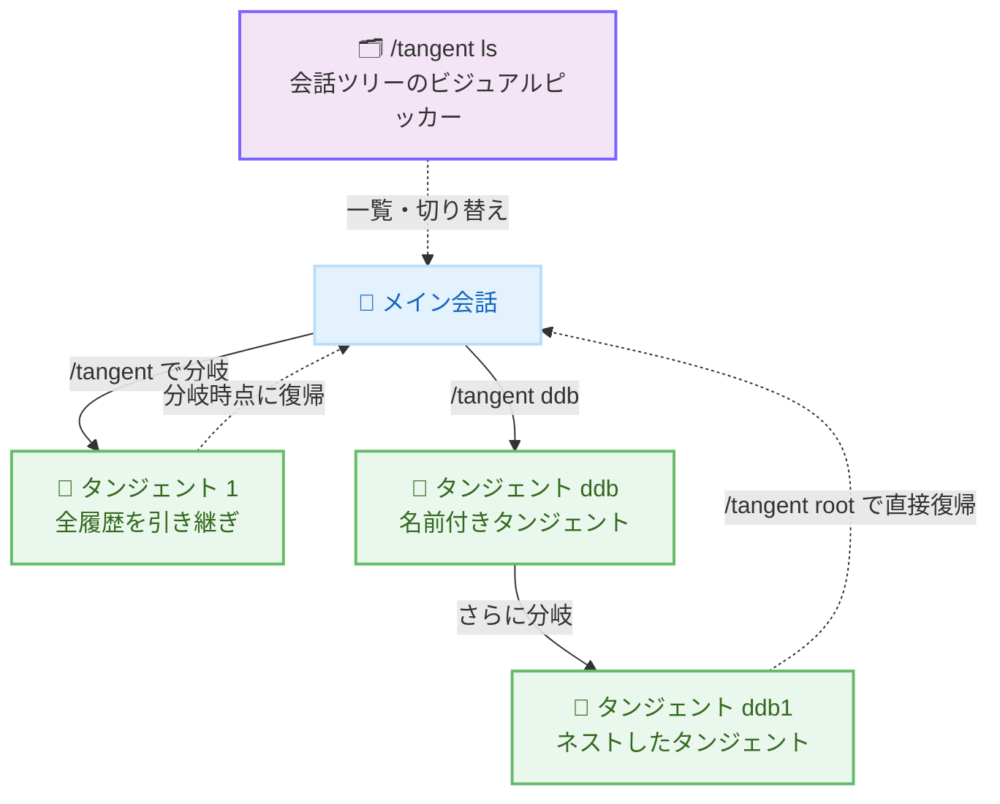

# Kiro - タンジェント (サイド会話) と /context のツール別トークン内訳

**リリース日**: 2026 年 7 月 31 日
**サービス**: Kiro
**機能**: Tangent Side-Conversations and Per-Tool Token Breakdown (Kiro CLI 2.16.0)

📊 [このアップデートのインフォグラフィックを見る](https://takech9203.github.io/aws-news-summary/20260731-kiro-changelog-2026-07-31.html)

## 概要

Kiro CLI 2.16.0 がリリースされ、タンジェント (tangent) と呼ばれるサイド会話機能が導入されました。タンジェントは、メインの会話から分岐して、それまでの会話履歴をすべて引き継いだサイド会話を開始できる機能です。サイド会話内で自由に調査や試行錯誤を行った後、分岐した時点のメイン会話に正確に戻ることができます。タスクの途中で何かを調べたいが、メインスレッドを汚したくないという場面に適した機能です。

あわせて、`/context` コマンドにツール別のトークン内訳表示が追加されました。ビルトインツール、MCP サーバー、エージェントというソース別にグループ化されたトークン消費量を確認でき、コンテキストウィンドウを何が消費しているのかを把握できます。

**アップデート前の課題**

このアップデート以前は、以下の課題がありました。

- タスクの途中で別の調査を行うと、その内容がメイン会話の履歴に混ざり、コンテキストが汚れてしまった
- 調査用に新しい会話を開始すると、それまでの会話履歴を引き継げず、文脈を再度説明する必要があった
- `/context` ではコンテキストウィンドウの消費内訳をツール単位で確認できず、何がトークンを消費しているのか特定しづらかった
- `/model` でモデルを切り替えた際に、コンテキスト使用率が再計算されなかった

**アップデート後の改善**

今回のアップデートにより、以下が可能になりました。

- `/tangent` でメイン会話の全履歴を引き継いだサイド会話に分岐し、終了後に分岐時点へ正確に戻れるようになった
- `/tangent <name>` で名前付きタンジェントを作成し、`/tangent ls` でビジュアルピッカーから会話ツリー全体を閲覧できるようになった
- `/tangent root` により、どの深さのタンジェントからでもメイン会話に直接戻れるようになった
- `/context` がツール別のトークン内訳をソース別 (ビルトイン、MCP サーバー、エージェント) に表示するようになった
- `/model` でモデルを切り替えた際に、コンテキスト使用率が再計算されるようになった

## アーキテクチャ図



メイン会話からタンジェントに分岐し、調査後に分岐時点へ戻るフローを示しています。タンジェントはネストでき、`/tangent root` でどの深さからでもメイン会話に直接戻れます。

## サービスアップデートの詳細

### 主要機能

1. **タンジェント (サイド会話)**
   - `/tangent` でメイン会話から分岐したサイド会話を開始できる
   - サイド会話は、それまでに議論したすべての内容 (会話履歴) を引き継ぐ
   - サイド会話での調査や試行錯誤を終えたら、分岐した時点のメイン会話に正確に戻れる
   - `/tangent <name>` で名前付きタンジェントを作成できる
   - V3 モード (`kiro-cli --v3`) で利用可能

2. **会話ツリーのビジュアルピッカー**
   - `/tangent ls` で会話ツリー全体をビジュアルピッカーで閲覧できる
   - 各タンジェントは最終アクティブ時刻とともに一覧表示される
   - 矢印キーで移動し、Enter キーで切り替え、Esc キーで閉じる操作に対応
   - `/tangent root` で、ネストしたタンジェントのどの深さからでもメイン会話に直接戻れる

3. **/context のツール別トークン内訳 (改善)**
   - `/context` がツール別のトークン内訳を表示するようになった
   - ソース別 (ビルトイン、MCP サーバー、エージェント) にグループ化して表示
   - コンテキストウィンドウを何が消費しているのかを特定しやすくなった

4. **コンテキスト使用率の再計算 (修正)**
   - `/model` でモデルを切り替えた際に、コンテキスト使用率が再計算されるようになった

## 技術仕様

### タンジェント関連コマンド

| コマンド | 説明 |
|----------|------|
| `/tangent` | 現在の会話から分岐したサイド会話を開始する |
| `/tangent <name>` | 名前付きタンジェントを作成する |
| `/tangent ls` | 会話ツリー全体をビジュアルピッカーで表示する |
| `/tangent root` | どの深さからでもメイン会話に直接戻る |

### リリース情報

| 項目 | 詳細 |
|------|------|
| バージョン | Kiro CLI 2.16.0 |
| リリース日 | 2026 年 7 月 31 日 |
| 対象製品 | Kiro CLI |
| タンジェントの利用条件 | V3 モード (`kiro-cli --v3`) |

## 設定方法

### 前提条件

1. Kiro CLI 2.16.0 以降がインストールされていること
2. タンジェント機能を利用する場合は、V3 モードで起動すること

### 手順

#### ステップ 1: V3 モードで Kiro CLI を起動

```bash
kiro-cli --v3
```

タンジェント機能は V3 モードで利用可能なため、`--v3` フラグを付けて Kiro CLI を起動します。

#### ステップ 2: タンジェントを開始

```
/tangent
```

現在の会話履歴をすべて引き継いだサイド会話を開始します。名前を付けたい場合は `/tangent <name>` を使用します。

#### ステップ 3: 会話ツリーの確認とメイン会話への復帰

```
/tangent ls
/tangent root
```

`/tangent ls` で会話ツリー全体をビジュアルピッカーで確認し、矢印キーと Enter キーで切り替えます。`/tangent root` を実行すると、どの深さのタンジェントからでもメイン会話に直接戻れます。

#### ステップ 4: コンテキスト消費の内訳を確認

```
/context
```

ツール別のトークン内訳が、ビルトイン、MCP サーバー、エージェントのソース別にグループ化されて表示されます。

## メリット

### ビジネス面

- **作業効率の向上**: メインタスクを中断せずに調査や検証を行えるため、コンテキストスイッチのコストが下がる
- **コンテキストコストの可視化**: トークン消費の内訳が見えることで、MCP サーバーやツール構成の最適化判断がしやすくなる
- **会話の整理**: 名前付きタンジェントと会話ツリーにより、複数トピックの並行検討を整理して進められる

### 技術面

- **コンテキストの汚染防止**: サイド会話での試行錯誤がメイン会話の履歴に混入しない
- **履歴の完全な引き継ぎ**: タンジェントは分岐時点までの全履歴を引き継ぐため、文脈の再説明が不要
- **ネスト対応**: タンジェントからさらにタンジェントを作成でき、`/tangent root` で一気にメイン会話へ戻れる
- **トークン消費の診断**: `/context` のツール別内訳により、コンテキストウィンドウ圧迫の原因特定が容易になる

## デメリット・制約事項

### 制限事項

- タンジェント機能は V3 モード (`kiro-cli --v3`) でのみ利用可能
- Kiro CLI のみが対象で、Kiro IDE には本リリースの機能は含まれない

### 考慮すべき点

- タンジェントは分岐時点までの全履歴を引き継ぐため、メイン会話が長い場合はタンジェント側でも相応のコンテキストを消費する
- タンジェントを多用・深くネストすると会話ツリーが複雑になるため、名前付きタンジェントで整理することが望ましい

## ユースケース

### ユースケース 1: タスク途中の調査

**シナリオ**: 機能実装の途中で、使用しているライブラリの API 仕様を確認したいが、メイン会話の流れを乱したくない。

**実装例**:
```
/tangent
(サイド会話でライブラリの API 仕様を調査)
/tangent root
```

**効果**: 調査内容がメイン会話に混入せず、実装の文脈を保ったまま作業を再開できる。

### ユースケース 2: 複数の設計案の並行検討

**シナリオ**: DynamoDB と EC2 それぞれの構成案を、同じ前提知識を共有した状態で並行して検討したい。

**実装例**:
```
/tangent ddb
(DynamoDB 案を検討)
/tangent root
/tangent ec2
(EC2 案を検討)
/tangent ls
```

**効果**: 各案を独立したタンジェントで検討しつつ、ビジュアルピッカーで会話ツリーを俯瞰して切り替えられる。

### ユースケース 3: コンテキストウィンドウの最適化

**シナリオ**: 長時間のセッションでコンテキスト使用率が高くなっており、どのツールがトークンを消費しているのか特定したい。

**実装例**:
```
/context
(ビルトイン、MCP サーバー、エージェント別の内訳を確認)
```

**効果**: トークン消費の大きい MCP サーバーやツールを特定し、不要なものを無効化するなどの最適化につなげられる。

## 利用可能リージョン

グローバル (Kiro はグローバルに提供されるサービスです)

## 関連サービス・機能

- **Kiro CLI V3 モード**: `kiro-cli --v3` で有効化する新しい CLI モード。タンジェント機能の利用に必要
- **/context コマンド**: コンテキストウィンドウの使用状況を確認するコマンド。今回ツール別トークン内訳が追加された
- **MCP サーバー**: Kiro に外部ツールを追加する仕組み。`/context` の内訳表示でソースの 1 つとして区別される

## 参考リンク

- 📊 [インフォグラフィック](https://takech9203.github.io/aws-news-summary/20260731-kiro-changelog-2026-07-31.html)
- [Kiro Changelog (CLI 2.16.0)](https://kiro.dev/changelog/cli/2-16)
- [Kiro Changelog](https://kiro.dev/changelog/)
- [タンジェント機能のドキュメント](https://kiro.dev/docs/cli/v3/tangent)

## まとめ

Kiro CLI 2.16.0 では、会話履歴を引き継いだサイド会話に分岐できるタンジェント機能と、`/context` のツール別トークン内訳表示が追加されました。メイン会話を汚さずに調査や並行検討を行える点と、コンテキスト消費の原因を特定できる点は、長時間のエージェントセッションの生産性を大きく向上させます。Kiro CLI を利用している場合は、V3 モード (`kiro-cli --v3`) でタンジェント機能を試すことを推奨します。
