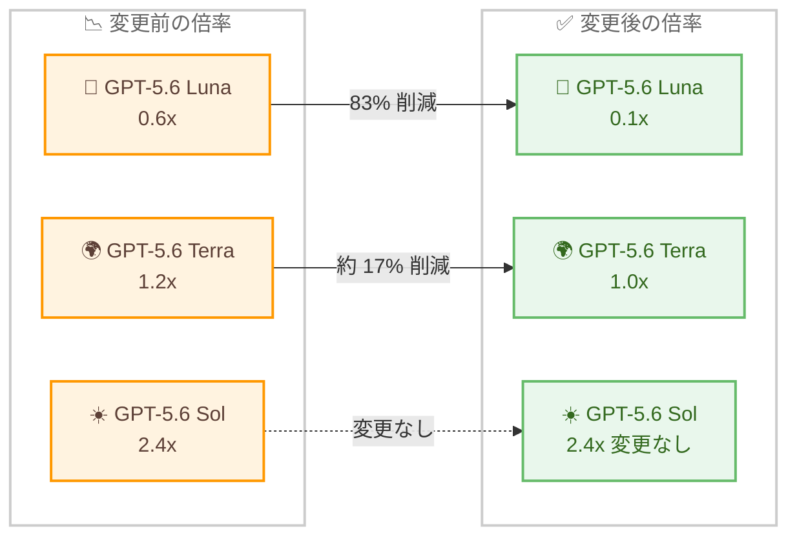

# Kiro - GPT-5.6 アップデート: Terra と Luna のクレジット倍率引き下げ

**リリース日**: 2026 年 7 月 31 日
**サービス**: Kiro
**機能**: GPT-5.6 Terra および Luna のクレジット倍率引き下げ

📊 [このアップデートのインフォグラフィックを見る](https://takech9203.github.io/aws-news-summary/20260731-kiro-gpt-5-6-pricing.html)

## 概要

Kiro は、OpenAI の GPT-5.6 Terra および Luna モデルの価格引き下げを受けて、Kiro におけるこれらのモデルのクレジット倍率を引き下げたことを発表しました。OpenAI 側の値下げ分をそのまま Kiro のユーザーに還元する形のアップデートであり、新しいクレジット倍率はすでに適用されています。

具体的には、GPT-5.6 Luna のクレジット倍率が 0.6x から 0.1x へ、GPT-5.6 Terra が 1.2x から 1.0x へ引き下げられました。GPT-5.6 Sol は 2.4x のまま変更ありません。GPT-5.6 の Sol、Terra、Luna は、Kiro Pro、Pro+、Pro Max、Power の各プランのユーザーが実験的サポート (experimental support) として利用できます。

**アップデート前の課題**

このアップデート以前は、以下の状況がありました。

- GPT-5.6 Luna の利用には 0.6x のクレジット倍率が適用され、軽量タスクでもクレジット消費が相対的に大きかった
- GPT-5.6 Terra の利用には 1.2x のクレジット倍率が適用され、標準的な利用でも基準値 1.0x を上回るコストがかかっていた
- モデル提供元の価格改定がツール側の料金に反映されるまでのタイムラグや不透明さが、コスト計画上の懸念となり得た

**アップデート後の改善**

今回のアップデートにより、以下が改善されました。

- GPT-5.6 Luna のクレジット倍率が 0.6x から 0.1x に引き下げられ、従来の 6 分の 1 のクレジット消費で利用可能になった
- GPT-5.6 Terra のクレジット倍率が 1.2x から 1.0x に引き下げられ、基準値と同等のコストで利用可能になった
- OpenAI の値下げが迅速に Kiro のクレジット倍率へ反映され、ユーザーは追加の手続きなしに新しい倍率の恩恵を受けられる

## アーキテクチャ図



GPT-5.6 の各モデルにおけるクレジット倍率の変更前後の比較です。Luna と Terra が引き下げられ、Sol は変更ありません。

## サービスアップデートの詳細

### 主要機能

1. **GPT-5.6 Luna のクレジット倍率引き下げ**
   - クレジット倍率が 0.6x から 0.1x に引き下げ
   - 従来比で 6 分の 1 のクレジット消費となり、軽量・高頻度なタスクでの利用コストが大幅に低下
   - 変更はすでに適用済み

2. **GPT-5.6 Terra のクレジット倍率引き下げ**
   - クレジット倍率が 1.2x から 1.0x に引き下げ
   - 基準となる 1.0x で利用できるため、日常的な開発タスクでのコスト予測が容易に

3. **GPT-5.6 Sol は変更なし**
   - クレジット倍率は 2.4x のまま据え置き
   - 高い推論能力が必要な場面向けの上位モデルという位置づけは従来どおり

## 技術仕様

### クレジット倍率の変更内容

| モデル | 変更前 | 変更後 | 変更率 |
|--------|--------|--------|--------|
| GPT-5.6 Luna | 0.6x | 0.1x | 約 83% 削減 |
| GPT-5.6 Terra | 1.2x | 1.0x | 約 17% 削減 |
| GPT-5.6 Sol | 2.4x | 2.4x | 変更なし |

### 利用可能なプラン

GPT-5.6 Sol、Terra、Luna は、以下のプランで実験的サポートとして利用できます。

| プラン | 利用可否 |
|--------|----------|
| Kiro Free | 対象外 |
| Kiro Pro | 利用可能 |
| Kiro Pro+ | 利用可能 |
| Kiro Pro Max | 利用可能 |
| Kiro Power | 利用可能 |

## 設定方法

### 前提条件

1. Kiro Pro、Pro+、Pro Max、Power のいずれかのプランに加入していること
2. Kiro がインストールされていること
3. GPT-5.6 系モデルは実験的サポートであることを理解していること

### 手順

#### ステップ 1: Kiro でモデルを選択

Kiro のモデルセレクターから GPT-5.6 Luna または GPT-5.6 Terra を選択します。新しいクレジット倍率はすでに適用されているため、追加の設定は不要です。

#### ステップ 2: クレジット消費の確認

利用状況に応じたクレジット消費を確認し、タスクの性質に応じてモデルを使い分けます。軽量なタスクには Luna、標準的なタスクには Terra、より高度な推論が必要なタスクには Sol という使い分けが考えられます。

## メリット

### ビジネス面

- **コスト削減**: Luna は従来比 6 分の 1、Terra は約 17% のクレジット消費削減となり、同じプランでより多くの作業が可能になる
- **迅速な価格還元**: OpenAI の値下げがそのまま Kiro ユーザーに還元され、価格面の透明性が高い
- **プラン価値の向上**: 月間クレジット枠の実質的な利用可能量が増加する

### 技術面

- **モデル使い分けの促進**: Luna が 0.1x になったことで、簡易なタスクを低コストモデルに振り分ける運用がより合理的になる
- **設定変更不要**: 倍率変更は自動的に適用され、ユーザー側での作業は不要
- **コスト予測の簡素化**: Terra が基準値 1.0x となり、クレジット消費の見積もりが直感的になる

## デメリット・制約事項

### 制限事項

- GPT-5.6 Sol、Terra、Luna は実験的サポート (experimental support) としての提供
- Kiro Free プランでは GPT-5.6 系モデルは利用できない
- GPT-5.6 Sol の倍率は 2.4x のままで、今回の引き下げ対象外

### 考慮すべき点

- 実験的サポートのモデルは、将来的に提供条件や倍率が変更される可能性がある
- クレジット倍率はモデル提供元の価格改定に連動するため、変動し得る点を考慮した運用が望ましい

## ユースケース

### ユースケース 1: 軽量タスクの低コスト処理

**シナリオ**: コードの軽微な修正、コメント追加、簡単な質問応答など、高度な推論を必要としないタスクを大量に処理したい。

**実装例**:
```
Kiro のモデルセレクターで GPT-5.6 Luna を選択し、
軽量タスクを 0.1x の低倍率で実行する。
```

**効果**: 従来の 6 分の 1 のクレジット消費で軽量タスクを処理でき、月間クレジット枠を温存できる。

### ユースケース 2: 日常的な開発タスクの標準運用

**シナリオ**: 機能実装やリファクタリングなど、日常的な開発タスクをバランスの取れたモデルで進めたい。

**実装例**:
```
Kiro のモデルセレクターで GPT-5.6 Terra を選択し、
1.0x の基準倍率で開発タスクを実行する。
```

**効果**: 基準値 1.0x でクレジット消費の見積もりが容易になり、コストを意識した開発計画を立てやすくなる。

### ユースケース 3: タスク難易度に応じたモデル使い分け

**シナリオ**: チームでクレジット消費を最適化するため、タスクの難易度に応じてモデルを使い分けたい。

**実装例**:
```
軽量タスク: GPT-5.6 Luna (0.1x)
標準タスク: GPT-5.6 Terra (1.0x)
高度な推論: GPT-5.6 Sol (2.4x)
```

**効果**: タスクごとに最適なコストパフォーマンスを実現し、チーム全体のクレジット利用効率を最大化できる。

## 料金

Kiro はクレジットベースの料金体系を採用しており、モデルごとにクレジット倍率が設定されています。今回のアップデートで GPT-5.6 Luna は 0.1x、GPT-5.6 Terra は 1.0x に引き下げられました。

### プランとクレジット

| プラン | 月額料金 | 月間クレジット |
|--------|----------|----------------|
| Kiro Free | $0 | 50 クレジット |
| Kiro Pro | $20 | 1,000 クレジット |
| Kiro Pro+ | $40 | 2,000 クレジット |
| Kiro Pro Max | $100 | 5,000 クレジット |
| Kiro Power | $200 | 10,000 クレジット |

GPT-5.6 系モデルは Kiro Pro 以上のプランで利用可能です。最新の料金情報は [Kiro の料金ページ](https://kiro.dev/pricing/) を参照してください。

## 利用可能リージョン

グローバル (Kiro はグローバルに提供されるサービスです)

## 関連サービス・機能

- **GPT-5.6 in Kiro**: 今回倍率が変更された GPT-5.6 Sol、Terra、Luna の提供開始時のアナウンス
- **Kiro クレジットシステム**: モデルごとのクレジット倍率に基づいて月間クレジットを消費する Kiro の課金の仕組み
- **Kiro のモデル選択機能**: タスクに応じて複数のモデルを切り替えて利用できる機能

## 参考リンク

- 📊 [インフォグラフィック](https://takech9203.github.io/aws-news-summary/20260731-kiro-gpt-5-6-pricing.html)
- [公式ブログ記事 (Kiro Blog)](https://kiro.dev/blog/gpt-5-6-pricing/)
- [GPT-5.6 提供開始時のブログ記事](https://kiro.dev/blog/gpt-5-6/)
- [Kiro 料金ページ](https://kiro.dev/pricing/)

## まとめ

OpenAI の GPT-5.6 Terra と Luna の値下げを受け、Kiro のクレジット倍率が Luna は 0.6x から 0.1x へ、Terra は 1.2x から 1.0x へ引き下げられました。特に Luna の大幅な引き下げにより、軽量タスクを低コストで処理する運用が現実的になります。Kiro Pro 以上のプランを利用している場合は、タスクの難易度に応じた GPT-5.6 系モデルの使い分けを検討することを推奨します。
