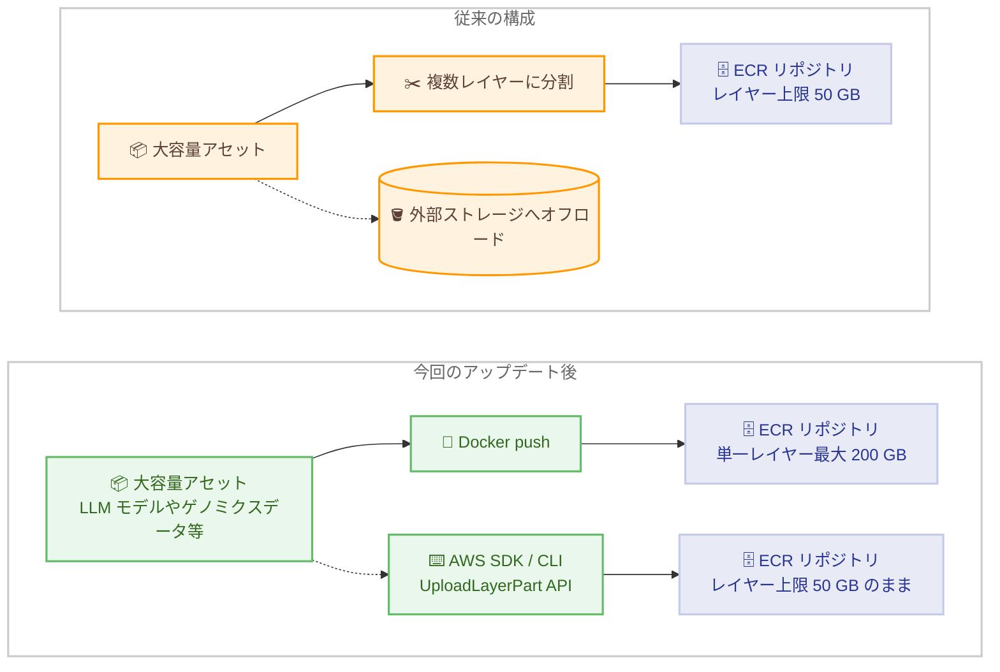

# Amazon ECR - イメージレイヤーサイズ上限を 200 GB に拡大

**リリース日**: 2026 年 8 月 3 日
**サービス**: Amazon Elastic Container Registry (Amazon ECR)
**機能**: Docker push 経由のイメージレイヤーサイズ上限の 200 GB への拡大

📊 [このアップデートのインフォグラフィックを見る](https://takech9203.github.io/aws-news-summary/20260803-amazon-ecr-image-layers.html)

## 概要

Amazon Elastic Container Registry (Amazon ECR) は、Docker push 経由でプッシュされるイメージについて、イメージレイヤーの最大サイズ上限を 200 GB に引き上げました。これにより、大規模言語モデル (LLM) の埋め込み、ゲノミクスデータセットのバンドル、大きなバイナリ依存関係のパッケージングなど、大容量アセットを単一のイメージレイヤーとしてコンテナイメージに直接含めることができるようになります。

従来は、大容量のアセットをコンテナイメージに含める場合、データを複数のレイヤーに分割するか、外部ストレージシステムにオフロードする必要がありました。今回のアップデートにより、こうした追加の複雑さが解消されます。

なお、AWS SDK または CLI (UploadLayerPart API) を使用してプッシュされるイメージのレイヤーサイズ上限は、引き続き 50 GB のままです。

**アップデート前の課題**

- 単一レイヤーのサイズに 50 GB の上限があり、大容量アセットをそのまま格納できなかった
- 大規模言語モデルやゲノミクスデータセットなどの大容量データは、複数レイヤーに分割する処理が必要だった
- あるいは Amazon S3 などの外部ストレージにオフロードし、コンテナ起動時に別途ダウンロードする仕組みを構築する必要があった

**アップデート後の改善**

- Docker push 経由であれば、最大 200 GB のデータを単一のイメージレイヤーに格納できるようになった
- レイヤー分割や外部ストレージ連携のための追加実装が不要になり、イメージビルドのパイプラインがシンプルになった
- モデルやデータセットをコンテナイメージに直接埋め込むことで、イメージ単体で完結するデプロイが可能になった

## アーキテクチャ図



従来は大容量アセットをレイヤー分割または外部ストレージへオフロードする必要がありましたが、今回のアップデートにより Docker push 経由では単一レイヤーで最大 200 GB まで格納できます。SDK / CLI 経由 (UploadLayerPart API) は従来どおり 50 GB 上限です。

## サービスアップデートの詳細

### 主要機能

1. **イメージレイヤーサイズ上限の 200 GB への拡大**
   - Docker push 経由でプッシュされるイメージが対象
   - 単一のイメージレイヤーに最大 200 GB のデータを格納可能
   - 従来必要だったレイヤー分割や外部ストレージへのオフロードが不要に

2. **プッシュ方法によるレイヤーサイズ上限の違い**
   - Docker push 経由: 最大 200 GB
   - AWS SDK / CLI 経由 (UploadLayerPart API): 従来どおり最大 50 GB
   - 大容量レイヤーを利用する場合は Docker push を使用する必要がある

3. **大容量アセットのコンテナイメージへの直接埋め込み**
   - 大規模言語モデルのモデルファイルの埋め込み
   - ゲノミクスデータセットのバンドル
   - 大きなバイナリ依存関係のパッケージング

## 技術仕様

### レイヤーサイズ上限の比較

| プッシュ方法 | レイヤーサイズ上限 |
|------|------|
| Docker push | 200 GB |
| AWS SDK / CLI (UploadLayerPart API) | 50 GB |

### 補足事項

- 本アップデートの対象は「単一イメージレイヤーの最大サイズ」であり、プッシュ方法によって適用される上限が異なります
- Amazon ECR のサービスクォータの詳細は [Amazon ECR service quotas](https://docs.aws.amazon.com/AmazonECR/latest/userguide/service-quotas.html) を参照してください

## 設定方法

### 前提条件

1. Amazon ECR リポジトリが作成済みであること
2. Docker がインストールされたビルド環境があること
3. ECR へのプッシュ権限を持つ IAM 認証情報が設定されていること

### 手順

#### ステップ 1: ECR への認証

```bash
aws ecr get-login-password --region ap-northeast-1 | \
  docker login --username AWS --password-stdin \
  123456789012.dkr.ecr.ap-northeast-1.amazonaws.com
```

ECR の認証トークンを取得し、Docker クライアントを ECR レジストリに対して認証しています。

#### ステップ 2: 大容量アセットを含むイメージのビルド

```dockerfile
FROM public.ecr.aws/docker/library/python:3.12-slim

# 大規模言語モデルのモデルファイルをイメージに直接埋め込む
COPY models/large-model/ /opt/models/large-model/

COPY app/ /app/
WORKDIR /app
CMD ["python", "serve.py"]
```

```bash
docker build -t my-llm-app:latest .
docker tag my-llm-app:latest \
  123456789012.dkr.ecr.ap-northeast-1.amazonaws.com/my-llm-app:latest
```

大容量のモデルファイルを COPY 命令でイメージに含めてビルドし、ECR リポジトリ用のタグを付与しています。単一の COPY 命令で作成されるレイヤーは最大 200 GB まで格納できます。

#### ステップ 3: Docker push でイメージをプッシュ

```bash
docker push \
  123456789012.dkr.ecr.ap-northeast-1.amazonaws.com/my-llm-app:latest
```

Docker push でイメージを ECR にプッシュしています。200 GB のレイヤーサイズ上限が適用されるのは、この Docker push 経由の場合です。

## メリット

### ビジネス面

- **開発・運用コストの削減**: レイヤー分割や外部ストレージ連携のための独自実装が不要になり、ビルドパイプラインの構築・保守コストを削減できる
- **AI / ML ワークロードの迅速な展開**: 大規模言語モデルをイメージに直接埋め込めるため、モデル配布の仕組みを簡素化できる
- **再現性の向上**: モデルやデータセットを含めてイメージ単体で完結するため、環境差異の少ないデプロイが可能になる

### 技術面

- **シンプルなイメージ構成**: 大容量アセットを単一レイヤーとして扱えるため、Dockerfile やビルドスクリプトの複雑さが減る
- **外部ストレージ依存の排除**: コンテナ起動時に S3 などから大容量データをダウンロードする追加処理が不要になる
- **既存ワークフローとの互換性**: 通常の Docker push をそのまま使用でき、特別な設定は不要

## デメリット・制約事項

### 制限事項

- 200 GB 上限が適用されるのは Docker push 経由のプッシュのみで、AWS SDK / CLI (UploadLayerPart API) 経由は引き続き 50 GB 上限
- 中東 (バーレーン) リージョンおよび中東 (UAE) リージョンでは利用できない

### 考慮すべき点

- レイヤーサイズが大きくなると、イメージのプッシュ・プルに要する時間が長くなる可能性があるため、デプロイ時間への影響を考慮する必要がある
- ECR のストレージ料金はイメージサイズに応じて発生するため、大容量イメージの保管コストを見積もっておく必要がある
- モデルの更新頻度が高い場合、レイヤーキャッシュの効率を考慮した Dockerfile の構成 (変更頻度の低いレイヤーを先に配置するなど) が重要になる

## ユースケース

### ユースケース 1: 大規模言語モデルの埋め込み

**シナリオ**: 自社でファインチューニングした LLM を推論用コンテナとして配布したい。従来はモデルファイルが 50 GB を超えるため、S3 からの起動時ダウンロードが必要だった。

**実装例**:
```dockerfile
FROM public.ecr.aws/docker/library/python:3.12-slim
COPY models/finetuned-llm/ /opt/models/finetuned-llm/
COPY inference/ /app/
CMD ["python", "/app/serve.py"]
```

**効果**: モデルをイメージに直接埋め込むことで、起動時のダウンロード処理が不要になり、デプロイ構成がシンプルになる。

### ユースケース 2: ゲノミクスデータセットのバンドル

**シナリオ**: ゲノム解析パイプラインで使用する大容量のリファレンスデータセットを、解析ツールと一緒に配布したい。

**実装例**:
```dockerfile
FROM public.ecr.aws/docker/library/ubuntu:24.04
COPY reference-genomes/ /data/reference/
COPY pipeline/ /opt/pipeline/
```

**効果**: 解析ツールとリファレンスデータをひとつのイメージにまとめられ、解析環境の再現性が向上する。

### ユースケース 3: 大きなバイナリ依存関係のパッケージング

**シナリオ**: 大容量のランタイムやライブラリ群に依存するアプリケーションを、依存関係を含めた単一イメージとして配布したい。

**実装例**:
```dockerfile
FROM public.ecr.aws/docker/library/ubuntu:24.04
COPY large-runtime/ /opt/runtime/
COPY app/ /app/
```

**効果**: 依存関係の分割配置や外部取得の仕組みが不要になり、ビルドとデプロイのパイプラインが簡素化される。

## 料金

本機能の利用自体に追加料金はありません。Amazon ECR の通常の料金体系が適用されます。

- プライベートリポジトリのストレージ: $0.10/GB/月
- インターネットへのデータ転送 (アウト): $0.09/GB (無料利用枠を超過した場合)
- データ転送 (イン): 無料

大容量イメージを保管する場合はストレージ料金が増加する点に注意してください。詳細は [Amazon ECR 料金ページ](https://aws.amazon.com/ecr/pricing/) を参照してください。

### 料金例

| 使用量 | 月額料金 (概算) |
|--------|------------------|
| 200 GB のイメージを 1 つ保管 | $20.00 |
| 200 GB のイメージを 5 つ保管 | $100.00 |

## 利用可能リージョン

Amazon ECR が利用可能なすべての AWS リージョンおよびパーティションで利用できます。ただし、以下のリージョンは除きます。

- 中東 (バーレーン) リージョン
- 中東 (UAE) リージョン

## 関連サービス・機能

- **Amazon ECS / Amazon EKS**: ECR に格納した大容量イメージをコンテナワークロードとして実行するオーケストレーションサービス
- **Amazon SageMaker AI**: 大規模言語モデルを含むカスタムコンテナイメージを推論エンドポイントとして利用可能
- **AWS HealthOmics**: ゲノミクスワークロードで大容量リファレンスデータを扱う際に関連するサービス

## 参考リンク

- 📊 [インフォグラフィック](https://takech9203.github.io/aws-news-summary/20260803-amazon-ecr-image-layers.html)
- [公式発表 (What's New)](https://aws.amazon.com/about-aws/whats-new/2026/08/amazon-ecr-image-layers/)
- [Amazon ECR 製品ページ](https://aws.amazon.com/ecr/)
- [Amazon ECR ユーザーガイド](https://docs.aws.amazon.com/AmazonECR/latest/userguide/)
- [Amazon ECR 料金ページ](https://aws.amazon.com/ecr/pricing/)

## まとめ

Amazon ECR のイメージレイヤーサイズ上限が Docker push 経由で 200 GB に拡大され、大規模言語モデルやゲノミクスデータセットなどの大容量アセットを単一レイヤーとしてコンテナイメージに直接埋め込めるようになりました。従来必要だったレイヤー分割や外部ストレージへのオフロードが不要になり、AI / ML ワークロードのコンテナ配布が大幅に簡素化されます。SDK / CLI 経由のプッシュは 50 GB 上限のままである点と、ストレージコストへの影響を確認したうえで活用を検討してください。
