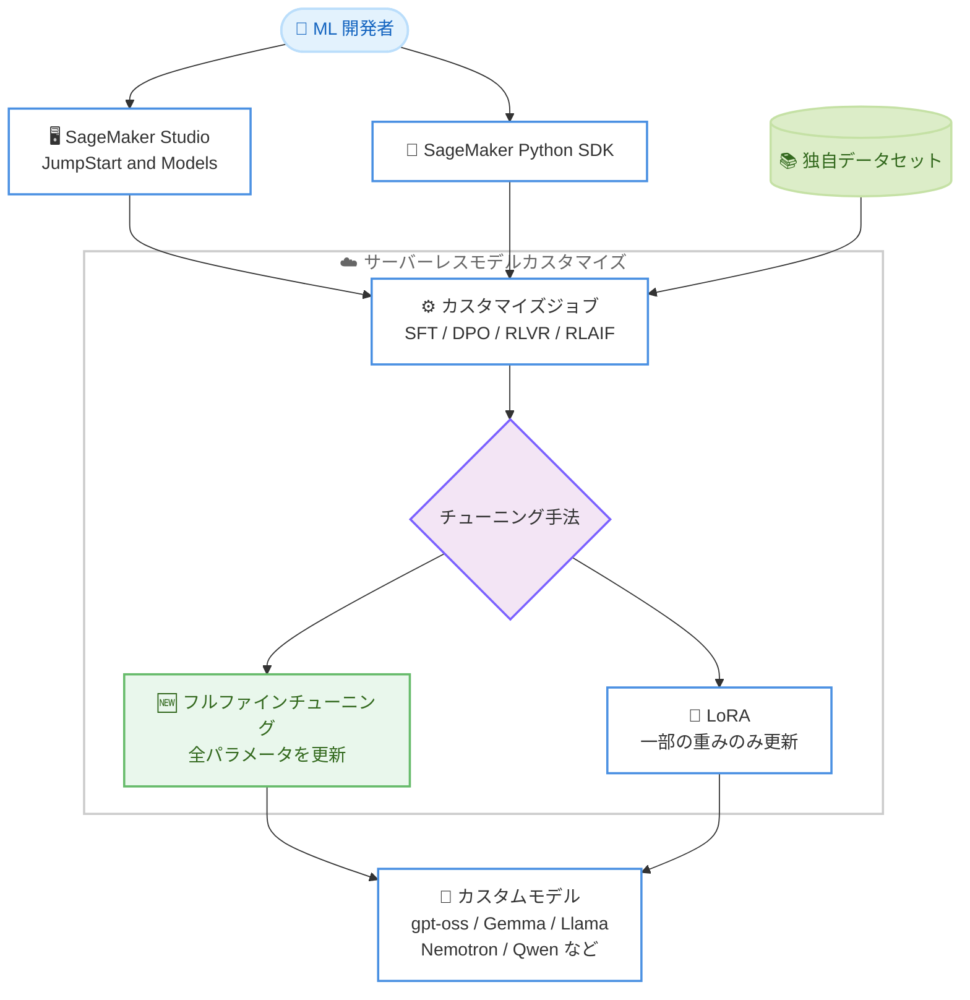

# Amazon SageMaker AI - サーバーレスモデルカスタマイズでフルファインチューニングをサポート

**リリース日**: 2026 年 8 月 3 日
**サービス**: Amazon SageMaker AI
**機能**: サーバーレスモデルカスタマイズにおけるフルファインチューニング (FFT) サポート

📊 [このアップデートのインフォグラフィックを見る](https://takech9203.github.io/aws-news-summary/20260803-amazon-sagemaker-fft.html)

## 概要

Amazon SageMaker AI のサーバーレスモデルカスタマイズが、25 以上のオープンソースモデルに対するフルファインチューニング (FFT: Full Fine-Tuning) をサポートしました。対象には gpt-oss、Gemma、Llama、Nemotron、Qwen などの人気モデルファミリーが含まれます。従来サポートされていた LoRA のようなパラメータ効率的手法 (モデル重みの一部のみを更新) に加えて、ユースケースが必要とする場合にモデルの全パラメータを更新し、より深い適応を実現できるようになりました。

フルファインチューニングにより、モデルはドメイン固有のパターン、用語、タスク構造をより徹底的に学習できます。これは、表面的なスタイル調整を超えた能力の獲得が必要な場合、たとえば専門的な推論パターンの学習、複雑な出力フォーマットの採用、大規模な独自データセットからのドメイン知識の内在化などにおいて特に有効です。サーバーレスモデルカスタマイズでは SageMaker がすべてのインフラストラクチャのプロビジョニングとトレーニングのオーケストレーションを管理するため、インフラストラクチャを一切プロビジョニング・管理することなくフルファインチューニングジョブを実行でき、使用した分だけの支払いで済みます。

**アップデート前の課題**

- サーバーレスモデルカスタマイズでは LoRA などのパラメータ効率的手法が中心で、モデル重みの一部のみが更新対象だった
- 専門的な推論パターンの学習や大規模な独自データセットからのドメイン知識の内在化など、深い適応が必要なユースケースには制約があった
- 全パラメータを更新するトレーニングを行うには、GPU インスタンスのプロビジョニングやトレーニング基盤の管理を自前で行う必要があった

**アップデート後の改善**

- 25 以上のオープンソースモデルに対して、全パラメータを更新するフルファインチューニングが可能になった
- インフラストラクチャのプロビジョニングや管理なしでフルファインチューニングジョブを実行でき、従量課金で利用できるようになった
- SageMaker Studio の JumpStart and Models ページまたは SageMaker Python SDK から簡単にカスタマイズジョブを開始できるようになった

## アーキテクチャ図



サーバーレスモデルカスタマイズのジョブで、従来の LoRA に加えて全パラメータを更新するフルファインチューニングを選択できるようになりました。インフラストラクチャの管理は SageMaker が担います。

## サービスアップデートの詳細

### 主要機能

1. **フルファインチューニング (FFT) のサポート**
   - LoRA のようにモデル重みの一部を更新するのではなく、モデルの全パラメータを更新する
   - ドメイン固有のパターン、用語、タスク構造をより徹底的に学習可能
   - 専門的な推論パターンの学習、複雑な出力フォーマットの採用、大規模な独自データセットからのドメイン知識の内在化に有効

2. **25 以上のオープンソースモデルに対応**
   - gpt-oss (OpenAI)、Gemma (Google)、Llama (Meta)、Nemotron (NVIDIA)、Qwen (Alibaba) などのモデルファミリーをサポート
   - 公式ドキュメントのサポートモデル一覧には DeepSeek R1 Distill シリーズも掲載されている
   - モデルごとに SFT、DPO、RLVR、RLAIF の各手法で LoRA / FFT の対応状況が定義されている

3. **サーバーレスによるインフラストラクチャ管理の不要化**
   - SageMaker がインフラストラクチャのプロビジョニングとトレーニングのオーケストレーションをすべて管理
   - GPU インスタンスの自動プロビジョニングとトレーニング完了後のリソース自動クリーンアップ
   - 使用した分だけの従量課金

## 技術仕様

### チューニング手法の比較

| 項目 | LoRA (パラメータ効率的手法) | フルファインチューニング (FFT) |
|------|------|------|
| 更新対象 | モデル重みの一部のサブセット | モデルの全パラメータ |
| 適応の深さ | スタイル調整など比較的軽微な適応 | ドメイン知識の内在化など深い適応 |
| 適するケース | 少量データでの効率的なカスタマイズ | 大規模な独自データセットからの学習、専門的な推論パターンの獲得 |

### サポートされるカスタマイズ手法

公式ドキュメントによると、サーバーレスモデルカスタマイズでは以下の手法がサポートされ、モデルごとに LoRA / FFT の対応が定義されています。

| 手法 | 説明 |
|------|------|
| SFT | 教師ありファインチューニング |
| DPO | 直接選好最適化 |
| RLVR | 検証可能な報酬による強化学習 |
| RLAIF | AI フィードバックによる強化学習 |

### 対応モデルの例 (FFT 対応)

公式ドキュメントのサポートモデル一覧より抜粋。

| プロバイダー | モデル例 |
|------|------|
| OpenAI | GPT OSS 120B、GPT OSS 20B |
| Google | Gemma 4 31B、Gemma 4 26B A4B、Gemma 4 E4B |
| Meta | Llama 3.3 Instruct 70B、Llama 3.2 Instruct 3B / 1B、Llama 3.1 Instruct 8B |
| NVIDIA | Nemotron 3 Super 120B、Nemotron 3 Nano 30B |
| Alibaba | Qwen3.6 27B、Qwen3.5 27B / 9B / 4B、Qwen3 32B〜0.6B、Qwen2.5 Instruct シリーズ |
| DeepSeek | R1 Distill Qwen シリーズ、R1 Distill Llama シリーズ |

最新の対応状況は [公式ドキュメントのサポートモデル一覧](https://docs.aws.amazon.com/sagemaker/latest/dg/model-customize-open-weight.html) を参照してください。

## 設定方法

### 前提条件

1. AWS アカウントと Amazon SageMaker AI へのアクセス権限
2. Amazon SageMaker Studio のセットアップ (UI から利用する場合)
3. トレーニング用の独自データセット

### 手順

#### ステップ 1: SageMaker Studio からカスタマイズジョブを起動

Amazon SageMaker Studio の「JumpStart and Models」ページに移動し、対象のオープンソースモデルを選択してカスタマイズジョブを起動します。ジョブ作成時にファインチューニング手法としてフルファインチューニング (FFT) を選択できます。

#### ステップ 2: SageMaker Python SDK から実行する場合

```bash
pip install sagemaker
```

SageMaker Python SDK をインストールします。SDK のモデルカスタマイズ機能を使用してフルファインチューニングジョブをプログラムから起動できます。詳細は [SageMaker Python SDK のモデルカスタマイズドキュメント](https://sagemaker.readthedocs.io/en/stable/model_customization/index.html) を参照してください。

#### ステップ 3: トレーニングの実行とモデルのデプロイ

ジョブを送信すると、SageMaker がインフラストラクチャのプロビジョニングとトレーニングのオーケストレーションを自動で行います。トレーニング完了後は、モデル評価ジョブの実行やカスタムモデルのデプロイに進むことができます。

## メリット

### ビジネス面

- **運用負荷の削減**: インフラストラクチャのプロビジョニングや管理が不要なため、モデル開発そのものに集中できる
- **コスト効率**: 使用した分だけの従量課金で、トレーニング完了後はリソースが自動的にクリーンアップされる
- **差別化された AI 体験の構築**: 独自データを活用した深いモデル適応により、競争優位性のある AI アプリケーションを構築できる

### 技術面

- **深いドメイン適応**: 全パラメータの更新により、ドメイン固有のパターン、用語、タスク構造を徹底的に学習できる
- **幅広いモデル選択肢**: gpt-oss、Gemma、Llama、Nemotron、Qwen など 25 以上のオープンソースモデルから選択可能
- **柔軟な手法選択**: SFT、DPO、RLVR、RLAIF の各手法で LoRA と FFT を使い分けられる

## デメリット・制約事項

### 制限事項

- 利用可能リージョンは米国東部 (バージニア北部)、米国西部 (オレゴン)、アジアパシフィック (東京)、欧州 (アイルランド) の 4 リージョンに限定される
- モデルとカスタマイズ手法の組み合わせによっては FFT がサポートされない場合がある (公式ドキュメントの対応表を要確認)

### 考慮すべき点

- フルファインチューニングは全パラメータを更新するため、LoRA と比較して計算リソースの消費が大きくなり、トレーニングコストが高くなる可能性がある
- 表面的なスタイル調整が目的の場合は、引き続き LoRA などのパラメータ効率的手法が適している場合がある
- 深い適応を得るには相応の規模と品質のトレーニングデータが必要となる

## ユースケース

### ユースケース 1: 専門ドメイン知識の内在化

**シナリオ**: 金融、法務、医療などの専門分野において、大規模な独自データセットからドメイン知識をモデルに内在化させ、専門用語や業界固有の文脈を正確に理解する AI アシスタントを構築したい。

**実装例**:
```
1. 専門分野の独自データセットを準備
2. SageMaker Studio の JumpStart and Models ページで対象モデルを選択
3. FFT を指定して SFT カスタマイズジョブを実行
4. モデル評価ジョブで精度を検証しデプロイ
```

**効果**: 表面的なスタイル調整では実現できない、ドメイン知識に基づいた深い理解と応答が可能になる。

### ユースケース 2: 専門的な推論パターンの学習

**シナリオ**: 複雑な多段階の推論を必要とするタスク (障害診断、リスク分析など) に対して、組織固有の推論プロセスをモデルに学習させたい。

**実装例**:
```
1. 推論過程を含むトレーニングデータを整備
2. Qwen3 や GPT OSS などの推論系モデルを選択
3. FFT による SFT や RLVR でトレーニングを実行
```

**効果**: モデルが専門的な推論パターンを獲得し、組織のワークフローに沿った高度な分析タスクを実行できる。

### ユースケース 3: 複雑な出力フォーマットへの対応

**シナリオ**: 社内システムとの連携のため、複雑な構造化フォーマット (独自スキーマの JSON、業界標準フォーマットなど) での出力を安定して生成させたい。

**実装例**:
```
1. 目的の出力フォーマットを含むペアデータを大量に準備
2. FFT による SFT でフォーマット遵守を徹底的に学習
3. DPO で出力品質をさらに調整
```

**効果**: プロンプトエンジニアリングだけでは安定しない複雑な出力フォーマットを、モデル自体に確実に習得させられる。

## 料金

サーバーレスモデルカスタマイズは従量課金制で、使用した分だけの支払いとなります。インフラストラクチャのプロビジョニングが不要なため、トレーニングジョブの実行に使用したリソースに対してのみ課金されます。詳細は [Amazon SageMaker AI の料金ページ](https://aws.amazon.com/sagemaker-ai/pricing/) を参照してください。

## 利用可能リージョン

- 米国東部 (バージニア北部)
- 米国西部 (オレゴン)
- アジアパシフィック (東京)
- 欧州 (アイルランド)

## 関連サービス・機能

- **Amazon SageMaker JumpStart**: 事前トレーニング済みモデルのハブ。SageMaker Studio の JumpStart and Models ページからカスタマイズジョブを起動する
- **SageMaker Python SDK**: プログラムからモデルカスタマイズジョブを起動・管理するための SDK
- **Amazon Bedrock**: 基盤モデルのマネージドサービス。SageMaker のモデルカスタマイズの評価機能には Amazon Bedrock Evaluations が活用されている

## 参考リンク

- 📊 [インフォグラフィック](https://takech9203.github.io/aws-news-summary/20260803-amazon-sagemaker-fft.html)
- [公式発表 (What's New)](https://aws.amazon.com/about-aws/whats-new/2026/08/amazon-sagemaker-fft)
- [ドキュメント: Open weight model customization (サポートモデル一覧)](https://docs.aws.amazon.com/sagemaker/latest/dg/model-customize-open-weight.html)
- [ドキュメント: Serverless model customization](https://docs.aws.amazon.com/sagemaker/latest/dg/customize-model.html)
- [SageMaker Python SDK: Model Customization](https://sagemaker.readthedocs.io/en/stable/model_customization/index.html)
- [料金ページ](https://aws.amazon.com/sagemaker-ai/pricing/)

## まとめ

Amazon SageMaker AI のサーバーレスモデルカスタマイズが 25 以上のオープンソースモデルでフルファインチューニングに対応し、インフラストラクチャの管理なしで全パラメータを更新する深いモデル適応が可能になりました。東京リージョンでも利用可能なため、大規模な独自データセットを持つ組織はドメイン特化型のカスタムモデル構築を検討する好機です。まずは SageMaker Studio の JumpStart and Models ページから対象モデルの FFT 対応状況を確認することを推奨します。
