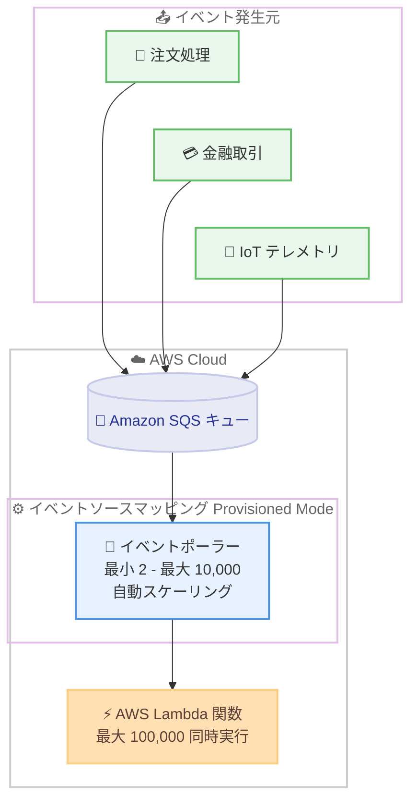

# AWS Lambda - Amazon SQS イベントソースマッピングの Provisioned Mode が最大 10,000 イベントポーラーをサポート

**リリース日**: 2026 年 8 月 3 日
**サービス**: AWS Lambda
**機能**: Provisioned Mode for Amazon SQS event source mappings の最大イベントポーラー数拡張

📊 [このアップデートのインフォグラフィックを見る](https://takech9203.github.io/aws-news-summary/20260803-aws-Lambda-provisioned-sqs-esm-max-pollers.html)

## 概要

AWS Lambda は、Amazon SQS イベントソースマッピング (ESM) の Provisioned Mode において、最大イベントポーラー数を従来の 2,000 から 5 倍の 10,000 に拡張しました。これにより、単一の ESM あたり最大 100,000 の同時実行 (concurrent invocations) に到達できるようになり、厳しいパフォーマンス要件を持つ大規模なイベント駆動型アプリケーションを構築できます。

Amazon SQS を Lambda のイベントソースとして利用するお客様は、リアルタイムの注文処理、金融取引パイプライン、IoT テレメトリの取り込み、大規模なファンアウトワークロードなど、イベント処理の遅延がビジネス成果に直結するミッションクリティカルなアプリケーションを構築しています。Provisioned Mode では、イベントポーラーの最小数と最大数を設定してアプリケーションのスループットを最適化できますが、これまでは最大数の上限が制約となっていました。

**アップデート前の課題**

- Provisioned Mode の最大イベントポーラー数は ESM あたり 2,000 に制限されていた
- ESM あたりの同時実行数に上限があり、超大規模ワークロードでは要件を満たせない場合があった
- 上限を超えるスループットが必要な場合、ワークロードを複数の ESM に分割する必要があり、構成が複雑化していた

**アップデート後の改善**

- 最大イベントポーラー数が 10,000 に拡張され、従来の 5 倍の設定が可能になった
- 単一の ESM で最大 100,000 の同時実行に到達できるようになった
- 複数 ESM への分割が不要になり、厳しいレイテンシーおよびスループット要件を持つ大規模ワークロードを単一 ESM で構築できるようになった

## アーキテクチャ図



Provisioned Mode では、ESM 専用のイベントポーラーが設定した最小数と最大数の範囲で自動スケーリングし、SQS キューからメッセージをポーリングして Lambda 関数を呼び出します。今回のアップデートで最大ポーラー数が 10,000 に拡張され、単一 ESM で最大 100,000 の同時実行に対応できます。

## サービスアップデートの詳細

### 主要機能

1. **最大イベントポーラー数の 5 倍拡張**
   - 最大イベントポーラー数 (MaximumPollers) の上限が 2,000 から 10,000 に拡張
   - 設定可能な範囲は 2 から 10,000 (デフォルトは 200)
   - 最小イベントポーラー数 (MinimumPollers) の範囲は 2 から 200 (デフォルトは 2)

2. **ESM あたり最大 100,000 同時実行**
   - 各イベントポーラーは最大 1 MB/s のスループット、最大 10 の同時実行、または毎秒最大 10 回の SQS ポーリング API 呼び出しを処理
   - 10,000 ポーラー x 10 同時実行により、単一 ESM で最大 100,000 の同時実行に到達可能
   - デフォルトの SQS ESM と比較して 80 倍の同時実行数、3 倍のスケーリング速度 (毎分最大 1,000 同時実行の増加) を実現

3. **応答性の高い自動スケーリング**
   - 設定した最小数と最大数の間でイベントポーラーが自動スケーリング
   - 予期しないメッセージスパイクにも専用ポーラーが即座に対応
   - `ProvisionedPollers` メトリクスでポーラーの使用状況をモニタリング可能

## 技術仕様

### Provisioned Mode for SQS ESM の仕様

| 項目 | 詳細 |
|------|------|
| 最小イベントポーラー数 | 2 - 200 (デフォルト: 2) |
| 最大イベントポーラー数 | 2 - 10,000 (デフォルト: 200)、**今回 2,000 から 10,000 に拡張** |
| ポーラーあたりのスループット | 最大 1 MB/s |
| ポーラーあたりの同時実行 | 最大 10 |
| ポーラーあたりのポーリング API 呼び出し | 毎秒最大 10 回 |
| ESM あたりの最大同時実行 | 最大 100,000 |
| 設定方法 | ESM API、AWS マネジメントコンソール、AWS CLI、AWS SDK、AWS CloudFormation、AWS SAM |
| 課金単位 | Event Poller Unit (EPU)、EPU 時間単位で課金 |

### 必要なイベントポーラー数の見積もり

公式ドキュメントでは、ワークロードに必要なポーラー数を以下の式で見積もる方法が示されています。

```text
ポーラーあたりの EPS = minimum(
    ceiling(1024 / 平均イベントサイズ KB),
    ceiling(10 / 平均関数実行時間 秒) * バッチサイズ,
    min(100, 10 * バッチサイズ)
)

必要なイベントポーラー数 = キューのピーク時イベント数毎秒 / ポーラーあたりの EPS
```

例えば、バッチサイズ 10、平均イベントサイズ 3 KB、平均関数実行時間 100 ms で毎秒 1,000 イベントを処理する場合、各ポーラーは約 100 EPS をサポートするため、最小ポーラー数は 10 が推奨されます。同じ条件で平均関数実行時間が 1 秒の場合は、各ポーラーが 10 EPS しかサポートできないため、100 の最小ポーラーが必要になります。

## 設定方法

### 前提条件

1. Lambda 関数と Amazon SQS キューが同一リージョンに存在すること (アカウントは別でも可)
2. SQS ESM が作成済みであること (新規作成時にも設定可能)
3. Provisioned Mode は最大同時実行数 (maximum concurrency) 設定と併用できないことを理解しておくこと

### 手順

#### ステップ 1: Provisioned Mode の設定

```bash
aws lambda update-event-source-mapping \
    --uuid a1b2c3d4-5678-90ab-cdef-EXAMPLE11111 \
    --provisioned-poller-config '{"MinimumPollers": 100, "MaximumPollers": 10000}'
```

既存の SQS ESM に対して Provisioned Mode を有効化し、最小ポーラー数を 100、最大ポーラー数を今回拡張された上限である 10,000 に設定します。コンソールの場合は、対象関数の [設定] → [トリガー] から SQS トリガーを編集し、[Configure provisioned mode] で最小・最大イベントポーラー数を入力します。

#### ステップ 2: ポーラー使用状況のモニタリング

```bash
aws cloudwatch get-metric-statistics \
    --namespace AWS/Lambda \
    --metric-name ProvisionedPollers \
    --dimensions Name=EventSourceMappingUUID,Value=a1b2c3d4-5678-90ab-cdef-EXAMPLE11111 \
    --start-time 2026-08-03T00:00:00Z \
    --end-time 2026-08-04T00:00:00Z \
    --period 300 \
    --statistics Average Maximum
```

`ProvisionedPollers` メトリクスを取得し、実際に消費されているイベントポーラー数を確認します。この値をもとに最小・最大ポーラー数の設定を調整します。

#### ステップ 3: Provisioned Mode の無効化 (必要な場合)

```bash
aws lambda update-event-source-mapping \
    --uuid a1b2c3d4-5678-90ab-cdef-EXAMPLE11111 \
    --provisioned-poller-config '{}'
```

空の設定を指定することで Provisioned Mode を無効化し、デフォルトのオンデマンドモードに戻します。

## メリット

### ビジネス面

- **ミッションクリティカルなワークロードへの対応**: 金融取引パイプラインやリアルタイム注文処理など、イベント処理の遅延がビジネス成果に直結するワークロードで、超大規模なスループット要件を満たせる
- **アーキテクチャの簡素化によるコスト削減**: 複数 ESM への分割・管理が不要になり、設計・運用の工数を削減できる
- **将来の成長への対応**: ビジネスの拡大に伴うイベント量の増加に対して、単一 ESM のままスケールできる

### 技術面

- **同時実行数の大幅な拡張**: 単一 ESM で最大 100,000 の同時実行に到達でき、デフォルト ESM の 80 倍の同時実行数を実現
- **高速なスケーリング**: デフォルト ESM の 3 倍の速度 (毎分最大 1,000 同時実行の増加) でスケール
- **きめ細かなスループット制御**: 最小・最大ポーラー数の設定により、レイテンシー要件とコストのバランスを調整可能

## デメリット・制約事項

### 制限事項

- Provisioned Mode は最大同時実行数 (maximum concurrency) 設定と併用できない (同時実行の制御は最大イベントポーラー数で行う)
- 最小イベントポーラー数の上限は 200 のまま (今回拡張されたのは最大イベントポーラー数)
- SQS ESM ごとに最低 2 つのイベントポーラーが必要

### 考慮すべき点

- Provisioned Mode の利用には EPU (Event Poller Unit) ベースの追加料金が発生するため、デフォルトのオンデマンドモードとのコスト比較が必要
- 大規模な同時実行に到達するには、アカウントの Lambda 同時実行クォータも合わせて確認・引き上げが必要
- 効率を最大化するため、バッチサイズは 10 以上が推奨される
- トラフィックスパイクに備え、最小ポーラー数は計算値より少し高めに設定することが推奨される

## ユースケース

### ユースケース 1: 金融取引パイプラインのリアルタイム処理

**シナリオ**: 金融サービス企業がマーケットデータフィードの処理と金融取引の実行をイベント駆動型マイクロサービスで行っており、スパイク性のあるトラフィックを低レイテンシーで処理する必要がある。

**実装例**:
```bash
aws lambda update-event-source-mapping \
    --uuid <ESM-UUID> \
    --provisioned-poller-config '{"MinimumPollers": 200, "MaximumPollers": 10000}'
```

**効果**: 常時 200 ポーラーを確保して低レイテンシーを維持しつつ、市場の急変時には最大 10,000 ポーラーまで自動スケーリングし、処理遅延によるビジネス影響を回避できる。

### ユースケース 2: IoT テレメトリの大規模取り込み

**シナリオ**: 数百万台のデバイスからのテレメトリデータを SQS 経由で取り込み、Lambda で変換・保存する。デバイス数の増加により、従来の 2,000 ポーラー上限では単一 ESM で処理しきれず、複数 ESM に分割していた。

**実装例**:
```bash
# 従来: 複数 ESM に分割して運用
# 今回のアップデート後: 単一 ESM に集約
aws lambda update-event-source-mapping \
    --uuid <ESM-UUID> \
    --provisioned-poller-config '{"MinimumPollers": 100, "MaximumPollers": 8000}'
```

**効果**: 複数 ESM とキューの分割管理が不要になり、単一の ESM とキューでシンプルに大規模テレメトリを処理できる。

### ユースケース 3: 大規模ファンアウトワークロード

**シナリオ**: e コマースプラットフォームがセールイベント時に大量の注文イベントをファンアウトして処理する。ピーク時には通常の数十倍のイベントが発生する。

**実装例**:
```bash
aws lambda update-event-source-mapping \
    --uuid <ESM-UUID> \
    --provisioned-poller-config '{"MinimumPollers": 50, "MaximumPollers": 10000}'
```

**効果**: 平常時は 50 ポーラーでコストを抑えつつ、セール開始時のスパイクには最大 10,000 ポーラー・100,000 同時実行までスケールし、注文処理の遅延を防止できる。

## 料金

Provisioned Mode for ESM の料金は、EPU (Event Poller Unit) と呼ばれる課金単位に基づきます。プロビジョニングされた最小イベントポーラー数と、自動スケーリング中に消費されたイベントポーラーに対して、EPU 時間 (Event-Poller-Unit-hours) 単位で課金されます。SQS ESM では 1 EPU が 1 イベントポーラー (最大 1 MB/s のスループット) をサポートし、ESM ごとに最低 2 イベントポーラーが必要です。課金は秒単位 (最低 1 分) で計算されます。

### 料金例 (米国東部 バージニア北部リージョンの公式料金例より)

| 項目 | 内容 |
|------|------|
| SQS ESM の EPU 単価 | 0.00925 USD/EPU 時間 |
| 例: 最小 10 ポーラーで月間 8,000 EPU 時間を消費 | 8,000 x 0.00925 = 74 USD/月 |

上記は Lambda 関数のコンピューティング料金・リクエスト料金とは別に発生します。最新の料金は [AWS Lambda 料金ページ](https://aws.amazon.com/lambda/pricing/) を参照してください。

## 利用可能リージョン

すべての AWS 商用リージョンで一般提供されています。

## 関連サービス・機能

- **Amazon SQS**: 本アップデートの対象となるイベントソース。標準キューと FIFO キューの両方が Lambda ESM でサポートされる
- **AWS Lambda イベントソースマッピング**: SQS、Kinesis、DynamoDB、Kafka などからイベントを読み取り Lambda 関数を呼び出す仕組み。Provisioned Mode は SQS に加えて MSK / セルフマネージド Kafka の ESM でも利用可能
- **Amazon CloudWatch**: `ProvisionedPollers` メトリクスによりイベントポーラーの使用状況をモニタリング可能
- **AWS CloudFormation / AWS SAM**: `ProvisionedPollerConfig` プロパティにより Provisioned Mode を IaC で構成可能

## 参考リンク

- 📊 [インフォグラフィック](https://takech9203.github.io/aws-news-summary/20260803-aws-Lambda-provisioned-sqs-esm-max-pollers.html)
- [公式発表 (What's New)](https://aws.amazon.com/about-aws/whats-new/2026/08/aws-Lambda-provisioned-sqs-esm-max-pollers/)
- [ドキュメント: Using Lambda with Amazon SQS - Provisioned Mode](https://docs.aws.amazon.com/lambda/latest/dg/with-sqs.html#sqs-provisioned-mode)
- [料金ページ: AWS Lambda Pricing](https://aws.amazon.com/lambda/pricing/)

## まとめ

SQS ESM の Provisioned Mode における最大イベントポーラー数が 2,000 から 10,000 へと 5 倍に拡張され、単一 ESM で最大 100,000 の同時実行が可能になりました。これまで上限を回避するために複数 ESM へワークロードを分割していた場合は、単一 ESM への集約によるアーキテクチャ簡素化を検討する価値があります。導入時は、公式ドキュメントの見積もり式を用いて必要ポーラー数を算出し、EPU ベースの追加コストと性能要件のバランスを確認することを推奨します。
