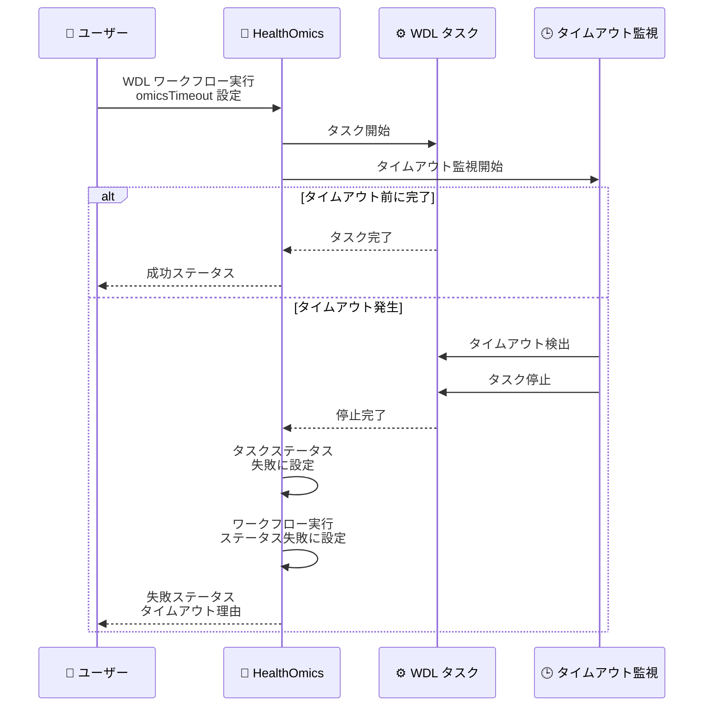

# AWS HealthOmics - WDL ワークフローのタスクレベルタイムアウト対応

**リリース日**: 2026 年 8 月 3 日
**サービス**: AWS HealthOmics
**機能**: WDL ワークフローのタスクレベルタイムアウト (omicsTimeout)

📊 [このアップデートのインフォグラフィックを見る](https://takech9203.github.io/aws-news-summary/20260803-aws-healthomics-wdl-task-level-timeout.html)

## 概要

AWS HealthOmics は、HIPAA 適格のマネージドバイオインフォマティクスワークフローサービスで、WDL (Workflow Description Language) ワークフローのタスクレベルタイムアウト機能をサポートしました。これにより、個々のタスクの最大実行時間を細かく制御できるようになり、コスト管理と自動エラー復旧が可能になります。

バイオインフォマティクスワークフローでは、ゲノム解析やデータ処理タスクが予期せず長時間実行されることがあり、コスト増大や次の処理への遅延を引き起こす可能性がありました。新しい omicsTimeout ランタイム属性により、タスクごとに最大実行時間を指定でき、タイムアウト時には自動的にタスクを停止し、ワークフローの状態を失敗としてマークします。

**アップデート前の課題**

- WDL ワークフローでタスクが予期せず長時間実行された場合、手動で停止する必要があった
- タスクレベルでの実行時間制御ができず、コストの予測と管理が困難だった
- タイムアウト処理を実装するには、ワークフロー外部の監視システムが必要だった
- 異常に長時間実行されるタスクにより、後続タスクの実行が遅延し、全体のワークフロー効率が低下した

**アップデート後の改善**

- WDL タスクの runtime セクションに omicsTimeout 属性を追加するだけで、タスクレベルのタイムアウトを設定可能
- タイムアウト時に自動的にタスクを停止し、タスクとワークフロー実行のステータスを失敗に設定
- 90s (90 秒)、2h (2 時間)、1d (1 日) など、柔軟な時間指定が可能
- コスト管理と自動エラー復旧により、ワークフロー運用の効率が向上

## アーキテクチャ図



WDL ワークフローでタスクに omicsTimeout を設定すると、HealthOmics が自動的にタイムアウトを監視し、指定時間を超えた場合にタスクを停止します。

## サービスアップデートの詳細

### 主要機能

1. **omicsTimeout ランタイム属性**
   - WDL タスクの runtime セクションに追加可能な新しい属性
   - タスクの最大実行時間を指定し、超過時に自動停止
   - HealthOmics 固有の拡張属性として実装

2. **柔軟な時間指定フォーマット**
   - 秒 (s)、分 (m)、時間 (h)、日 (d) の単位をサポート
   - 例: `90s` (90 秒)、`2h` (2 時間)、`1d` (1 日)
   - タスクの特性に応じて適切な粒度で時間を設定可能

3. **自動ステータス管理**
   - タイムアウト発生時、タスクステータスを自動的に失敗に設定
   - ワークフロー実行全体のステータスも失敗としてマーク
   - エラー理由として明確にタイムアウトを記録

## 技術仕様

### omicsTimeout の設定例

WDL タスクの runtime セクションに omicsTimeout を追加します。

```wdl
task MyGenomeAnalysisTask {
  input {
    File genome_file
  }
  
  command <<<
    # ゲノム解析処理
    analyze_genome ~{genome_file}
  >>>
  
  runtime {
    docker: "my-analysis-image:latest"
    cpu: 4
    memory: "16 GB"
    omicsTimeout: "2h"  # 2時間でタイムアウト
  }
  
  output {
    File results = "results.vcf"
  }
}
```

### タイムアウト時の動作

| 項目 | 詳細 |
|------|------|
| 監視対象 | WDL ワークフロー内の個々のタスク実行 |
| タイムアウト検出 | 指定時間経過後、HealthOmics が自動検出 |
| タスク停止 | 実行中のタスクを強制停止 |
| ステータス | タスクとワークフロー実行の両方を失敗に設定 |
| エラー情報 | タイムアウトが原因であることを明記 |

## 設定方法

### 前提条件

1. AWS HealthOmics のワークフローが既に作成されている
2. WDL (Workflow Description Language) でワークフローが記述されている
3. 適切な IAM 権限 (HealthOmics ワークフロー実行権限) が付与されている

### 手順

#### ステップ 1: WDL タスクに omicsTimeout を追加

```wdl
runtime {
  docker: "my-image:latest"
  cpu: 2
  memory: "8 GB"
  omicsTimeout: "90s"  # 90秒でタイムアウト
}
```

タスクの runtime セクションに omicsTimeout 属性を追加します。値は秒 (s)、分 (m)、時間 (h)、日 (d) の単位で指定できます。

#### ステップ 2: ワークフローを HealthOmics に登録

```bash
aws omics create-workflow \
  --name my-workflow-with-timeout \
  --definition-uri s3://my-bucket/workflow.wdl \
  --engine WDL
```

omicsTimeout 属性を含む WDL ワークフローを HealthOmics に登録します。

#### ステップ 3: ワークフローを実行

```bash
aws omics start-run \
  --workflow-id 1234567 \
  --role-arn arn:aws:iam::123456789012:role/OmicsWorkflowRole \
  --parameters file://parameters.json
```

ワークフローを実行します。タスクが omicsTimeout で指定した時間を超えると、自動的に停止され、失敗ステータスが設定されます。

#### ステップ 4: 実行ステータスを確認

```bash
aws omics get-run --id run-123456
```

ワークフロー実行のステータスを確認します。タイムアウトが発生した場合、タスクとワークフロー実行の両方が失敗ステータスとなり、エラー情報にタイムアウトが記録されます。

## メリット

### ビジネス面

- **コスト管理の向上**: タスクごとに最大実行時間を制限することで、予期しないコスト増大を防止
- **運用効率の改善**: タイムアウト処理が自動化され、手動介入の必要性が減少
- **予測可能な実行時間**: ワークフロー全体の実行時間をより正確に見積もることが可能

### 技術面

- **自動エラー復旧**: タイムアウトを検出してワークフローを停止し、リトライロジックと組み合わせた自動復旧が可能
- **リソース効率化**: 長時間実行タスクを自動停止することで、コンピュートリソースを効率的に利用
- **デバッグの容易化**: タスクが異常に長時間実行される問題を早期に検出し、原因調査が容易に

## デメリット・制約事項

### 制限事項

- omicsTimeout は WDL ワークフローのみで利用可能 (Nextflow など他のワークフロー言語では未サポート)
- タイムアウト時にタスクは強制停止されるため、部分的な結果は保存されない
- タイムアウト時間の動的な調整はサポートされていない (ワークフロー定義時に固定値を指定)

### 考慮すべき点

- タイムアウト時間は、タスクの通常実行時間を考慮して余裕を持って設定する必要がある
- タイムアウト発生時の処理 (リトライ、エラー通知など) は別途実装が必要
- 大規模ゲノムデータ処理など、実行時間が大きく変動するタスクでは慎重に時間を設定

## ユースケース

### ユースケース 1: ゲノムバリアントコーリングのタイムアウト制御

**シナリオ**: ゲノムバリアントコーリングタスクが通常 1 時間で完了するが、稀に 5 時間以上かかることがあり、コストが増大する。

**実装例**:
```wdl
task VariantCalling {
  input {
    File bam_file
  }
  
  command <<<
    gatk HaplotypeCaller -I ~{bam_file} -O variants.vcf
  >>>
  
  runtime {
    docker: "broadinstitute/gatk:latest"
    cpu: 8
    memory: "32 GB"
    omicsTimeout: "2h"  # 2時間でタイムアウト
  }
  
  output {
    File vcf = "variants.vcf"
  }
}
```

**効果**: 2 時間を超えるタスクを自動停止し、異常な実行を早期に検出してコストを削減。

### ユースケース 2: データ前処理パイプラインの SLA 遵守

**シナリオ**: データ前処理パイプラインで、各ステップの最大実行時間を保証し、全体の SLA を遵守する必要がある。

**実装例**:
```wdl
workflow DataPreprocessing {
  call FastQC { runtime { omicsTimeout: "30m" } }
  call Trimmomatic { runtime { omicsTimeout: "1h" } }
  call Alignment { runtime { omicsTimeout: "2h" } }
  call Sorting { runtime { omicsTimeout: "30m" } }
}
```

**効果**: 各ステップにタイムアウトを設定し、パイプライン全体の実行時間を予測可能にし、SLA を遵守。

### ユースケース 3: リトライロジックとの組み合わせ

**シナリオ**: タスクが一時的なリソース不足でタイムアウトする可能性があるため、自動リトライを実装する。

**実装例**:
```python
import boto3

omics = boto3.client('omics')

def run_workflow_with_retry(workflow_id, max_retries=3):
    for attempt in range(max_retries):
        response = omics.start_run(workflowId=workflow_id, ...)
        run_id = response['id']
        
        # 実行完了を待機
        status = wait_for_completion(run_id)
        
        if status == 'COMPLETED':
            return run_id
        elif status == 'FAILED':
            # タイムアウトエラーの場合はリトライ
            print(f"Attempt {attempt + 1} failed, retrying...")
    
    raise Exception("Workflow failed after max retries")
```

**効果**: タイムアウトを検出して自動的にワークフローをリトライし、一時的な問題からの自動復旧を実現。

## 料金

AWS HealthOmics の料金は、ワークフロー実行時に使用されたコンピュートリソース (vCPU、メモリ、ストレージ) に基づいて課金されます。omicsTimeout 機能自体に追加料金はかかりません。

タイムアウトによりタスクが早期に停止された場合、実際に使用された時間分のみが課金されるため、長時間実行タスクを停止することでコストを削減できます。

### 料金例

| シナリオ | 実行時間 | vCPU | メモリ | 月額料金 (概算) |
|--------|---------|------|--------|------------------|
| タイムアウトなし (5 時間実行) | 5 時間 | 8 | 32 GB | 約 $2.50 |
| タイムアウトあり (2 時間で停止) | 2 時間 | 8 | 32 GB | 約 $1.00 |

(料金は目安であり、リージョンや使用状況により異なります)

## 利用可能リージョン

AWS HealthOmics が利用可能なすべてのリージョンで omicsTimeout 機能を使用できます。

- 米国東部 (バージニア北部)
- 米国西部 (オレゴン)
- 欧州 (アイルランド)
- 欧州 (ロンドン)
- アジアパシフィック (シンガポール)
- アジアパシフィック (シドニー)

## 関連サービス・機能

- **AWS Batch**: コンテナベースのバッチ処理サービス。HealthOmics のワークフローエンジンと連携
- **Amazon S3**: ゲノムデータや解析結果の保存に使用
- **AWS Step Functions**: ワークフローオーケストレーション。HealthOmics ワークフローと組み合わせて複雑なパイプラインを構築

## 参考リンク

- 📊 [インフォグラフィック](https://takech9203.github.io/aws-news-summary/20260803-aws-healthomics-wdl-task-level-timeout.html)
- [公式発表 (What's New)](https://aws.amazon.com/about-aws/whats-new/2026/08/aws-healthomics-wdl-task-level-timeout/)
- [AWS HealthOmics ドキュメント](https://docs.aws.amazon.com/omics/)
- [WDL 仕様](https://github.com/openwdl/wdl)
- [AWS HealthOmics 料金ページ](https://aws.amazon.com/omics/pricing/)

## まとめ

AWS HealthOmics の WDL ワークフローにタスクレベルタイムアウト機能が追加され、omicsTimeout ランタイム属性を使用することで、個々のタスクの最大実行時間を細かく制御できるようになりました。これにより、予期しないコスト増大を防ぎ、自動エラー復旧を実現し、バイオインフォマティクスワークフローの運用効率が向上します。ゲノム解析やデータ処理パイプラインを運用している場合は、この機能を活用してコスト管理と SLA 遵守を強化することをお勧めします。
