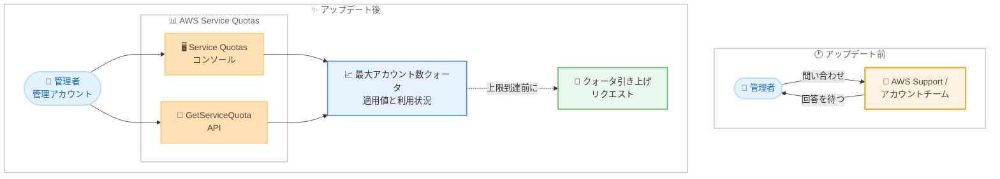

# AWS Organizations - Service Quotas でのアカウント数上限クォータ可視化

**リリース日**: 2026 年 8 月 3 日
**サービス**: AWS Organizations / AWS Service Quotas
**機能**: 組織の最大アカウント数クォータと利用状況の Service Quotas での可視化

📊 [このアップデートのインフォグラフィックを見る](https://takech9203.github.io/aws-news-summary/20260803-aws-organizations.html)

## 概要

AWS Organizations を利用しているお客様は、組織内の最大アカウント数クォータとその利用状況を、AWS Service Quotas を通じて直接確認できるようになりました。これまでは現在のアカウント数上限を把握するために AWS Support や AWS アカウントチームへの問い合わせが必要でしたが、今回のアップデートによりセルフサービスで確認できます。

確認方法は、管理アカウント (Management Account) にログインして Service Quotas コンソールにアクセスするか、Service Quotas の GetServiceQuota API を呼び出すかのいずれかです。現在のクォータ利用状況をモニタリングし、上限に達する前に引き上げをリクエストすることで、アカウント数の増加を事前に計画できます。

マルチアカウント戦略を採用し、プロジェクトや環境ごとにアカウントを払い出している企業にとって、アカウント数の上限管理はガバナンス運用の重要な要素です。本アップデートは、その運用をシンプルかつプロアクティブにするものです。

**アップデート前の課題**

このアップデート以前は、組織のアカウント数上限の把握に手間がかかっていました。

- 現在のアカウント数上限を確認するには、AWS Support への問い合わせや AWS アカウントチームへの確認が必要だった
- クォータの利用状況をセルフサービスで確認する手段がなく、上限にどの程度近づいているかを把握しにくかった
- 上限への到達を事前に検知できず、新規アカウント作成時にクォータ超過で失敗して初めて気づくリスクがあった

**アップデート後の改善**

今回のアップデートにより、以下が可能になりました。

- Service Quotas コンソールから、最大アカウント数クォータの適用値と利用状況を直接確認できるようになった
- GetServiceQuota API を使用してプログラムからクォータ情報を取得できるようになった
- 利用状況をモニタリングし、上限到達前にクォータ引き上げをリクエストするプロアクティブな計画が可能になった

## アーキテクチャ図



アップデート前は AWS Support への問い合わせが必要でしたが、アップデート後は管理アカウントから Service Quotas コンソールまたは API で直接クォータと利用状況を確認し、上限到達前に引き上げをリクエストできます。

## サービスアップデートの詳細

### 主要機能

1. **最大アカウント数クォータの可視化**
   - 組織内の最大アカウント数クォータの適用値を Service Quotas で直接確認可能
   - AWS Support や AWS アカウントチームへの問い合わせが不要に
   - 管理アカウントにログインして確認する

2. **クォータ利用状況のモニタリング**
   - 現在のアカウント数がクォータに対してどの程度かを利用状況 (Utilization) として確認可能
   - 上限に近づいていることを事前に把握し、アカウント増加の計画に活用できる

3. **コンソールと API の両方に対応**
   - Service Quotas コンソールでの GUI 確認に対応
   - GetServiceQuota API によるプログラムからの取得に対応し、自動化やモニタリングへの組み込みが可能

## 技術仕様

### 確認方法

| 項目 | 詳細 |
|------|------|
| 確認元アカウント | 組織の管理アカウント |
| コンソール | Service Quotas コンソールで AWS Organizations のクォータを表示 |
| API | Service Quotas の GetServiceQuota API |
| 確認できる情報 | 最大アカウント数クォータの適用値と利用状況 |

### 最大アカウント数クォータの基本情報

AWS Organizations ドキュメントによると、最大アカウント数クォータには以下の特徴があります。

| 項目 | 詳細 |
|------|------|
| デフォルト値 | 10 (新規組織の場合。組織によってはこれより低い場合あり) |
| 調整可否 | 調整可能。Service Quotas コンソールから引き上げをリクエスト可能 |
| 引き上げ上限 | お客様の利用状況に基づき最大 50,000 アカウントまで |
| リクエスト元 | 組織の管理アカウントのみが引き上げリクエストを送信可能 |
| カウント対象 | 送信済みの招待もクォータにカウントされる (辞退・キャンセル・期限切れで返却)。閉鎖済みアカウントも完全閉鎖まではカウント対象 |

## 設定方法

### 前提条件

1. AWS Organizations の組織が作成済みであること
2. 組織の管理アカウントにログインできること
3. Service Quotas へのアクセス権限 (servicequotas:GetServiceQuota など) を持つ IAM プリンシパルを使用すること

### 手順

#### ステップ 1: コンソールでクォータを確認する

1. 管理アカウントで AWS Management Console にサインインし、Service Quotas コンソール (https://console.aws.amazon.com/servicequotas/home) を開く
2. ナビゲーションペインで [AWS services] を選択する
3. サービス一覧から AWS Organizations を選択する
4. 最大アカウント数のクォータを選択し、適用値と利用状況を確認する

コンソールでは、クォータ名、適用されているクォータ値、AWS デフォルト値、利用状況、調整可否が表示されます。

#### ステップ 2: API でクォータを確認する

```bash
# AWS CLI で AWS Organizations の最大アカウント数クォータを取得
aws service-quotas get-service-quota \
    --service-code organizations \
    --quota-code <クォータコード>
```

GetServiceQuota API を呼び出し、AWS Organizations のサービスコードとクォータコードを指定して、適用されているクォータ値を取得します。クォータコードは list-service-quotas コマンドの出力から確認できます。

```bash
# AWS Organizations のクォータ一覧からクォータコードを確認
aws service-quotas list-service-quotas \
    --service-code organizations
```

list-service-quotas コマンドで対象サービスのクォータ一覧を取得し、目的のクォータのコードと現在値を確認します。

#### ステップ 3: 必要に応じてクォータ引き上げをリクエストする

利用状況が上限に近づいている場合、Service Quotas コンソールからクォータ引き上げをリクエストします。最大アカウント数クォータの引き上げリクエストは、組織の管理アカウントからのみ送信できます。

## メリット

### ビジネス面

- **プロアクティブな成長計画**: アカウント数の利用状況を常時把握できるため、組織拡大やプロジェクト増加に伴うアカウント払い出し計画を事前に立てられる
- **運用工数の削減**: AWS Support やアカウントチームへの問い合わせと回答待ちが不要になり、確認にかかる時間を削減できる
- **障害リスクの低減**: 上限到達によるアカウント作成失敗を未然に防ぎ、新規プロジェクトの立ち上げ遅延を回避できる

### 技術面

- **セルフサービス化**: コンソールと API の両方でクォータ情報を取得でき、確認作業が自己完結する
- **自動化への組み込み**: GetServiceQuota API により、アカウント払い出しの自動化パイプラインやモニタリングツールにクォータチェックを組み込める
- **他のクォータ管理との統合**: Service Quotas という単一のインターフェースで、他の AWS サービスのクォータと同様に一元管理できる

## デメリット・制約事項

### 制限事項

- クォータの確認は組織の管理アカウントから行う必要がある
- 現時点で利用可能なリージョンは米国東部 (バージニア北部) のみ
- 最大アカウント数クォータの引き上げリクエストは管理アカウントのみが送信できる

### 考慮すべき点

- 送信済みの招待や完全閉鎖前のアカウントもクォータにカウントされるため、実際のアクティブアカウント数と利用状況の数値が一致しない場合がある
- クォータ引き上げは自動承認とは限らず、利用状況に基づいて審査される場合がある

## ユースケース

### ユースケース 1: マルチアカウント環境の成長計画

**シナリオ**: プロジェクトごとにアカウントを払い出す運用をしている企業が、来期のプロジェクト増加に備えてアカウント数の余裕を確認したい。

**実装例**:
```bash
# 現在のクォータと利用状況を確認
aws service-quotas list-service-quotas \
    --service-code organizations \
    --query "Quotas[?contains(QuotaName, 'account')]"
```

**効果**: 現在の上限と利用状況を即座に把握し、不足が見込まれる場合は事前にクォータ引き上げをリクエストできるため、プロジェクト立ち上げの遅延を防止できる。

### ユースケース 2: アカウント払い出し自動化パイプラインでの事前チェック

**シナリオ**: Account Factory などでアカウント作成を自動化しており、作成前にクォータ超過にならないかを検証したい。

**実装例**:
```bash
# パイプライン内でクォータ値を取得し、現在のアカウント数と比較するチェック処理を追加
aws service-quotas get-service-quota \
    --service-code organizations \
    --quota-code <クォータコード> \
    --query "Quota.Value"
```

**効果**: アカウント作成の失敗を事前に検知し、パイプラインの途中失敗による手戻りを回避できる。

### ユースケース 3: 定期的なガバナンスレポートへの組み込み

**シナリオ**: クラウド管理チームが、月次のガバナンスレポートに組織のアカウント数上限と利用率を含めたい。

**実装例**:
```bash
# 定期実行スクリプトでクォータ情報を取得しレポートに出力
aws service-quotas get-service-quota \
    --service-code organizations \
    --quota-code <クォータコード> \
    --output json
```

**効果**: 経営層や監査向けのレポートにアカウント利用状況を自動で反映し、ガバナンス状況の透明性を高められる。

## 料金

Service Quotas によるクォータの表示および利用状況の確認に追加料金はかかりません。AWS Organizations 自体も無料で利用できます。

## 利用可能リージョン

このクォータ可視化機能は、現在、米国東部 (バージニア北部) リージョンで利用可能です。

## 関連サービス・機能

- **AWS Service Quotas**: AWS サービスのクォータを一元的に表示・管理・引き上げリクエストできるサービス。今回のアップデートで AWS Organizations の最大アカウント数クォータが確認可能になった
- **AWS Organizations**: 複数の AWS アカウントを一元管理するサービス。SCP によるガバナンスや一括請求などを提供
- **AWS Control Tower**: マルチアカウント環境のセットアップとガバナンスを自動化するサービス。Account Factory によるアカウント払い出しでアカウント数クォータの管理が重要になる

## 参考リンク

- 📊 [インフォグラフィック](https://takech9203.github.io/aws-news-summary/20260803-aws-organizations.html)
- [公式発表 (What's New)](https://aws.amazon.com/about-aws/whats-new/2026/08/aws-organizations/)
- [Viewing service quotas - Service Quotas ユーザーガイド](https://docs.aws.amazon.com/servicequotas/latest/userguide/gs-request-quota.html)
- [Quotas for AWS Organizations - AWS Organizations ユーザーガイド](https://docs.aws.amazon.com/organizations/latest/userguide/orgs_reference_limits.html)
- [GetServiceQuota API リファレンス](https://docs.aws.amazon.com/servicequotas/2019-06-24/apireference/API_GetServiceQuota.html)

## まとめ

AWS Organizations の最大アカウント数クォータが Service Quotas で直接確認できるようになり、これまで必要だった AWS Support への問い合わせが不要になりました。マルチアカウント環境を運用している場合は、管理アカウントから現在のクォータと利用状況を一度確認し、上限に近い場合は早めに引き上げをリクエストすることを推奨します。GetServiceQuota API を利用すれば、アカウント払い出しの自動化やガバナンスレポートへの組み込みも容易です。
