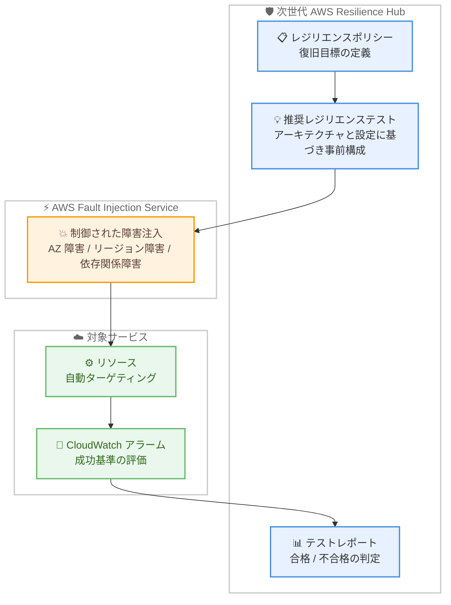

# AWS Resilience Hub - 推奨レジリエンステスト

**リリース日**: 2026 年 8 月 3 日
**サービス**: AWS Resilience Hub
**機能**: 推奨レジリエンステスト (Recommended Resilience Tests)

📊 [このアップデートのインフォグラフィックを見る](https://takech9203.github.io/aws-news-summary/20260803-aws-resilience-hub.html)

## 概要

AWS Resilience Hub は、既知の障害シナリオに対してサービスがどのように応答し回復するかを検証できる「推奨レジリエンステスト」の提供を開始しました。この機能は、次世代 AWS Resilience Hub 上で提供され、プラットフォームエンジニアリングチームやサイト信頼性エンジニアリング (SRE) チームによる、障害からの回復力の検証を支援します。

Resilience Hub は、サービスのアーキテクチャ、設定、およびレジリエンスポリシーに基づいて事前構成されたテストを提供します。テストは AWS Fault Injection Service (FIS) を使用して制御された障害を注入し、定義された復旧目標の範囲内でサービスが回復するかを評価します。アベイラビリティーゾーン障害、リージョン障害、依存関係の障害といったシナリオに対する準備状況を検証できます。

各テストは、サービス内のリソースを自動的にターゲットとして特定し、必要な障害を注入した後、アラーム評価と復旧目標に基づいて合格または不合格の結果を判定し、詳細なテストレポートを生成します。

**アップデート前の課題**

障害注入テストの設計と実行には、多くの手動作業と専門知識が必要でした。

- 障害シナリオごとに FIS の実験テンプレートを手動で設計・作成する必要があった
- テスト対象リソースの特定、障害アクションの選択、停止条件の設定を個別に行う必要があった
- テスト結果と復旧目標 (RTO など) との突き合わせや、合否判定を手動で行う必要があった

**アップデート後の改善**

推奨レジリエンステストにより、テストの設計から評価までが自動化されます。

- サービスのアーキテクチャ、設定、レジリエンスポリシーに基づく事前構成済みテストが AWS から提供される
- テストがサービス内のリソースを自動的にターゲットとし、必要な障害を自動で注入する
- アラーム評価と復旧目標に基づいて合格 / 不合格が自動判定され、詳細なテストレポートが生成される
- アベイラビリティーゾーン障害、リージョン障害、依存関係障害といった代表的なシナリオへの準備状況を体系的に検証できる

## アーキテクチャ図



推奨レジリエンステストは、レジリエンスポリシーに基づいて事前構成され、FIS を通じて対象サービスに障害を注入します。アラーム評価と復旧目標に基づいて合否が判定され、詳細なテストレポートが生成されます。

## サービスアップデートの詳細

### 主要機能

1. **事前構成された推奨テスト**
   - サービスのアーキテクチャ、設定、レジリエンスポリシーに基づいて AWS が推奨テストを提供
   - テストの設計を一から行う必要がなく、すぐに検証を開始できる
   - プラットフォームエンジニアリングチームや SRE チームの検証作業を効率化

2. **代表的な障害シナリオの検証**
   - アベイラビリティーゾーン障害 (Availability Zone impairment)
   - リージョン障害 (Regional impairment)
   - 依存関係の障害 (dependency failure)

3. **AWS Fault Injection Service との統合**
   - FIS を使用して制御された障害を注入
   - サービス内のリソースを自動的にターゲティング
   - CloudWatch アラームを停止条件として利用可能

4. **自動的な合否判定とレポート生成**
   - アラーム評価と定義済みの復旧目標に基づき、合格または不合格の結果を判定
   - テスト完了後に詳細なテストレポートを自動生成

## 技術仕様

### テストの流れ

| 項目 | 詳細 |
|------|------|
| テストの構成 | サービスのアーキテクチャ、設定、レジリエンスポリシーに基づき事前構成 |
| 障害注入 | AWS Fault Injection Service (FIS) を使用 |
| 対象シナリオ | AZ 障害、リージョン障害、依存関係障害 |
| ターゲティング | サービス内のリソースを自動的に特定 |
| 合否判定 | アラーム評価と復旧目標に基づく自動判定 |
| 出力 | 詳細なテストレポート |

### API変更履歴

| 日付 | サービス | 変更内容 |
|------|----------|----------|
| 2026/07/31 | [AWS Resilience Hub V2](https://awsapichanges.com/archive/changes/21e1f1-resiliencehub.html) | 17 new 2 updated api methods - 新しいテスト機能のサポートを追加 |

追加された主な API には、テスト管理用の `GetTest`、`DeleteTest`、テストテンプレート参照用の `GetTestTemplate`、テスト実行管理用の `StopTestRun`、成功基準アラームや観測用アラームを設定する `PutTestSources`、テスト実行のソースを一覧する `ListTestRunSources`、解決済みターゲットリソースを一覧する `ListResolvedTestRunTargetResources` などが含まれます。API では成功基準アラーム (successCriteriaAlarm) と観測用アラーム (observabilityAlarm) を指定でき、テスト実行の結果は `PASSED`、`FAILED` などのステータスで返されます。

## 設定方法

### 前提条件

1. 次世代 AWS Resilience Hub でサービスを作成し、レジリエンスポリシー (復旧目標) を定義していること
2. AWS FIS が障害を注入するための IAM ロールと権限が設定されていること
3. 合否判定に使用する CloudWatch アラームが構成されていること

### 手順

#### ステップ1: 次世代 AWS Resilience Hub コンソールにアクセス

[AWS コンソール](https://console.aws.amazon.com/resiliencehub/v2/home) にアクセスし、対象のサービスを選択します。

#### ステップ2: 推奨レジリエンステストの確認

サービスのアーキテクチャ、設定、レジリエンスポリシーに基づいて提供される推奨テストを確認します。AZ 障害、リージョン障害、依存関係障害などのシナリオに対応したテストが表示されます。

#### ステップ3: テストの実行と結果の確認

テストを実行すると、FIS が制御された障害を注入し、アラーム評価と復旧目標に基づいて合否が判定されます。テスト完了後、生成された詳細なテストレポートを確認し、必要に応じてアーキテクチャの改善を行います。

## メリット

### ビジネス面

- **障害への準備状況の可視化**: AZ 障害やリージョン障害といった実際に起こり得るシナリオへの準備状況を、合格 / 不合格という明確な結果で把握できる
- **検証コストの削減**: テストの設計・構築にかかる工数を削減し、チームは結果の分析と改善に集中できる
- **レポートによる説明責任**: 詳細なテストレポートにより、ステークホルダーや監査担当者への説明が容易になる

### 技術面

- **テスト設計の自動化**: サービスの構成とレジリエンスポリシーに基づき、AWS が推奨テストを事前構成
- **リソースの自動ターゲティング**: テスト対象リソースを手動で指定する必要がない
- **復旧目標との自動突き合わせ**: 定義済みの復旧目標とアラーム評価に基づき、合否を自動判定

## デメリット・制約事項

### 制限事項

- 次世代 AWS Resilience Hub 上での提供であり、利用可能リージョンは 15 リージョンに限定される
- 障害注入には AWS FIS を使用するため、FIS がサポートするアクションとリソースタイプの範囲に依存する

### 考慮すべき点

- 本番環境でテストを実行する場合は、停止条件 (CloudWatch アラーム) の設定など、影響範囲を制御する準備が必要
- レジリエンステストの実行には FIS の料金 (アクション分単位) が発生する
- 合否判定の精度は、成功基準として設定する CloudWatch アラームの品質に依存する

## ユースケース

### ユースケース1: AZ 障害への準備状況の定期検証

**シナリオ**: マルチ AZ 構成の Web サービスを運用する SRE チームが、AZ 障害発生時に定義した復旧目標内でサービスが回復することを定期的に検証したい。

**実装例**:
```
1. 次世代 Resilience Hub でサービスを作成し、レジリエンスポリシーで復旧目標を定義
2. 推奨されたアベイラビリティーゾーン障害テストを確認
3. テストを実行し、FIS による障害注入とアラーム評価の結果を確認
4. テストレポートをもとに改善点を特定
```

**効果**: AZ 障害に対する回復力を客観的な合否判定で継続的に検証でき、想定外の障害発生時のリスクを低減できる。

### ユースケース2: 依存関係障害の影響検証

**シナリオ**: 複数の外部依存関係を持つマイクロサービスにおいて、依存先の障害発生時にサービス全体がどのように振る舞うかを検証したい。

**実装例**:
```
1. 対象サービスを次世代 Resilience Hub に登録
2. 依存関係障害 (dependency failure) の推奨テストを実行
3. 成功基準アラームの評価結果とテストレポートを確認
4. フォールバック処理やタイムアウト設定の改善に反映
```

**効果**: 依存関係の障害がサービスに与える影響を事前に把握し、グレースフルデグラデーションの実装を検証できる。

### ユースケース3: 組織横断でのレジリエンス標準の検証

**シナリオ**: プラットフォームエンジニアリングチームが、組織内の複数サービスに対して共通のレジリエンス基準を設け、その準拠状況を検証したい。

**実装例**:
```
1. 各サービスにレジリエンスポリシーを割り当て
2. AWS 推奨のレジリエンステストを各サービスで実行
3. 合否結果とテストレポートを収集し、組織全体の準拠状況を把握
```

**効果**: 統一された基準と自動化されたテストにより、組織全体のレジリエンス態勢を体系的に管理できる。

## 料金

次世代 AWS Resilience Hub の料金は、サービス数、障害モード評価、レジリエンステスト、およびオプションの依存関係検出に基づきます。

- **サービス料金**: 1 サービスあたり月額 15 USD (150 リソース以下のサービスで月 2 回の障害モード評価を含む)
- **レジリエンステスト**: AWS Fault Injection Service を通じて課金され、アクション分あたり 0.10 USD (追加のターゲットアカウントごとにアクション分あたり 0.10 USD が加算)

### 料金例

| 使用量 | 料金 (概算) |
|--------|------------------|
| 3 アクションのテストを 60 分間、1 アカウントで実行 | 18 USD (3 x 60 x 0.10 USD) |
| 10 サービス (各 150 リソース以下、月 2 回の評価) | 150 USD / 月 |

最新の料金は [AWS Resilience Hub 料金ページ](https://aws.amazon.com/resilience-hub/pricing/) を確認してください。

## 利用可能リージョン

次世代 AWS Resilience Hub の推奨レジリエンステストは、以下の 15 リージョンで利用可能です。

- 米国東部 (バージニア北部)
- 米国東部 (オハイオ)
- 米国西部 (オレゴン)
- カナダ (中部)
- 欧州 (アイルランド)
- 欧州 (ロンドン)
- 欧州 (フランクフルト)
- 欧州 (パリ)
- 欧州 (ストックホルム)
- アジアパシフィック (ムンバイ)
- アジアパシフィック (シンガポール)
- アジアパシフィック (シドニー)
- アジアパシフィック (東京)
- アジアパシフィック (ソウル)
- 南米 (サンパウロ)

## 関連サービス・機能

- **AWS Fault Injection Service (FIS)**: 推奨レジリエンステストの障害注入エンジンとして使用される。制御された障害の注入、停止条件、ロールバックなどのガードレールを提供
- **Amazon CloudWatch**: テストの成功基準アラームおよび観測用アラームとして使用され、合否判定の根拠となる
- **AWS Well-Architected Framework**: Resilience Hub の評価とレコメンデーションの基盤となるベストプラクティス

## 参考リンク

- 📊 [インフォグラフィック](https://takech9203.github.io/aws-news-summary/20260803-aws-resilience-hub.html)
- [公式発表 (What's New)](https://aws.amazon.com/about-aws/whats-new/2026/08/aws-resilience-hub/)
- [AWS Resilience Hub 製品ページ](https://aws.amazon.com/resilience-hub/)
- [AWS Resilience Hub ドキュメント](https://docs.aws.amazon.com/resilience-hub/)
- [次世代 Resilience Hub API リファレンス](https://docs.aws.amazon.com/resilience-hub/v2/APIReference/)
- [料金ページ](https://aws.amazon.com/resilience-hub/pricing/)

## まとめ

推奨レジリエンステストにより、これまで専門知識と手作業を要した障害注入テストの設計・実行・評価が自動化され、AZ 障害、リージョン障害、依存関係障害への準備状況を合否という明確な形で検証できるようになりました。次世代 AWS Resilience Hub を利用しているチームは、レジリエンスポリシーを定義した上で推奨テストを実行し、テストレポートに基づく継続的な改善サイクルの確立を検討することを推奨します。
