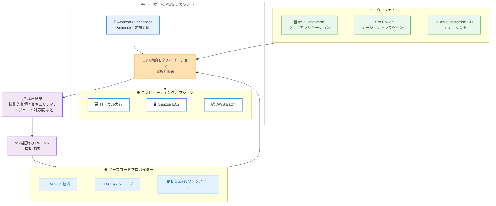

# AWS Transform - 継続的モダナイゼーション (Continuous Modernization) が一般提供開始

**リリース日**: 2026 年 8 月 3 日
**サービス**: AWS Transform
**機能**: AWS Transform continuous modernization (継続的モダナイゼーション) の一般提供開始

📊 [このアップデートのインフォグラフィックを見る](https://takech9203.github.io/aws-news-summary/20260803-aws-transform-continuous-general-available.html)

## 概要

AWS Transform の継続的モダナイゼーション (continuous modernization) が、AWS Transform がサポートされているすべての AWS リージョンで一般提供 (GA) されました。この機能は、エンジニアリングチームがソースコードリポジトリ全体の技術的負債を大規模に分析し、修復することを支援します。

GitHub 組織、GitLab グループ、Bitbucket ワークスペースを接続し、オンデマンドまたは定期スケジュールで分析を実行できます。分析結果は、技術的負債、セキュリティ、エージェント対応度 (agentic readiness)、モダナイゼーション対応度、カスタム分析基準といった観点で優先順位付けできます。修復が関連付けられた検出結果に対しては、継続的モダナイゼーションがブランチを作成し、検証済みのコード変更を含むプルリクエスト (PR) またはマージリクエスト (MR) を自動的にオープンします。分析と修復はユーザー自身の AWS アカウント内で、ユーザーの認証情報を使用して実行され、ソースコードはユーザーの管理下に留まります。

今回の GA では、AWS Transform ウェブアプリケーションからソースコードプロバイダーの接続、分析の開始とスケジュール設定、検出結果のレビュー、修復の作成を直接行えるようになりました。また、AWS Transform Kiro Power、エージェントプラグイン、AWS Transform CLI を使用して IDE やターミナルから作業し、ローカルリポジトリの分析、ラベルによるリポジトリの整理、Amazon EC2 や AWS Batch を使用したローカルまたはリモートでの分析実行も可能です。

**アップデート前の課題**

- 多数のリポジトリにまたがる技術的負債やセキュリティ脆弱性の把握には、リポジトリごとの手動調査や個別ツールの組み合わせが必要だった
- 検出した問題の修正は開発者が手作業でコード変更・PR 作成を行う必要があり、大規模なコードベース全体への展開に時間がかかった
- コードベースの健全性を継続的に監視する仕組みを、チームが独自に構築・運用する必要があった

**アップデート後の改善**

- GitHub、GitLab、Bitbucket を接続し、組織全体のリポジトリを一括で検出・分析できるようになった
- 検出結果に対して検証済みのコード変更を含む PR / MR を自動作成でき、修復作業を大規模に自動化できるようになった
- Amazon EventBridge Scheduler を利用した定期分析 (日次・週次・カスタム cron) により、ポートフォリオ全体を継続的に監視できるようになった
- ウェブアプリケーション、Kiro Power、エージェントプラグイン、CLI という複数のインターフェイスから同じワークフローを利用できるようになった

## アーキテクチャ図



継続的モダナイゼーションは、接続したソースコードプロバイダーのリポジトリをユーザーの AWS アカウント内で分析し、検出結果から検証済みの PR / MR を自動作成してソースコードプロバイダーに反映します。

## サービスアップデートの詳細

### 主要機能

1. **技術的負債分析 (Tech Debt Analysis)**
   - 古い依存関係、セキュリティ脆弱性、コード品質の問題、モダナイゼーションの機会をリポジトリ横断でスキャン
   - パッケージマニフェストを対象とした高速なメタデータスキャン、またはコードレベルの包括的な分析を選択可能
   - transformation definition (変換定義) を使用して、環境に合わせたカスタム分析基準を定義可能

2. **自律的な修復 (Autonomous Remediation)**
   - 検証済みのプルリクエストを大規模に生成
   - 各検出結果は、関連付けられた変換定義を使用して自動修復が可能
   - GitHub、GitLab、Bitbucket に対してブランチ作成と PR / MR のオープンを自動実行

3. **レポート機能 (Reporting)**
   - 重要度、リポジトリ、分析タイプ別の検出結果を示す HTML レポートを生成
   - 修復の進捗と検出結果の解決状況を時系列で追跡

4. **継続的モニタリング (Continuous Monitoring)**
   - Amazon EventBridge Scheduler を使用した定期分析のスケジュール設定
   - 日次、週次、カスタム cron スケジュールを設定し、ポートフォリオを継続的に監視

5. **開発者ツールからの利用**
   - Kiro IDE では AWS Transform Kiro Power をインストールして、Kiro Chat から会話形式でワークフローを操作
   - Claude Code、Codex、Cursor では awslabs/agent-plugins のエージェントプラグインで同等の機能を利用可能
   - AWS Transform CLI の `atx ct` サブコマンド群で、ソース管理、分析、検出結果、修復、リモート実行を操作可能

### 分析タイプ

| 分析タイプ | 説明 |
|------|------|
| rapid-techdebt-analysis | パッケージマニフェスト (pom.xml、package.json、requirements.txt) のみを対象とした高速なメタデータスキャン。古いバージョンや依存関係を特定。ソースコードは分析しない |
| tech-debt-comprehensive | AWS Transform エージェントによるコードレベルの詳細な技術的負債分析。負債パターン、コード品質の問題、アーキテクチャ上の懸念、改善機会を特定 |
| security | AWS Security Agent によるセキュリティ脆弱性と CVE の検出。既知の脆弱性、安全でないコーディングパターン、悪用可能な弱点をスキャン。初回のみインフラセットアップが必要 |
| agentic-readiness | AI とエージェント統合への対応度評価。インフラとプラットフォーム、アプリケーションアーキテクチャ、データ基盤、アイデンティティ / セキュリティ / ガバナンス、運用と可観測性の 5 カテゴリ、56 の基準でスコアリング |
| modernization-readiness | クラウドモダナイゼーションの機会評価。コンテナ化、サーバーレス移行、プラットフォームアップグレードの候補を特定 |
| custom | 任意の変換定義を分析として実行。独自の分析基準の定義や、組み込みタイプでカバーされない AWS マネージド変換の実行に使用 |

## 技術仕様

### 主要な概念

| 項目 | 詳細 |
|------|------|
| ソース | リポジトリの場所を示す接続先。GitHub (組織、クラシックのパーソナルアクセストークン)、GitLab (グループまたはユーザー、セルフホストインスタンス対応)、Bitbucket (Cloud のワークスペースまたは Data Center のプロジェクト)、ローカル (git リポジトリを含む親ディレクトリ) をサポート |
| リポジトリ | ソースのスキャンにより検出。ラベル (チーム、優先度、移行ウェーブなど) で整理し、分析や修復の対象を絞り込み可能 |
| 分析 | 特定の分析タイプによる 1 つ以上のリポジトリのスキャン。オンデマンドまたは自動スケジュールで実行。ステータス (pending、running、complete、cancelled、failed) を追跡 |
| 検出結果 | 分析の結果。重要度 (high、medium、low)、ステータス (open、dismissed、obsolete)、自動修復可能な場合は修復用の変換定義を含む。再分析により解決済みの検出結果は自動的に obsolete となる |
| 修復 | 変換定義を適用して検出結果を修正。findings-based、TD override、direct TD の 3 モード。出力はソースプロバイダーに応じて GitHub PR、GitLab MR、Bitbucket PR、またはローカルブランチ |
| コンピューティングオプション | ローカル (デフォルト、追加インフラ不要)、Amazon EC2、AWS Batch (Fargate) の 3 種類。いずれの場合も分析と修復はユーザーの AWS アカウント内で実行 |

### CLI の主なサブコマンド

| サブコマンド | 説明 |
|------|------|
| `atx ct status` | ソース、リポジトリ、分析、検出結果、修復を含むシステムステータスの表示 |
| `atx ct source add / list / update / remove` | ソース (GitHub、GitLab、Bitbucket、ローカル) の管理 |
| `atx ct discovery scan` | ソースからのリポジトリ検出 |
| `atx ct repository list / update` | リポジトリの一覧表示とラベル更新 |
| `atx ct analysis run / list / cancel` | 分析の実行・管理 |
| `atx ct findings list / count / update` | 検出結果のクエリ、集計、ステータス更新 |
| `atx ct remediation create / status / retry` | 修復の作成、ステータス確認、再試行 |
| `atx ct remote provision / analysis / remediation` | Amazon EC2 / AWS Batch へのリモート実行インフラのデプロイと実行 |
| `atx ct schedule` | Amazon EventBridge Scheduler による定期分析の設定 |

## 設定方法

### 前提条件

1. AWS アカウントと、AWS Transform がサポートされているリージョンの AWS Transform ワークスペース
2. 接続するソースコードプロバイダーの認証トークン (GitHub はクラシックのパーソナルアクセストークンなど、適切なスコープを持つもの)
3. IDE / ターミナルから利用する場合は、Kiro IDE + AWS Transform Kiro Power、または awslabs/agent-plugins のエージェントプラグイン、または AWS Transform CLI

### 手順

#### ステップ 1: インターフェイスの選択とセットアップ

- **ウェブアプリケーション**: [AWS Transform ウェブアプリケーション](https://console.aws.amazon.com/transform/home) を開く
- **Kiro IDE**: AWS Transform Kiro Power をインストールし、Kiro Chat でエージェントに継続的モダナイゼーションのワークフローを依頼する
- **Claude Code / Codex / Cursor**: awslabs/agent-plugins の `plugins/aws-transform` ディレクトリのプラグインをインストールする

公式ドキュメントでは、Kiro Power またはエージェントプラグインから始めることが推奨されています。エージェントスキルがインフラのプロビジョニング、ソース設定、分析実行、検出結果のトリアージ、修復までのセットアップとオンボーディングをオーケストレーションします。

#### ステップ 2: ソースの接続とリポジトリの検出

```bash
# ソースを追加 (GitHub / GitLab / Bitbucket / ローカル)
atx ct source add

# ソースからリポジトリを検出
atx ct discovery scan

# 検出されたリポジトリを一覧表示し、ラベルで整理
atx ct repository list
atx ct repository update
```

ソースコードプロバイダーを接続し、リポジトリを検出します。ラベルを使用してチーム、優先度、移行ウェーブごとにリポジトリを整理できます。

#### ステップ 3: 分析の実行と検出結果のトリアージ

```bash
# 分析を実行 (分析タイプを指定)
atx ct analysis run

# 検出結果を重要度・リポジトリ・分析タイプでフィルタリングして確認
atx ct findings list
atx ct findings count
```

ポートフォリオ全体に対して分析を実行し、検出結果を重要度別にレビューします。誤検出は理由を記録して却下でき、再分析により解決済みの問題は自動的に obsolete としてマークされます。

#### ステップ 4: 修復と継続的分析の設定

```bash
# 検出結果から修復を作成 (PR / MR が自動作成される)
atx ct remediation create

# 修復ステータスと PR / MR リンクを確認
atx ct remediation status

# 定期分析をスケジュール (Amazon EventBridge Scheduler を使用)
atx ct schedule
```

修復を作成すると、ブランチの作成と検証済みコード変更を含む PR / MR のオープンが自動実行されます。`atx ct schedule` で日次・週次・月次の分析サイクルを設定し、コードベースの健全性を継続的に維持できます。

## メリット

### ビジネス面

- **技術的負債の可視化**: 組織全体のリポジトリを横断して技術的負債やセキュリティリスクを定量的に把握し、優先順位付けした対応が可能
- **修復コストの削減**: 検証済み PR / MR の自動生成により、大規模なコードベースの修正にかかる開発者の工数を削減
- **継続的なコード健全性の維持**: 定期分析と自動修復の組み合わせにより、負債の蓄積を防ぐ継続的な運用が可能

### 技術面

- **データ主権の維持**: 分析と修復はユーザーの AWS アカウント内でユーザーの認証情報を使用して実行され、ソースコードはユーザーの管理下に留まる
- **柔軟なコンピューティングオプション**: ローカル実行 (追加インフラ不要)、Amazon EC2、AWS Batch (Fargate) から用途に応じて選択可能
- **多様なインターフェイス**: ウェブアプリケーション、Kiro Power、エージェントプラグイン (Claude Code、Codex、Cursor)、CLI から同じワークフローを利用可能
- **拡張性**: 変換定義によるカスタム分析基準の定義と、AWS マネージド変換の活用が可能

## デメリット・制約事項

### 制限事項

- セキュリティ分析 (security タイプ) は初回のみインフラセットアップが必要
- rapid-techdebt-analysis はパッケージマニフェストのみを対象とし、ソースコード自体は分析しない
- GitHub のソース接続にはクラシックのパーソナルアクセストークンが必要

### 考慮すべき点

- ソースコードプロバイダーの認証トークンには適切なスコープの設定が必要であり、トークンの管理・ローテーション運用を検討する必要がある
- 自動生成される PR / MR は検証済みとされるが、マージ前のコードレビュープロセスは引き続き組織側で運用する必要がある
- リモート実行 (Amazon EC2 / AWS Batch) を使用する場合、対応するインフラのコストが発生する

## ユースケース

### ユースケース 1: 組織全体の技術的負債の棚卸しと計画的な解消

**シナリオ**: 数百のリポジトリを持つ企業が、古い依存関係や脆弱なライブラリの利用状況を把握できておらず、モダナイゼーション計画を立てられない。

**実装例**:
```bash
# GitHub 組織を接続してリポジトリを検出
atx ct source add
atx ct discovery scan

# まず高速スキャンで全体像を把握
atx ct analysis run   # rapid-techdebt-analysis

# 重要度別に検出結果を集計
atx ct findings count
```

**効果**: 組織全体の技術的負債を重要度別に定量化し、優先度の高いリポジトリから計画的に修復を進められる。

### ユースケース 2: セキュリティ脆弱性の継続的な検出と自動修復

**シナリオ**: セキュリティチームが CVE 対応を手動で追跡しており、脆弱な依存関係の修正 PR 作成に時間がかかっている。

**実装例**:
```bash
# セキュリティ分析を週次でスケジュール
atx ct schedule

# 検出結果から修復を作成し、PR を自動生成
atx ct remediation create
atx ct remediation status
```

**効果**: 脆弱性の検出から修正 PR の作成までを自動化し、対応リードタイムを短縮。再分析により解決済みの検出結果は自動的に obsolete となり、追跡負荷も軽減される。

### ユースケース 3: AI エージェント活用に向けたコードベースの対応度評価

**シナリオ**: AI コーディングエージェントの導入を検討しているが、既存のコードベースがエージェントによる開発に適した状態か判断できない。

**実装例**:
```bash
# エージェント対応度分析を実行
atx ct analysis run   # agentic-readiness

# HTML レポートを生成して評価結果を共有
# レポーティングスキルまたは CLI から生成
```

**効果**: 5 カテゴリ 56 基準のスコアリングにより、AI エージェント統合に向けた改善ポイントを客観的に特定し、投資判断の材料にできる。

## 料金

AWS Transform の料金体系については、公式の [AWS Transform 料金ページ](https://aws.amazon.com/transform/pricing/) を参照してください。なお、リモート実行に Amazon EC2 や AWS Batch を使用する場合は、それらのコンピューティングリソースの料金が別途発生します。

## 利用可能リージョン

AWS Transform がサポートされているすべての AWS リージョンで利用可能です。ドキュメントによると、AWS Transform のワークスペースは以下のリージョン (デフォルトで有効) で作成できます。

- 米国東部 (バージニア北部)
- 欧州 (フランクフルト)
- アジアパシフィック (ムンバイ)
- アジアパシフィック (シドニー)
- **アジアパシフィック (東京)**
- 欧州 (ロンドン)
- アジアパシフィック (ソウル)
- カナダ (中部)
- 南米 (サンパウロ) - メインフレームモダナイゼーションエージェントのみ

最新のリージョン情報は [Supported Regions for AWS Transform](https://docs.aws.amazon.com/transform/latest/userguide/regions.html) を参照してください。

## 関連サービス・機能

- **Kiro**: AWS の AI 搭載 IDE。AWS Transform Kiro Power をインストールすると、Kiro Chat から会話形式で継続的モダナイゼーションのワークフローを操作できる
- **Amazon EventBridge Scheduler**: 定期分析のスケジュール実行に使用。日次、週次、カスタム cron スケジュールを設定可能
- **Amazon EC2 / AWS Batch**: リモート実行のコンピューティングオプション。大規模な分析や修復をローカルマシンの外で実行できる
- **AWS CloudFormation**: リモート実行インフラ (Amazon EC2 / AWS Batch) のデプロイに使用
- **AWS Secrets Manager**: リモート実行時のソースコードプロバイダーのトークン管理に使用

## 参考リンク

- 📊 [インフォグラフィック](https://takech9203.github.io/aws-news-summary/20260803-aws-transform-continuous-general-available.html)
- [公式発表 (What's New)](https://aws.amazon.com/about-aws/whats-new/2026/7/aws-transform-continuous-general-available)
- [AWS Transform continuous modernization 製品ページ](https://aws.amazon.com/transform/continuous-modernization/)
- [ドキュメント: AWS Transform continuous modernization](https://docs.aws.amazon.com/transform/latest/userguide/continuous-modernization.html)
- [ドキュメント: Developer tools (Kiro Power / エージェントプラグイン / CLI)](https://docs.aws.amazon.com/transform/latest/userguide/ct-developer-tools.html)
- [ドキュメント: Supported Regions for AWS Transform](https://docs.aws.amazon.com/transform/latest/userguide/regions.html)
- [料金ページ](https://aws.amazon.com/transform/pricing/)

## まとめ

AWS Transform 継続的モダナイゼーションの GA により、技術的負債の分析から検証済み PR / MR による修復までを、組織のリポジトリポートフォリオ全体に対して自動化・継続化できるようになりました。分析と修復はユーザーの AWS アカウント内で実行され、ソースコードの管理権を手放す必要がない点も大きな特長です。多数のリポジトリを抱えるチームは、まず Kiro Power やエージェントプラグインから rapid-techdebt-analysis を試し、組織全体の負債状況の可視化から始めることを推奨します。
