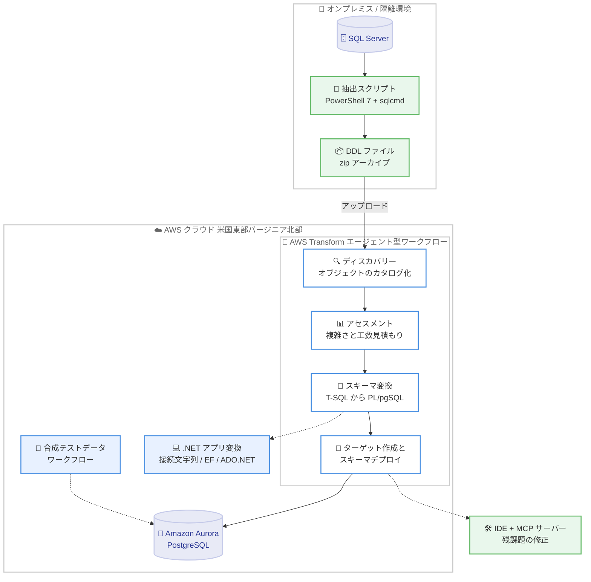

# AWS Transform - フルスタック Windows モダナイゼーションにおける Aurora PostgreSQL へのオフラインスキーマ変換サポート

**リリース日**: 2026 年 8 月 3 日
**サービス**: AWS Transform
**機能**: オフラインソース変換 (offline source transformation) による SQL Server から Amazon Aurora PostgreSQL へのスキーマ変換

📊 [このアップデートのインフォグラフィックを見る](https://takech9203.github.io/aws-news-summary/20260803-aws-transform-windows-sql-schema-aurora.html)

## 概要

AWS Transform for full-stack Windows modernization において、オフラインソース変換の一般提供 (GA) が発表されました。この機能により、ライブデータベース接続を必要とせずに、Microsoft SQL Server データベースを Amazon Aurora PostgreSQL へモダナイズできるようになります。AWS Transform は、AWS DMS を活用した SQL Server ストレージオブジェクトの変換と、エージェント型のインタラクティブな体験によるコードオブジェクト (ストアドプロシージャ) の変換を提供します。

レガシー .NET アプリケーションとそれに依存する SQL Server データベースをモダナイズする企業は、データベースから抽出した DDL (Data Design Language) ソースファイルを直接アップロードするだけで、モダナイゼーションを開始できます。アップロードされた DDL ファイルをもとに、データベースとストアドプロシージャの複雑さを評価し、カスタマイズ可能な変換プランを生成します。AWS Transform はテーブルやスキーマを変換し、ストアドプロシージャや関数などのコードオブジェクトを変換して機能的等価性を検証したうえで、変換済みスキーマを Aurora PostgreSQL にデプロイします。

同じワークフローで、データベースに依存する .NET アプリケーションも PostgreSQL 互換の .NET アプリケーションに変換されます。接続文字列、ADO.NET、Entity Framework のデータアクセスコールが更新されます。残った変換課題については、Web コンソール上で直接反復修正するか、AWS Transform MCP サーバーを使用して好みの IDE に引き継ぐことができます。また、別途用意された合成データワークフローにより、Aurora PostgreSQL にテストデータを投入し、エンドツーエンドのアプリケーション検証を実施できます。

**アップデート前の課題**

- スキーマ変換を開始するには、SQL Server データベースへのライブ接続 (ネットワーク接続) が必要だった
- セキュリティポリシーやネットワーク分離の制約により、データベースを AWS Transform に公開できない環境では、モダナイゼーションの着手自体が困難だった
- ネットワークアクセスを許可する前に、変換の実現可能性を評価する手段が限られていた

**アップデート後の改善**

- DDL ファイルをアップロードするだけで、データベース接続なしにスキーマの分析・評価・変換が可能になった
- ネットワークアクセスを許可する前に、実現可能性アセスメントとスキーマ変換を実施できるようになった
- スキーマ変換から .NET アプリケーション変換、合成テストデータによる検証まで、単一のワークフローで完結できるようになった

## アーキテクチャ図



オフラインワークフローでは、抽出スクリプトで生成した DDL ファイルをアップロードするだけで、データベースへの直接接続なしにディスカバリーからスキーマデプロイまでを実行できます。

## サービスアップデートの詳細

### 主要機能

1. **オフラインソース変換 (DDL ファイルアップロード)**
   - AWS Transform が提供する抽出スクリプト (PowerShell 7 以降で実行) を SQL Server に対して実行し、タイムスタンプ付きの zip アーカイブとして DDL ファイルを生成
   - zip アーカイブまたは個別の .sql ファイルをチャットからアップロードするだけで変換を開始可能
   - スキーマ分析・変換フェーズでは、データベースと AWS 間のインバウンド / アウトバウンド接続は一切不要

2. **ディスカバリーとアセスメント**
   - アップロードされたファイルを解析し、テーブル、ストアドプロシージャ、ビュー、トリガー、インデックス、制約、シーケンスなどのデータベースオブジェクトをデータベース単位でカタログ化
   - 選択したデータベースの変換実現可能性を評価し、エグゼクティブサマリー、データベースごとのオブジェクトサマリー、工数 (LOE) 見積もりを含むダウンロード可能なレポートを生成
   - LOE スコアのカスタマイズや追加ファイルのアップロードによる再評価にも対応

3. **スキーマ変換とデプロイ**
   - SQL Server スキーマ (T-SQL ストアドプロシージャを含む) を Aurora PostgreSQL 向けに変換し、機能的等価性を検証
   - 複数データベースは独立して並列に変換 (デフォルトで同時 5 データベースまで)
   - 変換済みデータベースごとに Aurora PostgreSQL クラスターを新規作成または再利用し、変換済みスキーマをデプロイ

4. **.NET アプリケーションのモダナイゼーション (オプション)**
   - 同一ワークフロー内で、依存する .NET 6 以降のアプリケーションを PostgreSQL 互換に変換
   - 接続文字列の更新、Entity Framework および ADO.NET のデータアクセスコードの変更を人間の監督付きで実施
   - ソースコードは AWS CodeConnections、Personal Access Token (GitHub / GitLab)、または S3 URI (zip ファイル) 経由で接続

5. **残課題の修正と検証**
   - 変換で残った課題は Web コンソール上のチャットで直接反復修正するか、AWS Transform MCP サーバー経由で好みの IDE に引き継いで修正可能
   - 別途用意された合成データワークフローで Aurora PostgreSQL にテストデータを投入し、エンドツーエンドのアプリケーション検証を実施可能

## 技術仕様

### 対応バージョンと要件

| 項目 | 詳細 |
|------|------|
| SQL Server バージョン | 2008 R2、2012、2014、2016、2017、2019、2022 (全エディション対応) |
| ターゲットデータベース | Amazon Aurora PostgreSQL (PostgreSQL 15 以降互換) のみ |
| .NET バージョン | .NET 6、7、8、10 (.NET Framework 4.x 以前は非対応) |
| Entity Framework | EF 6.3 - 6.5、EF Core 1.0 - 10.0、ADO.NET 全バージョン |
| 抽出スクリプト実行環境 | PowerShell 7 以降、sqlcmd ユーティリティ |
| 必要な SQL Server 権限 | VIEW SERVER STATE および VIEW ANY DEFINITION (SQL Server 認証のみ、Windows / ドメイン認証は非対応) |
| ソースコードリポジトリ | GitHub / GitHub Enterprise Server、GitLab.com / GitLab Self-Managed、Bitbucket Cloud / Data Center、Azure DevOps / Azure DevOps Server、Amazon S3 |

### オフラインワークフローのサービス制限 (デフォルト)

| 制限 | デフォルト値 | 適用対象 |
|------|--------------|----------|
| ジョブあたりのアップロードサイズ | 1,024 MB (ジョブ内の全アップロード累計) | DDL ファイルアップロード |
| 月あたりの変換データベース数 | アカウントあたり 10 | スキーマ変換 |
| データベースあたりのストアドプロシージャ数 | 250 | スキーマ変換 |
| 同時スキーマ変換数 | 5 データベース | スキーマ変換 |
| 同時実行ジョブ数 | 5 | アカウント単位 |

一部の制限はアカウントごとに設定変更が可能で、AWS アカウントチームへの依頼で引き上げをリクエストできます。なお、アセスメントはストアドプロシージャ数の制限による影響を受けず、スキーマ変換のみが対象です。

## 設定方法

### 前提条件

1. サポート対象の SQL Server バージョン (2008 R2 から 2022、全エディション)
2. 抽出スクリプトを実行するための PowerShell 7 以降と、PATH 上で利用可能な sqlcmd ユーティリティ
3. VIEW SERVER STATE および VIEW ANY DEFINITION 権限を持つ SQL Server 認証ログイン
4. 後続フェーズ (Aurora PostgreSQL ターゲットの作成とスキーマデプロイ) 用の AWS アカウント (IAM Identity Center または IAM 認証を有効化)

### 手順

#### ステップ 1: DDL ファイルの抽出とアップロード

```powershell
# macOS / Linux の場合は pwsh で実行
pwsh ./ExtractDatabaseMetadata.ps1
```

AWS Transform のチャットからダウンロードした抽出スクリプトを SQL Server に対して実行します。カンマ区切りの include リストで対象データベースを限定することも可能です (大文字小文字は区別されません)。スクリプトはタイムスタンプ付きの zip アーカイブを生成するため、これをチャットのアップロードボタンからアップロードします。

#### ステップ 2: ディスカバリーとアセスメント

AWS Transform がアップロードされたファイルを解析し、データベースオブジェクトをカタログ化します。データベースごとのサマリーを確認し、アセスメント対象のデータベースを選択します。アセスメント完了後、工数見積もりを含むレポートをダウンロードして変換プランをカスタマイズできます。

#### ステップ 3: スキーマ変換とデプロイ

変換対象のデータベースを選択すると、AWS Transform が T-SQL ストアドプロシージャを含むスキーマを Aurora PostgreSQL 向けに変換します。ガイド付きのプロンプトに従ってネットワークとターゲット構成を選択し、Aurora クラスターの作成 (または再利用) とスキーマデプロイを実行します。デプロイ後は、チャットまたは IDE で残りのオブジェクトを修正し、必要に応じて合成テストデータを生成します。

## メリット

### ビジネス面

- **モダナイゼーション着手の障壁を低減**: データベースへのネットワークアクセス許可の社内調整を待たずに、DDL ファイルのアップロードだけで移行プロジェクトを開始できる
- **事前の実現可能性評価**: ネットワークアクセスを許可する前に、アセスメントレポートと工数見積もりで移行の実現可能性とコストを把握できる
- **フルスタックでの生産性向上**: スキーマ変換からアプリケーションコード変換まで単一のワークフローで自動化され、複雑で労働集約的な作業が削減される

### 技術面

- **セキュアな変換プロセス**: スキーマ分析・変換フェーズではデータベースと AWS 間の接続が不要なため、厳格なネットワーク分離要件のある環境でも利用可能
- **エージェント型のインタラクティブな体験**: 変換課題を Web コンソールで反復修正でき、AWS Transform MCP サーバーにより好みの IDE への引き継ぎも可能
- **並列変換とテストデータ生成**: 複数データベースの独立した並列変換と、合成データワークフローによるエンドツーエンド検証に対応

## デメリット・制約事項

### 制限事項

- オフラインワークフローが変換・デプロイするのはスキーマのみで、実データの移行は行われない (実データの移行には AWS DMS コンソールでのデータ移行プロジェクト作成が必要)
- ターゲットエンジンは Amazon Aurora PostgreSQL のみ
- .NET Framework 4.x 以前のアプリケーションは非対応 (事前に AWS Transform for .NET で .NET 6 以降へのアップグレードが必要)
- 抽出スクリプトは SQL Server 認証のみをサポートし、Windows / ドメイン認証は利用不可

### 考慮すべき点

- 利用可能リージョンは米国東部 (バージニア北部) のみのため、他リージョンのデータベースでは変換結果のターゲットリージョンへの展開を検討する必要がある
- データ移行をオプトアウトした場合でも、メタデータや処理アーティファクト (エージェントログ、アセスメント結果、SQL スキーマファイルなど) はサービスリージョンに保存されるため、厳格なデータレジデンシー要件がある組織は注意が必要
- ジョブあたり 1 GB のアップロード上限や月あたり 10 データベースの変換上限など、デフォルトのサービス制限を考慮した計画が必要

## ユースケース

### ユースケース 1: ネットワーク分離環境にあるデータベースのモダナイゼーション

**シナリオ**: 金融機関などセキュリティポリシーが厳しい企業で、オンプレミスの SQL Server を外部ネットワークに公開できないが、Aurora PostgreSQL への移行を検討したい。

**実装例**:
```
1. 抽出スクリプトを社内環境で実行し、DDL ファイルの zip を生成
2. zip を AWS Transform にアップロードしてディスカバリーとアセスメントを実行
3. スキーマ変換と Aurora PostgreSQL へのデプロイを実施
4. 合成テストデータで動作検証後、DMS で実データ移行を計画
```

**効果**: データベースを外部に公開することなく、移行の実現可能性評価からスキーマ変換までを完了できる。

### ユースケース 2: 移行プロジェクト開始前のフィージビリティスタディ

**シナリオ**: 大規模な SQL Server 環境を持つ企業が、Aurora PostgreSQL への移行工数を見積もり、経営層への提案資料を作成したい。

**実装例**:
```
1. 対象データベース群の DDL を抽出してアップロード
2. アセスメントレポート (エグゼクティブサマリー、オブジェクトサマリー、LOE 見積もり) をダウンロード
3. LOE スコアをカスタマイズして自社の状況に合わせた見積もりを作成
```

**効果**: 実環境への影響なしに、データ (オブジェクト数、複雑さ、工数見積もり) に基づいた移行計画を策定できる。

### ユースケース 3: レガシー .NET アプリケーションとデータベースの一体的なモダナイゼーション

**シナリオ**: SQL Server に依存する .NET アプリケーションを運用しており、データベースとアプリケーションの両方を PostgreSQL 互換にモダナイズしたい。

**実装例**:
```
1. DDL ファイルをアップロードしてスキーマを Aurora PostgreSQL に変換・デプロイ
2. GitHub リポジトリを AWS CodeConnections で接続
3. 接続文字列、Entity Framework / ADO.NET コードの変換を人間の監督付きで実行
4. 残課題は AWS Transform MCP サーバー経由で IDE から修正
```

**効果**: データベースとアプリケーションの変換を単一ワークフローで完結し、移行後の不整合リスクを低減できる。

## 料金

料金の詳細は AWS Transform の料金ページを参照してください。変換先の Amazon Aurora PostgreSQL クラスターや、実データ移行に使用する AWS DMS には、それぞれのサービスの料金が適用されます。

## 利用可能リージョン

- 米国東部 (バージニア北部) - us-east-1

サポートされていないリージョンのデータベースについては、サポート対象リージョンにデータベースをクローンして変換を実行し、結果をターゲットリージョンに展開するクロスリージョン利用が案内されています。

## 関連サービス・機能

- **Amazon Aurora PostgreSQL**: 本ワークフローの唯一のターゲットデータベースエンジン。PostgreSQL 15 以降互換で、最新の Aurora 機能と最適化をサポート
- **AWS Database Migration Service (DMS)**: ストレージオブジェクト変換の基盤技術。実データの移行が必要な場合は DMS コンソールでデータ移行プロジェクトを作成
- **AWS Transform for .NET**: .NET Framework 4.x 以前のアプリケーションを .NET 6 以降にアップグレードするための機能。SQL Server 変換の前提として利用
- **AWS Transform MCP サーバー**: 変換で残った課題を好みの IDE で修正するための連携機能

## 参考リンク

- 📊 [インフォグラフィック](https://takech9203.github.io/aws-news-summary/20260803-aws-transform-windows-sql-schema-aurora.html)
- [公式発表 (What's New)](https://aws.amazon.com/about-aws/whats-new/2026/7/aws-transform-windows-sql-schema-aurora)
- [AWS Transform 製品ページ](https://aws.amazon.com/transform/windows/)
- [AWS Transform for full-stack Windows ドキュメント](https://docs.aws.amazon.com/transform/latest/userguide/windows-full-stack.html)
- [SQL Server モダナイゼーション](https://docs.aws.amazon.com/transform/latest/userguide/sql-server-modernization.html)
- [DDL ファイルのアップロード (オフラインワークフロー)](https://docs.aws.amazon.com/transform/latest/userguide/sql-server-offline-transformation.html)

## まとめ

AWS Transform のオフラインソース変換により、ライブデータベース接続なしで SQL Server から Aurora PostgreSQL へのスキーマ変換が可能になり、セキュリティ要件の厳しい環境でもモダナイゼーションに着手しやすくなりました。ネットワークアクセスの調整を待たずに DDL ファイルのアップロードだけで実現可能性評価と変換を開始できるため、SQL Server と .NET アプリケーションの移行を検討している場合は、まずアセスメントレポートによる工数見積もりから始めることを推奨します。
