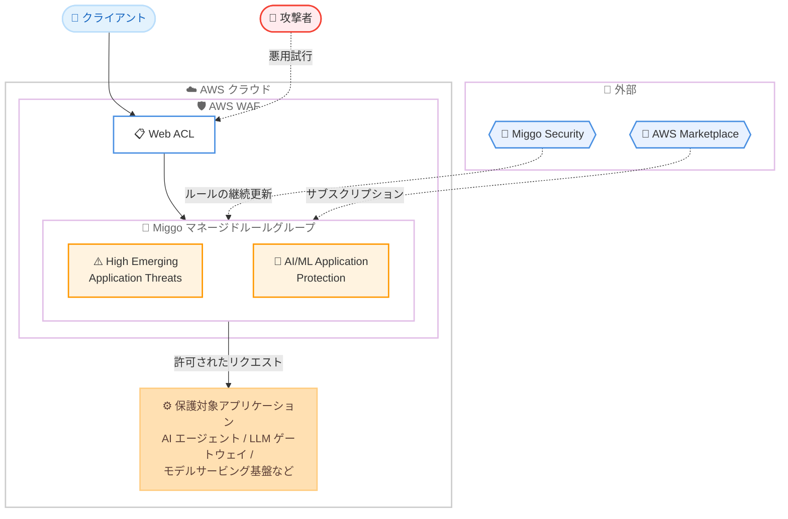

# AWS WAF - Miggo Security マネージドルールグループのサポート

**リリース日**: 2026 年 8 月 3 日
**サービス**: AWS WAF
**機能**: Miggo Security パートナーマネージドルールグループ (新興脅威対策および AI/ML アプリケーション保護)

📊 [このアップデートのインフォグラフィックを見る](https://takech9203.github.io/aws-news-summary/20260803-aws-waf-miggo-managed-rule-groups.html)

## 概要

AWS WAF が、Miggo Security の 2 つの新しいパートナーマネージドルールグループを AWS Marketplace 経由でサポートするようになりました。提供されるのは「Miggo Rules for AWS WAF – High Emerging Application Threats」と「Miggo Rules for AWS WAF – AI/ML Application Protection」の 2 つです。

これらのルールグループは、実際に悪用されている脆弱性、公開された概念実証 (PoC) コードが存在する脆弱性、または CISA の Known Exploited Vulnerabilities (KEV) カタログに掲載されている脆弱性に対して、継続的に更新される保護を提供します。ユーザーはカスタムルールを作成・維持することなく、最新の脅威に対する防御を Web ACL に追加できます。

特に AI/ML Application Protection ルールグループは、AI エージェントフレームワーク、LLM ゲートウェイ、モデルサービングインフラストラクチャといった生成 AI アプリケーションスタックの保護に焦点を当てており、生成 AI アプリケーションを運用する組織にとって注目すべきアップデートです。

**アップデート前の課題**

- 新たに悪用が確認された脆弱性 (CISA KEV カタログ掲載の脆弱性など) に対応するには、ユーザー自身がカスタムルールを作成・更新し続ける必要があった
- AI エージェントフレームワークや LLM ゲートウェイなど、生成 AI アプリケーションスタック特有の攻撃ベクトルに特化したマネージドルールの選択肢が限られていた
- 新興脅威への対応は情報収集からルール反映までのリードタイムが長く、運用負荷が高かった

**アップデート後の改善**

- Miggo Security が継続的に更新するルールグループを購読するだけで、活発に悪用されている脆弱性への保護を自動的に取り込めるようになった
- 生成 AI アプリケーションスタックに特化した保護を、追加設定なしで Web ACL に追加できるようになった
- 両ルールグループはバージョニングをサポートしており、ルール更新の管理を計画的に行えるようになった

## アーキテクチャ図



Miggo Security が継続的に更新するルールグループを AWS Marketplace 経由で購読し、Web ACL に追加することで、新興脅威や生成 AI スタックへの攻撃からアプリケーションを保護する構成です。

## サービスアップデートの詳細

### 主要機能

1. **Miggo Rules for AWS WAF – High Emerging Application Threats**
   - 実際に悪用が進行中の脆弱性への保護に焦点を当てたルールグループ
   - 公開された概念実証 (PoC) コードが存在する脆弱性や、CISA KEV カタログに掲載された脆弱性を対象とする
   - Miggo Security により継続的に更新されるため、ユーザーによるルールの作成・維持が不要

2. **Miggo Rules for AWS WAF – AI/ML Application Protection**
   - 生成 AI アプリケーションスタックの保護に特化したルールグループ
   - AI エージェントフレームワーク、LLM ゲートウェイ、モデルサービングインフラストラクチャなどを保護対象とする

3. **簡単な導入とバージョニング**
   - AWS Marketplace でサブスクリプションを購入し、AWS WAF コンソールから直接 Web ACL に追加可能
   - 追加の設定は不要
   - 両ルールグループともバージョニングをサポートしており、ルール更新のタイミングを制御可能

## 技術仕様

### 提供されるルールグループ

| 項目 | 詳細 |
|------|------|
| ルールグループ 1 | Miggo Rules for AWS WAF – High Emerging Application Threats |
| ルールグループ 2 | Miggo Rules for AWS WAF – AI/ML Application Protection |
| 提供元 | Miggo Security (AWS Marketplace セラー) |
| 提供形態 | AWS Marketplace サブスクリプション |
| 対象脅威 | 活発に悪用中の脆弱性、公開 PoC が存在する脆弱性、CISA KEV カタログ掲載の脆弱性 |
| AI/ML 保護対象 | AI エージェントフレームワーク、LLM ゲートウェイ、モデルサービング基盤 |
| バージョニング | 両ルールグループでサポート |
| 追加設定 | 不要 (Web ACL への追加のみ) |

## 設定方法

### 前提条件

1. AWS アカウントを保有していること
2. AWS WAF の Web ACL を作成済み、または作成する権限があること
3. AWS Marketplace でサブスクリプションを購入できること

### 手順

#### ステップ1: AWS Marketplace でルールグループを購読

AWS Marketplace で以下のいずれか (または両方) のルールグループを購読します。

- [Miggo Rules for AWS WAF – High Emerging Application Threats](https://aws.amazon.com/marketplace/pp/prodview-6zieu7lxn5vje)
- [Miggo Rules for AWS WAF – AI/ML Application Protection](https://aws.amazon.com/marketplace/pp/prodview-a6ezxvokf5keg)

料金は Miggo により AWS Marketplace を通じて設定されています。

#### ステップ2: Web ACL にルールグループを追加

AWS WAF コンソールで対象の Web ACL を開き、「Rules」からマネージドルールグループとして Miggo のルールグループを追加します。追加の設定は不要です。

```bash
# CLI で Web ACL の現在の設定を確認する例
aws wafv2 get-web-acl \
  --name my-web-acl \
  --scope REGIONAL \
  --id <web-acl-id>
```

このコマンドは、指定した Web ACL の現在のルール構成を取得します。ルールグループ追加前後の構成確認に使用できます。

#### ステップ3: 動作確認とモニタリング

追加したルールグループの動作を Amazon CloudWatch メトリクスや AWS WAF のサンプルリクエスト、ログで確認します。必要に応じて、最初はカウントモードで動作を検証してからブロックモードへ移行することを検討してください。

## メリット

### ビジネス面

- **運用負荷の削減**: 新興脆弱性への対応ルールを自作・維持する必要がなくなり、セキュリティチームの負荷を軽減できる
- **対応速度の向上**: 悪用が確認された脆弱性に対する保護が Miggo により継続的に提供されるため、脅威発生から防御までの時間を短縮できる
- **生成 AI 活用の安全性向上**: 生成 AI アプリケーションを本番運用する際のセキュリティ懸念に、専用のマネージドルールで対処できる

### 技術面

- **CISA KEV カタログ連動**: 実際に悪用されている脆弱性 (KEV) に基づく保護を利用できる
- **AI/ML スタック特化の保護**: AI エージェントフレームワーク、LLM ゲートウェイ、モデルサービング基盤といった、従来の WAF ルールではカバーしにくい領域に対応
- **バージョニング対応**: ルールグループのバージョンを固定または追従させることで、変更管理を計画的に実施できる

## デメリット・制約事項

### 制限事項

- ルールグループの利用には AWS Marketplace でのサブスクリプション購入が必要
- 料金は Miggo が設定するため、AWS WAF の基本料金とは別にサブスクリプション費用が発生する
- ルールの内容は Miggo が管理するため、個々のルールの詳細なカスタマイズには制約がある

### 考慮すべき点

- 導入前にカウントモードでの検証を行い、正常なトラフィックへの誤検知 (フォールスポジティブ) がないか確認することを推奨
- 既存の AWS Managed Rules や他のマネージドルールグループとの重複や、Web ACL の WCU (Web ACL Capacity Unit) 上限への影響を確認する必要がある
- 利用可能なリージョンは AWS Regional Services ページでの確認が必要

## ユースケース

### ユースケース1: 新興脆弱性への迅速な防御

**シナリオ**: 公開 Web アプリケーションを運用しており、新たに公表された脆弱性の悪用 (PoC 公開直後の攻撃など) に迅速に対応したいが、専任のセキュリティチームのリソースが限られている。

**実装例**:
```
1. AWS Marketplace で「High Emerging Application Threats」を購読
2. 公開アプリケーションの Web ACL にルールグループを追加
3. CloudWatch メトリクスで検知状況をモニタリング
```

**効果**: CISA KEV カタログ掲載の脆弱性や活発に悪用中の脆弱性への保護が自動的に更新され、パッチ適用までの間の防御層 (仮想パッチ) として機能する。

### ユースケース2: 生成 AI アプリケーションの保護

**シナリオ**: LLM ゲートウェイや AI エージェントフレームワークを利用した生成 AI アプリケーションを公開しており、AI スタック特有の攻撃ベクトルへの防御を強化したい。

**実装例**:
```
1. AWS Marketplace で「AI/ML Application Protection」を購読
2. 生成 AI アプリケーションのフロントに配置した Web ACL にルールグループを追加
3. カウントモードで一定期間検証後、ブロックモードへ移行
```

**効果**: AI エージェントフレームワーク、LLM ゲートウェイ、モデルサービング基盤を狙う攻撃に対する専用の保護を、カスタムルールの開発なしで導入できる。

### ユースケース3: 多層防御の強化

**シナリオ**: AWS Managed Rules をすでに利用しているが、新興脅威への対応をさらに強化し、多層防御を実現したい。

**実装例**:
```
1. 既存の Web ACL の構成と WCU 使用量を確認
2. Miggo のルールグループを追加し、既存ルールとの評価順序を調整
3. WAF ログを分析し、各ルールグループの検知傾向を把握
```

**効果**: AWS Managed Rules による汎用的な保護に加えて、悪用中の脆弱性に特化した保護レイヤーを追加でき、防御の網羅性が向上する。

## 料金

両ルールグループの料金は、Miggo Security が AWS Marketplace を通じて設定します。詳細は各 Marketplace 製品ページで確認してください。

なお、マネージドルールグループの利用には AWS WAF の基本料金 (Web ACL、ルール、リクエスト数に基づく課金) が別途適用されます。

## 利用可能リージョン

サポートされるリージョンの一覧は、AWS Regional Services ページを参照してください。

## 関連サービス・機能

- **AWS WAF**: 本ルールグループを Web ACL に追加して利用する Web アプリケーションファイアウォールサービス
- **AWS Marketplace**: Miggo ルールグループのサブスクリプション購入経路
- **Amazon CloudFront / Application Load Balancer / Amazon API Gateway**: AWS WAF を関連付けて保護できる代表的なリソース
- **AWS Firewall Manager**: 複数アカウントにわたる WAF ルールの一元管理に利用可能

## 参考リンク

- 📊 [インフォグラフィック](https://takech9203.github.io/aws-news-summary/20260803-aws-waf-miggo-managed-rule-groups.html)
- [公式発表 (What's New)](https://aws.amazon.com/about-aws/whats-new/2026/07/aws-waf-miggo-managed-rule-groups)
- [Miggo Rules for AWS WAF – High Emerging Application Threats (AWS Marketplace)](https://aws.amazon.com/marketplace/pp/prodview-6zieu7lxn5vje)
- [Miggo Rules for AWS WAF – AI/ML Application Protection (AWS Marketplace)](https://aws.amazon.com/marketplace/pp/prodview-a6ezxvokf5keg)
- [AWS WAF Developer Guide - Using managed rule groups](https://docs.aws.amazon.com/waf/latest/developerguide/waf-managed-rule-groups.html)
- [AWS WAF 料金ページ](https://aws.amazon.com/waf/pricing/)

## まとめ

AWS WAF に Miggo Security の 2 つのマネージドルールグループが追加され、活発に悪用されている脆弱性や CISA KEV カタログ掲載の脆弱性、そして生成 AI アプリケーションスタックへの攻撃に対する保護を、カスタムルールの開発なしで導入できるようになりました。特に LLM ゲートウェイや AI エージェントを本番運用している組織は、AI/ML Application Protection ルールグループの評価を検討する価値があります。まずは AWS Marketplace で製品ページを確認し、カウントモードでの検証から始めることを推奨します。
