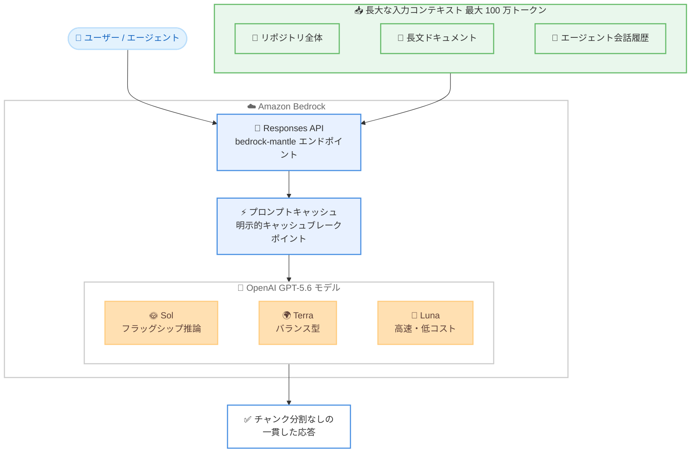

# Amazon Bedrock - OpenAI GPT-5.6 Sol / Terra / Luna が 100 万トークンのコンテキストウィンドウをサポート

**リリース日**: 2026 年 8 月 3 日
**サービス**: Amazon Bedrock
**機能**: OpenAI GPT-5.6 Sol、Terra、Luna の 100 万トークンコンテキストウィンドウ対応

📊 [このアップデートのインフォグラフィックを見る](https://takech9203.github.io/aws-news-summary/20260803-gpt-sol-terra-luna-long-context-bedrock.html)

## 概要

Amazon Bedrock 上の OpenAI GPT-5.6 Sol、Terra、Luna の 3 モデルが、100 万トークンのコンテキストウィンドウをサポートしました。これにより、コードベース全体、長文ドキュメント、マルチターンのエージェント履歴を 1 回のリクエストで処理できるようになります。モデルはより広いコンテキストを踏まえて推論できるため、チャンク分割や情報の欠落なしに、より正確で一貫性のある応答を返すことができます。

100 万トークンのコンテキストウィンドウを活用することで、コードレビューやマイグレーションのためにリポジトリ全体を一度に分析したり、法務・規制関連の長文ドキュメントを端から端まで処理したり、マルチステップのエージェンティックワークフローで会話履歴全体を維持したりすることが可能になります。また、明示的なキャッシュブレークポイントによるプロンプトキャッシュが長文コンテキストのリクエストにも適用されるため、繰り返し送信されるコンテキストはキャッシュ割引価格で課金されます。

GPT-5.6 は OpenAI の最新世代モデルファミリーで、2026 年 7 月に Amazon Bedrock で一般提供が開始されました。フラッグシップ推論モデルの Sol、日常的な本番ワークロード向けにバランスの取れた Terra、高速かつ低コストな Luna という 3 つの能力ティアで構成されており、今回のアップデートで長大なコンテキストを扱うユースケースへの適用範囲が大きく広がります。

**アップデート前の課題**

- 大規模なコードベースや長文ドキュメントは、コンテキストウィンドウに収まるようにチャンク分割して処理する必要があった
- チャンク分割により、ファイル間・セクション間の関連性が失われ、応答の正確性や一貫性が低下することがあった
- 長時間動作するエージェントでは、会話履歴やツール実行履歴を要約・削減する必要があり、情報の欠落が発生し得た

**アップデート後の改善**

- 100 万トークンのコンテキストウィンドウにより、リポジトリ全体や長文ドキュメントを 1 回のリクエストで処理できるようになった
- チャンク分割が不要になり、コンテキスト全体を踏まえた正確で一貫性のある応答が得られるようになった
- マルチステップのエージェンティックワークフローで、完全な会話履歴を維持したまま処理を継続できるようになった
- プロンプトキャッシュが長文コンテキストのリクエストにも適用され、繰り返し部分はキャッシュ割引で課金されるためコストを抑制できる

## アーキテクチャ図



リポジトリ全体や長文ドキュメントなどの大規模コンテキストを、チャンク分割せずに 1 回のリクエストで GPT-5.6 モデルに渡せるようになった構成を示しています。繰り返し送信されるコンテキストはプロンプトキャッシュにより割引価格で処理されます。

## サービスアップデートの詳細

### 主要機能

1. **100 万トークンのコンテキストウィンドウ**
   - GPT-5.6 Sol、Terra、Luna の 3 モデルすべてが対象
   - コードベース全体、長文ドキュメント、マルチターンのエージェント履歴を 1 回のリクエストで処理可能
   - チャンク分割や情報の欠落なしに、広いコンテキストに基づいた正確で一貫性のある応答を生成

2. **長文コンテキストへのプロンプトキャッシュ適用**
   - 明示的なキャッシュブレークポイントによるプロンプトキャッシュが、長文コンテキストのリクエストにも適用される
   - システム指示、ツール定義、参照ファイルなど繰り返し使用されるコンテキストは、キャッシュ割引価格で課金される
   - エージェンティックワークロードのように同じコンテキストを繰り返し送信するユースケースでコスト効率が向上

3. **Responses API による利用**
   - Amazon Bedrock コンソール、または bedrock-mantle エンドポイント上の Responses API から利用可能
   - GPT-5.6 ファミリーは Amazon Bedrock の次世代推論エンジン上で動作

## 技術仕様

### GPT-5.6 モデルファミリーの概要

| モデル | 位置付け | 主な用途 |
|------|------|------|
| GPT-5.6 Sol | フラッグシップ推論モデル | 自律型コーディングエージェント、脆弱性研究、多段階の深い推論を要するタスク |
| GPT-5.6 Terra | バランス型の本番ワークロード向けモデル | コード生成、コンテンツワークフロー、構造化データ抽出、汎用エージェントタスク |
| GPT-5.6 Luna | 高速・低コストモデル | 分類、要約、ルーティング、レイテンシとトークン単価が重要なリアルタイムアプリケーション |

### 今回のアップデート内容

| 項目 | 詳細 |
|------|------|
| コンテキストウィンドウ | 100 万トークン (Sol、Terra、Luna の 3 モデル) |
| プロンプトキャッシュ | 明示的キャッシュブレークポイント方式。長文コンテキストリクエストにも適用 |
| アクセス方法 | Amazon Bedrock コンソール、または bedrock-mantle エンドポイントの Responses API |

## 設定方法

### 前提条件

1. AWS アカウントを保有していること
2. 利用可能リージョン (米国東部または米国西部) で Amazon Bedrock へのアクセス権限があること
3. Amazon Bedrock で対象の OpenAI GPT-5.6 モデルへのアクセスが有効化されていること

### 手順

#### ステップ1: Amazon Bedrock コンソールでモデルを確認

Amazon Bedrock コンソールにアクセスし、GPT-5.6 Sol、Terra、Luna のモデルカードを確認します。モデルの詳細やサポートされるリージョンは、Amazon Bedrock ドキュメントの OpenAI モデルカードページで確認できます。

#### ステップ2: Responses API で長文コンテキストリクエストを送信

bedrock-mantle エンドポイント上の Responses API を使用して、最大 100 万トークンのコンテキストを含むリクエストを送信します。リポジトリ全体や長文ドキュメントをチャンク分割せずに入力として渡すことができます。

#### ステップ3: プロンプトキャッシュの活用

繰り返し使用するコンテキスト (システム指示、ツール定義、参照ファイルなど) に明示的なキャッシュブレークポイントを設定します。以降のリクエストで同じコンテキストが再利用され、キャッシュ割引価格で課金されます。

## メリット

### ビジネス面

- **開発効率の向上**: リポジトリ全体を一度に分析できるため、コードレビューやマイグレーションの作業を大幅に効率化できる
- **コスト最適化**: プロンプトキャッシュにより、繰り返し送信されるコンテキストの課金が割引され、長文コンテキスト利用時のコスト増加を抑制できる
- **ワークロードに応じたモデル選択**: Sol、Terra、Luna の 3 ティアから、性能とコストの要件に応じて最適なモデルを選択できる

### 技術面

- **チャンク分割の排除**: 分割処理のための前処理パイプラインが不要になり、アプリケーションの実装がシンプルになる
- **応答品質の向上**: コンテキスト全体を踏まえた推論により、ファイル間・セクション間の関連性を考慮した正確で一貫性のある応答が得られる
- **エージェント履歴の完全保持**: マルチステップのエージェンティックワークフローで、要約による情報欠落なしに完全な会話履歴を維持できる

## デメリット・制約事項

### 制限事項

- GPT-5.6 Sol は米国東部 (バージニア北部) と米国東部 (オハイオ) の 2 リージョンでのみ利用可能
- GPT-5.6 Terra と Luna は米国東部 (バージニア北部)、米国東部 (オハイオ)、米国西部 (オレゴン) の 3 リージョンでのみ利用可能
- 東京リージョンを含む日本のリージョンでは現時点で利用できない

### 考慮すべき点

- 長文コンテキストのリクエストは入力トークン数に応じて課金されるため、プロンプトキャッシュのキャッシュブレークポイントを適切に設計しないとコストが増大する可能性がある
- コンテキストウィンドウが大きくても、ユースケースによっては必要な部分のみを渡す設計の方がレイテンシやコストの面で有利な場合がある

## ユースケース

### ユースケース1: リポジトリ全体のコードレビューとマイグレーション

**シナリオ**: 大規模なレガシーコードベースを新しいフレームワークに移行する際、ファイル間の依存関係を含めた全体像を踏まえた分析が必要になる。

**実装例**:
```
1. リポジトリ全体のソースコードを 1 回のリクエストで GPT-5.6 Sol に入力
2. ファイル間の依存関係を含めた移行計画の立案を指示
3. モジュールごとの変更案と影響範囲の分析結果を取得
```

**効果**: チャンク分割では見落とされがちなファイル間の関連性を考慮した、精度の高いコードレビューと移行計画が得られる。

### ユースケース2: 法務・規制ドキュメントのエンドツーエンド処理

**シナリオ**: 数百ページに及ぶ契約書や規制文書を分析し、条項間の整合性チェックや要約を行う。

**実装例**:
```
1. 長文の法務ドキュメント全体を GPT-5.6 Terra に入力
2. 条項間の矛盾や参照関係を含めた分析を指示
3. ドキュメント全体を踏まえた要約とリスク項目の一覧を取得
```

**効果**: ドキュメントを分割せずに処理できるため、離れたセクション間の参照や整合性を正確に分析できる。

### ユースケース3: 長時間動作するエージェンティックワークフロー

**シナリオ**: 1 つのユーザーリクエストから数百のモデル呼び出しが発生するマルチステップのエージェントで、完全な実行履歴を維持しながら処理を進める。

**実装例**:
```
1. システム指示とツール定義にキャッシュブレークポイントを設定
2. エージェントの各ステップで会話履歴全体をコンテキストとして送信
3. 繰り返し部分はキャッシュ割引価格で課金され、履歴の要約・削減が不要になる
```

**効果**: 情報欠落のない完全な履歴に基づいてエージェントが判断できるため、長時間のワークフローでも一貫性のある動作を実現できる。

## 料金

Amazon Bedrock の GPT-5.6 モデルの利用料金は、入出力トークン数に基づく従量課金です。明示的なキャッシュブレークポイントによるプロンプトキャッシュが長文コンテキストリクエストにも適用され、繰り返し送信されるコンテキストはキャッシュ割引価格で課金されます。

最新の料金は [Amazon Bedrock 料金ページ](https://aws.amazon.com/bedrock/pricing/) を参照してください。

## 利用可能リージョン

- **GPT-5.6 Sol**: 米国東部 (バージニア北部)、米国東部 (オハイオ)
- **GPT-5.6 Terra / Luna**: 米国東部 (バージニア北部)、米国東部 (オハイオ)、米国西部 (オレゴン)

最新のリージョン対応状況は [Amazon Bedrock ドキュメントのモデルとリージョンの対応表](https://docs.aws.amazon.com/bedrock/latest/userguide/models-region-compatibility.html) を参照してください。

## 関連サービス・機能

- **Amazon Bedrock Responses API**: bedrock-mantle エンドポイントで提供される API。GPT-5.6 モデルへのアクセスに使用する
- **Amazon Bedrock プロンプトキャッシュ**: 明示的なキャッシュブレークポイントにより、繰り返し使用されるコンテキストを割引価格で処理する機能
- **AWS IAM / AWS CloudTrail**: Amazon Bedrock のモデル呼び出しは IAM ポリシーで制御され、CloudTrail にログとして記録される

## 参考リンク

- 📊 [インフォグラフィック](https://takech9203.github.io/aws-news-summary/20260803-gpt-sol-terra-luna-long-context-bedrock.html)
- [公式発表 (What's New)](https://aws.amazon.com/about-aws/whats-new/2026/08/gpt-sol-terra-luna-long-context-bedrock)
- [AWS Blog: OpenAI GPT-5.6 Sol, Terra, and Luna are now generally available on Amazon Bedrock](https://aws.amazon.com/blogs/machine-learning/openai-gpt-5-6-sol-terra-and-luna-are-now-generally-available-on-amazon-bedrock/)
- [ドキュメント: Amazon Bedrock OpenAI モデルカード](https://docs.aws.amazon.com/bedrock/latest/userguide/model-cards-openai.html)
- [ドキュメント: モデルとリージョンの対応表](https://docs.aws.amazon.com/bedrock/latest/userguide/models-region-compatibility.html)
- [料金ページ](https://aws.amazon.com/bedrock/pricing/)

## まとめ

Amazon Bedrock 上の OpenAI GPT-5.6 Sol、Terra、Luna が 100 万トークンのコンテキストウィンドウに対応し、リポジトリ全体の分析や長文ドキュメント処理、長時間のエージェンティックワークフローをチャンク分割なしで実現できるようになりました。プロンプトキャッシュが長文コンテキストにも適用されるため、コストを抑えながら大規模コンテキストを活用できます。長文処理やエージェント開発に取り組んでいる場合は、対象リージョンで Responses API からの利用を検討してください。
