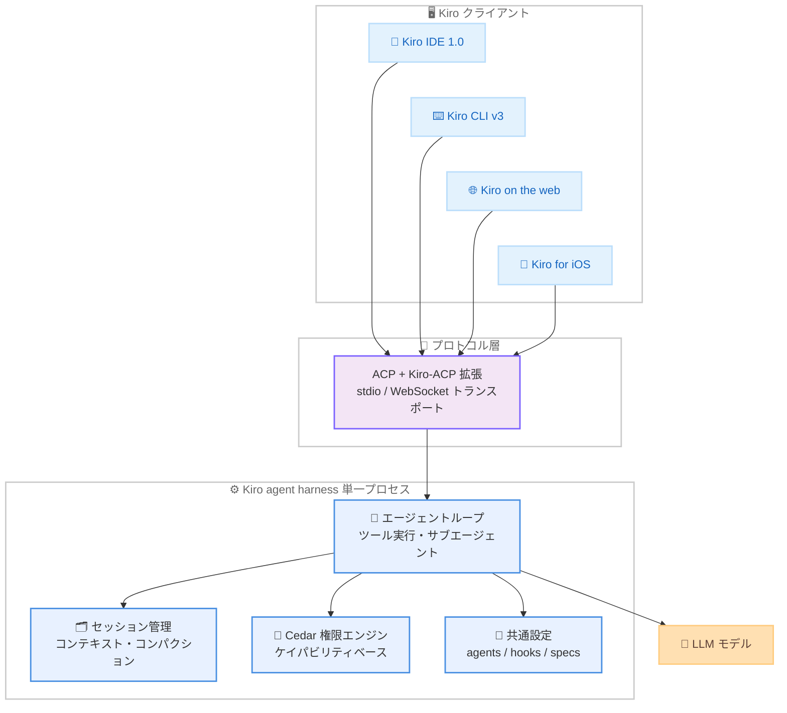

# Kiro - 統一エージェントハーネス「Kiro agent harness」の紹介

**リリース日**: 2026 年 8 月 3 日
**サービス**: Kiro (AWS の AI 搭載 IDE)
**機能**: Kiro agent harness (全クライアント共通の統一エージェント基盤)

📊 [このアップデートのインフォグラフィックを見る](https://takech9203.github.io/aws-news-summary/20260803-kiro-one-agent.html)

## 概要

Kiro チームは、IDE、CLI、Web、iOS の各クライアントで個別に実装されていたエージェントを、単一の「Kiro agent harness」に統合した経緯とアーキテクチャを解説する Blog 記事を公開しました。エージェントハーネスとは、エージェントループ、ツール実行、サブエージェント委譲、セッション管理、設定読み込み、モデルとの通信を管理するオーケストレーション層です。

Kiro が目指すのは、開発セッションがラップトップ、クラウドサンドボックス、スマートフォンの間を摩擦なく移動できる世界です。夜にラップトップを閉じてもセッションはクラウドで動き続け、翌朝 IDE で続きから再開できる、という体験を実現するには、どのクライアントでも同じように動作する単一のエージェントが必要でした。この統一ハーネスは既に Kiro IDE 1.0、Kiro CLI v3 (早期アクセス)、Kiro on the web (プレビュー)、Kiro for iOS (プレビュー) の全 4 クライアントで稼働しています。

**アップデート前の課題**

以前は IDE、CLI、Web の各クライアントが専用エージェントを個別に実装していました (IDE は TypeScript、CLI は Rust、Web は Python)。

- セッション形式、ツールセット、設定モデルがクライアントごとに異なり、あるクライアントで開始したセッションを別のクライアントに移動できなかった
- 権限システムの構文に互換性がなかった (CLI は正規表現ベースの allowedCommands / deniedCommands、IDE はプレフィックス一致の trustedCommands と部分文字列一致の denylist)
- 新機能を 3 回実装し、バグを 3 回修正する必要があり、実装コストが増大していた
- スペック駆動開発と powers は IDE のみ、プランモードとコードインテリジェンスは CLI のみ、と機能セットが分断されていた
- コンテキスト管理やコンパクション戦略がクライアントごとに異なり、セッションの挙動に差が生じていた

**アップデート後の改善**

- 単一のエージェントハーネスにより、全クライアントで同一のエージェント動作、セッション形式、設定モデルを実現
- スペック駆動開発が CLI (/spec new) と Web でも利用可能になり、カスタムエージェントとフックも全サーフェスで同じ形式で動作
- Cedar ベースのケイパビリティ単位の統一権限モデルにより、1 つのルールで全ツール横断のアクセス制御が可能に
- プロトコル境界に触れないハーネス側の変更 (新ツール追加、エージェントループ改善など) は、クライアント側の変更ゼロで全クライアントに即座に反映
- グローバルフックやポリシープリセットなどの新機能が、ハーネス更新のみで全クライアントに展開済み

## アーキテクチャ図

全クライアントが ACP (Agent Client Protocol) を介して単一の Kiro agent harness に接続する構成です。ハーネスはスタンドアロンプロセスとして動作し、ローカルのラップトップでもクラウドのサンドボックスでも同一のバイナリと挙動で実行されます。

## サービスアップデートの詳細

### 主要機能

1. **スタンドアロンサーバープロセスとしてのハーネス**
   - ハーネスはクライアントに組み込むライブラリではなく、独立したサーバープロセスとして実装
   - 共有ライブラリでは内部メソッドの直接呼び出しなどで実装が再び分岐するため、プロセス分離により境界を強制
   - クライアントとハーネスが言語やランタイムを共有する必要がなく、各クライアントはプラットフォームに適したスタックを維持可能
   - スタンドアロンプロセスのため、ラップトップでもクラウド VM でも同じハーネスが動作
   - クライアントは独自ツールを提供して組み込みツールを置き換え可能 (例: IDE は Code OSS の API を使った独自のファイル読み書きツールを使用)

2. **Agent Client Protocol (ACP) と Kiro-ACP 拡張**
   - クライアントとハーネスの境界プロトコルとして、2026 年 6 月に 1.0 に到達した標準仕様 ACP を採用
   - ACP は JetBrains IDE、Xcode、Zed などの IDE や、Obsidian、Emacs、Neovim などのエディタでもサポート
   - 標準の stdio トランスポートに加え、Web / iOS などのリモートクライアント向けに独自の WebSocket トランスポートを追加
   - ライブステアリング (エージェント動作中に次の推論ターンへメッセージを注入)、スペック駆動開発の専用メソッド、マルチスコープ権限、コンテキストウィンドウ使用量通知などを Kiro-ACP として拡張
   - 拡張は _kiro/ 名前空間に集約し、エージェント呼び出し可能メソッド 20 以上、クライアント呼び出し可能メソッド 15、通知タイプ 20 を追加
   - サードパーティの ACP 互換クライアントも、ツール、サブエージェント、セッション管理、MCP 接続を含む完全なエージェントを利用可能

3. **全サーフェスで利用可能になった機能**
   - スペック駆動開発: 従来 IDE 専用だった機能が CLI (/spec new) と Web でも利用可能に。Web ではインラインレビューとマルチユーザーコラボレーションに対応
   - カスタムエージェント: 全サーフェス共通の .kiro/agents/ Markdown 形式。説明、システムプロンプト、タグベースのツール選択 (read、write、shell など)、サブエージェント、インライン MCP サーバー定義、インライン権限ルールを定義可能
   - フック: 共通の .kiro/hooks/*.json 形式で、SessionStart、PreToolUse、PostToolUse、FileCreate、FileSave の同一トリガーが全クライアントで動作
   - コンテキスト管理、コンパクション、要約も単一実装となり、クライアントを問わず一貫した挙動を実現

4. **Cedar ベースの統一権限モデル**
   - 形式検証されたポリシー言語 Cedar を基盤とする、ケイパビリティベースの単一権限モデルを導入
   - fs_read、fs_write、shell、web_fetch、mcp、subagent などのケイパビリティでツールを機能単位にグループ化
   - fs_read への deny は、ファイルを読み取るすべてのツール (read_file、grep_search、file_search、将来の read 系ツール) を個別列挙なしで一括ブロック
   - ポリシーは複数スコープ (MDM による企業管理、ユーザー、ワークスペース、エージェントプロファイル、セッション) で合成され、deny 優先のセマンティクスでマージ
   - エージェントが自身の権限ファイルを変更できないなど、Kiro 自体が不変のセキュリティ不変条件を強制
   - 事前設定は不要で、作業中の同意判断が蓄積され、任意のスコープに永続化可能

5. **ハーネス更新のみで展開された新機能**
   - グローバルフック: ~/.kiro/hooks/ に一度定義すれば全ワークスペースで自動的に発火 (保存時 lint、コミット前セキュリティチェックなど)
   - ポリシープリセット: edit-workspace、dev-shell、read-all などの合成可能な名前付きルールセットで、承認プロンプトの疲労を軽減
   - ライブカスタムエージェントリロード: セッション中に .kiro/agents/ のファイルを編集すると即座に反映
   - いずれもクライアント側の変更ゼロで全クライアントに展開

## 技術仕様

### 統一前後の比較

| 項目 | 統一前 | 統一後 |
|------|--------|--------|
| エージェント実装 | クライアントごとに 3 実装 (TypeScript / Rust / Python) | 単一の Kiro agent harness |
| セッション形式 | クライアントごとに異なる | 共通形式 |
| 権限システム | CLI は正規表現、IDE はプレフィックス一致で非互換 | Cedar ベースのケイパビリティモデル |
| スペック駆動開発 | IDE のみ | IDE / CLI / Web |
| カスタムエージェント | クライアントごとに挙動が異なる | .kiro/agents/ 共通 Markdown 形式 |
| フック | クライアントごとに異なる | .kiro/hooks/*.json 共通形式 |
| プロトコル | クライアントごとに独自 | ACP + Kiro-ACP 拡張 |
| トランスポート | - | stdio (ローカル) / WebSocket (リモート) |

### 各クライアントの提供状況

| クライアント | 状態 | 主な内容 |
|--------------|------|----------|
| Kiro IDE 1.0 | 提供中 | ケイパビリティベース権限、タグベースツールとインライン MCP 対応のカスタムエージェント、エージェントフォーカスモード、ドッキング可能なチャットタブ、セッションエクスポート |
| Kiro CLI v3 | 早期アクセス | 統一ハーネス、スペック駆動開発、permissions.yaml、強化されたフック、新エージェント設定形式。`kiro-cli --v3` で利用 |
| Kiro on the web | プレビュー | クラウドサンドボックスでの自律開発、ブラウザでのスペック、マルチリポジトリセッション、GitHub / GitLab 連携 |
| Kiro for iOS | プレビュー | Web と同じクラウドセッションに接続し、自律作業の開始、差分レビュー、変更承認が可能 |

## メリット

### ビジネス面

- **機能提供の高速化**: 新機能を一度実装すれば全クライアントに展開されるため、3 重実装のコストが解消され、新しい能力がより早くユーザーに届く
- **一貫したユーザー体験**: どのサーフェスを使っても同じエージェント挙動と同じ設定が使えるため、クライアント間の学習コストや挙動差による混乱が減少
- **チームでの設定共有**: カスタムエージェントやフックの設定をバージョン管理にコミットすれば、チームメンバー全員が全クライアントで同じ構成を利用可能

### 技術面

- **プロセス分離による堅牢な境界**: ライブラリ共有と異なり、スタンドアロンプロセスと定義済みプロトコルにより実装の再分岐を構造的に防止
- **標準プロトコル採用による相互運用性**: ACP 準拠により、Zed、JetBrains IDE、Neovim などのサードパーティクライアントからも同じエージェントを利用可能
- **ケイパビリティベースのセキュリティ**: 形式検証済みの Cedar により、ツール単位ではなく操作の種類単位で意図を表現でき、ツールの追加漏れによるアクセス制御の抜けを防止
- **信頼性改善の一括適用**: モデル推論リクエストのリトライロジック改善、権限評価の高速化、MCP サーバー接続の耐障害性向上などが全クライアントに同時に反映

## デメリット・制約事項

### 制限事項

- Kiro CLI v3 は早期アクセス、Kiro on the web と Kiro for iOS はプレビュー段階
- セッションを環境間で移動するためのセッションパッケージングや、任意のクライアントからローカル / クラウド両方のセッションを制御する機能は、まだ構築予定の段階
- 一部の機能はハーネス側の新機能に加えてクライアント側の対応作業も必要

### 考慮すべき点

- IDE 1.0 および CLI v3 への移行にはそれぞれ移行手順があり、公式の移行ドキュメントの確認が必要
- 権限設定の形式が従来の allowedCommands / trustedCommands などから新しいケイパビリティベースのモデルに変わるため、既存設定の見直しが必要

## ユースケース

### ユースケース 1: サーフェスをまたいだ継続的な開発セッション

**シナリオ**: 日中は IDE で作業し、退勤後はクラウドで自律実行を継続、移動中はスマートフォンから進捗を確認したい。

**実装例**: Kiro on the web でクラウドサンドボックス上のセッションを開始し、Kiro for iOS から同じセッションに接続して差分レビューや変更承認を実施する。

**効果**: ラップトップを開かなくても自律的な開発作業の開始・レビュー・承認が可能になり、開発の連続性が向上する。

### ユースケース 2: チーム共通のカスタムエージェント運用

**シナリオ**: コードレビュー専用エージェントなど、チームで統一したエージェント構成を全メンバーの全クライアントで使いたい。

**実装例**: `.kiro/agents/` に説明、システムプロンプト、タグベースのツール選択 (read、write、shell)、インライン MCP 定義、権限ルールを記述した Markdown ファイルを作成し、リポジトリにコミットする。

**効果**: チームメンバー全員が IDE、CLI、Web のいずれでも同じエージェント構成を利用でき、挙動の一貫性が保たれる。

### ユースケース 3: 組織的なセキュリティポリシーの一元管理

**シナリオ**: 企業として、機密ファイルへのアクセス禁止などのガードレールを全開発者の全クライアントに強制したい。

**実装例**: 管理者が MDM 経由で制限を配布し、fs_read などのケイパビリティ単位の deny ルールを設定する。ユーザーはその範囲内でユーザー / ワークスペースレベルの独自ルールや policies: [dev-shell, edit-workspace] のようなプリセットを追加する。

**効果**: deny 優先のマージセマンティクスにより組織のガードレールが確実に適用され、個別ツールの列挙漏れによる抜け穴も防げる。

## 利用可能リージョン

グローバル (Kiro はリージョンに依存しないサービスとして提供)

## 関連サービス・機能

- **Agent Client Protocol (ACP)**: クライアントとエージェント間通信の標準仕様。Kiro はこれを拡張した Kiro-ACP を全クライアントの境界プロトコルとして採用
- **Cedar**: AWS が開発した形式検証済みのポリシー言語。Kiro の新しいケイパビリティベース権限モデルの基盤
- **Model Context Protocol (MCP)**: カスタムエージェント定義内でインライン MCP サーバーを設定可能で、ハーネスが MCP 接続の耐障害性を管理

## 参考リンク

- 📊 [インフォグラフィック](https://takech9203.github.io/aws-news-summary/20260803-kiro-one-agent.html)
- [Kiro Blog: One agent, every surface: how we built the Kiro agent harness](https://kiro.dev/blog/one-agent/)
- [Kiro Changelog](https://kiro.dev/changelog/)
- [Kiro 公式サイト](https://kiro.dev/)

## まとめ

このアップデートは、Kiro の IDE / CLI / Web / iOS で分かれていたエージェント実装を単一の Kiro agent harness に統合し、全サーフェスで一貫したエージェント体験を実現するアーキテクチャ刷新です。スペック駆動開発やカスタムエージェント、Cedar ベースの権限モデルが全クライアント共通になったため、Kiro ユーザーは IDE 1.0 や CLI v3 (`kiro-cli --v3`) への移行を検討し、`.kiro/agents/` や `.kiro/hooks/` によるチーム共通設定の整備を進めることを推奨します。
