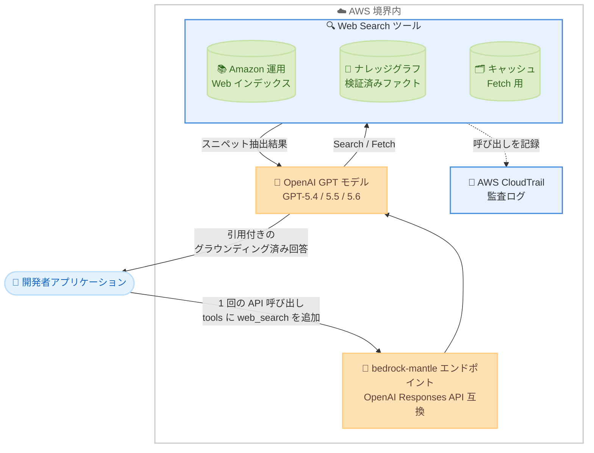

# Amazon Bedrock - Web Search for OpenAI GPT models

**リリース日**: 2026 年 8 月 4 日
**サービス**: Amazon Bedrock
**機能**: Web Search on Amazon Bedrock

📊 [このアップデートのインフォグラフィックを見る](https://takech9203.github.io/aws-news-summary/20260804-amazon-bedrock-web.html)

## 概要

Amazon Bedrock で Web Search の一般提供が開始されました。Web Search は AWS 内で完結するサーバーサイドのビルトインツールで、OpenAI モデル (GPT-5.4、GPT-5.5、GPT-5.6 Sol/Terra/Luna) が最新の Web 知識に基づいて回答を生成 (グラウンディング) できるようにします。デフォルトではデータは AWS 境界内に留まり、データの外部流出 (データエグレス) はゼロで、データレジデンシーを維持したまま利用できます。

Web Search は Amazon が構築・運用しており、Alexa+、Amazon Quick、Kiro での長年の経験に基づいています。数百億のドキュメントを継続的に更新する Amazon 運用の Web インデックスと、検証済みファクトを提供するビルトインのナレッジグラフを組み合わせています。生のページを返すのではなく、セマンティックスニペット抽出により、モデルのコンテキストウィンドウに最適化されたコンテキスト効率の高い結果を低レイテンシで提供します。OpenAI Responses API と互換性のある標準化されたツール利用インターフェースを通じて統合され、API 呼び出しに Web Search ツールを追加するだけで、Bedrock が検索ライフサイクル全体をサーバーサイドで処理し、1 回の API 呼び出しで引用付きのグラウンディングされた回答を返します。

なお、AWS New York Summit 2026 で発表された AgentCore の Web Search に続き、今回 Amazon Bedrock のモデル推論にも拡張された形となります。

**アップデート前の課題**

- Web グラウンディングを追加するには、サードパーティの検索プロバイダーのオンボーディングが必要だった
- 別途 API キーと請求の管理、カスタムオーケストレーションの構築が必要だった
- 外部ベンダーごとに追加のコンプライアンスレビューを実施する必要があった
- 検索クエリが外部プロバイダーに送信されるため、データレジデンシーのリスクがあった

**アップデート後の改善**

- 既存の API 呼び出しにパラメーターを 1 つ追加するだけでグラウンディングを有効化できるようになった
- ベンダーオンボーディング、外部 API のオーケストレーション、追加のベンダーセキュリティレビューが不要になった
- デフォルトでデータが AWS 境界内に留まり、データエグレスゼロでコンプライアンス要件に対応しやすくなった
- 引用 (citation) 付きの回答が 1 回の API 呼び出しで得られるようになった

## アーキテクチャ図



Web Search を有効にすると、モデルが最新情報の要否を判断し、AWS 境界内の Web インデックスとナレッジグラフに対して Search / Fetch を実行します。検索ライフサイクル全体がサーバーサイドで完結し、1 回の API 呼び出しで引用付きの回答が返されます。

## サービスアップデートの詳細

### 主要機能

1. **マルチソースグラウンディング**
   - 数百億のドキュメントを継続的に更新する Amazon 運用の Web インデックスを利用
   - ビルトインのナレッジグラフがエンティティとその関係を保持し、事実に関する質問には高い確度で回答
   - モデルがページ断片から推測することによる細かな事実誤りを削減

2. **コンテキスト効率の高い検索**
   - 生のページではなく、クエリに関連する箇所を抽出するセマンティックスニペット抽出を実行
   - モデルのコンテキストウィンドウに最適化された形式で結果を返却し、ボイラープレートへのトークン消費を削減
   - 検索は高速で、グラウンディングされた回答を低レイテンシで提供

3. **単一パラメーターでの有効化**
   - OpenAI Responses API 互換の API 呼び出しの `tools` 配列に `web_search` タイプのツールを追加するだけで有効化
   - ベンダーオンボーディング、API キー、オーケストレーションレイヤー、別 SDK が不要
   - モデルは最新情報が必要と判断した場合のみツールを使用し、必要に応じて同一ターン内でクエリを再構成して再検索

4. **Search と Fetch の 2 つのオペレーション**
   - Search: Amazon Bedrock の Web インデックスとナレッジグラフからタイトル、URL、スニペットを返却
   - Fetch: 特定 URL のキャッシュ済みページコンテンツを Amazon Bedrock のキャッシュから取得
   - デフォルトでは両オペレーションともライブ Web への到達ではなく、AWS サービス境界内のインデックスとキャッシュから提供

5. **エンタープライズグレードのデータガバナンス**
   - デフォルトでデータエグレスゼロ。リクエストデータは検索のために AWS 境界を離れない
   - `external_web_access` パラメーターと IAM 権限 `bedrock-websearch:ExternalWebAccess` の 2 つの制御で外部 Web アクセスを管理
   - 処理は厳密にリージョン内で完結し、クエリ、フェッチ、インデックスデータ、結果はリージョン間でルーティングされない

6. **引用 (Citation) 付きレスポンス**
   - 回答テキストに `url_citation` アノテーションが付与され、ソースのタイトル、URL、回答内の文字位置 (start_index / end_index) を含む
   - ストリーミングでは `response.output_text.annotation.added` イベントとして引用が到着
   - 利用規約上、エンドユーザーへの出力ではソースの引用とリンクを保持・表示する必要がある

## 技術仕様

### 主要仕様

| 項目 | 詳細 |
|------|------|
| 対応モデル | openai.gpt-5.4、openai.gpt-5.5、openai.gpt-5.6 (luna、terra、sol) |
| エンドポイント | bedrock-mantle エンドポイント (例: `https://bedrock-mantle.{region}.api.aws/openai/v1`) |
| API | OpenAI Responses API 互換 |
| 有効化方法 | `tools` 配列に `{"type": "web_search"}` を追加 |
| 外部 Web アクセス制御 | `external_web_access` パラメーター (デフォルト: true) + `bedrock-websearch:ExternalWebAccess` IAM 権限 |
| IAM サービスプレフィックス | `bedrock-websearch` |
| 認証 | AWS 認証情報から生成する短期ベアラートークン (aws-bedrock-token-generator、最長 12 時間) |
| 監査 | AWS CloudTrail に呼び出しを記録 (クエリテキスト、返却 URL、ページコンテンツは記録されない) |

### IAM 権限

| アクション | 用途 |
|-----------|------|
| `bedrock-websearch:InvokeSearch` | Web Search の実行 (最低限必要) |
| `bedrock-websearch:InvokeFetch` | 検索結果のページコンテンツ全文の取得 |
| `bedrock-websearch:ExternalWebAccess` | 外部 Web アクセスの許可 (`AmazonBedrockFullAccess` には含まれない) |

`external_web_access` はデフォルトで `true` のため、`ExternalWebAccess` 権限を持たない ID からのリクエストでは認可チェックで 403 AccessDenied となります。ただしリクエスト自体は失敗せず、モデルは Search とキャッシュ済み Fetch に基づいて回答し、外部 Web アクセスができなかった旨を報告します。このエラーを避けるには `"external_web_access": false` を明示的に設定します。なお現時点では、この権限を付与しても検索は Amazon Bedrock の Web インデックスとキャッシュからのみ提供され、ライブ Web からの取得は将来のリリースで有効化される予定です。

### コード例

```python
from openai import OpenAI
from aws_bedrock_token_generator import provide_token

REGION = "us-east-1"

client = OpenAI(
    base_url=f"https://bedrock-mantle.{REGION}.api.aws/openai/v1",
    api_key=provide_token(region=REGION),
)

response = client.responses.create(
    model="openai.gpt-5.5",
    input="What are the most significant AWS launches announced this month?",
    tools=[{"type": "web_search", "external_web_access": False}],
)

print(response.output_text)

# 引用の取得
for item in response.output:
    if item.type == "message":
        for block in item.content:
            if block.type == "output_text":
                for ann in block.annotations:
                    if ann.type == "url_citation":
                        print(f"- {ann.title}: {ann.url}")
```

## 設定方法

### 前提条件

1. Amazon Bedrock の推論権限 (`AmazonBedrockMantleInferenceAccess` マネージドポリシー、または必要な推論アクション)
2. Web Search ツール権限 (最低限 `bedrock-websearch:InvokeSearch`、必要に応じて `bedrock-websearch:InvokeFetch`)
3. 標準の認証情報チェーン (IAM ロール、AWS CLI プロファイル、環境変数) で AWS 認証情報が利用可能なこと

### 手順

#### ステップ 1: 環境変数の設定

```bash
export OPENAI_API_KEY="your-amazon-bedrock-api-key"
export OPENAI_BASE_URL="https://bedrock-mantle.us-west-2.api.aws/openai/v1"
```

OpenAI クライアントの接続先を bedrock-mantle エンドポイントに設定し、AWS 認証情報から生成したベアラートークンを API キーとして設定しています。トークンは `aws-bedrock-token-generator` パッケージで既存の AWS IAM アイデンティティから SigV4 経由で生成できます。

#### ステップ 2: Web Search ツールを追加してリクエスト

```bash
curl "https://bedrock-mantle.us-west-2.api.aws/openai/v1/responses" \
  -H "Authorization: Bearer $OPENAI_API_KEY" \
  -H "Content-Type: application/json" \
  -d '{
    "model": "openai.gpt-5.5",
    "input": "Summarize recent guidance on AWS Lambda cold starts.",
    "tools": [{"type": "web_search", "external_web_access": false}]
  }'
```

Responses API のリクエストの `tools` 配列に `web_search` タイプのツールを追加して送信しています。`external_web_access` を `false` に設定しているため、追加の IAM 権限なしで AWS 境界内のインデックスとキャッシュのみから検索が実行されます。

#### ステップ 3: 引用付きレスポンスの確認

レスポンスの `output[].content[].annotations[]` に含まれる `url_citation` アノテーションから、各引用のタイトル、URL、回答内の文字範囲を取得します。エンドユーザー向けの出力では、これらのソース引用とリンクを保持・表示する必要があります。

## メリット

### ビジネス面

- **ベンダー管理の排除**: サードパーティ検索プロバイダーのオンボーディング、契約、個別の請求管理が不要になり、プロジェクトの立ち上げが迅速化
- **コンプライアンス対応の簡素化**: 外部ベンダーごとのセキュリティレビューが不要。デフォルトでデータエグレスゼロのため、データレジデンシー要件への対応が容易
- **ハルシネーションの削減**: 最新の Web 知識と検証済みファクトに基づく引用付き回答により、生成 AI アプリケーションの信頼性が向上

### 技術面

- **実装の大幅な簡素化**: クライアントサイドのツール利用ループ、外部 API レスポンスのパース、リトライやレート制限の管理が不要。1 回の API 呼び出しで完結
- **コンテキスト効率**: セマンティックスニペット抽出により関連箇所のみがモデルに渡され、トークン消費を抑制しつつ低レイテンシを実現
- **監査可能性**: CloudTrail 統合により、誰がいつどこからツールを呼び出したかを監査可能。クエリテキストは推論プロンプトと同様に扱われ、ログに記録されない

## デメリット・制約事項

### 制限事項

- 対応モデルは bedrock-mantle エンドポイント経由の OpenAI GPT モデル (GPT-5.4、GPT-5.5、GPT-5.6 Luna/Terra/Sol) のみで、Responses API の利用が前提
- 利用可能リージョンは米国 3 リージョン (us-east-1、us-east-2、us-west-2) のみ
- 現時点ではライブ Web からのリアルタイム取得は提供されず、Amazon Bedrock の Web インデックスとキャッシュからの取得のみ (ライブ Web 取得は将来のリリースで有効化予定)
- Fetch でキャッシュに結果がない場合、モデルはその旨を通知するか、手持ちの最良の情報に基づいて回答を構成する

### 考慮すべき点

- `external_web_access` のデフォルトは `true` のため、`ExternalWebAccess` 権限がない環境では明示的に `false` を設定しないと認可エラー (403) がログに記録される
- 検索結果を大量に抽出・保存・複製すること、競合するインデックスやデータベースの構築は利用規約で禁止されている
- エンドユーザーに提示する出力では、ソースの引用とリンクを保持・表示する義務がある
- 利用モデルによっては Amazon Bedrock の自動不正利用検出メカニズムの対象となる

## ユースケース

### ユースケース 1: 最新情報に対応したエンタープライズチャットボット

**シナリオ**: 社内外向けチャットボットで、直近の製品リリース、価格、規制変更など、モデルの学習データに含まれない最新情報への回答が必要。ただしコンプライアンス上、ユーザーのクエリを外部ベンダーに送信できない。

**実装例**:
```python
response = client.responses.create(
    model="openai.gpt-5.5",
    input="最新の規制変更の概要を教えてください",
    tools=[{"type": "web_search", "external_web_access": False}],
)
```

**効果**: データを AWS 境界内に保ったまま最新の Web 知識に基づく回答を提供でき、外部ベンダーのセキュリティレビューなしでコンプライアンス要件を満たせる。

### ユースケース 2: 引用付き回答が必要なリサーチアシスタント

**シナリオ**: 金融や法務などの領域で、回答の根拠となるソースを明示する必要があるリサーチ支援アプリケーションを構築する。

**実装例**:
```python
for item in response.output:
    if item.type == "message":
        for block in item.content:
            if block.type == "output_text":
                for ann in block.annotations:
                    if ann.type == "url_citation":
                        render_footnote(ann.title, ann.url,
                                        ann.start_index, ann.end_index)
```

**効果**: `url_citation` の文字オフセットを利用して、回答の該当箇所にインライン脚注やハイライトを表示でき、回答の検証可能性が向上する。

### ユースケース 3: 開発者向けコーディングアシスタント

**シナリオ**: 新しいライブラリバージョンのドキュメントやニッチな API、特定の設定値など、モデルの知識が薄い、または古い領域について正確な回答が必要なコーディングアシスタントや CLI ツールを提供する。

**実装例**:
```python
response = client.responses.create(
    model="openai.gpt-5.4",
    input="Summarize recent guidance on AWS Lambda cold starts.",
    tools=[{"type": "web_search", "external_web_access": False}],
)
```

**効果**: モデルが必要と判断した場合のみ検索が実行され、検索結果が不十分な場合は学習データで穴埋めせずその旨を報告するため、不正確な情報の提示を回避できる。

## 料金

Web Search の料金は Amazon Bedrock の料金ページに記載されています。詳細は [Amazon Bedrock 料金ページ](https://aws.amazon.com/bedrock/pricing/) を参照してください。

## 利用可能リージョン

以下の 3 リージョンで一般提供されています。クエリの処理は厳密にリージョン内で完結し、リージョン間でルーティングされません。

| リージョン | リージョンコード |
|-----------|-----------------|
| 米国東部 (バージニア北部) | us-east-1 |
| 米国東部 (オハイオ) | us-east-2 |
| 米国西部 (オレゴン) | us-west-2 |

## 関連サービス・機能

- **Amazon Bedrock AgentCore**: AWS New York Summit 2026 で Web Search on AgentCore が一般提供開始済み。今回のアップデートで Bedrock のモデル推論にも拡張された
- **AWS IAM**: `bedrock-websearch` プレフィックスのアクションで Search / Fetch / 外部 Web アクセスをポリシーレベルで制御
- **AWS CloudTrail**: Web Search の呼び出しを記録し、監査を実現。クエリテキストや取得コンテンツは記録されない

## 参考リンク

- 📊 [インフォグラフィック](https://takech9203.github.io/aws-news-summary/20260804-amazon-bedrock-web.html)
- [公式発表 (What's New)](https://aws.amazon.com/about-aws/whats-new/2026/08/amazon-bedrock-web/)
- [AWS Blog: Introducing Web Search on Amazon Bedrock for foundation model grounding](https://aws.amazon.com/blogs/machine-learning/introducing-web-search-on-amazon-bedrock-for-foundation-model-grounding/)
- [ドキュメント: Web Search - Amazon Bedrock User Guide](https://docs.aws.amazon.com/bedrock/latest/userguide/web-search.html)
- [料金ページ](https://aws.amazon.com/bedrock/pricing/)

## まとめ

Web Search on Amazon Bedrock は、これまでサードパーティベンダーの統合が必要だった Web グラウンディングを、API パラメーター 1 つで有効化できるビルトイン機能として提供する重要なアップデートです。データエグレスゼロのデフォルト設計と CloudTrail 統合により、エンタープライズのコンプライアンス要件を満たしながら最新情報に基づく引用付き回答を実現できます。米国リージョンで OpenAI GPT モデルを利用中の場合は、`bedrock-websearch:InvokeSearch` 権限を付与し、`external_web_access: false` を設定した小規模な検証から始めることを推奨します。
