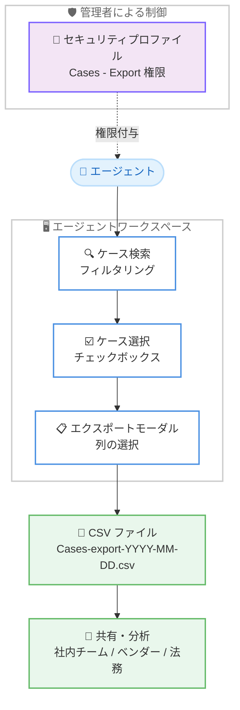

# Amazon Connect Customer - エージェントワークスペースからのケース CSV エクスポート

**リリース日**: 2026 年 8 月 4 日
**サービス**: Amazon Connect Customer (Cases)
**機能**: エージェントワークスペースからのケース CSV エクスポート

📊 [このアップデートのインフォグラフィックを見る](https://takech9203.github.io/aws-news-summary/20260804-amazon-connect-export-cases.html)

## 概要

Amazon Connect Customer は、エージェントワークスペースから直接ケースを CSV ファイルにエクスポートする機能をサポートしました。エージェントはケース検索画面でケースをフィルタリング・選択し、エクスポートに含めるケースフィールド (列) を選んで CSV ファイルとしてダウンロードできます。

エクスポートされた CSV ファイルは Microsoft Excel や Google Sheets などのスプレッドシートアプリケーションでの利用を想定したフォーマットになっており、社内チームへのレポート共有や、ベンダー、法務チーム、ビジネスパートナーといった外部ステークホルダーとのケースデータ共有、オフライン分析に活用できます。また、管理者はセキュリティプロファイルの権限 (Cases - Export) によってエクスポート機能へのアクセスを制御できます。

**アップデート前の課題**

- エージェントワークスペースの検索結果からケースデータを CSV として直接取り出す標準機能がなかった
- ベンダーや法務チームなど外部ステークホルダーとケースデータを共有するには、手動での転記や別の仕組みが必要だった
- ケースデータのレポート作成やオフライン分析のための手軽な手段が限られていた

**アップデート後の改善**

- エージェントがケース検索画面から複数のケースを選択し、ワンクリックで CSV ファイルとしてエクスポートできるようになった
- エクスポートに含めるケースフィールドを選択でき、目的に応じた列構成でデータを出力できるようになった
- 管理者はセキュリティプロファイルの権限でエクスポート機能の利用可否を制御できるようになった

## アーキテクチャ図



エージェントはケース検索画面でケースを選択し、エクスポートする列を指定して CSV をダウンロードします。エクスポート機能へのアクセスはセキュリティプロファイルの権限で制御されます。

## サービスアップデートの詳細

### 主要機能

1. **ケース検索結果からの CSV エクスポート**
   - エージェントワークスペースのケース検索画面で、検索フィルターを使って対象ケースを絞り込み
   - 検索結果テーブルのチェックボックスで 1 件以上のケースを選択
   - [Export] ボタンを選択するとエクスポートモーダルが開き、選択したケース数が表示される

2. **エクスポートする列の選択**
   - デフォルトでは検索結果テーブルに現在表示されている列がすべて事前選択される
   - [Columns to export] のマルチセレクトドロップダウンでフィールドの追加・削除が可能 (入力によるフィルタリングにも対応)
   - 少なくとも 1 つの列を選択する必要があり、列が未選択の場合 [Export] ボタンは無効になる

3. **セキュリティプロファイルによるアクセス制御**
   - エクスポートには、エージェントのセキュリティプロファイルに「Cases - Export」権限が必要
   - 権限がない場合、ケース検索画面に [Export] ボタンは表示されない
   - Export 権限を有効にすると、Cases の View 権限が未付与の場合は自動的に付与される

4. **即時ダウンロードと結果通知**
   - [Export] を選択すると、CSV ファイルがブラウザのデフォルトダウンロードフォルダに即時ダウンロードされる
   - 成功時はファイル名を表示する成功バナー、失敗時はエラーバナーが表示され、再度 [Export] で再試行できる

## 技術仕様

### CSV ファイル形式

| 項目 | 詳細 |
|------|------|
| ファイル名 | `Cases-export-YYYY-MM-DD.csv` (日付はエクスポート開始日) |
| エンコーディング | UTF-8 (BOM 付き)。スプレッドシートアプリケーションで文字化けせずに開ける |
| ヘッダー | 1 行目に選択した各フィールドの表示名を列ヘッダーとして出力 |
| 列の順序 | 検索結果テーブルに表示されている順序と同じ |
| 空の値 | 値がないフィールドは空セルとして出力 |

### フィールドタイプごとのフォーマット

エクスポートはすべてのケースフィールドタイプをサポートします。

| フィールドタイプ | CSV での表示 |
|------|------|
| テキスト | そのまま出力 |
| 数値 | エージェントのロケール設定に従ってフォーマット |
| 日付/時刻 | エージェントのロケールに基づく medium 日付スタイルと short 時刻スタイル |
| ブール値 | `True` または `False` |
| 単一選択 | 内部値ではなく選択肢の表示名 |
| ユーザー | ユーザーの表示名に解決して出力 |
| キュー | キューの表示名 |
| タグ | すべてのタグをカンマで結合 |

## 設定方法

### 前提条件

1. Amazon Connect インスタンスで Cases (Connect Customer Cases) を利用していること
2. エージェントのセキュリティプロファイルに「Cases - Export」権限が付与されていること

### 手順

#### ステップ 1: セキュリティプロファイルで Export 権限を付与

管理者は Amazon Connect の管理画面でエージェントのセキュリティプロファイルを編集し、Cases の「Export」権限を有効にします。Export を有効にすると、Cases の「View」権限が未付与の場合は自動的に付与されます。

#### ステップ 2: ケースを検索・選択

エージェントワークスペースでケース検索画面に移動し、検索フィルターでエクスポートしたいケースを絞り込みます。検索結果テーブルのチェックボックスで 1 件以上のケースを選択します。

#### ステップ 3: 列を選択してエクスポート

[Export] ボタンを選択してエクスポートモーダルを開きます。デフォルトでは表示中の列が事前選択されているため、必要に応じてドロップダウンでフィールドを追加・削除し、[Export] を選択します。CSV ファイルがブラウザのダウンロードフォルダに即時ダウンロードされ、成功バナーにファイル名が表示されます。

## メリット

### ビジネス面

- **ステークホルダーとの共有の効率化**: ベンダー、法務チーム、ビジネスパートナーなど外部ステークホルダーへのケースデータ共有が容易になる
- **レポート作成の簡素化**: Excel や Google Sheets でそのまま扱える形式で出力されるため、レポート作成の手間を削減できる
- **オフライン分析の実現**: ケースデータを CSV として取り出し、スプレッドシート上で自由に分析できる

### 技術面

- **権限による統制**: セキュリティプロファイルの「Cases - Export」権限により、エクスポート機能の利用可否を組織のポリシーに沿って制御できる
- **ロケール対応のフォーマット**: 数値や日付/時刻はエージェントのロケール設定に従ってフォーマットされ、そのまま読みやすい形で出力される
- **表示名での出力**: 単一選択、ユーザー、キューなどのフィールドは内部値ではなく表示名で出力されるため、後処理なしで利用できる

## デメリット・制約事項

### 制限事項

- エクスポートには少なくとも 1 つの列の選択が必要 (未選択の場合 [Export] ボタンは無効)
- 「Cases - Export」権限がないエージェントには [Export] ボタン自体が表示されない
- ダウンロード先はブラウザのデフォルトダウンロードフォルダに固定される

### 考慮すべき点

- ケースデータには顧客情報が含まれる可能性があるため、Export 権限の付与対象は組織のデータ取り扱いポリシーに沿って慎重に検討する必要がある
- Export 権限を有効にすると Cases の View 権限が自動付与される点に注意が必要
- 日付/時刻や数値はエージェントのロケールに依存してフォーマットされるため、複数ロケールのエージェントが出力したファイルを統合する場合は表記の違いに留意する

## ユースケース

### ユースケース 1: 外部ベンダーへのエスカレーション連携

**シナリオ**: 製品の不具合に関するケースを、修理を担当する外部ベンダーに一括で連携したい。

**実装例**:
```
1. ケース検索で「製品カテゴリ = ハードウェア」「ステータス = エスカレーション待ち」でフィルタリング
2. 該当ケースをすべて選択
3. ケース ID、タイトル、顧客名、症状などベンダーに必要な列のみ選択してエクスポート
4. CSV をベンダーに共有
```

**効果**: 手動転記なしで必要な情報のみを正確に共有でき、エスカレーションのリードタイムを短縮できる。

### ユースケース 2: 法務チーム向けのケース記録提出

**シナリオ**: 特定の顧客に関する対応履歴を、法務チームのレビュー用に提出する必要がある。

**実装例**:
```
1. ケース検索で対象顧客のケースを検索
2. 該当ケースを選択し、日時、担当者、ステータスなどレビューに必要な列を選択
3. CSV をエクスポートして法務チームに提出
```

**効果**: 表示名で解決された読みやすいデータを提出でき、法務レビューの準備工数を削減できる。

### ユースケース 3: スプレッドシートでの週次ケース分析

**シナリオ**: スーパーバイザーが週次で未解決ケースの傾向をスプレッドシートで分析したい。

**実装例**:
```
1. ケース検索で「ステータス = オープン」「作成日 = 過去 7 日間」でフィルタリング
2. 分析に必要な列 (キュー、担当者、タグ、作成日時など) を選択してエクスポート
3. Excel や Google Sheets でピボットテーブルを作成し、キュー別・タグ別の傾向を分析
```

**効果**: BI ツールを構築することなく、手軽にケースの傾向分析を実施できる。

## 料金

今回の発表では、本機能に関する追加料金の情報は記載されていません。Cases の料金は Amazon Connect の料金ページを参照してください。

## 利用可能リージョン

Cases は以下の AWS リージョンで利用可能です。

- 米国東部 (バージニア北部)
- 米国西部 (オレゴン)
- カナダ (中部)
- 欧州 (フランクフルト)
- 欧州 (ロンドン)
- アジアパシフィック (ソウル)
- アジアパシフィック (シンガポール)
- アジアパシフィック (シドニー)
- アジアパシフィック (東京)
- アフリカ (ケープタウン)

## 関連サービス・機能

- **Amazon Connect**: クラウドベースのコンタクトセンターサービス。Cases はその機能の一部として提供される
- **エージェントワークスペース**: エージェントが顧客対応に必要な情報とツールを一元的に利用できる UI。本機能のエクスポート操作はここで行う
- **セキュリティプロファイル**: Amazon Connect のアクセス制御機能。「Cases - Export」権限で本機能の利用可否を制御する

## 参考リンク

- 📊 [インフォグラフィック](https://takech9203.github.io/aws-news-summary/20260804-amazon-connect-export-cases.html)
- [公式発表 (What's New)](https://aws.amazon.com/about-aws/whats-new/2026/08/amazon-connect-export-cases/)
- [ドキュメント: Export cases to CSV in Connect Customer Cases](https://docs.aws.amazon.com/connect/latest/adminguide/case-bulk-export.html)
- [Amazon Connect Cases 製品ページ](https://aws.amazon.com/connect/cases/)

## まとめ

Amazon Connect Customer のケース CSV エクスポート機能により、エージェントはワークスペースから直接、必要な列だけを選んでケースデータを取り出せるようになりました。外部ステークホルダーとのデータ共有やオフライン分析が大幅に簡素化されます。Cases を利用中の組織は、データ取り扱いポリシーに沿って「Cases - Export」権限の付与対象を検討したうえで、活用を開始することを推奨します。
