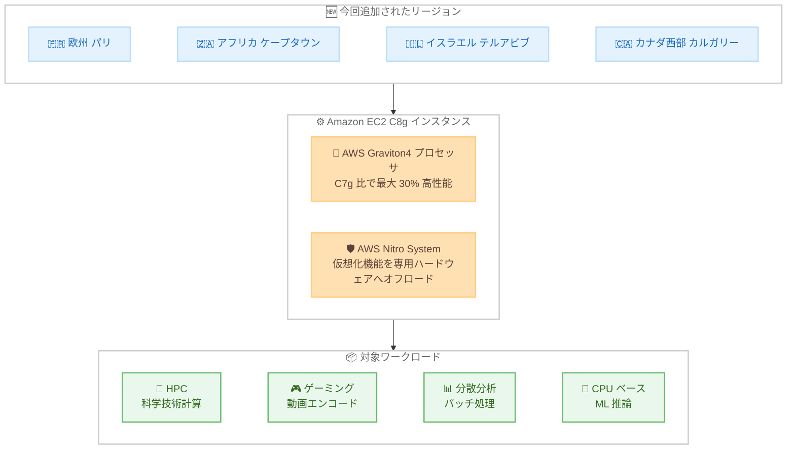

# Amazon EC2 - C8g インスタンスの利用可能リージョン拡大

**リリース日**: 2026 年 8 月 4 日
**サービス**: Amazon EC2
**機能**: Amazon EC2 C8g インスタンスの追加リージョン展開

📊 [このアップデートのインフォグラフィックを見る](https://takech9203.github.io/aws-news-summary/20260804-amazon-ec2-c8g-instances-additional-regions.html)

## 概要

Amazon Elastic Compute Cloud (Amazon EC2) の C8g インスタンスが、新たに欧州 (パリ)、アフリカ (ケープタウン)、イスラエル (テルアビブ)、カナダ西部 (カルガリー) の 4 リージョンで利用可能になりました。

C8g インスタンスは AWS Graviton4 プロセッサを搭載したコンピューティング最適化インスタンスで、AWS Graviton3 ベースのインスタンスと比較して最大 30% 高いパフォーマンスを実現します。ハイパフォーマンスコンピューティング (HPC)、バッチ処理、ゲーミング、動画エンコード、科学技術計算モデリング、分散分析、CPU ベースの機械学習 (ML) 推論、広告配信といったコンピューティング集約型ワークロード向けに設計されています。

C8g インスタンスは AWS Nitro System 上に構築されており、CPU 仮想化、ストレージ、ネットワーキングの機能を専用のハードウェアとソフトウェアにオフロードすることで、ワークロードのパフォーマンスとセキュリティを高めています。

**アップデート前の課題**

- 欧州 (パリ)、アフリカ (ケープタウン)、イスラエル (テルアビブ)、カナダ西部 (カルガリー) の各リージョンでは Graviton4 ベースの C8g インスタンスを利用できなかった
- これらのリージョンでコンピューティング最適化ワークロードを実行する場合、旧世代の Graviton ベースインスタンスや x86 ベースインスタンスを選択する必要があった
- データレジデンシー要件などでリージョンが固定されているワークロードは、最新世代の価格性能比の恩恵を受けられなかった

**アップデート後の改善**

- 上記 4 リージョンで Graviton4 ベースの C8g インスタンスが起動可能になった
- Graviton3 ベースの C7g インスタンスと比較して最大 30% 高いパフォーマンスを、これらのリージョンでも利用できるようになった
- リージョン要件のあるワークロードでも、最新世代への移行による価格性能比とエネルギー効率の向上を実現できるようになった

## アーキテクチャ図



今回のアップデートで C8g インスタンスが利用可能になった 4 リージョンと、C8g インスタンスの主要コンポーネントおよび対象ワークロードの関係を示しています。

## サービスアップデートの詳細

### 主要機能

1. **AWS Graviton4 プロセッサによる高いパフォーマンス**
   - Graviton3 ベースのインスタンスと比較して最大 30% 高いパフォーマンスを実現
   - Graviton3 プロセッサと比較して、データベースで最大 40%、Web アプリケーションで最大 30%、大規模 Java アプリケーションで最大 45% 高速
   - Amazon EC2 上で動作する幅広いワークロードに対して優れたパフォーマンスとエネルギー効率を提供

2. **豊富なインスタンスサイズ**
   - 2 種類のベアメタルサイズを含む 12 種類のインスタンスサイズを提供
   - Graviton3 ベースの C7g インスタンスと比較して、最大 3 倍の vCPU 数とメモリ容量を持つ大型サイズを提供

3. **高いネットワーク・ストレージ性能**
   - 最大 50 Gbps の拡張ネットワーキング帯域幅
   - Amazon Elastic Block Store (Amazon EBS) への最大 40 Gbps の帯域幅

4. **AWS Nitro System による基盤強化**
   - CPU 仮想化、ストレージ、ネットワーキングの機能を専用のハードウェアとソフトウェアにオフロード
   - ホストリソースをワークロードに最大限割り当てつつ、パフォーマンスとセキュリティを向上

## 技術仕様

### C8g インスタンスの主な仕様

| 項目 | 詳細 |
|------|------|
| プロセッサ | AWS Graviton4 (Arm ベース) |
| インスタンスサイズ | 12 種類 (ベアメタル 2 種類を含む) |
| vCPU / メモリ | C7g 比で最大 3 倍の vCPU 数とメモリ容量 |
| ネットワーク帯域幅 | 最大 50 Gbps (拡張ネットワーキング) |
| EBS 帯域幅 | 最大 40 Gbps |
| 基盤 | AWS Nitro System |
| 対象ワークロード | HPC、バッチ処理、ゲーミング、動画エンコード、科学技術計算モデリング、分散分析、CPU ベース ML 推論、広告配信 |

### パフォーマンス比較 (対 Graviton3)

| ワークロード | パフォーマンス向上 |
|--------------|--------------------|
| 全般 | 最大 30% |
| データベース | 最大 40% |
| Web アプリケーション | 最大 30% |
| 大規模 Java アプリケーション | 最大 45% |

## 設定方法

### 前提条件

1. AWS アカウントを保有していること
2. 対象リージョン (パリ、ケープタウン、テルアビブ、カルガリーなど) が AWS アカウントで有効化されていること (オプトインリージョンの場合)
3. Arm64 アーキテクチャに対応した AMI およびアプリケーションを用意していること

### 手順

#### ステップ 1: 対象リージョンでの利用可能状況を確認

```bash
aws ec2 describe-instance-type-offerings \
  --region eu-west-3 \
  --filters "Name=instance-type,Values=c8g.*" \
  --query "InstanceTypeOfferings[].InstanceType" \
  --output table
```

欧州 (パリ) リージョンで利用可能な C8g インスタンスタイプの一覧を取得します。他のリージョンを確認する場合は `--region` の値を変更します。

#### ステップ 2: Arm64 対応 AMI を確認

```bash
aws ec2 describe-images \
  --region eu-west-3 \
  --owners amazon \
  --filters "Name=name,Values=al2023-ami-2023*-arm64" "Name=state,Values=available" \
  --query "sort_by(Images, &CreationDate)[-1].{ImageId:ImageId,Name:Name}" \
  --output table
```

欧州 (パリ) リージョンで利用可能な最新の Arm64 版 Amazon Linux 2023 AMI を検索します。C8g インスタンスは Arm ベースの Graviton4 プロセッサを搭載しているため、Arm64 アーキテクチャの AMI が必要です。

#### ステップ 3: C8g インスタンスを起動

```bash
aws ec2 run-instances \
  --region eu-west-3 \
  --instance-type c8g.xlarge \
  --image-id <Arm64 対応 AMI の ID> \
  --key-name <キーペア名> \
  --subnet-id <サブネット ID> \
  --security-group-ids <セキュリティグループ ID>
```

欧州 (パリ) リージョンで c8g.xlarge インスタンスを起動します。AMI ID、キーペア名、サブネット ID、セキュリティグループ ID は環境に合わせて指定します。AWS Management Console からも同様に起動できます。

## メリット

### ビジネス面

- **価格性能比の向上**: Graviton3 ベースのインスタンスと比較して最大 30% 高いパフォーマンスにより、同一ワークロードに必要なインスタンス数の削減やコスト最適化が期待できる
- **データレジデンシー要件への対応**: パリ、ケープタウン、テルアビブ、カルガリーの各リージョンにデータを保持する必要があるワークロードでも、最新世代インスタンスを選択できるようになった
- **エネルギー効率の向上**: Graviton4 ベースのインスタンスは高いエネルギー効率を提供し、サステナビリティ目標への貢献が期待できる

### 技術面

- **コンピューティング集約型ワークロードの高速化**: HPC、動画エンコード、分散分析、CPU ベース ML 推論などの処理時間短縮が期待できる
- **大型インスタンスサイズの活用**: C7g 比で最大 3 倍の vCPU 数とメモリ容量により、スケールアップが必要なワークロードにも対応可能
- **高いネットワーク・ストレージ性能**: 最大 50 Gbps のネットワーク帯域幅と最大 40 Gbps の EBS 帯域幅により、データ転送がボトルネックになりにくい

## デメリット・制約事項

### 制限事項

- C8g インスタンスは Arm ベースの Graviton4 プロセッサを搭載しているため、x86 専用のソフトウェアやバイナリは動作しない
- 利用にあたっては Arm64 アーキテクチャ対応の AMI、ライブラリ、ミドルウェアが必要

### 考慮すべき点

- x86 ベースのインスタンスから移行する場合は、アプリケーションの Arm64 対応状況の確認と動作検証が必要
- リージョンごとに利用可能なインスタンスサイズや料金が異なる場合があるため、事前に各リージョンの提供状況と料金を確認することを推奨
- カナダ西部 (カルガリー)、アフリカ (ケープタウン)、イスラエル (テルアビブ) はオプトインリージョンのため、利用前にアカウントでの有効化が必要

## ユースケース

### ユースケース 1: 欧州のデータレジデンシー要件に対応した HPC ワークロード

**シナリオ**: フランス国内にデータを保持する要件がある研究機関が、科学技術計算モデリングを実行する。

**実装例**:
```bash
# 欧州 (パリ) リージョンで大型サイズの C8g インスタンスを起動
aws ec2 run-instances \
  --region eu-west-3 \
  --instance-type c8g.24xlarge \
  --image-id <Arm64 対応 HPC 向け AMI の ID> \
  --placement "GroupName=<プレイスメントグループ名>"
```

**効果**: データをフランス国内に保持したまま、Graviton4 の高いコンピューティング性能を活用して計算時間を短縮できる。

### ユースケース 2: 動画エンコードパイプラインのコスト最適化

**シナリオ**: カナダ西部 (カルガリー) リージョンで動画配信サービスを運用する企業が、エンコード処理のコストを削減したい。

**実装例**:
```bash
# Auto Scaling グループの起動テンプレートで C8g インスタンスを指定
aws ec2 create-launch-template \
  --region ca-west-1 \
  --launch-template-name video-encoding-c8g \
  --launch-template-data '{"InstanceType":"c8g.4xlarge","ImageId":"<Arm64 対応 AMI の ID>"}'
```

**効果**: 旧世代インスタンスと比較して高い価格性能比によりエンコード処理あたりのコストを削減できる。

### ユースケース 3: CPU ベースの ML 推論の高速化

**シナリオ**: イスラエル (テルアビブ) リージョンでレコメンデーションサービスを提供する企業が、CPU ベースの ML 推論のレイテンシーを改善したい。

**実装例**:
```bash
# イスラエル (テルアビブ) リージョンで推論用 C8g インスタンスを起動
aws ec2 run-instances \
  --region il-central-1 \
  --instance-type c8g.2xlarge \
  --image-id <Arm64 対応 ML 推論用 AMI の ID>
```

**効果**: Graviton4 の性能向上により推論スループットの改善とレイテンシーの短縮が期待できる。

## 料金

C8g インスタンスは、オンデマンド、Savings Plans、リザーブドインスタンス、スポットインスタンスの各購入オプションで利用できます。料金はリージョンおよびインスタンスサイズによって異なるため、最新の料金は [Amazon EC2 料金ページ](https://aws.amazon.com/ec2/pricing/) を参照してください。

## 利用可能リージョン

今回のアップデートにより、以下の 4 リージョンで新たに利用可能になりました。

- 欧州 (パリ)
- アフリカ (ケープタウン)
- イスラエル (テルアビブ)
- カナダ西部 (カルガリー)

その他の利用可能リージョンについては、[Amazon EC2 C8g インスタンス](https://aws.amazon.com/ec2/instance-types/c8g/) のページを参照してください。

## 関連サービス・機能

- **AWS Graviton4**: C8g インスタンスに搭載されている AWS 設計の Arm ベースプロセッサ。高い価格性能比とエネルギー効率を提供する
- **AWS Nitro System**: C8g インスタンスの基盤となる仮想化基盤。CPU 仮想化、ストレージ、ネットワーキングを専用ハードウェアにオフロードする
- **Amazon EBS**: C8g インスタンスは最大 40 Gbps の EBS 帯域幅をサポートし、高スループットなブロックストレージアクセスが可能
- **Amazon EC2 C7g インスタンス**: Graviton3 ベースの前世代コンピューティング最適化インスタンス。C8g への移行により性能向上が期待できる

## 参考リンク

- 📊 [インフォグラフィック](https://takech9203.github.io/aws-news-summary/20260804-amazon-ec2-c8g-instances-additional-regions.html)
- [公式発表 (What's New)](https://aws.amazon.com/about-aws/whats-new/2026/08/amazon-ec2-c8g-instances-additional-regions/)
- [Amazon EC2 C8g インスタンス](https://aws.amazon.com/ec2/instance-types/c8g/)
- [AWS Graviton プロセッサ](https://aws.amazon.com/ec2/graviton/)
- [AWS Nitro System](https://aws.amazon.com/ec2/nitro/)
- [Amazon EC2 料金ページ](https://aws.amazon.com/ec2/pricing/)

## まとめ

AWS Graviton4 を搭載した Amazon EC2 C8g インスタンスが、欧州 (パリ)、アフリカ (ケープタウン)、イスラエル (テルアビブ)、カナダ西部 (カルガリー) の 4 リージョンに拡大しました。これらのリージョンでコンピューティング集約型ワークロードを運用している場合は、C8g への移行によって最大 30% のパフォーマンス向上と価格性能比の改善が期待できます。まずは対象リージョンでのインスタンスサイズの提供状況と、アプリケーションの Arm64 対応状況を確認することを推奨します。
