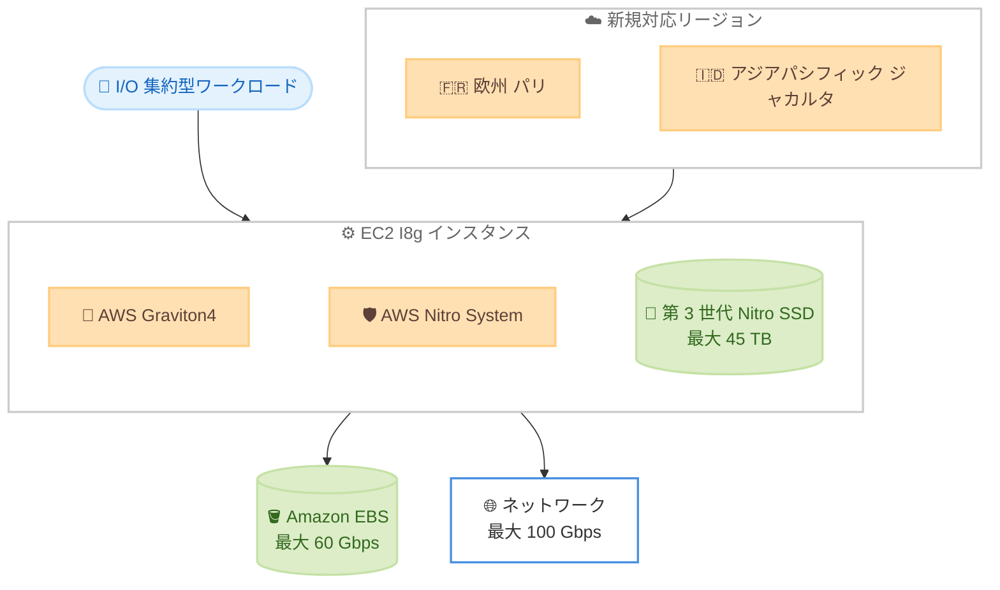

# Amazon EC2 - I8g インスタンス

**リリース日**: 2026 年 8 月 4 日
**サービス**: Amazon EC2
**機能**: ストレージ最適化 I8g インスタンス (欧州 (パリ)、アジアパシフィック (ジャカルタ) リージョン対応)

📊 [このアップデートのインフォグラフィックを見る](https://takech9203.github.io/aws-news-summary/20260804-amazon-ec2-i8g-instances-aws-paris-jakarta-regions.html)
<!-- INFOGRAPHIC_BASE_URL は環境変数から取得 -->

## 概要

AWS は、ストレージ最適化された Amazon EC2 I8g インスタンスを欧州 (パリ) およびアジアパシフィック (ジャカルタ) リージョンで一般提供 (GA) 開始しました。I8g インスタンスは AWS Graviton4 プロセッサを搭載し、ストレージを多用するワークロードにおいて Amazon EC2 で最高のコンピューティングパフォーマンスを提供します。

I8g インスタンスは第 3 世代の AWS Nitro SSD (ローカル NVMe ストレージ) を採用しており、前世代の I4g インスタンスと比較して、TB あたりのリアルタイムストレージパフォーマンスが最大 65% 向上し、ストレージ I/O レイテンシは最大 50% 低減、レイテンシの変動は最大 60% 低減します。これらのインスタンスは AWS Nitro System 上に構築されており、CPU の仮想化、ストレージ、ネットワーク機能を専用のハードウェアとソフトウェアにオフロードすることで、ワークロードのパフォーマンスとセキュリティを高めています。

今回のリージョン拡大により、フランスやインドネシアおよびその周辺地域のお客様も、トランザクション処理、リアルタイム分散データベース、リアルタイム分析、データレイクハウス、AI/LLM トレーニング向け前処理などの I/O 集約型ワークロードで I8g インスタンスの高いパフォーマンスを活用できるようになりました。

**アップデート前の課題**

- 欧州 (パリ) およびアジアパシフィック (ジャカルタ) リージョンでは、最新世代のストレージ最適化インスタンスである I8g を利用できなかった
- 両リージョンのストレージ集約型ワークロードでは前世代インスタンスを使用する必要があり、コンピューティングおよびストレージ性能に制約があった
- データレジデンシー要件により両リージョンを利用するお客様は、Graviton4 と第 3 世代 Nitro SSD による性能向上を享受できなかった

**アップデート後の改善**

- 欧州 (パリ) およびアジアパシフィック (ジャカルタ) リージョンで I8g インスタンスが利用可能になった
- 第 3 世代 Nitro SSD により、I4g 比でストレージパフォーマンスとレイテンシが大幅に改善された
- 両リージョンにデータを保持したまま、最新世代のストレージ最適化インスタンスへ移行できるようになった

## アーキテクチャ図

Graviton4 プロセッサと第 3 世代 Nitro SSD を組み合わせた I8g インスタンスが、パリとジャカルタの両リージョンで I/O 集約型ワークロードに高いストレージ性能を提供する構成を示しています。

## サービスアップデートの詳細

### 主要機能

1. **AWS Graviton4 プロセッサ**
   - ストレージを多用するワークロードにおいて Amazon EC2 で最高のコンピューティングパフォーマンスを提供
   - Arm ベースのアーキテクチャによる高い電力効率とコストパフォーマンス

2. **第 3 世代 AWS Nitro SSD**
   - I4g 比で TB あたりのリアルタイムストレージパフォーマンスが最大 65% 向上
   - ストレージ I/O レイテンシが最大 50% 低減
   - ストレージ I/O レイテンシの変動が最大 60% 低減

3. **AWS Nitro System による構築**
   - CPU の仮想化、ストレージ、ネットワーク機能を専用のハードウェアとソフトウェアにオフロード
   - ワークロードのパフォーマンスとセキュリティを向上

4. **豊富なインスタンスサイズ**
   - メタルサイズ 2 種類を含む 11 種類のサイズを提供
   - 最大 1.5 TiB のメモリ、最大 45 TB のローカルインスタンスストレージ
   - 最大 100 Gbps のネットワーク帯域幅、最大 60 Gbps の EBS 専用帯域幅

## 技術仕様

### インスタンスの主要スペック

| 項目 | 詳細 |
|------|------|
| プロセッサ | AWS Graviton4 |
| インスタンスサイズ | 11 サイズ (メタル 2 種類を含む) |
| 最大 vCPU | 192 (i8g.48xlarge、i8g.metal-48xl) |
| 最大メモリ | 1.5 TiB |
| 最大ローカルストレージ | 45 TB (第 3 世代 Nitro SSD) |
| 最大ネットワーク帯域幅 | 100 Gbps |
| 最大 EBS 帯域幅 | 60 Gbps |
| ストレージ性能向上 (TB あたり) | I4g 比で最大 65% |
| ストレージ I/O レイテンシ低減 | I4g 比で最大 50% |
| レイテンシ変動低減 | I4g 比で最大 60% |

### インスタンスサイズ一覧

| インスタンスサイズ | vCPU | メモリ (GiB) | インスタンスストレージ (GB) | ネットワーク帯域幅 (Gbps) | EBS 帯域幅 (Gbps) |
|------|------|------|------|------|------|
| i8g.large | 2 | 16 | 1 x 468 | 最大 10 | 最大 10 |
| i8g.xlarge | 4 | 32 | 1 x 937 | 最大 10 | 最大 10 |
| i8g.2xlarge | 8 | 64 | 1 x 1,875 | 最大 12 | 最大 10 |
| i8g.4xlarge | 16 | 128 | 1 x 3,750 | 最大 25 | 最大 10 |
| i8g.8xlarge | 32 | 256 | 2 x 3,750 | 25 | 10 |
| i8g.12xlarge | 48 | 384 | 3 x 3,750 | 28.125 | 15 |
| i8g.16xlarge | 64 | 512 | 4 x 3,750 | 37.5 | 20 |
| i8g.24xlarge | 96 | 768 | 6 x 3,750 | 56.25 | 30 |
| i8g.48xlarge | 192 | 1,536 | 12 x 3,750 | 100 | 60 |
| i8g.metal-24xl | 96 | 768 | 6 x 3,750 | 56.25 | 30 |
| i8g.metal-48xl | 192 | 1,536 | 12 x 3,750 | 100 | 60 |

## メリット

### ビジネス面

- **データレジデンシー要件への対応**: フランスやインドネシアにデータを保持する必要があるお客様が、最新世代のストレージ最適化インスタンスを利用できるようになった
- **コストパフォーマンスの向上**: Graviton4 の高い電力効率により、ストレージ集約型ワークロードのコスト最適化が期待できる
- **柔軟なサイジング**: メタルサイズ 2 種類を含む 11 種類のサイズにより、小規模から大規模まで幅広いワークロード要件に対応

### 技術面

- **高いストレージパフォーマンス**: 第 3 世代 Nitro SSD により、TB あたりのリアルタイムストレージ性能が I4g 比で最大 65% 向上
- **低レイテンシと安定性**: I/O レイテンシとその変動が大幅に低減し、レイテンシに敏感なアプリケーションに適する
- **高い帯域幅**: 最大 100 Gbps のネットワーク帯域幅と最大 60 Gbps の EBS 専用帯域幅を提供

## デメリット・制約事項

### 制限事項

- Arm ベースの Graviton4 アーキテクチャのため、x86 向けにビルドされたアプリケーションは Arm 対応のビルドまたは互換性確認が必要
- 利用可能なインスタンスサイズや購入オプションはリージョンによって異なる場合があるため、事前確認が必要

### 考慮すべき点

- ローカル NVMe ストレージは揮発性であり、インスタンスの停止や終了時にデータが失われるため、永続化が必要なデータは Amazon EBS や Amazon S3 などに保存する必要がある
- 既存の x86 ベースワークロードから移行する場合は、依存ライブラリやコンテナイメージの Arm 対応状況を事前に確認する

## ユースケース

### ユースケース1: リアルタイム分散データベース

**シナリオ**: MySQL、PostgreSQL、Hbase、Aerospike、MongoDB、ClickHouse、Apache Druid などのトランザクション処理やリアルタイム分散データベースをパリまたはジャカルタリージョンで運用する。

**効果**: 第 3 世代 Nitro SSD の低レイテンシと高スループットにより、大量のトランザクションやクエリを高速に処理できる。

### ユースケース2: リアルタイム分析とデータレイクハウス

**シナリオ**: Apache Spark などを用いたリアルタイム分析処理や、データレイクハウス基盤を両リージョンで構築する。

**効果**: 高いストレージ性能とネットワーク帯域幅により、大規模データセットの高速な読み書きと分析が可能になる。

### ユースケース3: AI/LLM トレーニング向け前処理

**シナリオ**: 大規模言語モデル (LLM) のトレーニングに向けたデータ前処理を、データレジデンシー要件のあるリージョン内で実施する。

**効果**: ローカル NVMe ストレージへの高速アクセスにより、大量のトレーニングデータの前処理を効率化できる。

## 料金

I8g インスタンスは、オンデマンド、リザーブドインスタンス、Savings Plans、スポットインスタンスなどの EC2 の各種購入オプションで利用できます。具体的な料金はインスタンスサイズおよびリージョンによって異なるため、最新の料金は Amazon EC2 の料金ページを参照してください。

## 利用可能リージョン

今回のアップデートにより、欧州 (パリ) およびアジアパシフィック (ジャカルタ) リージョンで一般提供 (GA) 開始しました。

## 関連サービス・機能

- **AWS Graviton4**: I8g インスタンスが搭載する最新世代の Arm ベースプロセッサ
- **AWS Nitro System**: I8g の基盤となる仮想化基盤。第 3 世代 Nitro SSD を含む
- **Amazon EBS**: I8g インスタンスにアタッチして永続ストレージとして利用可能 (最大 60 Gbps)

## 参考リンク

- 📊 [インフォグラフィック](https://takech9203.github.io/aws-news-summary/20260804-amazon-ec2-i8g-instances-aws-paris-jakarta-regions.html)
- [公式発表 (What's New)](https://aws.amazon.com/about-aws/whats-new/2026/08/amazon-ec2-i8g-instances-aws-paris-jakarta-regions/)
- [Amazon EC2 I8g インスタンス](https://aws.amazon.com/ec2/instance-types/i8g/)
- [AWS Graviton プロセッサ](https://aws.amazon.com/ec2/graviton/)
- [Level up your compute with AWS Graviton](https://aws.amazon.com/ec2/graviton/level-up-with-graviton/)
- [Amazon EC2 料金ページ](https://aws.amazon.com/ec2/pricing/)

## まとめ

Amazon EC2 I8g インスタンスが欧州 (パリ) およびアジアパシフィック (ジャカルタ) リージョンに拡大し、両リージョンのお客様も Graviton4 と第 3 世代 Nitro SSD による最高クラスのストレージ性能を活用できるようになりました。リアルタイムデータベース、リアルタイム分析、AI/LLM 前処理などの I/O 集約型ワークロードを両リージョンで運用しているお客様は、I8g への移行によるパフォーマンス向上とコスト最適化を検討することを推奨します。
