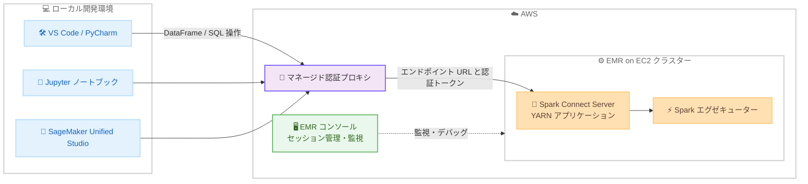

# Amazon EMR - EMR on EC2 での Spark Connect によるインタラクティブセッションのサポート

**リリース日**: 2026 年 8 月 4 日
**サービス**: Amazon EMR (EMR on EC2)
**機能**: Spark Connect によるインタラクティブセッション (Interactive Sessions)

📊 [このアップデートのインフォグラフィックを見る](https://takech9203.github.io/aws-news-summary/20260804-amazon-emr-ec2-spark-connect.html)

## 概要

Amazon EMR on EC2 が、Spark Connect を利用した Apache Spark のインタラクティブセッションをサポートしました。データエンジニアやデータサイエンティストは、Amazon SageMaker Unified Studio のマネージドノートブックや、Jupyter、Visual Studio Code などの使い慣れた IDE から、EMR on EC2 クラスター上で Apache Spark アプリケーションをインタラクティブに開発・デバッグできます。各セッションは専用の EMR on EC2 クラスター上で実行され、アクティブなセッションと完了したセッションは EMR コンソールから監視・デバッグできます。

インタラクティブセッションは、セルやスクリプトをまたいで持続する永続的な Spark コンテキストを提供し、ローカルでの Python コード実行とリモートでの Spark 操作を組み合わせることができます。Spark Connect のクライアント・サーバーアーキテクチャにより、アプリケーションクライアントが Spark ドライバーから分離されるため、開発者は好みの開発環境やツールを維持したまま、Spark インフラストラクチャをクラスター上で実行できます。アドホックなデータ探索、ステップごとの反復的なデバッグ、本番デプロイ前の段階的な PySpark ジョブ開発などのワークフローに適しています。

可観測性の面では、Spark UI によるリアルタイムのセッション監視、Spark History Server による履歴追跡、EMR コンソールまたは API/CLI/SDK からのセッション管理が提供されます。

**アップデート前の課題**

- EMR on EC2 クラスター上の Spark に対して、ローカル IDE から直接インタラクティブに接続する標準的な仕組みがなく、SSH トンネルの構築やクラスター上でのコード実行など追加のセットアップが必要だった
- アプリケーションコードと Spark ドライバーが密結合しており、IDE のブレークポイントを使ったステップ実行など、ローカル開発環境の機能を活かしたデバッグが困難だった
- クエリを試行するたびに Spark アプリケーションを起動し直す必要があり、反復的な開発サイクルに時間がかかった

**アップデート後の改善**

- VS Code、PyCharm、Jupyter ノートブックなどの任意の PySpark クライアントから EMR クラスターに接続し、インタラクティブに開発・デバッグできるようになった
- IDE でブレークポイントを設定し、本番規模のデータに対して DataFrame を実行しながら PySpark コードをステップ実行できるようになった
- セッションが永続的な Spark コンテキストを維持するため、Spark を再起動せずに複数のインタラクティブクエリを実行できるようになった
- EMR コンソール、API、CLI、SDK からセッションの管理・監視・デバッグが可能になった

## アーキテクチャ図



ローカルの PySpark クライアントは、マネージド認証プロキシを経由して EMR クラスター上の Spark Connect Server に DataFrame や SQL 操作を送信します。Spark Connect Server はセッション開始時に YARN アプリケーションとしてクラスター上に起動され、各セッションは固有のエンドポイント URL と認証トークンを持ちます。

## サービスアップデートの詳細

### 主要機能

1. **Spark Connect によるクライアント・サーバー分離**
   - アプリケーションクライアントを Spark ドライバープロセスから分離するアーキテクチャ
   - ローカル IDE で PySpark コードを開発・デバッグしながら、Spark 操作はクラスター上で実行
   - ローカルの Python コード実行とリモートの Spark 操作を組み合わせ可能

2. **永続的なインタラクティブセッション**
   - セルやスクリプトをまたいで持続する Spark コンテキストを提供
   - セッションは明示的に終了するかアイドルタイムアウトに達するまで持続
   - Spark を再起動せずに複数のインタラクティブクエリを実行可能

3. **セッション管理 API**
   - `StartSession`、`GetSession`、`GetSessionEndpoint`、`ListSessions`、`TerminateSession` の各 API でセッションのライフサイクルを管理
   - ランタイムロールセッションでは実行ロールを指定可能 (`--execution-role-arn`)
   - セッションごとに Spark 設定のオーバーライドを指定可能 (`--engine-configuration`)

4. **可観測性とモニタリング**
   - Spark UI によるリアルタイムのセッション監視
   - Spark History Server による完了済みセッションの履歴追跡
   - EMR コンソールまたは API/CLI/SDK からのセッション管理

## 技術仕様

### 主な仕様

| 項目 | 詳細 |
|------|------|
| 対応リリース | Amazon EMR リリース emr-spark-8.0.0 以降 (AWS runtime for Apache Spark) |
| 対応クライアント | VS Code、PyCharm、Jupyter ノートブックなどの PySpark クライアント、SageMaker Unified Studio マネージドノートブック |
| ローカル環境要件 | Python 3.9 以降、`pyspark[connect]` のインストール (クラスターの Spark バージョンと一致が必要) |
| サポート API | PySpark の DataFrame および SQL API (RDD ベースの API は非対応) |
| 認証トークン有効期限 | 1 時間 (期限切れ時は `GetSessionEndpoint` で再取得) |
| アイドルタイムアウト | デフォルト 60 分、最大 24 時間 (設定可能) |
| 同時セッション数上限 | クラスターあたり 1,000 アクティブセッション (実際の上限はクラスターリソースに依存) |
| 認証プロキシのレート制限 | 送信元 IP アドレスごとに 5 分間あたり 5,000 リクエスト |
| プライベートサブネット | EMR がアカウント内に NLB と VPC エンドポイントサービスを作成 (`AmazonEMRServicePolicyForSessions` 管理ポリシーが必要) |

### 必要な IAM 権限

セッション管理には以下のユーザー権限が必要です。

```json
{
  "Version": "2012-10-17",
  "Statement": [
    {
      "Sid": "EMRSessionClusterAccess",
      "Effect": "Allow",
      "Action": [
        "elasticmapreduce:StartSession",
        "elasticmapreduce:ListSessions"
      ],
      "Resource": "arn:aws:elasticmapreduce:region:account-id:cluster/*"
    },
    {
      "Sid": "EMRSessionAccess",
      "Effect": "Allow",
      "Action": [
        "elasticmapreduce:GetSession",
        "elasticmapreduce:GetSessionEndpoint",
        "elasticmapreduce:TerminateSession"
      ],
      "Resource": "arn:aws:elasticmapreduce:region:account-id:cluster/*/session/*"
    }
  ]
}
```

ランタイムロールセッションを使用する場合は、実行ロールに対する `iam:PassRole` 権限も必要です。

## 設定方法

### 前提条件

1. Amazon EMR リリース emr-spark-8.0.0 以降のクラスターで `SessionEnabled` が有効であること
2. クラスターに Spark アプリケーションがインストールされていること
3. ローカルに Python 3.9 以降と `pyspark[connect]` がインストールされていること (PySpark バージョンはクラスターの Spark バージョンと一致させる)
4. プライベートサブネットのクラスターでは、EMR サービスロールに `AmazonEMRServicePolicyForSessions` 管理ポリシーが付与され、VPC とサブネットに `for-use-with-amazon-emr-managed-policies=true` タグが設定されていること

### 手順

#### ステップ 1: セッション対応クラスターの作成

```bash
aws emr create-cluster \
  --name "spark-connect-cluster" \
  --release-label emr-spark-8.0.0 \
  --applications Name=Spark \
  --service-role arn:aws:iam::account-id:role/EMR_DefaultRole \
  --ec2-attributes InstanceProfile=EMR_EC2_DefaultRole,SubnetId=subnet-id \
  --instance-groups '[
    {"InstanceCount":1,"InstanceGroupType":"MASTER","InstanceType":"m5.xlarge"},
    {"InstanceCount":2,"InstanceGroupType":"CORE","InstanceType":"m5.xlarge"}
  ]' \
  --session-enabled \
  --tags Key=for-use-with-amazon-emr-managed-policies,Value=true
```

`--session-enabled` オプションを指定して、Spark Connect セッションが有効な EMR クラスターを作成します。

#### ステップ 2: セッションの開始とエンドポイントの取得

```bash
# セッションを開始 (--name は必須)
aws emr start-session \
  --cluster-id j-XXXXXXXXXXXXX \
  --name "my-session"

# セッションが IDLE 状態になるまで状態を確認
aws emr get-session \
  --cluster-id j-XXXXXXXXXXXXX \
  --session-id is-XXXXXXXXXXXXX

# エンドポイント URL と認証トークンを取得
aws emr get-session-endpoint \
  --cluster-id j-XXXXXXXXXXXXX \
  --session-id is-XXXXXXXXXXXXX
```

クラスターが `WAITING` 状態になった後にセッションを開始します。`get-session-endpoint` のレスポンスには、接続に使用するエンドポイント URL、認証トークン、トークンの有効期限が含まれます。

#### ステップ 3: PySpark クライアントからの接続

```python
from pyspark.sql import SparkSession

session_id = "is-XXXXXXXXXXXXX"
auth_token = "get-session-endpoint で取得したトークン"
endpoint_url = "get-session-endpoint で取得した Endpoint"

# 返却された Endpoint の https:// を sc:// に変換し、ポート 443 を明示する
host = endpoint_url.replace("https://", "")
url = f"sc://{host}:443/;use_ssl=true;x-aws-proxy-auth={auth_token};authorization={session_id}"

spark = SparkSession.builder.remote(url).getOrCreate()
spark.sql("SELECT 1 + 1 AS result").show()
spark.stop()
```

事前に `pip install 'pyspark[connect]==4.0.1' boto3` のように、クラスターの Spark バージョンと一致する PySpark クライアントをインストールします。ポートを指定しない場合、PySpark クライアントはデフォルトの 15002 を使用して接続に失敗するため、`:443` の明示が必要です。

#### ステップ 4: セッションの終了

```bash
aws emr terminate-session \
  --cluster-id j-XXXXXXXXXXXXX \
  --session-id is-XXXXXXXXXXXXX
```

`spark.stop()` はローカルクライアントの接続を閉じるだけで、リモートセッションは明示的に終了するかアイドルタイムアウトに達するまでクラスターリソースを消費し続けます。使い終わったセッションは `terminate-session` で終了します。

## メリット

### ビジネス面

- **開発生産性の向上**: 使い慣れた IDE やノートブックをそのまま利用でき、開発環境の切り替えやセットアップのオーバーヘッドを削減できる
- **開発サイクルの短縮**: Spark の再起動なしに反復的なクエリ実行やデバッグができ、本番デプロイ前の PySpark ジョブ開発を加速できる
- **追加コストなし**: Spark Connect の利用自体に追加料金はなく、EMR クラスターの EC2 インスタンス料金のみで利用できる

### 技術面

- **クライアント・サーバー分離**: アプリケーションクライアントと Spark ドライバーが分離され、ローカル環境の障害がクラスター上のセッションに影響しにくい
- **本番規模データでのデバッグ**: IDE のブレークポイントを使い、クラスター上の本番規模データに対して PySpark コードをステップ実行できる
- **セッション単位の設定**: `--engine-configuration` により、クラスターのデフォルト設定や他のセッションに影響を与えずにセッションごとの Spark 設定を適用できる
- **標準化された可観測性**: Spark UI、Spark History Server、EMR コンソールによりセッションの監視・デバッグが一元化される

## デメリット・制約事項

### 制限事項

- Amazon EMR リリース emr-spark-8.0.0 以降でのみサポートされる
- PySpark の DataFrame および SQL API のみサポートされ、RDD ベースの API は非対応
- 複数プライマリノードを持つ高可用性 (HA) クラスターは非対応
- Trusted Identity Propagation (TIP) は非対応
- Lake Formation によるきめ細かなアクセス制御 (FGAC) は現時点で非対応
- AWS GovCloud リージョンおよび中国リージョンでは利用不可

### 考慮すべき点

- ローカルの PySpark バージョンをクラスターの Spark バージョンと一致させる必要がある。Python UDF を使用する場合は、ローカルの Python マイナーバージョンもクラスターワーカーの Python バージョンと一致が必要
- 認証トークンは 1 時間で期限切れになるため、長時間のセッションではトークンの再取得と SparkSession の再作成が必要
- `spark.stop()` ではリモートセッションは終了しないため、リソース解放には明示的な `TerminateSession` の呼び出しが必要
- 認証プロキシには送信元 IP あたり 5 分間 5,000 リクエストのレート制限があり、単一クライアントからの高スループットワークロードでは制限に達する可能性がある
- プライベートサブネットのクラスターでは NLB が作成されるため、Elastic Load Balancing のクォータを確認する必要がある

## ユースケース

### ユースケース 1: IDE からのアドホックなデータ探索

**シナリオ**: データサイエンティストが VS Code や Jupyter から、S3 上の大規模データセットに対してアドホックな探索クエリを実行したい。

**実装例**:
```python
spark = SparkSession.builder.remote(url).getOrCreate()

# 永続的なセッションで複数のクエリを連続実行
df = spark.read.parquet("s3://my-bucket/sales-data/")
df.groupBy("region").sum("amount").show()
df.filter(df["amount"] > 10000).count()
```

**効果**: Spark を再起動せずに複数クエリを連続実行でき、対話的な探索のたびにクラスターへの SSH やジョブ投入を行う必要がなくなる。

### ユースケース 2: 本番規模データでの段階的なデバッグ

**シナリオ**: データエンジニアが本番デプロイ前の PySpark ジョブを、本番規模のデータに対してステップ実行しながらデバッグしたい。

**実装例**:
```python
# IDE でブレークポイントを設定してステップ実行
df = spark.read.parquet("s3://my-bucket/input/")
transformed = df.withColumn("normalized", df["value"] / 100)  # ここにブレークポイント
transformed.show(5)  # 中間結果を確認しながら開発
```

**効果**: ローカルのサンプルデータでは再現しない問題を、クラスター上の実データで確認しながら段階的にジョブを開発できる。

### ユースケース 3: セッションごとのリソース調整による共有クラスター運用

**シナリオ**: 複数のデータエンジニアが 1 つの EMR クラスターを共有し、ワークロードに応じてセッションごとに異なる Spark 設定を使いたい。

**実装例**:
```bash
aws emr start-session \
  --cluster-id j-XXXXXXXXXXXXX \
  --name "heavy-workload-session" \
  --engine-configuration '{
    "Classification": "spark-defaults",
    "Properties": {
      "spark.executor.memory": "4g",
      "spark.executor.cores": "2",
      "spark.dynamicAllocation.enabled": "true"
    }
  }'
```

**効果**: クラスターのデフォルト設定や他のユーザーのセッションに影響を与えずに、セッション単位でリソース設定を最適化できる。

## 料金

Spark Connect の利用自体に追加料金はありません。EMR クラスターを構成する Amazon EC2 インスタンスの料金のみが発生します。

なお、プライベートサブネットのクラスターでは、接続のために Network Load Balancer と VPC エンドポイントサービスがアカウント内に作成される点に留意してください。

## 利用可能リージョン

Amazon EMR が利用可能なすべての AWS リージョンで利用できます (AWS GovCloud リージョンおよび中国リージョンを除く)。Amazon SageMaker Unified Studio でのエクスペリエンスは、SageMaker Unified Studio がサポートするリージョンで利用できます。

## 関連サービス・機能

- **Amazon SageMaker Unified Studio**: マネージドノートブックから EMR on EC2 のインタラクティブセッションを利用可能
- **Apache Spark Connect**: Apache Spark 3.4 で導入されたクライアント・サーバーアーキテクチャ。本アップデートの基盤技術
- **Amazon EMR Serverless / EMR on EKS**: EMR のその他のデプロイオプション。ワークロード特性に応じて選択
- **AWS Glue インタラクティブセッション**: サーバーレスな Spark インタラクティブセッションを提供する類似機能

## 参考リンク

- 📊 [インフォグラフィック](https://takech9203.github.io/aws-news-summary/20260804-amazon-emr-ec2-spark-connect.html)
- [公式発表 (What's New)](https://aws.amazon.com/about-aws/whats-new/2026/08/amazon-emr-ec2-spark-connect/)
- [ドキュメント: Interactive sessions with Spark Connect](https://docs.aws.amazon.com/emr/latest/ManagementGuide/emr-spark-connect-sessions.html)
- [ドキュメント: Amazon SageMaker Unified Studio Getting Started](https://docs.aws.amazon.com/sagemaker-unified-studio/latest/userguide/what-is-sagemaker-unified-studio.html)
- [料金ページ: Amazon EMR](https://aws.amazon.com/emr/pricing/)

## まとめ

Amazon EMR on EC2 での Spark Connect サポートにより、ローカル IDE やノートブックから本番規模のクラスターに直接接続してインタラクティブに開発・デバッグできるようになり、Spark アプリケーションの開発体験が大きく向上します。追加料金なしで利用できるため、emr-spark-8.0.0 以降のクラスターを利用しているチームは、`--session-enabled` オプションでクラスターを作成し、まずはアドホックなデータ探索やジョブ開発のワークフローから試すことを推奨します。
