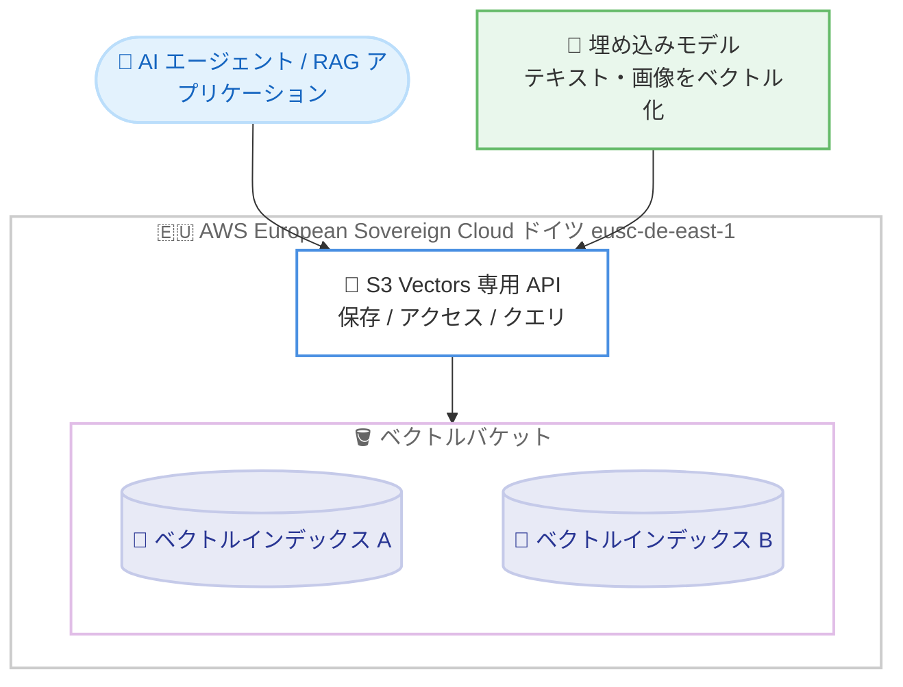

# Amazon S3 - S3 Vectors が AWS European Sovereign Cloud (ドイツ) リージョンで利用可能に

**リリース日**: 2026 年 8 月 4 日
**サービス**: Amazon S3 (Amazon S3 Vectors)
**機能**: AWS European Sovereign Cloud (Germany) リージョンでの Amazon S3 Vectors 提供開始

📊 [このアップデートのインフォグラフィックを見る](https://takech9203.github.io/aws-news-summary/20260804-amazon-s3-vectors-european-sovereign-cloud-germany.html)

## 概要

Amazon S3 Vectors が AWS European Sovereign Cloud (ドイツ) リージョン (eusc-de-east-1) で利用可能になりました。Amazon S3 Vectors は、AI エージェント、推論、検索拡張生成 (RAG)、セマンティック検索向けに専用設計されたベクトルストレージで、数十億ベクトル規模までスケールします。

S3 Vectors は、Amazon S3 と同等の伸縮性、耐久性、可用性を提供するように設計されており、専用の API セットを通じてインフラストラクチャをプロビジョニングすることなくベクトルの保存、アクセス、クエリを実行できます。今回の提供開始により、データ主権要件の厳しい欧州の公共部門や規制産業のお客様も、European Sovereign Cloud 内で完結する形でベクトル検索や生成 AI アプリケーションを構築できるようになります。

**アップデート前の課題**

- AWS European Sovereign Cloud を利用するお客様は、同クラウド内で S3 Vectors を利用できなかった
- データ主権要件により欧州域内でのデータ保持が求められる組織は、マネージドなベクトルストレージの選択肢が限られていた
- ベクトル検索基盤を自前で構築する場合、インフラストラクチャのプロビジョニングと運用管理が必要だった

**アップデート後の改善**

- AWS European Sovereign Cloud (ドイツ) リージョン内で S3 Vectors のベクトルバケットとベクトルインデックスを利用可能になった
- データ主権要件を満たしながら、RAG やセマンティック検索などの AI アプリケーションを構築できるようになった
- インフラストラクチャのプロビジョニング不要で、数十億ベクトル規模のストレージとクエリを利用できるようになった

## アーキテクチャ図



AWS European Sovereign Cloud (ドイツ) リージョン内で、アプリケーションが S3 Vectors の専用 API を通じてベクトルバケット内のベクトルインデックスに対して保存・クエリを実行する構成を示しています。

## サービスアップデートの詳細

### 主要機能

1. **ベクトルバケット**
   - ベクトルの保存とクエリのために専用設計された新しいバケットタイプ
   - Amazon S3 と同等の伸縮性、耐久性、可用性を提供するように設計
   - 従量課金制で、アップロード、保存、クエリした分のみ支払い

2. **ベクトルインデックス**
   - ベクトルバケット内でベクトルデータを整理する単位
   - ベクトルインデックスに対して類似検索クエリを実行
   - ベクトル追加時にメタデータを付与し、タイムスタンプやカテゴリなどの条件でフィルタリング可能

3. **専用 API とパフォーマンス特性**
   - インフラストラクチャのプロビジョニング不要でベクトルの保存、アクセス、クエリが可能
   - 書き込みは強い整合性を持ち、追加直後のデータに即座にアクセス可能
   - 低頻度クエリでサブセカンド、高頻度クエリでは最短 100 ミリ秒のレイテンシを実現するように設計
   - ベクトルの書き込み、更新、削除に応じて、データを自動的に最適化し価格性能を維持

## 技術仕様

### AWS European Sovereign Cloud (Germany) リージョンでのエンドポイント

| 項目 | 詳細 |
|------|------|
| リージョン名 | AWS European Sovereign Cloud (Germany) |
| リージョンコード | eusc-de-east-1 |
| エンドポイント | s3vectors.eusc-de-east-1.api.amazonwebservices.eu |
| プロトコル | HTTPS |
| 署名バージョン | 4 |

### 接続とアクセス制御

- S3 Vectors のエンドポイントは IPv6 と IPv4 のリクエストをサポートするデュアルスタックエンドポイント
- AWS PrivateLink インターフェイスエンドポイントによるプライベート接続をサポート
- バケットポリシーや IAM ポリシーなど、Amazon S3 の既存のアクセス制御メカニズムでベクトルデータへのアクセスを制御可能

## メリット

### ビジネス面

- **データ主権要件への対応**: European Sovereign Cloud 内でベクトルデータを保持したまま AI アプリケーションを構築でき、欧州の規制要件に対応しやすくなる
- **コスト最適化**: 従量課金制のため、専用のベクトルデータベースインフラを常時稼働させる場合と比較してコストを抑えられる可能性がある
- **AI 活用の加速**: 規制産業や公共部門でも RAG やセマンティック検索を活用したアプリケーション開発を進めやすくなる

### 技術面

- **インフラ管理不要**: サーバーやクラスターのプロビジョニングなしで、数十億ベクトル規模のストレージとクエリを利用可能
- **強い整合性**: 書き込み直後のベクトルデータに即座にアクセス可能
- **自動最適化**: データセットの拡大や変化に応じて、ベクトルデータが自動的に最適化され価格性能が維持される

## デメリット・制約事項

### 制限事項

- ベクトルバケットあたりのベクトルインデックス数や、インデックスあたりのベクトル数には上限がある (詳細は公式ドキュメントの「Limitations and restrictions」を参照)
- クォータはリージョン単位で適用され、一部のクォータは引き上げ申請が可能だが、引き上げできないものもある

### 考慮すべき点

- European Sovereign Cloud は通常の AWS リージョンとは独立した環境であり、エンドポイントのドメイン (api.amazonwebservices.eu) も異なるため、既存アプリケーションの接続設定を確認する必要がある
- クエリ頻度によってレイテンシ特性が異なるため (低頻度でサブセカンド、高頻度で最短 100 ミリ秒)、要件に応じた性能検証を推奨

## ユースケース

### ユースケース 1: 規制産業における社内文書のセマンティック検索

**シナリオ**: 欧州の金融機関や公共機関が、データ主権要件を満たしながら社内文書に対する意味ベースの検索を提供したい。

**実装例**:
```
1. 埋め込みモデルで社内文書をベクトル化
2. eusc-de-east-1 の S3 Vectors ベクトルインデックスに保存
3. 検索クエリをベクトル化し、類似検索 API で関連文書を取得
```

**効果**: キーワード一致ではなく意味に基づいた検索が可能になり、データは European Sovereign Cloud 内に保持される。

### ユースケース 2: RAG による生成 AI アプリケーション

**シナリオ**: 欧州域内でのデータ保持が求められる組織が、自社ナレッジを活用した生成 AI アシスタントを構築したい。

**実装例**:
```
1. ナレッジベースの文書をベクトル埋め込みとして S3 Vectors に格納
2. ユーザーの質問に対して類似検索で関連コンテキストを取得
3. 取得したコンテキストをプロンプトに含めて LLM に回答を生成させる
```

**効果**: インフラ管理不要のベクトルストレージにより、RAG パイプラインの構築と運用が簡素化される。

### ユースケース 3: 大規模メディアライブラリの類似コンテンツ検出

**シナリオ**: 大量の画像や動画を保有する組織が、重複画像の検出や特定シーンの検索を行いたい。

**実装例**:
```
1. 画像・動画から埋め込みモデルでベクトルを生成
2. メタデータ (カテゴリ、タイムスタンプなど) とともにベクトルインデックスに保存
3. メタデータフィルタリング付きの類似検索で対象コンテンツを特定
```

**効果**: 数十億ベクトル規模まで対応するストレージにより、大規模メディアライブラリでも類似検索を実現できる。

## 料金

S3 Vectors は従量課金制で、ベクトルのアップロード、ストレージ、クエリに対して使用した分のみ課金されます。詳細な料金は [Amazon S3 料金ページ](https://aws.amazon.com/s3/pricing/) を参照してください。

## 利用可能リージョン

今回の対象リージョンは AWS European Sovereign Cloud (Germany) (eusc-de-east-1) です。

公式ドキュメントによると、S3 Vectors は米国東部 (バージニア北部)、米国西部 (オレゴン)、アジアパシフィック (東京)、アジアパシフィック (大阪)、欧州 (フランクフルト)、AWS GovCloud (US) を含む多数の AWS リージョンで利用可能です。最新のリージョン一覧は [AWS Regions and endpoints](https://docs.aws.amazon.com/AmazonS3/latest/userguide/s3-vectors-regions-quotas.html) を参照してください。

## 関連サービス・機能

- **Amazon S3**: S3 Vectors は S3 と同等の伸縮性、耐久性、可用性を提供するように設計されており、S3 の既存のアクセス制御メカニズムを利用できる
- **Amazon Bedrock Knowledge Bases**: S3 Vectors は Amazon Bedrock Knowledge Bases のベクトルストアとして利用可能 (公式ドキュメントに利用ガイドあり)
- **AWS PrivateLink**: インターフェイスエンドポイントを通じた S3 Vectors へのプライベート接続をサポート

## 参考リンク

- 📊 [インフォグラフィック](https://takech9203.github.io/aws-news-summary/20260804-amazon-s3-vectors-european-sovereign-cloud-germany.html)
- [公式発表 (What's New)](https://aws.amazon.com/about-aws/whats-new/2026/08/amazon-s3-vectors-european-sovereign-cloud-germany/)
- [Amazon S3 Vectors 製品ページ](https://aws.amazon.com/s3/features/vectors/)
- [ドキュメント: Working with S3 Vectors and vector buckets](https://docs.aws.amazon.com/AmazonS3/latest/userguide/s3-vectors.html)
- [ドキュメント: AWS Regions, endpoints, and quotas for S3 Vectors](https://docs.aws.amazon.com/AmazonS3/latest/userguide/s3-vectors-regions-quotas.html)
- [Amazon S3 料金ページ](https://aws.amazon.com/s3/pricing/)

## まとめ

Amazon S3 Vectors が AWS European Sovereign Cloud (ドイツ) リージョンで利用可能になり、データ主権要件の厳しい欧州のお客様もインフラ管理不要のベクトルストレージを活用した AI アプリケーションを構築できるようになりました。European Sovereign Cloud での生成 AI や RAG の導入を検討している場合は、S3 Vectors のドキュメントと制限事項を確認のうえ、検証を開始することを推奨します。
