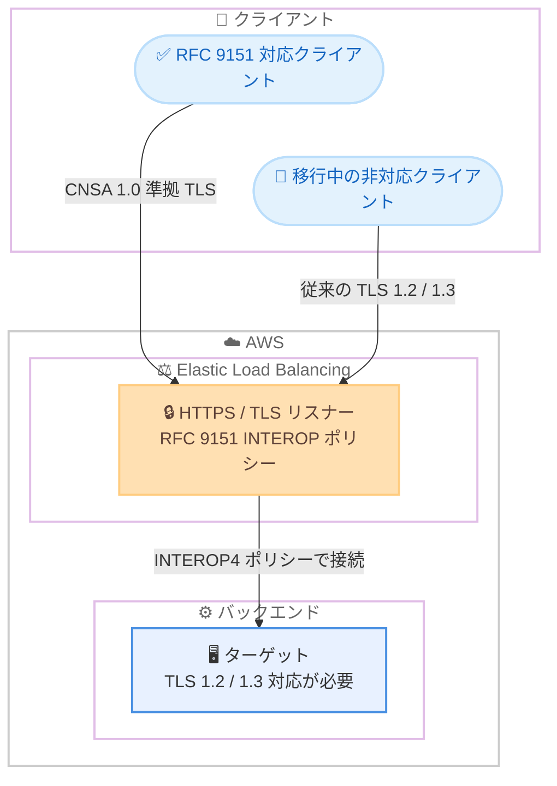

# Elastic Load Balancing - ALB / NLB の RFC 9151 準拠セキュリティポリシー対応

**リリース日**: 2026 年 8 月 4 日
**サービス**: Elastic Load Balancing (Application Load Balancer / Network Load Balancer)
**機能**: RFC 9151 (CNSA 1.0) 準拠 TLS セキュリティポリシー

📊 [このアップデートのインフォグラフィックを見る](https://takech9203.github.io/aws-news-summary/20260804-aws-application-network.html)

## 概要

AWS Application Load Balancer (ALB) と Network Load Balancer (NLB) が、RFC 9151 の TLS サーバー要件に準拠した新しい TLS ベースのセキュリティポリシーをサポートしました。RFC 9151 は、米国国家安全保障局 (NSA) が定める Commercial National Security Algorithm (CNSA) 1.0 スイートを TLS 1.2 および TLS 1.3 プロトコルで使用するための暗号要件を定義した規格です。

CNSA 1.0 の TLS セキュリティ要件への準拠が求められるお客様 (政府機関や規制の厳しい業界など) は、ALB と NLB のリスナーに RFC 9151 準拠のセキュリティポリシーを適用するだけで、この要件を満たす TLS 通信を実現できます。また、RFC 9151 の要件を厳格に強制する strict ポリシーに加えて、非準拠クライアントとの互換性を維持できる interop (相互運用) ポリシーも提供されるため、クライアントの移行期間中もサービスを中断することなく段階的に RFC 9151 準拠へ移行できます。

本機能は、すべての AWS 商用リージョン、AWS GovCloud (US) リージョン、中国リージョンで追加料金なしで利用できます。既存の ALB HTTPS リスナーまたは NLB TLS リスナーのセキュリティポリシーを更新するか、新規リスナー作成時に準拠ポリシーを選択することで利用を開始できます。

**アップデート前の課題**

- ALB / NLB には RFC 9151 (CNSA 1.0) の要件を満たすことを目的としたセキュリティポリシーが存在せず、NSA の CNSA 1.0 要件への準拠が必要なワークロードで ELB を利用する際の障壁となっていた
- 準拠のために暗号スイートを厳格化すると、RFC 9151 に対応していないクライアントからの接続が失敗するリスクがあり、段階的な移行が難しかった

**アップデート後の改善**

- リスナーのセキュリティポリシーを変更するだけで、RFC 9151 準拠の TLS 1.2 / TLS 1.3 通信を実現できるようになった
- strict ポリシーと interop ポリシーの 2 カテゴリが提供され、非準拠クライアントを許容しながら段階的に RFC 9151 準拠へ移行できるようになった
- ALB のコネクションログ / NLB のアクセスログの `tls_protocol`、`tls_cipher`、`tls_keyexchange` フィールドを使用して、クライアントの接続状況をモニタリングしながら移行を進められる

## アーキテクチャ図



interop ポリシーを使用すると、RFC 9151 準拠クライアントと非準拠クライアントの両方を受け入れながら、CNSA 1.0 準拠への段階的な移行を進められます。バックエンドへの接続には `ELBSecurityPolicy-TLS13-1-2-RFC9151-INTEROP4-FIPS-2023-07` が使用されます。

## サービスアップデートの詳細

### 主要機能

1. **RFC 9151 (CNSA 1.0) 準拠セキュリティポリシー**
   - NSA が定義する CNSA 1.0 スイートの暗号要件を TLS 1.2 / TLS 1.3 で実装するセキュリティポリシー
   - ALB の HTTPS リスナーと NLB の TLS リスナーの両方で利用可能
   - AWS Management Console、CLI、API、SDK からポリシーを選択・変更可能

2. **strict ポリシー**
   - RFC 9151 の暗号スイートおよび署名スキーム要件を厳格に強制するポリシー
   - すべてのクライアントが RFC 9151 に対応している場合に使用
   - 例: `ELBSecurityPolicy-TLS13-1-3-RFC9151-FIPS-2023-07` (TLS 1.3 のみ)、`ELBSecurityPolicy-TLS13-1-2-RFC9151-FIPS-2023-07` (TLS 1.3 / 1.2)

3. **interop ポリシー**
   - RFC 9151 準拠の暗号と非準拠の暗号の両方をサポートし、段階的な移行を支援するポリシー
   - ポリシー名に「INTEROP」を含む (INTEROP1 - INTEROP4 の 4 種類)
   - AWS は移行の起点として `ELBSecurityPolicy-TLS13-1-2-RFC9151-INTEROP4-FIPS-2023-07` の使用を推奨。従来の TLS 1.3 / TLS 1.2 クライアントと strict RFC 9151 アルゴリズムのクライアントの両方をサポートし、影響を最小化できる

4. **ログによる移行モニタリング**
   - ALB のコネクションログ、NLB のアクセスログの `tls_protocol`、`tls_cipher`、`tls_keyexchange` フィールドで、クライアントがどのプロトコル・暗号で接続しているかを確認可能
   - クライアントの対応状況を確認しながら、より厳格なポリシーへ段階的に移行できる

## 技術仕様

### 提供される RFC 9151 セキュリティポリシー

| セキュリティポリシー | TLS 1.3 | TLS 1.2 | カテゴリ |
|------|------|------|------|
| ELBSecurityPolicy-TLS13-1-3-RFC9151-FIPS-2023-07 | 対応 | 非対応 | strict |
| ELBSecurityPolicy-TLS13-1-2-RFC9151-FIPS-2023-07 | 対応 | 対応 | strict |
| ELBSecurityPolicy-TLS13-1-2-Ext0-RFC9151-FIPS-2023-07 | 対応 | 対応 | strict |
| ELBSecurityPolicy-TLS13-1-2-RFC9151-INTEROP1-FIPS-2023-07 | 対応 | 対応 | interop |
| ELBSecurityPolicy-TLS13-1-2-RFC9151-INTEROP2-FIPS-2023-07 | 対応 | 対応 | interop |
| ELBSecurityPolicy-TLS13-1-2-RFC9151-INTEROP3-FIPS-2023-07 | 対応 | 対応 | interop |
| ELBSecurityPolicy-TLS13-1-2-RFC9151-INTEROP4-FIPS-2023-07 | 対応 | 対応 | interop |

いずれのポリシーも TLS 1.1 / TLS 1.0 はサポートしません。

### バックエンド接続の動作

| 項目 | 詳細 |
|------|------|
| バックエンド接続のポリシー | RFC 9151 ポリシー (interop 含む) をリスナーに選択した場合、ターゲットや他サービスへの接続には `ELBSecurityPolicy-TLS13-1-2-RFC9151-INTEROP4-FIPS-2023-07` が使用される |
| egress 接続の準拠保証 | ロードバランサーはターゲットや外部サービス (サードパーティ IdP や認証エンドポイントなど) への接続について RFC 9151 準拠を保証・強制しない |
| ターゲット側の要件 | ロードバランサーとターゲット間で厳格な RFC 9151 準拠を実現するには、ターゲット側に RFC 9151 準拠の証明書と暗号の実装が必要 |
| 非対応ターゲット | ターゲットが TLS 1.0 / TLS 1.1 のみをサポートする場合、接続は失敗する |

## 設定方法

### 前提条件

1. ALB の HTTPS リスナー、または NLB の TLS リスナーが構成済みであること
2. クライアントの TLS 対応状況 (RFC 9151 準拠アルゴリズムのサポート有無) を把握していること
3. ターゲットが TLS 1.2 以上に対応していること

### 手順

#### ステップ 1: 既存リスナーのセキュリティポリシーを確認

```bash
aws elbv2 describe-listeners \
  --load-balancer-arn <ロードバランサーの ARN> \
  --query "Listeners[*].{Port:Port,Protocol:Protocol,SslPolicy:SslPolicy}"
```

指定したロードバランサーのリスナー一覧から、現在設定されているセキュリティポリシーを確認します。

#### ステップ 2: interop ポリシーへ変更

```bash
aws elbv2 modify-listener \
  --listener-arn <リスナーの ARN> \
  --ssl-policy ELBSecurityPolicy-TLS13-1-2-RFC9151-INTEROP4-FIPS-2023-07
```

リスナーのセキュリティポリシーを、AWS が推奨する interop ポリシーに変更します。RFC 9151 準拠クライアントと従来の TLS 1.2 / 1.3 クライアントの両方を受け入れるため、接続断のリスクを最小化できます。

#### ステップ 3: ログでクライアントの接続状況を確認し、strict ポリシーへ移行

```bash
aws elbv2 modify-listener \
  --listener-arn <リスナーの ARN> \
  --ssl-policy ELBSecurityPolicy-TLS13-1-2-RFC9151-FIPS-2023-07
```

ALB のコネクションログまたは NLB のアクセスログで `tls_protocol`、`tls_cipher`、`tls_keyexchange` フィールドを分析し、すべてのクライアントが RFC 9151 準拠アルゴリズムで接続できることを確認したうえで、strict ポリシーへ変更します。

## メリット

### ビジネス面

- **コンプライアンス対応の簡素化**: NSA の CNSA 1.0 要件が適用される政府関連ワークロードや規制業界において、マネージドなロードバランサーで RFC 9151 準拠を実現でき、独自のプロキシ構築や運用が不要になる
- **追加コストなし**: 本機能は追加料金なしで利用でき、既存の ALB / NLB 構成のままポリシー変更のみで適用できる
- **サービス中断リスクの最小化**: interop ポリシーにより、クライアントの移行期間中も非準拠クライアントとの互換性を維持でき、ビジネスへの影響を抑えられる

### 技術面

- **設定変更のみで適用可能**: リスナーのセキュリティポリシーを変更するだけで適用でき、アプリケーション側の変更が不要
- **段階的な移行パス**: INTEROP1 - INTEROP4 の複数の interop ポリシーと strict ポリシーが用意されており、クライアントの対応状況に応じて段階的に厳格化できる
- **可観測性による移行判断**: コネクションログ / アクセスログの TLS 関連フィールドで、クライアントごとの接続プロトコル・暗号・鍵交換を確認しながらデータに基づいて移行を判断できる

## デメリット・制約事項

### 制限事項

- RFC 9151 ポリシーは TLS 1.1 / TLS 1.0 をサポートしないため、これらのプロトコルのみに対応するクライアントやターゲットは接続できない
- ロードバランサーはターゲットや外部サービスへの egress 接続について RFC 9151 準拠を保証・強制しない。エンドツーエンドの厳格な準拠には、ターゲット側にも RFC 9151 準拠の証明書と暗号の実装が必要
- ターゲットが TLS 1.0 / TLS 1.1 のみをサポートする場合、バックエンド接続が失敗するため、ターゲット側のプロトコルと暗号の更新が必要

### 考慮すべき点

- strict ポリシーをいきなり適用すると非準拠クライアントの接続が失敗するため、まず interop ポリシー (INTEROP4 推奨) から開始し、ログでクライアントの対応状況を確認しながら段階的に移行することが推奨される
- サードパーティ IdP や認証エンドポイントなど、ロードバランサーが接続する外部サービスの準拠状況は別途確認が必要

## ユースケース

### ユースケース 1: 政府関連システムの CNSA 1.0 準拠

**シナリオ**: 米国政府機関向けのシステムを AWS GovCloud (US) で運用しており、NSA の CNSA 1.0 スイートに準拠した TLS 通信が求められている。

**実装例**:
```bash
aws elbv2 modify-listener \
  --listener-arn <リスナーの ARN> \
  --ssl-policy ELBSecurityPolicy-TLS13-1-2-RFC9151-FIPS-2023-07
```

**効果**: マネージドサービスのままリスナー設定の変更のみで RFC 9151 準拠を実現でき、独自の TLS 終端基盤の構築・運用が不要になる。

### ユースケース 2: 混在クライアント環境での段階的移行

**シナリオ**: 多様なクライアント (ブラウザ、モバイルアプリ、レガシーシステム) が接続する API 基盤で、RFC 9151 準拠を進めたいが、すべてのクライアントの対応状況が不明。

**実装例**:
```bash
# interop ポリシーで開始
aws elbv2 modify-listener \
  --listener-arn <リスナーの ARN> \
  --ssl-policy ELBSecurityPolicy-TLS13-1-2-RFC9151-INTEROP4-FIPS-2023-07

# コネクションログの tls_protocol / tls_cipher / tls_keyexchange を分析し、
# 全クライアントの準拠を確認後、strict ポリシーへ変更
```

**効果**: 非準拠クライアントの接続を維持したまま準拠移行を開始でき、ログに基づいてリスクなく厳格化のタイミングを判断できる。

### ユースケース 3: NLB 配下の TCP / TLS ワークロードの暗号強化

**シナリオ**: NLB の TLS リスナーで終端している社内向けサービスについて、セキュリティ基準の強化として CNSA 1.0 相当の暗号スイートへの統一を求められている。

**実装例**:
```bash
aws elbv2 modify-listener \
  --listener-arn <NLB TLS リスナーの ARN> \
  --ssl-policy ELBSecurityPolicy-TLS13-1-2-RFC9151-INTEROP4-FIPS-2023-07
```

**効果**: NLB でも ALB と同一のポリシー体系で RFC 9151 準拠を適用でき、組織全体で一貫した TLS 暗号基準を維持できる。

## 料金

本機能は追加料金なしで利用できます。ALB / NLB の標準料金 (時間あたりの料金と LCU / NLCU に基づく従量課金) のみが適用されます。

## 利用可能リージョン

すべての AWS 商用リージョン、AWS GovCloud (US) リージョン、中国リージョンで利用可能です。

## 関連サービス・機能

- **AWS Certificate Manager**: ALB / NLB のリスナーで使用する TLS 証明書の発行・管理に使用。厳格な RFC 9151 準拠にはターゲット側も準拠した証明書が必要
- **ALB コネクションログ / NLB アクセスログ**: `tls_protocol`、`tls_cipher`、`tls_keyexchange` フィールドでクライアントの接続状況をモニタリングし、strict ポリシーへの移行判断に活用
- **Elastic Load Balancing のポスト量子暗号ポリシー**: ELB では PQ を名前に含むハイブリッドポスト量子鍵交換対応ポリシーも提供されており、要件に応じてポリシーを選択できる

## 参考リンク

- 📊 [インフォグラフィック](https://takech9203.github.io/aws-news-summary/20260804-aws-application-network.html)
- [公式発表 (What's New)](https://aws.amazon.com/about-aws/whats-new/2026/08/aws-application-network/)
- [ALB ユーザーガイド - セキュリティポリシー](https://docs.aws.amazon.com/elasticloadbalancing/latest/application/describe-ssl-policies.html)
- [NLB ユーザーガイド - セキュリティポリシー](https://docs.aws.amazon.com/elasticloadbalancing/latest/network/describe-ssl-policies.html)
- [RFC 9151 (IETF)](https://datatracker.ietf.org/doc/html/rfc9151)
- [Elastic Load Balancing](https://aws.amazon.com/elasticloadbalancing/)

## まとめ

ALB / NLB のリスナー設定を変更するだけで、NSA の CNSA 1.0 スイート (RFC 9151) に準拠した TLS 通信を追加料金なしで実現できるようになりました。CNSA 1.0 準拠が求められるワークロードを運用している場合は、まず interop ポリシー `ELBSecurityPolicy-TLS13-1-2-RFC9151-INTEROP4-FIPS-2023-07` を適用し、ログでクライアントの対応状況を確認しながら strict ポリシーへの段階的な移行を計画することを推奨します。
