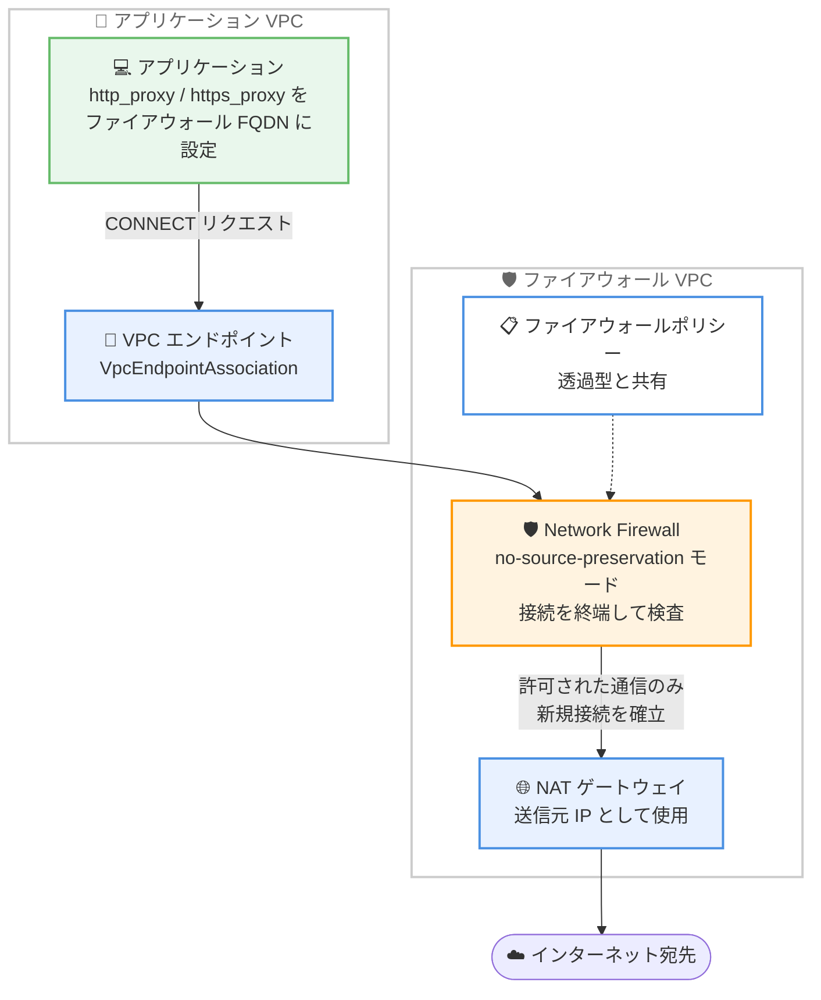

# AWS Network Firewall - フォワードプロキシ機能の再導入 (プレビュー)

**リリース日**: 2026 年 8 月 4 日
**サービス**: AWS Network Firewall
**機能**: 明示的フォワードプロキシ機能 (no-source-preservation デプロイモード、パブリックプレビュー)

📊 [このアップデートのインフォグラフィックを見る](https://takech9203.github.io/aws-news-summary/20260804-aws-network-firewall-forward-proxy-preview.html)

## 概要

AWS Network Firewall の明示的フォワードプロキシ (explicit forward proxy) 機能が、Network Firewall 本体の機能として再導入されました (パブリックプレビュー)。今回の再導入により、Network Firewall が持つ既存のすべてのフィルタリング機能をそのまま利用しながら、ファイアウォールを明示的プロキシとして動作させることができます。

もともと 2025 年 11 月 25 日に、データ持ち出し (data exfiltration) やマルウェア注入に対する集中的なセキュリティ制御を実現する目的で、「Network Firewall proxy」がスタンドアロン製品としてパブリックプレビュー公開されていました。しかし、この初期バージョンは独自の「プロキシセキュリティポリシー」を持つ別製品であり、既存の Network Firewall (透過型ファイアウォール) とはポリシーが分離していました。プレビューに参加したお客様から、Network Firewall の既存機能との同等性と、統一されたセキュリティポリシーへの要望が寄せられたことを受け、今回、明示的プロキシは Network Firewall 本体の機能として再設計されました。

新しい実装では、既存のファイアウォールポリシーを「no-source-preservation」という新しいデプロイモードで使用することでプロキシとして動作させます。単一のセキュリティポリシーを、明示的プロキシと透過型ファイアウォールの両方の機能で共有できるため、ポリシー管理が一元化されます。ネットワークセキュリティを集中管理したい企業や、アウトバウンド通信の統制を強化したいセキュリティチームが主な対象です。

**アップデート前の課題**

- 2025 年 11 月のプレビュー版 Network Firewall proxy はスタンドアロン製品であり、独自のプロキシセキュリティポリシーを別途管理する必要があった
- 透過型ファイアウォールとプロキシでポリシーが分離しており、同じ制御を二重に定義・運用する必要があった
- プロキシ側では Network Firewall の既存機能 (マネージドルールグループ、Geo-IP フィルタリングなど) との機能同等性がなかった

**アップデート後の改善**

- Network Firewall の既存のすべてのフィルタリング機能を明示的プロキシとして利用可能になった
- 単一のファイアウォールポリシーを透過型ファイアウォールとプロキシの両モードで共有できるようになり、ポリシー管理が一元化された
- マネージドルールグループ、Active Threat Defense、Geo-IP フィルタリング、URL / ドメインカテゴリフィルタリング、Amazon EKS / Amazon ECS 向けコンテナ属性ベースのルールがプロキシモードでも利用可能になった

## アーキテクチャ図



アプリケーションはプロキシ環境変数でファイアウォールの FQDN を指定し、VPC エンドポイント経由で CONNECT リクエストを送信します。ファイアウォールは接続を終端してフィルタリングし、許可された通信のみ NAT ゲートウェイの IP アドレスを送信元として宛先へ新規接続を確立します。

## サービスアップデートの詳細

### 主要機能

1. **no-source-preservation デプロイモード**
   - ファイアウォール作成時に選択する新しいデプロイモード (作成後の変更は不可)
   - ファイアウォールがクライアント接続を終端し、トラフィックを検査した後、アタッチされた NAT ゲートウェイの IP アドレスを送信元として宛先への接続を再確立する
   - 送信元 IP アドレスがマスクされるため「no-source-preservation」と呼ばれる
   - デフォルトの source-preservation モード (透過型) では従来どおり送信元 IP が保持される

2. **明示的プロキシとしての動作**
   - クライアントは HTTP CONNECT リクエストをファイアウォールに送信し、ファイアウォールがクライアントに代わって宛先へ接続する
   - ファイアウォールには FQDN が割り当てられ、クライアントはこのホスト名をプロキシ設定 (`http_proxy` / `https_proxy` 環境変数など) に指定する
   - ルートテーブルの変更が不要で、VPC エンドポイント経由でトラフィックがファイアウォールに到達する
   - プロキシリスナーポートはデフォルトで HTTP 3128 / HTTPS 8443 (変更可能)

3. **既存フィルタリング機能との完全な統合**
   - マネージドルールグループ
   - Active Threat Defense
   - Geo-IP フィルタリング
   - URL / ドメインカテゴリフィルタリング
   - Amazon EKS / Amazon ECS 向けコンテナ属性ベースのルール
   - 単一のファイアウォールポリシーを透過型ファイアウォールとプロキシの両方で共有可能

4. **マルチ VPC 対応**
   - `CreateVpcEndpointAssociation` API で任意の VPC に VPC エンドポイントをデプロイし、複数 VPC のアプリケーションから同一のプロキシを利用可能
   - Network Firewall がプライベートホストゾーンを自動作成し、関連付けられた VPC 内でファイアウォールのホスト名が解決される

## 技術仕様

### デプロイモードの比較

| 項目 | source-preservation (デフォルト) | no-source-preservation (プレビュー) |
|------|----------------------------------|-------------------------------------|
| 動作 | 透過型ファイアウォール | 明示的フォワードプロキシ + 透過型 |
| 送信元 IP | 保持される | NAT ゲートウェイの IP に置換 |
| トラフィック誘導 | VPC ルートテーブル | プロキシ設定 (環境変数など)、ルート変更不要 |
| クライアント設定 | 不要 (透過) | 必要 (FQDN とリスナーポートを指定) |
| ステートレスルール | 利用可能 | プロキシトラフィックには非適用 (ステートフルエンジンが直接処理) |
| NAT ゲートウェイ | 任意 | 必須 (ファイアウォールにアタッチ) |
| モード変更 | 作成後の変更不可 | 作成後の変更不可 |

### 前提となるリソース構成

| 項目 | 詳細 |
|------|------|
| NAT ゲートウェイ | ファイアウォールと同じ VPC / アベイラビリティーゾーンに必要 |
| ファイアウォールエンドポイント | NAT ゲートウェイと同じアベイラビリティーゾーン、かつ別のサブネットに作成 |
| リスナーポート | デフォルト: HTTP 3128、HTTPS 8443 |
| FQDN | ファイアウォール作成後、ステータスが READY になると `DnsName` として表示 |

### API 変更履歴

| 日付 | サービス | 変更内容 |
|------|----------|----------|
| 2026/08/03 | [AWS Network Firewall](https://awsapichanges.com/archive/changes/9e1c25-network-firewall.html) | 1 new 6 updated api methods - Network Firewall を明示的プロキシとして使用し、データ持ち出しの脅威からワークロードを保護する機能の追加 |

## 設定方法

### 前提条件

1. AWS Network Firewall を利用可能な AWS アカウント (プレビューは米国東部 (オハイオ) リージョンのみ)
2. ファイアウォールをデプロイする VPC と、エンドポイント用サブネット (NAT ゲートウェイとは別サブネット)
3. 同じアベイラビリティーゾーンに存在する NAT ゲートウェイ

### 手順

#### ステップ 1: ファイアウォールポリシーの作成

```bash
aws network-firewall create-firewall-policy \
  --firewall-policy-name proxy-policy \
  --firewall-policy '{
    "StatelessDefaultActions": ["aws:forward_to_sfe"],
    "StatelessFragmentDefaultActions": ["aws:forward_to_sfe"],
    "StatefulRuleGroupReferences": [
      {"ResourceArn": "arn:aws:network-firewall:us-east-2:aws-managed:stateful-rulegroup/MalwareDomainsActionOrder"}
    ]
  }' \
  --region us-east-2
```

ルールグループを指定してファイアウォールポリシーを作成します。カスタムルールグループのほか、AWS マネージドルールグループやパートナーマネージドルールグループも使用できます。このポリシーは透過型ファイアウォールとプロキシの両方で共有できます。

#### ステップ 2: NAT ゲートウェイの作成 (存在しない場合)

```bash
aws ec2 create-nat-gateway \
  --subnet-id subnet-0123456789abcdef0 \
  --allocation-id eipalloc-0123456789abcdef0 \
  --region us-east-2
```

ファイアウォールは NAT ゲートウェイにアタッチされ、その IP アドレスを使用して宛先と通信します。デプロイ先の VPC / アベイラビリティーゾーンに NAT ゲートウェイがない場合は作成します。

#### ステップ 3: no-source-preservation モードでファイアウォールを作成

マネジメントコンソールまたは API でファイアウォールを作成する際、デプロイモードとして「No source preservation」を選択し、以下を設定します。

1. アタッチする NAT ゲートウェイを指定 (この NAT ゲートウェイの IP がエグレスに使用される)
2. ファイアウォールエンドポイントを配置する VPC とサブネットを指定 (NAT ゲートウェイと同じアベイラビリティーゾーン、別サブネット)
3. ステップ 1 で作成したファイアウォールポリシーを関連付け
4. 必要に応じて詳細設定 (削除保護、トラフィック分析モード、プロキシリスナーポート、ログ記録) を構成

作成後、ステータスが PROVISIONING から READY に遷移すると、「Endpoints and identity」セクションにプロキシの FQDN (`DnsName`) が表示されます。

#### ステップ 4: ワークロードのプロキシ設定

```bash
export http_proxy=http://<firewall-dns-name>:3128
export https_proxy=http://<firewall-dns-name>:8443
```

アプリケーションのプロキシ環境変数にファイアウォールの `DnsName` と設定済みリスナーポートを指定します。明示的プロキシ設定のため、ルートテーブルの変更は不要です。ホスト名は自動作成されるプライベートホストゾーンによりローカル VPC エンドポイントの IP アドレスに解決されます。

#### ステップ 5: 他の VPC への拡張 (オプション)

```bash
aws network-firewall create-vpc-endpoint-association \
  --firewall-arn <firewall-arn> \
  --vpc-id vpc-0123456789abcdef0 \
  --subnet-mapping SubnetId=subnet-0123456789abcdef0 \
  --region us-east-2
```

VPC エンドポイント関連付けを作成することで、他の VPC のアプリケーションからも同一のプロキシを利用できます。Network Firewall がプライベートホストゾーンを自動作成し、関連付けた VPC 内でもファイアウォールのホスト名が解決されます。

## メリット

### ビジネス面

- **セキュリティ統制の一元化**: 単一のファイアウォールポリシーで透過型ファイアウォールとプロキシの両方を統制でき、ポリシーの二重管理によるコストと設定ミスのリスクを削減できる
- **データ持ち出し対策の強化**: アウトバウンド通信をプロキシで終端・検査することで、データ持ち出しやマルウェア注入に対する集中的なセキュリティ制御を実現できる
- **サードパーティプロキシの代替可能性**: マネージドサービスとして提供されるため、自己管理型のプロキシサーバー (Squid など) の構築・運用負荷を軽減できる

### 技術面

- **ルーティング設定の簡素化**: 明示的プロキシ方式のため、ルートテーブルの変更が不要で、クライアント側のプロキシ設定のみでトラフィックを誘導できる
- **既存機能の完全活用**: マネージドルールグループ、Active Threat Defense、Geo-IP フィルタリング、URL / ドメインカテゴリフィルタリング、コンテナ属性ベースのルールをプロキシモードでもそのまま利用できる
- **マルチ VPC 対応**: VPC エンドポイント関連付けにより、複数 VPC のワークロードから単一のプロキシを共有でき、プライベートホストゾーンによる名前解決も自動化される

## デメリット・制約事項

### 制限事項

- パブリックプレビューであり、米国東部 (オハイオ) リージョン (us-east-2) のみで利用可能
- 機能と動作はプレビュー期間中に変更される可能性がある
- デプロイモードはファイアウォール作成時に選択し、作成後に変更できない
- ステートレスルールエンジンは明示的プロキシトラフィックを検査しない (CONNECT リクエストはステートフルルールエンジンが直接処理)
- ファイアウォールエンドポイントは、アタッチした NAT ゲートウェイと同じアベイラビリティーゾーンにのみ作成可能

### 考慮すべき点

- クライアント側でプロキシ設定 (環境変数やアプリケーション設定) が必要であり、透過型と異なりワークロード側の変更が発生する
- 送信元 IP が NAT ゲートウェイの IP に置換されるため、宛先側で送信元 IP に基づく制御を行っている場合は影響を確認する必要がある
- AWS はテスト環境での試用を推奨しており、本番環境への適用は GA を待つことが望ましい
- 既存の透過型 Network Firewall とはデプロイモードが異なるため、プロキシ化には新規ファイアウォールの作成が必要

## ユースケース

### ユースケース 1: アウトバウンド通信の集中統制によるデータ持ち出し対策

**シナリオ**: 金融機関が、複数 VPC にまたがるワークロードからのインターネットアクセスを単一のプロキシに集約し、許可されたドメインへの通信のみを許可したい。

**実装例**:
```
1. 許可ドメインリストを定義したステートフルルールグループを作成
2. no-source-preservation モードのファイアウォールを作成しポリシーを関連付け
3. 各ワークロード VPC に VPC エンドポイント関連付けを作成
4. 全ワークロードの https_proxy にファイアウォールの FQDN を設定
```

**効果**: すべてのアウトバウンド通信がプロキシで終端・検査され、未許可ドメインへのデータ持ち出しを一元的に遮断できる。

### ユースケース 2: 透過型ファイアウォールとプロキシのポリシー統一

**シナリオ**: すでに Network Firewall を透過型で運用している企業が、プロキシ対応アプリケーション向けに明示的プロキシも提供したいが、セキュリティポリシーは一本化したい。

**実装例**:
```
1. 既存のファイアウォールポリシーをそのまま利用
2. no-source-preservation モードの新しいファイアウォールを作成し、
   同一ポリシーを関連付け
3. プロキシ対応アプリケーションのみプロキシ設定を追加
```

**効果**: 単一ポリシーで両モードを統制でき、ルール変更が透過型とプロキシの両方に即時反映されるため、運用負荷とポリシー乖離のリスクを削減できる。

### ユースケース 3: EKS / ECS ワークロードのコンテナ単位のエグレス制御

**シナリオ**: Amazon EKS 上のマイクロサービスごとに、アクセス可能な外部 API を制限したい。

**実装例**:
```
1. コンテナ属性ベースのルールを含むルールグループを作成
2. no-source-preservation モードのファイアウォールにポリシーを関連付け
3. Pod のプロキシ環境変数にファイアウォールの FQDN を設定
```

**効果**: コンテナ属性に基づくきめ細かなエグレス制御をプロキシ経由で適用でき、マイクロサービス単位の最小権限通信を実現できる。

## 料金

パブリックプレビュー期間中、明示的プロキシ機能 (no-source-preservation モード) は無料で利用できます。

なお、NAT ゲートウェイやログ記録など、関連リソースには通常の料金が発生する可能性があります。GA 時の料金体系は別途発表される見込みです。詳細は [AWS Network Firewall 料金ページ](https://aws.amazon.com/network-firewall/pricing/) を参照してください。

## 利用可能リージョン

パブリックプレビューは米国東部 (オハイオ) リージョン (us-east-2) のみで利用可能です。

## 関連サービス・機能

- **Amazon VPC NAT ゲートウェイ**: no-source-preservation モードのファイアウォールがアタッチする必須コンポーネント。宛先への通信の送信元 IP として使用される
- **AWS PrivateLink (VPC エンドポイント)**: アプリケーション VPC からファイアウォールへトラフィックを送るための接続手段。VPC エンドポイント関連付けで複数 VPC に展開できる
- **AWS Firewall Manager**: AWS Organizations 配下の複数アカウントにわたる Network Firewall の一元管理に利用可能
- **Route 53 プライベートホストゾーン**: ファイアウォールの FQDN を関連付けた VPC 内で解決するために自動作成される

## 参考リンク

- 📊 [インフォグラフィック](https://takech9203.github.io/aws-news-summary/20260804-aws-network-firewall-forward-proxy-preview.html)
- [公式発表 (What's New)](https://aws.amazon.com/about-aws/whats-new/2026/08/aws-network-firewall-forward-proxy-preview/)
- [ドキュメント: no-source-preservation モード](https://docs.aws.amazon.com/network-firewall/latest/developerguide/nfw-no-source-preservation.html)
- [ドキュメント: What is AWS Network Firewall?](https://docs.aws.amazon.com/network-firewall/latest/developerguide/what-is-aws-network-firewall.html)
- [料金ページ](https://aws.amazon.com/network-firewall/pricing/)

## まとめ

AWS Network Firewall の明示的フォワードプロキシが、独立製品ではなく Network Firewall 本体の機能として再導入され、既存のすべてのフィルタリング機能と統一ポリシーで利用できるようになりました。透過型ファイアウォールとプロキシのセキュリティ統制を一元化できる点は、アウトバウンド通信の統制やデータ持ち出し対策を強化したい組織にとって大きな価値があります。現時点では米国東部 (オハイオ) リージョン限定のプレビューであり無料で試用できるため、テスト環境での検証を通じて GA に備えることを推奨します。
