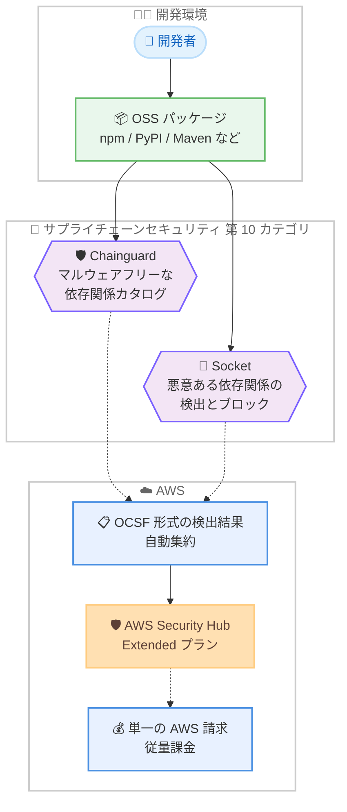

# AWS Security Hub - Extended プランに 10 番目のカテゴリとしてサプライチェーンセキュリティを追加

**リリース日**: 2026 年 8 月 4 日
**サービス**: AWS Security Hub
**機能**: Security Hub Extended プランのサプライチェーンセキュリティカテゴリ

📊 [このアップデートのインフォグラフィックを見る](https://takech9203.github.io/aws-news-summary/20260804-aws-security-hub-extended-adds-supply-chain-security.html)

## 概要

AWS Security Hub の Extended プランに、10 番目のセキュリティカテゴリとして「サプライチェーンセキュリティ (Supply Chain Security)」が追加されました。キュレーションされたパートナーとして Chainguard と Socket の 2 社が参加し、Extended プラン全体のパートナーソリューション数は 23 に拡大しました。

開発者が大規模にオープンソースライブラリを採用する中で、セキュリティチームには「環境に入ってくるパッケージが信頼でき、悪意のあるコードを含まないこと」への確信が求められています。今回の追加により、悪意のある依存関係がアプリケーションにビルドされる前に検出・ブロックできるようになります。他の Extended カテゴリと同様に、簡素化されたアクティベーションと従量課金 (pay-as-you-go) で利用でき、すべてのソリューションが単一の AWS 請求にまとめられ、長期コミットメントは不要です。

Security Hub Extended は、エンドポイント、アイデンティティ、メール、ネットワーク、データ、ブラウザ、クラウド、AI、セキュリティオペレーション、そしてサプライチェーンにわたるフルスタックのエンタープライズセキュリティソリューションの調達・デプロイ・統合を簡素化する、AWS Security Hub 内のプランです。参加するすべてのソリューションからのセキュリティ検出結果は Open Cybersecurity Schema Framework (OCSF) 形式で出力され、AWS Security Hub に自動的に集約されます。

**アップデート前の課題**

- OSS パッケージのサプライチェーンセキュリティ対策には、サードパーティツールを個別に調達・契約・統合する必要があった
- ベンダーごとに契約や請求が分かれ、調達プロセスが複雑だった
- サプライチェーンセキュリティツールの検出結果を Security Hub に集約するには、個別のインテグレーション設定が必要だった

**アップデート後の改善**

- Security Hub コンソールから Chainguard および Socket のソリューションを簡素化された手順で有効化できるようになった
- 悪意のある依存関係をアプリケーションにビルドされる前に検出・ブロックできるようになった
- 検出結果が OCSF 形式で自動的に Security Hub に集約され、他のカテゴリの検出結果と横断的にリスクを特定・対応できるようになった
- 単一の AWS 請求・従量課金・長期コミットメント不要で利用できるようになった

## アーキテクチャ図

開発者が利用する OSS パッケージを Chainguard と Socket が検査し、悪意のある依存関係をビルド前にブロックします。両ソリューションの検出結果は OCSF 形式で AWS Security Hub に自動集約され、課金は単一の AWS 請求に統合されます。

## サービスアップデートの詳細

### 主要機能

1. **サプライチェーンセキュリティカテゴリの追加**
   - Extended プランの 10 番目のセキュリティカテゴリとして追加
   - エンドポイント、アイデンティティ、メール、ネットワーク、データ、ブラウザ、クラウド、AI、セキュリティオペレーションに続くカテゴリ
   - キュレーションされたパートナーソリューションは合計 23 に拡大

2. **Chainguard による信頼できる依存関係の提供**
   - npm、PyPI、Maven Central などの代替となる、マルウェアフリーの OSS 依存関係カタログ (Chainguard Libraries) を提供
   - SLSA L3 準拠環境でのリビルドと署名付き SBOM を提供 (料金ページ記載)

3. **Socket による悪意ある依存関係の検出・ブロック**
   - Socket Firewall がインストール時に悪意のある依存関係をブロック (料金ページ記載)
   - Socket SCA が到達可能性フィルタリングにより、実際に影響のある脆弱性を特定 (料金ページ記載)

4. **OCSF 形式での検出結果の自動集約**
   - 参加ソリューションの検出結果は Open Cybersecurity Schema Framework (OCSF) で出力
   - AWS Security Hub に自動的に集約され、AWS とパートナーのソリューションを組み合わせて境界をまたぐリスクを迅速に特定・対応可能

## 技術仕様

### Extended プランの概要

| 項目 | 詳細 |
|------|------|
| プランの位置付け | AWS Security Hub 内のオプションプラン (Essentials プランに追加) |
| セキュリティカテゴリ数 | 10 (今回サプライチェーンセキュリティを追加) |
| パートナーソリューション数 | 23 |
| 今回追加されたパートナー | Chainguard、Socket |
| 検出結果の形式 | OCSF (Open Cybersecurity Schema Framework) |
| 請求 | 単一の AWS 請求に統合、従量課金、長期コミットメント不要 |

## 設定方法

### 前提条件

1. AWS Security Hub が有効化されていること
2. Security Hub Extended プランを利用できるリージョンであること

### 手順

#### ステップ 1: Security Hub コンソールにアクセス

[AWS Security Hub コンソール](https://console.aws.amazon.com/securityhub/v2/home) を開きます。Extended プランのパートナーソリューションは、コンソールから直接有効化できます。

#### ステップ 2: サプライチェーンセキュリティカテゴリのソリューションを有効化

Extended プランのカテゴリからサプライチェーンセキュリティを選択し、Chainguard または Socket のソリューションを有効化します。他の Extended カテゴリと同じ簡素化されたアクティベーションフローで利用を開始できます。

#### ステップ 3: 検出結果の確認

有効化したソリューションからのセキュリティ検出結果は OCSF 形式で出力され、AWS Security Hub に自動的に集約されます。Security Hub 上で他のカテゴリの検出結果と合わせて確認・対応できます。

## メリット

### ビジネス面

- **調達の簡素化**: サードパーティのサプライチェーンセキュリティツールを個別契約なしで調達でき、単一の AWS 請求に統合される
- **コミットメント不要**: 長期契約なしの従量課金で、スモールスタートが可能
- **フルスタックのカバレッジ**: 10 カテゴリ・23 ソリューションにより、エンタープライズセキュリティを幅広くカバー

### 技術面

- **ビルド前のブロック**: 悪意のある依存関係がアプリケーションにビルドされる前に検出・ブロックできる
- **検出結果の一元化**: OCSF 形式での自動集約により、境界をまたぐリスクを Security Hub 上で横断的に把握できる
- **迅速な導入**: Security Hub コンソールからの簡素化されたアクティベーションで、統合作業の負担を軽減

## デメリット・制約事項

### 制限事項

- Extended プランは Security Hub が利用可能な AWS 商用リージョンが対象 (今回の 2 ソリューションは全 AWS 商用リージョンで利用可能)
- 料金ページによると、Security Hub の無料トライアルおよびコスト見積もりツールには Extended プランの料金は含まれない

### 考慮すべき点

- パートナーソリューションごとに課金単位が異なる (開発者単位、パッケージ単位、ユーザー単位など) ため、自社の利用規模に応じたコスト試算が必要
- 既に個別契約で Chainguard や Socket を利用している場合は、Extended プラン経由への移行可否や条件の確認が必要

## ユースケース

### ユースケース 1: OSS 依存関係のマルウェア混入防止

**シナリオ**: 開発チームが npm や PyPI のパッケージを大量に利用しており、悪意のあるパッケージの混入リスクを低減したい。

**実装例**: Security Hub コンソールから Socket を有効化し、パッケージインストール時に悪意のある依存関係をブロックする。

**効果**: 悪意のあるコードがビルドに取り込まれる前に検出・ブロックでき、サプライチェーン攻撃のリスクを低減できる。

### ユースケース 2: 信頼できる依存関係カタログへの切り替え

**シナリオ**: セキュリティ要件の厳しい組織で、利用する OSS ライブラリの出所と完全性を保証したい。

**実装例**: Security Hub コンソールから Chainguard を有効化し、マルウェアフリーの依存関係カタログ (Chainguard Libraries) を開発環境の依存関係取得元として利用する。

**効果**: 署名付き SBOM を含む信頼性の高い依存関係を利用でき、パッケージの信頼性への確信を持って開発を進められる。

### ユースケース 3: セキュリティ検出結果の一元管理

**シナリオ**: エンドポイントやクラウドなど複数カテゴリのセキュリティソリューションを利用しており、サプライチェーン領域の検出結果も同じ基盤で管理したい。

**実装例**: Extended プランでサプライチェーンセキュリティカテゴリのソリューションを追加有効化し、OCSF 形式の検出結果を Security Hub に自動集約する。

**効果**: 境界をまたぐリスクを Security Hub 上で横断的に特定・対応でき、セキュリティ運用を効率化できる。

## 料金

Extended プランは、有効化したソリューションごとの従量課金です。前払いコミットメントは不要で、単一の AWS 請求に統合されます。料金ページによると、Enterprise Discount Program (EDP) クレジットの対象です。

### サプライチェーンセキュリティカテゴリの料金 (料金ページより)

**Chainguard (Chainguard Libraries)**: 開発者数に応じた段階制の月額料金

| 開発者数 | 開発者あたり月額 |
|--------|------------------|
| 1 - 10 | 100 USD |
| 11 - 50 | 75 USD |
| 51 - 100 | 40 USD |
| 101 - 200 | 18 USD |
| 201 - 300 | 12 USD |
| 301 - 500 | 9 USD |
| 501 - 2,000 | 6.25 USD |
| 2,001 - 5,000 | 5.50 USD |
| 5,001 - 10,000 | 3.75 USD |
| 10,000 超 | 2.25 USD |

**Socket**: Socket Firewall はパッケージ単位、Socket SCA はユーザー単位の月額料金

| ソリューション | 課金単位 | 料金 |
|----------------|----------|------|
| Socket Firewall | パッケージ/月 | 0 - 150,000: 0.26 USD、150,001 - 750,000: 0.22 USD、750,001 - 2,000,000: 0.18 USD、2,000,000 超: 0.14 USD |
| Socket SCA | ユーザー/月 | 66 USD |

最新の料金は [AWS Security Hub 料金ページ](https://aws.amazon.com/security-hub/pricing/) を参照してください。

## 利用可能リージョン

新しい 2 つのキュレーションされたパートナーソリューションは、Security Hub が利用可能なすべての AWS 商用リージョンで本日から利用可能です。対応リージョンの一覧は [AWS リージョン別サービス表](https://aws.amazon.com/about-aws/global-infrastructure/regional-product-services/) を参照してください。

## 関連サービス・機能

- **AWS Security Hub (Essentials プラン)**: Extended プランの基盤となるプラン。リスク分析、脆弱性管理、ポスチャ管理、ワークフロー自動化を提供
- **Open Cybersecurity Schema Framework (OCSF)**: 参加ソリューションの検出結果の共通スキーマ。Security Hub への自動集約を実現
- **Amazon Inspector**: ソフトウェアの脆弱性管理を提供する AWS サービス。SBOM 生成機能などサプライチェーン関連機能とも関連

## 参考リンク

- 📊 [インフォグラフィック](https://takech9203.github.io/aws-news-summary/20260804-aws-security-hub-extended-adds-supply-chain-security.html)
- [公式発表 (What's New)](https://aws.amazon.com/about-aws/whats-new/2026/08/aws-security-hub-extended-adds-supply-chain-security)
- [AWS Security Hub 製品ページ](https://aws.amazon.com/security-hub/)
- [AWS Security Hub 料金ページ](https://aws.amazon.com/security-hub/pricing/)
- [AWS Security Hub コンソール](https://console.aws.amazon.com/securityhub/v2/home)

## まとめ

Security Hub Extended プランにサプライチェーンセキュリティカテゴリが追加され、Chainguard と Socket により悪意のある OSS 依存関係をビルド前に検出・ブロックできるようになりました。OSS サプライチェーン攻撃への対策を検討している組織は、個別調達なしの従量課金・単一請求で導入できるため、Security Hub コンソールから対象ソリューションの有効化を検討することを推奨します。
