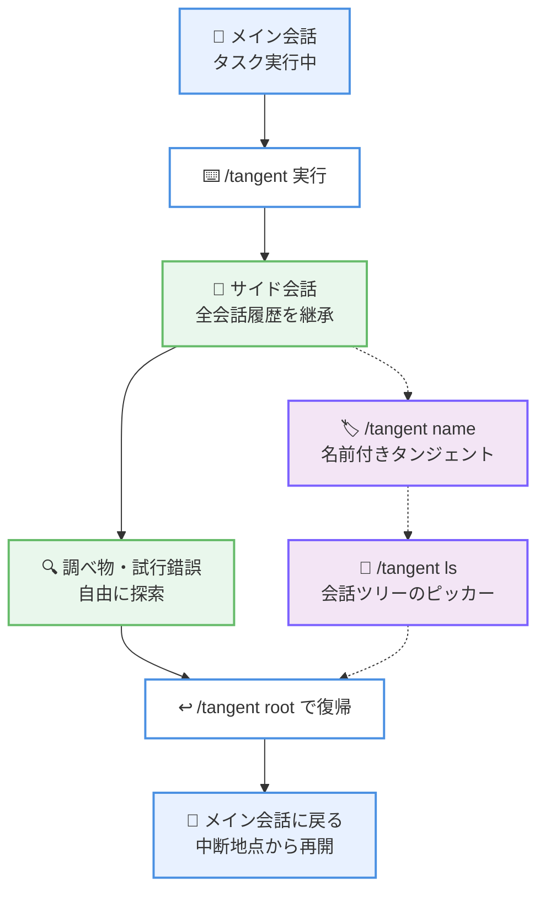

# Kiro - タンジェントによるサイド会話と /context のツール別トークン内訳

**リリース日**: 2026 年 8 月 4 日
**サービス**: Kiro (Kiro CLI v2.16)
**機能**: Tangent Side-Conversations and Per-Tool Token Breakdown

📊 [このアップデートのインフォグラフィックを見る](https://takech9203.github.io/aws-news-summary/20260804-kiro-changelog-2026-08-04.html)

## 概要

Kiro CLI v2.16 系のリリースで、会話を分岐させる「タンジェント (tangent)」機能が導入されました。`/tangent` コマンドを実行すると、それまでの会話履歴をすべて継承したサイド会話に分岐し、自由に調査や試行錯誤を行った後、中断した地点に正確に戻ることができます。タンジェントは V3 モード (`kiro-cli --v3`) で利用できます。

あわせて、`/context` コマンドにツール別のトークン消費内訳が追加されました。ビルトインツール、MCP サーバー、エージェントというソース別にグループ化して表示されるため、コンテキストウィンドウを何が消費しているのかを正確に把握できます。さらに 8 月 4 日のパッチ 2.16.1 では、`kiro-cli crew` による Kiro Crew の起動、ステータスラインのカスタマイズ、V3 の各種修正などが含まれています。

**アップデート前の課題**

このアップデート以前には、以下の課題がありました。

- タスクの途中で別の調べ物をすると、メインの会話スレッドが無関係な内容で汚染され、エージェントの精度やコンテキスト効率が低下していた
- 調査用に別セッションを開始すると、それまでの会話履歴を引き継げず、前提を再説明する必要があった
- `/context` ではコンテキストウィンドウの使用量の概要しか確認できず、どのツールがどれだけトークンを消費しているのか特定できなかった

**アップデート後の改善**

今回のアップデートにより、以下が可能になりました。

- `/tangent` でメインスレッドを汚染せずにサイド会話へ分岐し、全履歴を継承したまま自由に探索できるようになった
- `/tangent ls` の会話ツリーのビジュアルピッカーや `/tangent root` により、複数の分岐を管理し、任意の深さからメイン会話へ即座に復帰できるようになった
- `/context` のツール別トークン内訳により、コンテキスト消費の原因をソース別 (ビルトイン、MCP サーバー、エージェント) に特定できるようになった

## アーキテクチャ図



タンジェント機能の流れを示しています。メイン会話から `/tangent` で分岐したサイド会話は全履歴を継承し、探索後は `/tangent root` で中断地点に正確に戻れます。名前付きタンジェントとビジュアルピッカーにより、複数の分岐を管理できます。

## サービスアップデートの詳細

### 主要機能

1. **タンジェントによるサイド会話 (V3)**
   - `/tangent` を実行すると、それまでの会話内容をすべて継承したサイド会話に分岐する
   - サイド会話での探索内容はメインスレッドに影響せず、コンテキストの汚染を防げる
   - `/tangent <name>` で名前付きのタンジェントを作成できる
   - `/tangent ls` で会話ツリー全体をビジュアルピッカーで閲覧できる
   - `/tangent root` により、どの深さからでもメイン会話に直接戻れる
   - V3 モード (`kiro-cli --v3`) で利用可能

2. **`/context` のツール別トークン内訳**
   - コンテキストウィンドウのトークン消費をツール単位で表示する
   - ソース別 (ビルトイン、MCP サーバー、エージェント) にグループ化される
   - コンテキスト使用率は `/model` でモデルを切り替えた際に再計算されるよう修正された

3. **パッチ 2.16.1 (2026 年 8 月 4 日) の改善**
   - `kiro-cli crew` で Kiro Crew を起動できるようになった。macOS と Linux では未インストール時に Kiro CLI がインストールを実行でき、`--yes` または `-y` でインストール確認をスキップできる
   - `/settings` でステータスラインをカスタマイズし、日付、時刻、現在の使用率、残クレジットを表示できるようになった。変更は即時反映され、セッションをまたいで保持される
   - V2 において、macOS での長い応答や大きなプロンプト入力時の描画とタイピング応答が高速化された
   - V3 のローカルセッションでは `/agent create` がデフォルトで AI 支援による生成を使用し、`--manual` でエディタを開けるようになった

4. **パッチ 2.16.1 の主な修正**
   - V3 の `/context show` が「Your prompts」カテゴリのコンテンツを過大にカウントし、合計使用量と一致しない内訳を表示する問題を修正
   - 中断されたツール呼び出しや不整合なツール呼び出し記録の後に、一部の V3 セッションが継続できない問題を修正
   - オブジェクト形式のフックを持つレガシーエージェントプロファイルが V3 の `/agent` ピッカーに表示されない問題を修正
   - macOS の iTerm2 で、ターミナルのリサイズ後に Kiro CLI を終了するとキーボード入力が変更された状態のまま残る問題を修正

## 技術仕様

### タンジェント関連コマンド

| コマンド | 説明 |
|------|------|
| `/tangent` | 現在の会話履歴を継承したサイド会話に分岐する |
| `/tangent <name>` | 名前付きのタンジェントを作成する |
| `/tangent ls` | 会話ツリー全体をビジュアルピッカーで表示する |
| `/tangent root` | 任意の深さからメイン会話に直接復帰する |
| `/context` | ツール別トークン内訳を含むコンテキスト使用状況を表示する |

### 対象バージョン

| 項目 | 詳細 |
|------|------|
| 製品 | Kiro CLI |
| バージョン | 2.16.0 (2026 年 7 月 31 日)、パッチ 2.16.1 (2026 年 8 月 4 日) |
| タンジェント機能の前提 | V3 モード (`kiro-cli --v3`) |

## 設定方法

### 前提条件

1. Kiro CLI v2.16.1 以降がインストールされていること
2. タンジェント機能を使用する場合、V3 モードでセッションを開始すること

### 手順

#### ステップ 1: V3 モードで Kiro CLI を起動

```bash
kiro-cli --v3
```

タンジェント機能が利用できる V3 モードで Kiro CLI のセッションを開始します。

#### ステップ 2: タンジェントに分岐して探索

```bash
# サイド会話に分岐
/tangent

# 名前を付けて分岐する場合
/tangent research-api
```

現在までの会話履歴をすべて継承したサイド会話に分岐します。ここでの調査や試行錯誤はメイン会話に影響しません。

#### ステップ 3: 会話ツリーの確認とメイン会話への復帰

```bash
# 会話ツリーをビジュアルピッカーで表示
/tangent ls

# メイン会話に直接復帰
/tangent root
```

`/tangent ls` で分岐した会話の全体像を確認し、`/tangent root` でどの深さからでも中断した地点に戻れます。

#### ステップ 4: コンテキスト消費の確認

```bash
/context
```

コンテキストウィンドウの使用状況を、ビルトインツール、MCP サーバー、エージェントというソース別のツール別トークン内訳とともに表示します。

## メリット

### ビジネス面

- **開発効率の向上**: タスクの途中で発生した疑問をその場で解決でき、別セッションでの前提の再説明が不要になる
- **AI 利用コストの最適化**: コンテキスト消費の内訳を可視化することで、不要なツールや MCP サーバーを特定し、トークン使用を効率化できる
- **作業の中断リスク低減**: 探索後に中断地点へ正確に戻れるため、本来のタスクの文脈を失わない

### 技術面

- **コンテキスト汚染の防止**: サイド会話の内容がメインスレッドに混入しないため、エージェントの応答品質を維持できる
- **会話ツリーの体系的管理**: 名前付きタンジェントとビジュアルピッカーにより、複数の探索スレッドを構造的に管理できる
- **トークン消費の透明性**: ツール別・ソース別の内訳により、MCP サーバーの追加やエージェント設定がコンテキストに与える影響を定量的に把握できる

## デメリット・制約事項

### 制限事項

- タンジェント機能は V3 モード (`kiro-cli --v3`) でのみ利用可能
- Kiro CLI の機能であり、Kiro IDE のチャットでは今回のリリースの対象外
- タンジェントは分岐時点までの履歴を継承するため、大きな会話履歴を持つセッションではサイド会話側も相応のコンテキストを消費する

### 考慮すべき点

- V3 モードは従来の V2 モードと動作が異なる部分があるため、既存のワークフローでの互換性を確認することが推奨される
- `/context show` の集計に関する修正 (パッチ 2.16.1) が含まれるため、正確な内訳を得るには最新パッチへの更新が必要

## ユースケース

### ユースケース 1: 実装中のライブラリ調査

**シナリオ**: 機能実装の途中で、使用するライブラリの API 仕様を確認したくなった。メイン会話を汚染せずに調査したい。

**実装例**:
```
/tangent lib-research
→ サイド会話でライブラリの仕様や使用例を質問
/tangent root
→ メイン会話に戻り実装を継続
```

**効果**: 調査内容がメインスレッドに混入せず、実装タスクの文脈を維持したまま疑問を解決できる。

### ユースケース 2: 複数の設計案の比較検討

**シナリオ**: アーキテクチャの設計判断で複数の選択肢があり、それぞれを深掘りして比較したい。

**実装例**:
```
/tangent option-a
→ 案 A の詳細を検討
/tangent root
/tangent option-b
→ 案 B の詳細を検討
/tangent ls
→ 会話ツリーで両案の検討経緯を確認
```

**効果**: 各案の検討を独立したスレッドで行い、ビジュアルピッカーで検討の全体像を俯瞰しながら意思決定できる。

### ユースケース 3: コンテキスト消費の最適化

**シナリオ**: 長いセッションでコンテキストウィンドウの残量が減り、応答品質が低下してきた。原因を特定して対処したい。

**実装例**:
```
/context
→ ツール別トークン内訳を確認
→ 消費の大きい MCP サーバーやツールを特定し、不要なものを無効化
```

**効果**: コンテキスト消費の原因をソース別に特定し、必要なツールだけを残してセッションを効率化できる。

## 利用可能リージョン

グローバル (Kiro はリージョンに依存しないサービスです)

## 関連サービス・機能

- **Kiro CLI V3 モード**: タンジェント機能の前提となる新しいセッションモード。`/agent create` の AI 支援生成などの機能も含む
- **Kiro Crew**: `kiro-cli crew` で起動できる関連ツール。パッチ 2.16.1 で CLI からの起動とインストールに対応
- **MCP (Model Context Protocol)**: `/context` のツール別内訳では MCP サーバー由来のトークン消費がグループ化して表示される

## 参考リンク

- 📊 [インフォグラフィック](https://takech9203.github.io/aws-news-summary/20260804-kiro-changelog-2026-08-04.html)
- [Kiro Changelog: Tangent Side-Conversations and Per-Tool Token Breakdown](https://kiro.dev/changelog/cli/2-16/)
- [Kiro Changelog](https://kiro.dev/changelog/)
- [Kiro ドキュメント: Tangent (CLI V3)](https://kiro.dev/docs/cli/v3/tangent)
- [Kiro ドキュメント: CLI V3](https://kiro.dev/docs/cli/v3/)

## まとめ

Kiro CLI v2.16 のタンジェント機能は、メイン会話の文脈を守りながら自由に探索できる仕組みで、長時間のエージェントセッションにおけるコンテキスト管理の課題を解決します。`/context` のツール別トークン内訳と組み合わせることで、コンテキストウィンドウを効率的に運用できます。Kiro CLI を利用している場合は、最新パッチ 2.16.1 に更新し、V3 モードでタンジェント機能を試すことを推奨します。
