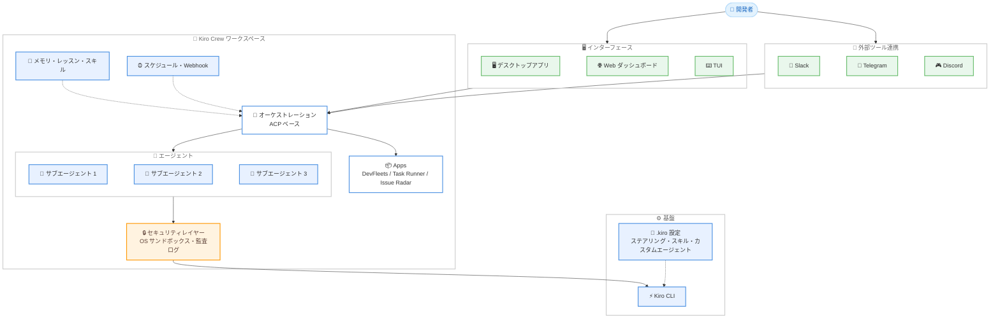

# Kiro - Kiro Crew の発表 (オープンソースのマルチエージェントワークスペース)

**リリース日**: 2026 年 8 月 4 日
**サービス**: Kiro (AWS の AI 搭載 IDE)
**機能**: Kiro Crew (オープンソースのエージェントオーケストレーションワークスペース)

📊 [このアップデートのインフォグラフィックを見る](https://takech9203.github.io/aws-news-summary/20260804-kiro-introducing-kiro-crew.html)

## 概要

Kiro チームは、複数の AI エージェントを協調させて開発作業を継続的に進める、オープンソースのワークスペース「Kiro Crew」を発表しました。Kiro Crew は、チケットのトリアージ、複数リポジトリにまたがるインシデント調査、長時間かかるマイグレーションなど、1 つのセッションに収まらない実際のエンジニアリング業務を、開発者が離席している間も自律的に進めることを目的としています。

Kiro Crew はもともと、Amazon 社内のサイドプロジェクト「MeshClaw」として開発されました。公開までの 6 か月足らずの間に、社内で 39,000 人以上の Amazon ビルダーに採用され、約 500 人のコントリビューターが 597 件のアップデートを平均週 143 コミットのペースで提供しました。この社内でのコミュニティ主導の成長が、オープンソースとして公開する決め手になったと説明されています。

Kiro Crew は Kiro CLI 上で動作し、既存の `.kiro` 設定 (ステアリングファイル、スキル、カスタムエージェント) を追加設定なしでそのまま読み込みます。デスクトップアプリ、Web ダッシュボード、TUI から利用でき、Slack、Telegram、Discord などのツールと接続して、別のインターフェースから同じ作業を継続できます。

**アップデート前の課題**

これまでの AI コーディング支援では、開発者自身がツール間の統合レイヤーとなる必要がありました。

- 実際のエンジニアリング業務はリポジトリ、ツール、レビュー、日をまたいで進行するが、AI エージェントのタスクは 1 セッション単位で完結していた
- タスクが単独で実行できても、コンテキストの再接続、引き継ぎの調整、ツール間の連携は開発者が手動で行う必要があった
- 開発者が離席すると作業が停止し、戻ってくるまで進捗が止まっていた
- 複数のタスクを同時に進めるには、プロンプトを 1 つずつ見守る必要があった

**アップデート後の改善**

Kiro Crew により、セッションをまたぐ作業の継続と複数エージェントの協調が可能になりました。

- タスクを指示して離席し、戻ってきたときにレビュー可能な成果を受け取るワークフローが実現した
- チケットキューを渡すとトリアージと割り当てを行い、担当者を特定し、注意が必要な項目をフラグする
- スケジュール実行、ハートビート監視、Webhook トリガーにより、開発者が不在でも作業が進み続ける
- メモリ、レッスン、スキルによる自己学習で、新しいセッションでもコールドスタートせずにコンテキストを引き継ぐ

## アーキテクチャ図

開発者は複数のインターフェースから Kiro Crew に指示を出し、ACP ベースのオーケストレーションが複数のサブエージェントを並列に協調させます。すべてのアクションはセキュリティレイヤーを経由し、Kiro CLI と既存の `.kiro` 設定の上で動作します。

## サービスアップデートの詳細

### 主要機能

1. **自己学習・自己進化するエージェント**
   - メモリが好み、アクティブなプロジェクトのコンテキスト、関連する履歴を新しいセッションに引き継ぐ
   - 開発者による修正が永続的なレッスンとなり、以降の動作を変える。プロジェクト固有のガイダンスとしてワークスペーススコープのレッスンにも対応
   - 繰り返されるパターンは再利用可能なスキルとなり、確認・編集・削除が可能
   - メモリ、レッスン、スキルは常に可視化され、何を引き継ぐかを開発者が制御できる

2. **不在時も継続する自律実行**
   - 定義したスケジュールで定期ジョブを実行 (例: 朝のダイジェストで要対応項目を収集)
   - ハートビートで PR やデプロイの状態変化を監視
   - 認証付き Webhook で外部イベントを起点に作業を開始
   - 推論が不要なジョブはモデル呼び出しなしでスクリプトやコマンドとして実行
   - 長時間タスクはチェックポイント、検証、リトライを通じて進行を継続

3. **マルチエージェントの協調**
   - 複数の会話をそれぞれ独立したコンテキストで同時実行
   - 独立した調査や実装をサブエージェントに委任し、結果を親の会話に返却
   - メインの会話はゴールに集中し、専門化されたエージェントが並列で作業を処理

4. **Apps による専用インターフェース**
   - カスタム UI とエージェント、スキル、スケジュール、統合、バックエンドサービスを組み合わせた共有可能な専用インターフェース
   - ローンチ時点で DevFleets (ワークツリー管理)、Task Runner (長時間タスク実行)、Issue Radar (Issue / PR トリアージ) などを提供
   - LaunchDarkly App では、LaunchDarkly の MCP サーバーと公開 API を基盤に、ワークスペースを離れずにフィーチャーフラグの参照・検索・作成・更新が可能
   - App SDK により独自の Apps を作成可能。MCP Apps とプラグインでデータとアクションを取り込める

5. **多層防御のセキュリティ**
   - OS レベルのサンドボックス、デフォルト拒否のコマンド制御、不審なパターンのブロック
   - 入力検証、機密パスのブロック、認証情報のマスキング
   - すべてのアクションの署名付き監査ログ
   - オープンソースであるため、すべてのレイヤーをソースコードで検証可能

6. **観測可能なオーケストレーション**
   - Agent Client Protocol (ACP) の背後でエージェントをオーケストレーションし、すべてのステップをリアルタイムで観測可能
   - Activity ビューで各エージェントの推論、すべてのツール呼び出し、結果をダッシュボード上のエージェントごとのカードとして表示
   - タスクの計画、並列サブエージェントの起動、ツール選択、承認ゲート、結果の統合を確認できる

7. **オープンな運営体制**
   - MAINTAINERS.md に公開されたメンテナーによるステアリングコミッティが運営
   - 提案は Pull Request として提出され、リポジトリ内で議論・決定が文書化される
   - 他の AI コーディングツールやプロバイダーとの統合を含む、あらゆる種類のコミュニティコントリビューションを受け入れる方針
   - オープンスタンダードベースの他のエージェントプラットフォーム向けに構築された資産は、変更なしで Kiro Crew でも動作

## 技術仕様

### 実行環境とインターフェース

| 項目 | 詳細 |
|------|------|
| 基盤 | Kiro CLI (ローンチ時点)。既存の `.kiro` 設定をそのまま読み込み |
| 対応 OS | macOS、Linux、Windows |
| インターフェース | デスクトップアプリ、Web ダッシュボード、TUI |
| 外部ツール連携 | Slack、Telegram、Discord、WeCom |
| 実行場所 | ローカル、または自身が管理するリモートマシン |
| プロトコル | Agent Client Protocol (ACP)、MCP |
| セキュリティ既定値 | ダッシュボードはローカルバインド。機密パスと認証情報はランタイムで保護。ツールリクエストに承認を要求可能。アクティビティはレビュー用に記録 |

## 設定方法

### 前提条件

1. macOS、Linux、Windows のいずれかの環境
2. Kiro CLI (既存の Kiro ユーザーは `.kiro` 設定がそのまま引き継がれる)

### 手順

#### ステップ 1: Kiro Crew の入手

Kiro Crew ページからダウンロードするか、GitHub リポジトリをクローンします。リポジトリには macOS、Linux、Windows 向けのセットアップ手順が含まれています。

#### ステップ 2: 外部ツールの接続

リポジトリ内のガイドに従い、Slack、Telegram、WeCom などのツールを接続します。接続後は別のインターフェースからワークスペースの状態を維持したまま同じ作業を継続できます。

#### ステップ 3: セッションをまたぐ作業から開始

公式ブログでは、マイグレーション、定期的なレビュー、監視が必要な Pull Request など、すでに 1 セッションを超えている作業から始めることが推奨されています。その後、App のインストール、繰り返しワークフローからのスキル作成、必要な統合のコントリビューションへと進めます。

## メリット

### ビジネス面

- **開発者の時間の解放**: チケットトリアージ、インシデント調査、マイグレーションなどの調整作業をエージェントに委任し、開発者は本質的な作業に集中できる
- **作業の継続性**: 会議中や退勤後もスケジュール、ハートビート、Webhook により作業が進行し、戻ったときに進捗を確認できる
- **実績のある基盤**: Amazon 社内で 39,000 人以上のビルダーに採用され、実際の業務で鍛えられた機能セットを利用できる

### 技術面

- **透明性と検証可能性**: オープンソースであり、セキュリティレイヤーを含むすべてのコードを検証できる。ブラックボックスではなく、Activity ビューで全ステップを観測可能
- **既存資産の継続利用**: `.kiro` 設定、ステアリングファイル、スキル、カスタムエージェントがそのまま動作。オープンスタンダードベースの他プラットフォーム向け資産も変更なしで利用可能
- **拡張性**: MCP によるツール接続、App SDK による独自 App の構築、オーケストレーションのカスタマイズが可能

## デメリット・制約事項

### 考慮すべき点

- コードや CI への実際のアクセスをエージェントに与えるため、サンドボックス、承認ゲート、監査ログなどのセキュリティ機能の理解と適切な設定が重要
- ローンチ時点では Kiro CLI 上での動作となる
- Apps のストアは今後拡充予定であり、必要な App がない場合は App SDK で自作するか、コミュニティへのコントリビューションが必要

## ユースケース

### ユースケース 1: チケットキューの自動トリアージ

**シナリオ**: 大量の Issue や チケットが蓄積し、担当者の割り当てと優先度判断に時間がかかっている。

**実装例**: Issue Radar App を導入し、リポジトリデータをキューとして取り込み、専用エージェントとスケジュールスキャンでトリアージを自動化する。

**効果**: Kiro Crew がトリアージと割り当てを行い、担当者を特定し、人間の注意が必要な項目のみをフラグする。

### ユースケース 2: 複数リポジトリにまたがるインシデント調査

**シナリオ**: レイテンシースパイクなどのインシデントが複数のリポジトリに関係しており、メトリクス調査、診断テスト、ログ確認を複数のツールで並行して行う必要がある。

**実装例**: 過去の類似インシデントの調査内容をメモリから引き継ぎ、独立したコンテキストを持つサブエージェントに各リポジトリの調査を委任する。

**効果**: 開発者が修正作業に集中している間に、エージェントが並列で調査を進め、結果を親の会話に統合して返す。

### ユースケース 3: 長時間マイグレーションの無人実行

**シナリオ**: 数時間かかるマイグレーションを、会議中や退勤後も止めずに進めたい。

**実装例**: マイグレーションタスクを Kiro Crew に指示し、チェックポイント、検証、リトライを設定する。進捗は Slack などの接続済みツールから確認する。

**効果**: 開発者が不在でもチェックポイントとリトライを通じて作業が進行し、朝には open PR の確認や不安定なテストの修正が完了した状態で作業を再開できる。

## 料金

Kiro Crew はオープンソースとして公開されており、GitHub リポジトリからクローンして利用できます。基盤となる Kiro 本体の料金プランについては [Kiro の料金ページ](https://kiro.dev/pricing/) を参照してください。

## 利用可能リージョン

グローバル (Kiro はリージョンに依存しないサービスです)

## 関連サービス・機能

- **Kiro CLI**: Kiro Crew のローンチ時点での実行基盤。既存の `.kiro` 設定を読み込む
- **MCP (Model Context Protocol)**: 既存ツールの接続と、MCP Apps によるデータ・アクションの取り込みに使用
- **Agent Client Protocol (ACP)**: エージェントオーケストレーションの背後で使用されるプロトコル。全ステップの観測を可能にする

## 参考リンク

- 📊 [インフォグラフィック](https://takech9203.github.io/aws-news-summary/20260804-kiro-introducing-kiro-crew.html)
- [公式発表 (Kiro Blog)](https://kiro.dev/blog/introducing-kiro-crew/)
- [Kiro Changelog](https://kiro.dev/changelog/)
- [Kiro 料金ページ](https://kiro.dev/pricing/)

## まとめ

Kiro Crew は、Amazon 社内で 39,000 人以上のビルダーに採用された実績を持つマルチエージェントワークスペースのオープンソース公開であり、セッションをまたぐ実際のエンジニアリング業務を AI エージェントに委任する新しい働き方を提示しています。既存の Kiro ユーザーは `.kiro` 設定をそのまま引き継げるため、マイグレーションや定期レビューなど、すでに 1 セッションを超えている作業から試すことを推奨します。オープンソースであるため、セキュリティレイヤーの検証や独自ワークフローへの拡張も可能です。
