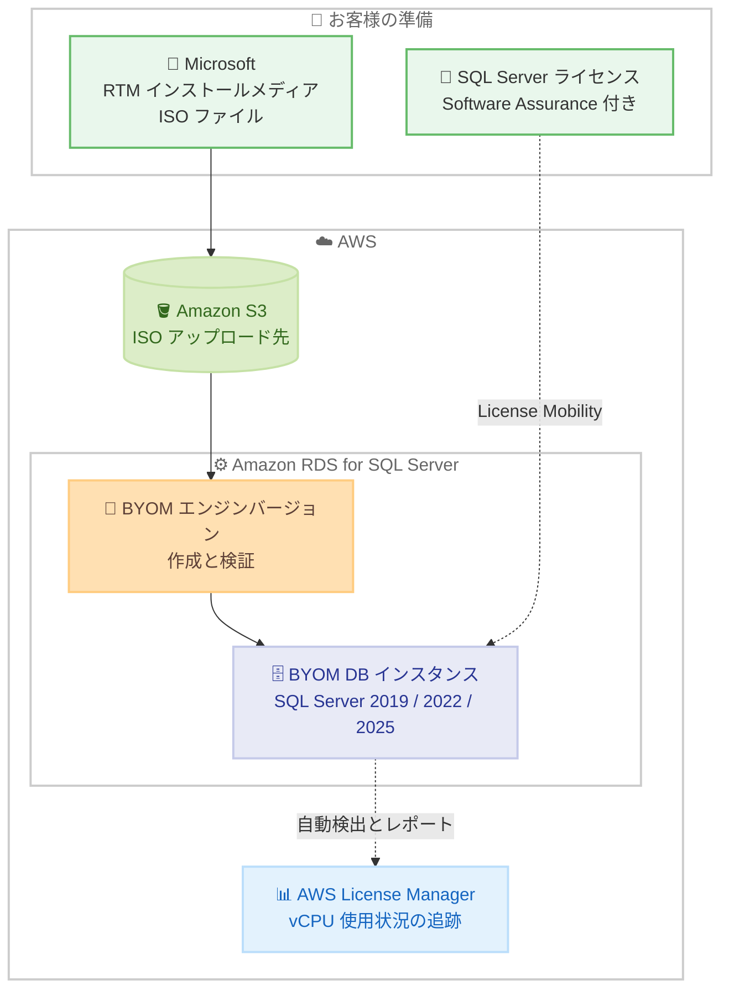

# Amazon RDS for SQL Server - BYOM が 10 の追加商用リージョンで利用可能に

**リリース日**: 2026 年 8 月 4 日
**サービス**: Amazon RDS for SQL Server
**機能**: Bring Your Own Media (BYOM) のリージョン拡大

📊 [このアップデートのインフォグラフィックを見る](https://takech9203.github.io/aws-news-summary/20260804-rds-sql-server-supports-byom-in-additional-aws-regions.html)

## 概要

Amazon RDS for SQL Server の Bring Your Own Media (BYOM) が、新たに 10 の商用 AWS リージョンで利用可能になりました。追加されたのは、アジアパシフィック (台北、ハイデラバード、ジャカルタ、マレーシア、メルボルン、ニュージーランド、タイ)、欧州 (ミラノ、スペイン)、メキシコ (中部) の各リージョンです。

BYOM を使用すると、Microsoft の License Mobility through Software Assurance プログラムを通じて、アクティブな Software Assurance 付きの既存 Microsoft SQL Server ライセンスを再利用しながら、Amazon RDS をマネージドデータベースサービスとして採用できます。BYOM は SQL Server 2019、2022、2025 でサポートされています。また、AWS License Manager と統合されており、AWS 環境全体でライセンス使用状況を追跡し、コンプライアンスを維持できます。

今回のリージョン拡大により、これまで BYOM を利用できなかったリージョンでワークロードを運用している組織も、既存の SQL Server ライセンス投資を活用しつつ RDS のマネージド運用の恩恵を受けられるようになります。

**アップデート前の課題**

- 追加された 10 リージョンでは BYOM を利用できず、RDS for SQL Server を使用する場合はライセンス込み (License Included) モデルを選択する必要があった
- 既存の SQL Server ライセンスと Software Assurance を保有していても、これらのリージョンではライセンスコストを二重に負担する形になっていた
- ライセンス持ち込みを優先する場合は、EC2 上でのセルフマネージド運用 (BYOL) を選択する必要があり、パッチ適用やバックアップなどの運用負荷が発生していた

**アップデート後の改善**

- 台北、ハイデラバード、ジャカルタ、マレーシア、メルボルン、ニュージーランド、タイ、ミラノ、スペイン、メキシコ中部の各リージョンで BYOM を利用可能になった
- 既存の SQL Server ライセンスを再利用することで、これらのリージョンでも SQL Server ライセンス料金の支払いなしに RDS を利用できるようになった
- データレジデンシー要件のあるワークロードでも、ローカルリージョンでライセンス持ち込みとマネージド運用を両立できるようになった

## アーキテクチャ図



BYOM のワークフローを示しています。Microsoft からダウンロードした RTM インストールメディアを S3 にアップロードし、RDS が BYOM エンジンバージョンを作成して DB インスタンスを起動します。ライセンスは License Mobility プログラムを通じて持ち込み、AWS License Manager が使用状況を自動追跡します。

## サービスアップデートの詳細

### 主要機能

1. **10 の追加商用リージョンでの BYOM 利用**
   - アジアパシフィック: 台北、ハイデラバード、ジャカルタ、マレーシア、メルボルン、ニュージーランド、タイ
   - 欧州: ミラノ、スペイン
   - メキシコ: 中部
   - 既存対応リージョン (東京、バージニア北部、フランクフルトなど) と合わせて利用可能リージョンが拡大

2. **既存ライセンスの再利用によるコスト最適化**
   - Microsoft の License Mobility through Software Assurance プログラムを通じて既存の SQL Server ライセンスを持ち込み可能
   - AWS は SQL Server ライセンス料金を課金せず、インフラストラクチャ (コンピューティング、ストレージ、I/O、データ転送) と Windows OS 料金のみを支払う
   - SQL Server 2019、2022、2025 の Enterprise Edition および Standard Edition をサポート (Developer Edition も一部機能差異ありでサポート)

3. **AWS License Manager との統合**
   - BYOM インスタンスを自動検出し、vCPU 使用状況をレポート
   - AWS 環境全体での SQL Server ライセンス消費の可視化
   - Microsoft ライセンスコンプライアンスの監査対応レポートを提供

4. **License Included と同等のマネージド運用**
   - パッチ適用、自動バックアップ、ポイントインタイムリカバリ、Multi-AZ フェイルオーバー、モニタリングを RDS が管理
   - RDS が必要な累積更新プログラムを自動適用
   - License Included インスタンスと同じ機能セットをサポート (一部例外あり)

## 技術仕様

### BYOM と License Included の比較

| 項目 | License Included | BYOM |
|------|------------------|------|
| SQL Server ライセンス | RDS 時間料金に含まれる | License Mobility プログラムで持ち込み |
| インストールメディア | AWS が提供・管理 | お客様が RTM ISO を S3 にアップロード |
| エンジンバージョン管理 | AWS が全バージョンを管理 | ターゲットマイナーバージョンごとに BYOM エンジンバージョンを作成 |
| ライセンスコンプライアンス | AWS が管理 | お客様が License Mobility で維持、License Manager が追跡を支援 |

### サポート対象

| 項目 | 詳細 |
|------|------|
| メジャーバージョン | SQL Server 2019、2022、2025 |
| エディション | Enterprise Edition、Standard Edition (Developer Edition は機能差異あり) |
| ライセンス要件 | アクティブな Software Assurance 付き SQL Server ライセンス |
| インスタンスタイプ | 最新情報は Amazon RDS for SQL Server 料金ページを参照 |

## 設定方法

### 前提条件

1. アクティブな Software Assurance 付きの SQL Server ライセンスを保有していること
2. Microsoft から SQL Server RTM インストールメディア (ISO ファイル) をダウンロードできること
3. ISO ファイルをアップロードする Amazon S3 バケットがあること

### 手順

#### ステップ 1: インストールメディアの準備

```bash
# Microsoft からダウンロードした RTM ISO ファイルを S3 にアップロード
aws s3 cp ./SQLServer2022-x64-ENU.iso s3://my-byom-media-bucket/
```

Microsoft からダウンロードした SQL Server の RTM インストールメディアを、自身の AWS アカウント内の S3 バケットにアップロードします。

#### ステップ 2: BYOM エンジンバージョンの作成 (CLI / API 使用時のみ)

アップロードしたインストールメディアを参照する BYOM エンジンバージョンを作成します。RDS がファイルを検証し、インスタンス起動に再利用可能な BYOM エンジンバージョンを作成します。

**注意**: AWS Management Console から BYOM インスタンスを起動する場合、このステップは不要です。コンソールでターゲットのメジャーバージョンとマイナーバージョンを選択すると、RDS が BYOM エンジンバージョンを自動作成します。

#### ステップ 3: BYOM DB インスタンスの起動

```bash
# license-model に bring-your-own-media を指定してインスタンスを作成
aws rds create-db-instance \
    --db-instance-identifier my-byom-instance \
    --engine sqlserver-ee \
    --license-model bring-your-own-media \
    --db-instance-class db.m5.xlarge \
    --allocated-storage 100 \
    --master-username admin \
    --manage-master-user-password
```

ライセンスモデルとして bring-your-own-media を指定して RDS for SQL Server インスタンスを起動します。起動後は License Included インスタンスと同様に、RDS がパッチ適用やバックアップなどの運用を管理します。

## メリット

### ビジネス面

- **ライセンスコストの最適化**: 既存の SQL Server ライセンス投資を活用でき、AWS への SQL Server ライセンス料金の支払いが不要になる
- **データレジデンシー要件への対応**: 台北、ジャカルタ、タイなどのローカルリージョンで、ライセンス持ち込みとマネージド運用を両立できる
- **コンプライアンスの可視化**: AWS License Manager による監査対応レポートで、Microsoft ライセンスコンプライアンスの証跡を確保できる

### 技術面

- **運用負荷の削減**: EC2 でのセルフマネージド運用と異なり、パッチ適用、自動バックアップ、Multi-AZ フェイルオーバー、モニタリングを RDS が管理する
- **License Included と同等の機能**: BYOM インスタンスは License Included インスタンスと同じ RDS for SQL Server 機能セットをサポートする
- **累積更新プログラムの自動適用**: RTM メディアからのインストール時に、必要な累積更新プログラムを RDS が自動適用する

## デメリット・制約事項

### 制限事項

- インプレースのメジャーバージョンアップグレードは非サポート (例: SQL Server 2019 から 2022 への直接アップグレードは不可。新規 BYOM インスタンスを作成し、ネイティブバックアップ / リストアでデータ移行が必要)
- BYOM エンジンバージョンは AWS アカウントおよびリージョン固有であり、クロスアカウント操作は非サポート
- クロスリージョン操作 (リードレプリカ、スナップショットコピー、自動バックアップレプリケーション) には、ターゲットリージョンで同じエンジンバージョンの BYOM エンジンバージョンを事前作成する必要がある
- SQL Server Analysis Services (SSAS) および SQL Server Reporting Services (SSRS) は非サポート
- SQL Server 2019 のエンジンバージョン 15.00.4043.16.v1 は非サポート
- SQL Server 2025 はバージョン 17.00.4045.5.v1 以降でサポート

### 考慮すべき点

- 有効な SQL Server インストールメディア (RTM ISO ファイル) の提供と、License Mobility によるライセンスコンプライアンスの維持はお客様の責任となる
- License Manager を設定しない場合でも BYOM インスタンスは正常に動作するが、ライセンス使用状況の監視とコンプライアンス維持を独自に行う必要がある
- ワークロードと既存のライセンス契約によっては、License Included の方がコスト効率が良い場合もあるため、事前の比較検討が必要

## ユースケース

### ユースケース 1: 東南アジアリージョンへのオンプレミス SQL Server 移行

**シナリオ**: タイやマレーシアで事業展開する企業が、Software Assurance 付きの SQL Server Enterprise Edition ライセンスを保有しており、オンプレミスのデータベースをローカルリージョンのマネージドサービスへ移行したい。

**実装例**:
```
1. SQL Server 2022 の RTM ISO を S3 バケットにアップロード
2. アジアパシフィック (タイ) リージョンで BYOM インスタンスを作成
3. ネイティブバックアップ / リストアでオンプレミスからデータ移行
4. AWS License Manager でライセンス使用状況を追跡
```

**効果**: 既存ライセンスを活用してライセンスコストを抑えつつ、データレジデンシー要件を満たしながら運用負荷を削減できる。

### ユースケース 2: EC2 セルフマネージドから RDS マネージドへの移行

**シナリオ**: 欧州 (スペイン) リージョンの EC2 上で BYOL 構成の SQL Server を運用している企業が、パッチ適用やバックアップの運用負荷を削減したい。

**実装例**:
```
1. 既存の License Mobility 申請を確認
2. 欧州 スペイン リージョンで BYOM エンジンバージョンを作成
3. license-model に bring-your-own-media を指定して RDS インスタンスを起動
4. ネイティブバックアップ / リストアでデータ移行し、Multi-AZ を有効化
```

**効果**: ライセンス持ち込みを維持したまま、パッチ適用、自動バックアップ、Multi-AZ フェイルオーバーなどのマネージド運用に移行できる。

### ユースケース 3: License Manager によるグローバルライセンスガバナンス

**シナリオ**: 複数リージョンで SQL Server ワークロードを運用する企業が、Microsoft ライセンス監査に備えてライセンス消費を一元的に可視化したい。

**実装例**:
```
1. AWS License Manager でライセンス設定を作成
2. 各リージョンの BYOM インスタンスを自動検出し vCPU 使用状況をレポート
3. License Included と BYOM のインスタンスを区別して追跡
4. 監査対応レポートを定期的に出力
```

**効果**: AWS 環境全体の SQL Server ライセンス消費を可視化し、監査対応の工数を削減できる。

## 料金

BYOM では SQL Server ライセンス料金は課金されず、AWS インフラストラクチャ (コンピューティング、ストレージ、I/O、データ転送) と Windows OS 料金のみを支払います。既存の Microsoft ライセンスが SQL Server ライセンスコストをカバーします。

AWS License Manager の利用に追加料金はかかりません。

リージョンごとの最新料金は [Amazon RDS for SQL Server 料金ページ](https://aws.amazon.com/rds/sqlserver/pricing/) を参照してください。

## 利用可能リージョン

今回追加された 10 リージョン。

- アジアパシフィック (台北)
- アジアパシフィック (ハイデラバード)
- アジアパシフィック (ジャカルタ)
- アジアパシフィック (マレーシア)
- アジアパシフィック (メルボルン)
- アジアパシフィック (ニュージーランド)
- アジアパシフィック (タイ)
- 欧州 (ミラノ)
- 欧州 (スペイン)
- メキシコ (中部)

上記を含め、BYOM は米国東部 (オハイオ、バージニア北部)、米国西部 (北カリフォルニア、オレゴン)、アフリカ (ケープタウン)、アジアパシフィック (ムンバイ、ソウル、シンガポール、シドニー、東京)、カナダ (中部)、欧州 (フランクフルト、アイルランド、ロンドン、パリ、ストックホルム)、南米 (サンパウロ)、AWS GovCloud (US-East、US-West) でも利用可能です。

## 関連サービス・機能

- **AWS License Manager**: BYOM インスタンスを自動検出し、SQL Server ライセンスの vCPU 使用状況を追跡。コンプライアンス監査用レポートを提供
- **Amazon S3**: SQL Server RTM インストールメディア (ISO ファイル) のアップロード先として使用
- **Amazon EC2 上の SQL Server (BYOL)**: セルフマネージドでライセンスを持ち込む代替手段。BYOM はマネージド運用との両立が可能な点で異なる

## 参考リンク

- 📊 [インフォグラフィック](https://takech9203.github.io/aws-news-summary/20260804-rds-sql-server-supports-byom-in-additional-aws-regions.html)
- [公式発表 (What's New)](https://aws.amazon.com/about-aws/whats-new/2026/07/rds-sql-server-supports-byom-in-additional-aws-regions/)
- [ドキュメント: Bring Your Own Media (BYOM) for RDS for SQL Server](https://docs.aws.amazon.com/AmazonRDS/latest/UserGuide/sqlserver-byom.html)
- [料金ページ: Amazon RDS for SQL Server Pricing](https://aws.amazon.com/rds/sqlserver/pricing/)

## まとめ

Amazon RDS for SQL Server の BYOM が 10 の追加商用リージョンに拡大し、アジアパシフィックや欧州、メキシコのローカルリージョンでも既存の SQL Server ライセンスを活用したマネージドデータベース運用が可能になりました。Software Assurance 付きの SQL Server ライセンスを保有し、対象リージョンでワークロードを運用している場合は、License Included とのコスト比較を行い、BYOM への移行を検討することを推奨します。
