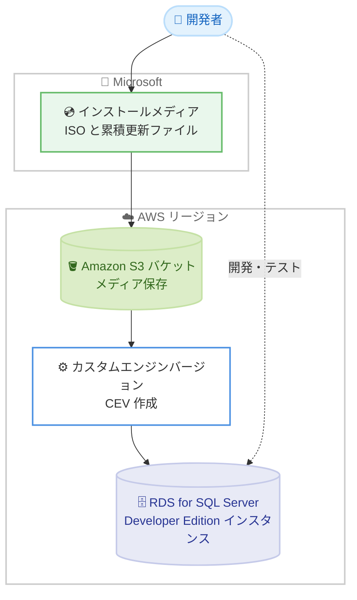

# Amazon RDS for SQL Server - Developer Edition の 13 リージョン追加対応

**リリース日**: 2026 年 8 月 4 日
**サービス**: Amazon RDS for SQL Server
**機能**: SQL Server Developer Edition の追加リージョン対応

📊 [このアップデートのインフォグラフィックを見る](https://takech9203.github.io/aws-news-summary/20260804-rds-sql-server-supports-developer-edition-in-additional-aws-regions.html)

## 概要

Amazon RDS for SQL Server の Developer Edition が、新たに 13 の AWS リージョンで利用可能になりました。追加されたリージョンは、アジアパシフィック (香港、台北、ハイデラバード、ジャカルタ、マレーシア、メルボルン、ニュージーランド、タイ)、カナダ西部 (カルガリー)、欧州 (ミラノ、スペイン)、イスラエル (テルアビブ)、メキシコ (中部) です。

SQL Server Developer Edition は、Enterprise Edition のすべての機能を含みながら、開発・テストシステムとしての利用に限りライセンス料金が無料となるエディションです。今回の拡大により、データやエンドユーザーに近いより多くのリージョンでアプリケーションの構築とテストが可能になり、レイテンシーの削減と開発ワークフローの簡素化を実現できます。

**アップデート前の課題**

これまで Developer Edition が利用できないリージョンでは、開発・テスト環境の構築に制約がありました。

- 対象リージョンでは、開発・テスト用途でも Standard Edition や Enterprise Edition のライセンス込み料金を支払う必要があった
- 本番環境と同じリージョンで Developer Edition の開発・テスト環境を構築できず、リージョンをまたいだ構成が必要になるケースがあった
- 遠隔リージョンの利用によるレイテンシー増加や、開発ワークフローの複雑化が発生していた

**アップデート後の改善**

今回のアップデートにより、以下が可能になりました。

- 追加された 13 リージョンで、SQL Server ライセンス料金なし (インフラ費用のみ) の開発・テスト環境を構築できるようになった
- 本番データベースと同じリージョンで、Enterprise Edition と同等の機能を持つ開発・テスト環境を運用できるようになった
- データやエンドユーザーに近い場所での開発・テストにより、レイテンシーを削減し開発ワークフローを簡素化できるようになった

## アーキテクチャ図



Developer Edition は、Microsoft から取得したインストールメディアを Amazon S3 バケットにアップロードし、カスタムエンジンバージョン (CEV) を作成することで RDS インスタンスとして起動する流れです。

## サービスアップデートの詳細

### 主要機能

1. **13 リージョンへの拡大**
   - アジアパシフィック: 香港、台北、ハイデラバード、ジャカルタ、マレーシア、メルボルン、ニュージーランド、タイ
   - カナダ西部 (カルガリー)、欧州 (ミラノ、スペイン)、イスラエル (テルアビブ)、メキシコ (中部)
   - 東京、大阪を含む既存の対応リージョンに加えて利用可能に

2. **Enterprise Edition と同等の機能をライセンス無料で利用**
   - Developer Edition は SQL Server Enterprise Edition のすべての機能を含む
   - 開発・テスト用途に限りライセンス料金が無料 (AWS インフラ費用のみ発生)
   - 本番環境での利用は Microsoft のライセンス条項により不可

3. **カスタムエンジンバージョン (CEV) による構築**
   - Microsoft から取得した独自のインストールメディアを使用して CEV を作成
   - バックアップ、パッチ適用、モニタリングなど RDS の自動管理機能を利用可能
   - SQL Server 2025 からは Enterprise 機能版 (sqlserver-dev-ee) と Standard 機能版 (sqlserver-dev-se) の 2 種類のエンジンタイプをサポート

## 技術仕様

### サポートされるバージョン

| バージョン | 詳細 |
|------|------|
| SQL Server 2025 CU5 (17.00.4045.5) | Developer Edition (Enterprise Edition 機能) |
| SQL Server 2025 CU5 (17.00.4045.5) | Developer Edition (Standard Edition 機能) |
| SQL Server 2022 CU21 (16.00.4215.2) | Developer Edition |
| SQL Server 2019 CU32 GDR (15.00.4455.2) | Developer Edition |

### 前提リソース

| 項目 | 詳細 |
|------|------|
| インストールメディア | Microsoft から直接取得した ISO と累積更新ファイル |
| Amazon S3 バケット | メディア保存用。CEV を作成するリージョンと同一リージョンかつ同一フォルダパスに配置 |
| IAM 権限 | AmazonRDSFullAccess および s3:GetObject 権限 |

## 設定方法

### 前提条件

1. Microsoft から SQL Server Developer Edition のインストールバイナリを取得し、ライセンス条項を遵守すること
2. AmazonRDSFullAccess と s3:GetObject 権限を持つ AWS アカウント
3. インストールメディア保存用の Amazon S3 バケット (CEV 作成リージョンと同一リージョン)

### 手順

#### ステップ 1: サポートされるエンジンバージョンの確認

```bash
aws rds describe-db-engine-versions \
  --engine sqlserver-dev-ee \
  --output json \
  --query "{ DBEngineVersions: DBEngineVersions[?Status=='requires-custom-engine-version'].{ Engine: Engine, EngineVersion: EngineVersion, Status: Status, DBEngineDescription: DBEngineDescription, DBEngineVersionDescription: DBEngineVersionDescription}}"
```

Developer Edition (Enterprise Edition 機能) の CEV 作成でサポートされるエンジンバージョンの一覧を取得します。Standard Edition 機能版を確認する場合は `--engine sqlserver-dev-se` を指定します。`requires-custom-engine-version` ステータスのバージョンが、インポート可能な SQL Server バージョンを示します。

#### ステップ 2: インストールメディアの S3 アップロード

```bash
aws s3 cp ./SQLServer2022-x64-ENU-Dev.iso s3://my-media-bucket/sqlserver-media/
aws s3 cp ./sqlserver2022-kbXXXXXXX-x64.exe s3://my-media-bucket/sqlserver-media/
```

Microsoft から取得した ISO ファイルと累積更新ファイルを Amazon S3 バケットにアップロードします。すべてのメディアファイルは同一バケット・同一フォルダパスに配置する必要があります。

#### ステップ 3: CEV の作成と DB インスタンスの起動

S3 にアップロードしたメディアを指定してカスタムエンジンバージョン (CEV) を作成し、その CEV を使用して Developer Edition の DB インスタンスを作成します。詳細な手順は公式ドキュメントの「Preparing a CEV」を参照してください。

## メリット

### ビジネス面

- **開発・テストコストの削減**: 対象リージョンで SQL Server ライセンス料金なしに Enterprise Edition 相当の機能を利用でき、非本番環境のコストを大幅に削減できる
- **データレジデンシー要件への対応**: 台北、マレーシア、タイ、ニュージーランド、メキシコなど比較的新しいリージョンでも、現地の要件に沿った開発・テスト環境を構築できる
- **本番環境との機能パリティ**: Enterprise Edition と同じ機能を非本番環境で利用でき、本番相当の検証が可能

### 技術面

- **レイテンシーの削減**: データやエンドユーザーに近いリージョンで開発・テストを実施でき、リージョンをまたぐ構成が不要になる
- **RDS 自動管理機能の活用**: バックアップ、パッチ適用、モニタリングなどのマネージド機能を開発・テスト環境でも利用できる
- **2 種類のエンジンタイプ**: SQL Server 2025 では Enterprise 機能版と Standard 機能版を選択でき、本番環境のエディションに合わせた検証ができる

## デメリット・制約事項

### 制限事項

- 本番環境での利用は不可 (Microsoft のライセンス条項により開発・テスト用途に限定)
- Multi-AZ 配置およびリードレプリカはサポートされない
- インストールメディアは利用者自身で Microsoft から取得・管理する必要がある
- CEV (sqlserver-dev-ee および sqlserver-dev-se) はリージョンやアカウントをまたいで共有できない
- サポートされるインスタンスクラスは SQL Server のバージョンによって異なる

### 考慮すべき点

- Microsoft の SQL Server Developer Edition ライセンス条項の遵守は利用者の責任となる
- CEV 作成のため、通常の RDS インスタンス作成よりセットアップ手順が多い (メディア取得、S3 アップロード、CEV 作成)
- 本番昇格時には Standard Edition や Enterprise Edition への移行計画が別途必要

## ユースケース

### ユースケース 1: 新興リージョンでの開発・テスト環境のコスト最適化

**シナリオ**: マレーシアリージョンで本番運用中の RDS for SQL Server Enterprise Edition に対し、同一リージョンに開発・テスト環境を低コストで構築したい。

**実装例**:
```
1. Microsoft から SQL Server 2022 Developer Edition の ISO を取得
2. マレーシアリージョンの S3 バケットにメディアをアップロード
3. sqlserver-dev-ee エンジンで CEV を作成
4. CEV を指定して開発用 DB インスタンスを作成
```

**効果**: SQL Server ライセンス費用なしで Enterprise Edition 相当の開発環境を本番と同一リージョンに構築でき、非本番環境のデータベースコストを削減できる。

### ユースケース 2: Enterprise Edition 機能の事前検証

**シナリオ**: 本番導入前に、透過的データ暗号化やパーティショニングなど Enterprise Edition 固有の機能を検証したい。

**実装例**:
```
1. Developer Edition (Enterprise Edition 機能) のインスタンスを作成
2. 本番相当のスキーマとデータ (マスキング済み) を投入
3. Enterprise Edition 機能の動作とパフォーマンスを検証
```

**効果**: Enterprise ライセンス費用を支払うことなく、本番導入前に機能の適合性を確認でき、導入判断の精度が向上する。

### ユースケース 3: SQL Server 2025 の Standard 機能版での互換性テスト

**シナリオ**: 本番環境が Standard Edition のため、Standard Edition の機能範囲でアプリケーションの互換性をテストしたい。

**実装例**:
```
1. sqlserver-dev-se エンジンで SQL Server 2025 の CEV を作成
2. Standard Edition 機能セットの範囲でアプリケーションをテスト
3. Enterprise 固有機能への依存がないことを確認
```

**効果**: 本番の Standard Edition と同じ機能セットで検証でき、エディション差異による本番障害のリスクを低減できる。

## 料金

SQL Server Developer Edition 自体のライセンス料金は無料です。DB インスタンス、ストレージ、データ転送などの AWS インフラ費用のみが発生します。Developer Edition の利用にあたっては、Microsoft の SQL Server Developer Edition ライセンス条項 (開発・テスト用途限定) を遵守する責任があります。

詳細は [Amazon RDS for SQL Server 料金ページ](https://aws.amazon.com/rds/sqlserver/pricing/) を参照してください。

## 利用可能リージョン

今回追加された 13 リージョン。

- アジアパシフィック (香港、台北、ハイデラバード、ジャカルタ、マレーシア、メルボルン、ニュージーランド、タイ)
- カナダ西部 (カルガリー)
- 欧州 (ミラノ、スペイン)
- イスラエル (テルアビブ)
- メキシコ (中部)

既存の対応リージョンには、米国東部 (オハイオ、バージニア北部)、米国西部 (北カリフォルニア、オレゴン)、アフリカ (ケープタウン)、アジアパシフィック (ムンバイ、大阪、ソウル、シンガポール、シドニー、東京)、カナダ (中部)、欧州 (フランクフルト、アイルランド、ロンドン、パリ、ストックホルム)、南米 (サンパウロ)、AWS GovCloud (US-East、US-West) が含まれます。最新のリージョン一覧は公式ドキュメントを参照してください。

## 関連サービス・機能

- **カスタムエンジンバージョン (CEV)**: Developer Edition のインスタンス作成に使用する仕組み。独自のインストールメディアから RDS エンジンバージョンを作成する
- **Bring Your Own Media (BYOM)**: Standard Edition および Enterprise Edition 向けに独自メディアを持ち込む仕組み。Developer Edition とは一部機能差異がある
- **Amazon S3**: インストールメディア (ISO、累積更新ファイル) の保存先として使用

## 参考リンク

- 📊 [インフォグラフィック](https://takech9203.github.io/aws-news-summary/20260804-rds-sql-server-supports-developer-edition-in-additional-aws-regions.html)
- [公式発表 (What's New)](https://aws.amazon.com/about-aws/whats-new/2026/07/rds-sql-server-supports-developer-edition-in-additional-aws-regions/)
- [ドキュメント: Working with SQL Server Developer Edition on RDS for SQL Server](https://docs.aws.amazon.com/AmazonRDS/latest/UserGuide/sqlserver-dev-edition.html)
- [料金ページ: Amazon RDS for SQL Server Pricing](https://aws.amazon.com/rds/sqlserver/pricing/)

## まとめ

Amazon RDS for SQL Server の Developer Edition が 13 リージョンに拡大され、より多くのリージョンでライセンス費用なしの開発・テスト環境を構築できるようになりました。対象リージョンで SQL Server の非本番環境を運用しているお客様は、Developer Edition への移行によるコスト削減効果の検証をおすすめします。なお、本番環境での利用は不可であり、Multi-AZ やリードレプリカもサポートされない点に注意が必要です。
