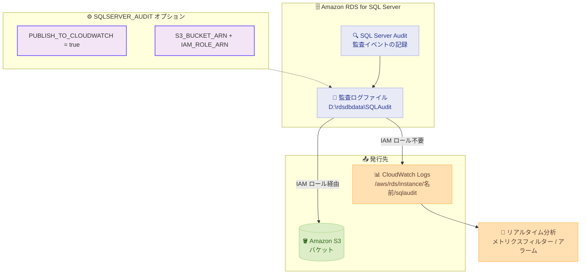

# Amazon RDS for SQL Server - SQL Server Audit ログの CloudWatch への発行をサポート

**リリース日**: 2026 年 8 月 4 日
**サービス**: Amazon RDS for SQL Server
**機能**: SQL Server Audit ログの Amazon CloudWatch Logs への発行

📊 [このアップデートのインフォグラフィックを見る](https://takech9203.github.io/aws-news-summary/20260804-rds-sqlserver-publish-sql-audit-to-cw.html)

## 概要

Amazon RDS for SQL Server が、SQL Server Audit ログの Amazon CloudWatch Logs への発行をサポートしました。SQL Server Audit は、データベースエンジン上で発生するイベントを追跡・記録する SQL Server ネイティブの監査機能です。Amazon RDS 上でも、オンプレミスの SQL Server データベースサーバーと同じ方法で監査 (Audit) と監査仕様 (Audit Specification) を作成できます。

今回のアップデートにより、監査ログの発行先として S3、CloudWatch、またはその両方を選択できるようになりました。S3 と CloudWatch の両方を有効にした場合、監査ログの発行は S3 と CloudWatch の両方へのアップロードが完了した時点で「completed」としてマークされます。監査ログが CloudWatch に取り込まれると、ログデータのリアルタイム分析が可能になります。また、保持 (retention) を有効にすると、RDS は設定した期間、監査ログを DB インスタンス上に保持します。

データベース監査ログを CloudWatch で一元的に管理・分析したい運用チームや、コンプライアンス要件でデータベース操作の監査証跡をリアルタイムに監視する必要がある組織にとって有用なアップデートです。

**アップデート前の課題**

- RDS for SQL Server の SQL Server Audit ログは S3 バケットへのアップロードのみに対応しており、CloudWatch Logs に直接発行できなかった
- S3 に保存された監査ログをリアルタイムに分析するには、追加の仕組み (Lambda によるログ取り込みなど) を独自に構築する必要があった
- CloudWatch のメトリクスフィルターやアラームを監査ログに対して直接活用できなかった

**アップデート後の改善**

- 監査ログの発行先として S3、CloudWatch、またはその両方を選択できるようになった
- CloudWatch Logs 上で監査ログの検索・フィルタリング、メトリクスフィルターや CloudWatch アラームの作成が可能になった
- CloudWatch への発行にはお客様側の IAM ロールが不要で、RDS がログ配信を管理するため、設定が簡素化された
- CloudWatch Logs の保持期間設定により、高耐久ストレージで監査レコードを保持できるようになった

## アーキテクチャ図



SQL Server Audit が記録した監査ログファイルは、オプション設定に応じて CloudWatch Logs、S3、またはその両方に発行されます。CloudWatch への発行はお客様の IAM ロールを必要とせず、RDS が配信を管理します。

## サービスアップデートの詳細

### 主要機能

1. **CloudWatch Logs への監査ログ発行**
   - `SQLSERVER_AUDIT` オプションの `PUBLISH_TO_CLOUDWATCH` 設定 (boolean) を `true` にするだけで有効化できる
   - 発行先ロググループは RDS 管理の `/aws/rds/instance/{DB インスタンス名}/sqlaudit`
   - ログレコードは JSON 形式で CloudWatch Logs に格納される
   - お客様側の IAM ロールや権限設定は不要 (RDS がログ配信を管理)

2. **発行先の柔軟な選択**
   - S3 のみ、CloudWatch のみ、または両方を発行先として設定可能
   - CloudWatch を単独の発行先にできるため、`IAM_ROLE_ARN` と `S3_BUCKET_ARN` はオプション扱い (S3 も使う場合のみ指定)
   - 少なくとも 1 つの発行先 (CloudWatch、S3、または両方) の設定が必要
   - 両方を有効にした場合、S3 と CloudWatch の両方へのアップロード完了後に発行が「completed」となる

3. **Multi-AZ 構成のサポート**
   - Multi-AZ (Always On) インスタンスでは、プライマリとセカンダリがそれぞれノード識別子で区別された個別のログストリームに書き込む
   - 両レプリカの監査イベントが同じ `sqlaudit` ロググループ内で独立してキャプチャされる

4. **リアルタイム分析と保持**
   - CloudWatch Logs 上で監査ログの検索・フィルタリング、メトリクスフィルターと CloudWatch アラームの構築が可能
   - アカウント間でのログデータ共有や S3 へのエクスポートも可能
   - DB インスタンス上での保持 (retention) を有効にすると、設定した期間 (最大 35 日) 監査ログをインスタンス上に保持

## 技術仕様

### SQLSERVER_AUDIT オプションの設定項目

| 設定項目 | 有効な値 | 説明 |
|------|------|------|
| PUBLISH_TO_CLOUDWATCH | true / false | CloudWatch Logs への監査ログ発行を制御する。今回のアップデートで追加 |
| IAM_ROLE_ARN | IAM ロールの ARN | S3 バケットへのアクセスを許可する IAM ロール (S3 発行時のみ必要) |
| S3_BUCKET_ARN | S3 バケットの ARN | 監査ログを保存する S3 バケット (S3 発行時のみ必要) |
| ENABLE_COMPRESSION | true / false | 監査ログの圧縮を制御する。デフォルトは有効 |
| RETENTION_TIME | 0 〜 840 | 監査レコードを DB インスタンス上に保持する時間 (時間単位)。デフォルトは無効 |

### CloudWatch Logs の出力先

| 項目 | 詳細 |
|------|------|
| ロググループ名 | `/aws/rds/instance/{DB インスタンス名}/sqlaudit` |
| ログストリーム | ノード識別子ごとに個別のログストリームに発行 |
| ログ形式 | JSON 形式 |
| 対応バージョン | SQL Server Audit をサポートするすべてのエンジンバージョンとエディション (追加のバージョン制限なし) |

### SQL Server Audit のサポート範囲

| SQL Server バージョン | サーバーレベル監査 | データベースレベル監査 |
|------|------|------|
| SQL Server 2016 (SP1 より前) | 全エディション | Enterprise エディションのみ |
| SQL Server 2016 (13.x) SP1 以降 | 全エディション | 全エディション |

## 設定方法

### 前提条件

1. Amazon RDS for SQL Server の DB インスタンスが稼働していること
2. カスタム DB オプショングループを使用していること (または新規作成すること)
3. S3 にも発行する場合は、S3 バケットと必要なポリシーを持つ IAM ロールがあること (CloudWatch のみの場合は不要)

### 手順

#### ステップ 1: オプショングループに SQLSERVER_AUDIT オプションを追加

Amazon RDS コンソールで [Option groups] を開き、オプショングループに `SQLSERVER_AUDIT` オプションを追加します。CloudWatch に発行する場合は、`PUBLISH_TO_CLOUDWATCH` 設定を `true` にします。既存のオプショングループで有効化する場合は、[Modify option group] から既存の `SQLSERVER_AUDIT` オプションの `PUBLISH_TO_CLOUDWATCH` を `true` に変更し、変更を即時適用するか次回メンテナンスウィンドウで適用するかを選択して保存します。

オプショングループは複数の DB インスタンスで共有されるため、変更は同じオプショングループを使用するすべての DB インスタンスに影響します。特定のインスタンスのみ変更したい場合は、専用のオプショングループを使用します。オプショングループが有効になった後、DB インスタンスの再起動は不要で、変更が適用されるとすぐに監査ログの CloudWatch Logs へのストリーミングが開始されます。

#### ステップ 2: SQL Server 内で監査を作成

```sql
-- 監査レコードを DB インスタンス上で確認する例
SELECT *
FROM msdb.dbo.rds_fn_get_audit_file
    ('D:\rdsdbdata\SQLAudit\*.sqlaudit', default, default)
```

オンプレミスの SQL Server と同じ方法で、SQL Server 内に監査 (Audit) と監査仕様 (Audit Specification) を作成します。上記のコマンドは、DB インスタンス上に保持されている監査レコードを `rds_fn_get_audit_file` 関数で参照する例です。

#### ステップ 3: CloudWatch Logs で監査ログを確認

```bash
# CloudWatch Logs から監査ログイベントを取得する例
LOG_GROUP="/aws/rds/instance/<your-db-instance-id>/sqlaudit"
START_TIME=$(date -d "2026-08-01" +%s)000
END_TIME=$(date -d "2026-08-02" +%s)000

aws logs filter-log-events \
  --log-group-name "${LOG_GROUP}" \
  --start-time "${START_TIME}" \
  --end-time "${END_TIME}" \
  --output json
```

CloudWatch コンソールの [Logs] から DB インスタンス名でロググループを検索してログストリームを表示するか、上記のように AWS CLI の `filter-log-events` コマンドで指定期間の監査ログイベント (JSON 形式) を取得します。

## メリット

### ビジネス面

- **コンプライアンス対応の強化**: データベース操作の監査証跡を CloudWatch Logs の高耐久ストレージに任意の保持期間で保存でき、監査要件への対応が容易になる
- **インシデント対応の迅速化**: 監査ログのリアルタイム分析により、不正アクセスや異常な操作の検知から対応までの時間を短縮できる
- **運用コストの削減**: S3 からのログ取り込みパイプラインを独自構築する必要がなくなり、開発・運用の工数を削減できる

### 技術面

- **設定の簡素化**: `PUBLISH_TO_CLOUDWATCH` の 1 つの boolean 設定のみで有効化でき、IAM ロールの作成やアタッチが不要
- **CloudWatch エコシステムとの統合**: メトリクスフィルター、CloudWatch アラーム、アカウント間のログ共有、S3 へのエクスポートなど CloudWatch Logs の機能をそのまま活用できる
- **Multi-AZ での可視性向上**: プライマリとセカンダリの監査イベントがノードごとの個別ログストリームで独立してキャプチャされる
- **再起動不要**: オプショングループの変更適用後、DB インスタンスの再起動なしでストリーミングが開始される

## デメリット・制約事項

### 制限事項

- 少なくとも 1 つの発行先 (CloudWatch、S3、または両方) を設定する必要がある
- DB インスタンス上の監査ログ保持時間は最大 840 時間 (35 日)
- SQL Server Audit のサポート範囲に依存する (SQL Server 2016 以降。SP1 より前のデータベースレベル監査は Enterprise エディションのみ)
- CloudWatch のロググループ名は RDS 管理の固定形式 (`/aws/rds/instance/{DB インスタンス名}/sqlaudit`) となる

### 考慮すべき点

- オプショングループは複数の DB インスタンスで共有されるため、設定変更が同じオプショングループを使用する全インスタンスに影響する
- S3 と CloudWatch の両方を有効にした場合、両方へのアップロード完了後に発行が「completed」となる
- CloudWatch Logs の取り込み・保存には CloudWatch Logs の料金が発生するため、監査ログの量に応じたコストを考慮する必要がある
- Multi-AZ インスタンスでは、サーバー監査とサーバー監査仕様はセカンダリノードに複製されないため、フェイルオーバー後に同じ名前と GUID で手動作成する必要がある (データベース監査仕様オブジェクトは全ノードに複製される)

## ユースケース

### ユースケース 1: 不正アクセスのリアルタイム検知

**シナリオ**: 金融系システムで、SQL Server データベースへのログイン失敗や権限変更をリアルタイムに検知し、セキュリティチームに通知したい。

**実装例**:
```
1. SQLSERVER_AUDIT オプションで PUBLISH_TO_CLOUDWATCH を true に設定
2. SQL Server 内でログイン失敗や権限変更を対象とするサーバー監査仕様を作成
3. CloudWatch Logs のメトリクスフィルターで対象イベントを抽出
4. CloudWatch アラームを作成し、Amazon SNS でセキュリティチームに通知
```

**効果**: S3 経由の遅延を待つことなく、監査イベントをリアルタイムに監視でき、セキュリティインシデントへの初動対応が迅速化される。

### ユースケース 2: コンプライアンス監査証跡の長期保管と検索

**シナリオ**: 規制対象の業務システムで、データベース操作の監査証跡を長期保管しつつ、監査人からの照会に応じて特定期間の操作履歴を迅速に提示する必要がある。

**実装例**:
```
1. 発行先として S3 と CloudWatch の両方を有効化
2. CloudWatch Logs の保持期間を規制要件に合わせて設定
3. 監査人からの照会時は aws logs filter-log-events で
   期間指定して JSON 形式の監査レコードを抽出し、CSV に変換して提出
```

**効果**: S3 での長期アーカイブと CloudWatch での検索性を両立し、監査対応の作業時間を大幅に短縮できる。

### ユースケース 3: Multi-AZ 環境での監査の一元管理

**シナリオ**: Multi-AZ 構成の RDS for SQL Server で、プライマリとセカンダリ両方のノードで発生する監査イベントを漏れなく収集したい。

**実装例**:
```
1. PUBLISH_TO_CLOUDWATCH を true に設定
2. プライマリノードでサーバー監査を作成後、フェイルオーバーして
   セカンダリノードにも同じ名前と GUID (AUDIT_GUID パラメータ) で作成
3. /aws/rds/instance/{インスタンス名}/sqlaudit ロググループ内の
   ノード識別子ごとのログストリームを確認
```

**効果**: フェイルオーバーが発生しても、両レプリカの監査イベントが同一ロググループ内で独立して記録され、監査の抜け漏れを防止できる。

## 料金

このアップデートに関する追加の機能料金は、公式発表には記載されていません。CloudWatch Logs へのログ取り込み・保存・分析には、標準の Amazon CloudWatch 料金が適用されます。S3 に発行する場合は、標準の Amazon S3 料金が適用されます。詳細は各サービスの料金ページを確認してください。

## 利用可能リージョン

Amazon RDS for SQL Server が利用可能なすべての AWS 商用リージョンおよび AWS GovCloud (US) リージョンで利用できます。

## 関連サービス・機能

- **Amazon CloudWatch Logs**: 監査ログの発行先。検索・フィルタリング、メトリクスフィルター、アラーム、アカウント間共有、S3 エクスポートに対応
- **Amazon S3**: 従来からの監査ログ発行先。CloudWatch と併用可能
- **Database Activity Streams**: RDS for SQL Server の監査イベントを Imperva、McAfee、IBM などのデータベースアクティビティ監視ツールと統合する機能
- **AWS IAM**: S3 発行時に使用する IAM ロール (CloudWatch 発行では不要)

## 参考リンク

- 📊 [インフォグラフィック](https://takech9203.github.io/aws-news-summary/20260804-rds-sqlserver-publish-sql-audit-to-cw.html)
- [公式発表 (What's New)](https://aws.amazon.com/about-aws/whats-new/2026/07/rds-sqlserver-publish-sql-audit-to-cw/)
- [SQL Server Audit - Amazon RDS User Guide](https://docs.aws.amazon.com/AmazonRDS/latest/UserGuide/Appendix.SQLServer.Options.Audit.html)
- [Configuring CloudWatch Log Stream - Amazon RDS User Guide](https://docs.aws.amazon.com/AmazonRDS/latest/UserGuide/Appendix.SQLServer.Options.Audit.CloudWatch.html)
- [SQL Server Audit (Database Engine) - Microsoft SQL Server ドキュメント](https://docs.microsoft.com/sql/relational-databases/security/auditing/sql-server-audit-database-engine)
- [Amazon RDS for SQL Server](https://aws.amazon.com/rds/sqlserver/)

## まとめ

Amazon RDS for SQL Server の SQL Server Audit ログを CloudWatch Logs に直接発行できるようになり、IAM ロール不要のシンプルな設定で監査ログのリアルタイム分析・アラート・長期保持が可能になりました。RDS for SQL Server で監査要件を持つ環境では、`SQLSERVER_AUDIT` オプションの `PUBLISH_TO_CLOUDWATCH` 設定を有効化し、CloudWatch のメトリクスフィルターやアラームと組み合わせた監視体制の構築を検討することを推奨します。
