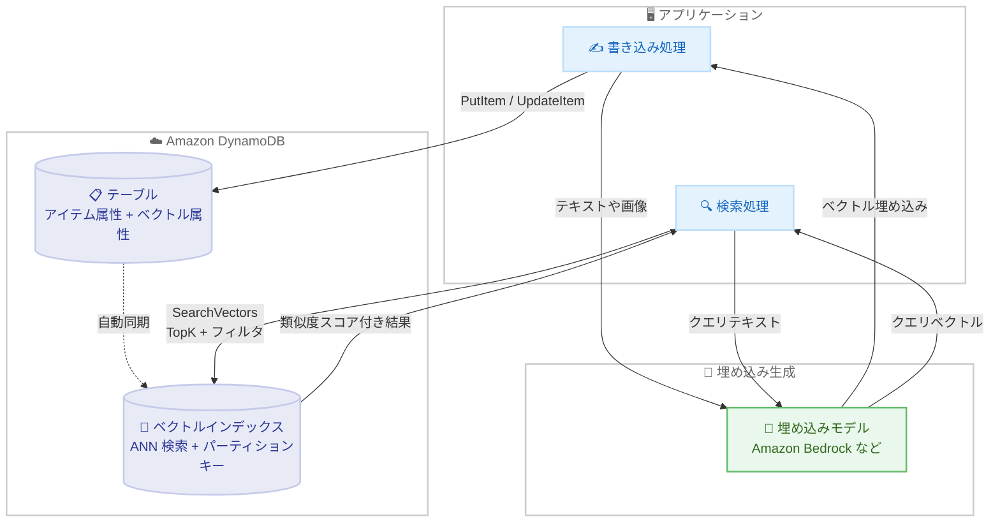

# Amazon DynamoDB - リアルタイムベクトル検索のサポート

**リリース日**: 2026 年 8 月 5 日
**サービス**: Amazon DynamoDB
**機能**: リアルタイムベクトル検索 (ベクトルインデックスと SearchVectors API)

📊 [このアップデートのインフォグラフィックを見る](https://takech9203.github.io/aws-news-summary/20260805-amazon-dynamodb-vector-search.html)

## 概要

Amazon DynamoDB がネイティブなベクトル検索機能の一般提供 (GA) を発表しました。ベクトル埋め込み (エンベディング) をテーブル内の他の属性と一緒に保存し、リアルタイムでインデックス化と検索が可能になります。1 桁ミリ秒のレイテンシーと 99% 以上の再現率 (リコール) を両立し、数兆ベクトルという超大規模なワークロードにも対応できる設計です。

埋め込みの生成には Amazon Bedrock で利用できるモデル (Amazon Titan Text Embeddings、Cohere Embed など) を含む任意のモデルを使用できます。テーブルにベクトルインデックスを作成し、`SearchVectors` API で近似最近傍 (ANN) 検索を実行します。ベクトルインデックスのパーティションキーを指定することで検索を水平にスケールでき、属性によるフィルタリングで検索範囲を絞り込むこともできます。DynamoDB のサーバーレスな運用モデル (インフラ管理不要、ダウンタイムなし、メンテナンスウィンドウなし、従量課金) はそのまま維持されます。

AI エージェントのメモリに対するセマンティック検索、RAG (検索拡張生成)、商品類似検索、パーソナライズ広告、レコメンデーションシステムなど、生成 AI 時代の主要ユースケースを DynamoDB 単体で実現できる大型アップデートです。

**アップデート前の課題**

これまで DynamoDB のデータに対してベクトル検索を行うには、外部のベクトルデータベースとの併用が必要でした。

- DynamoDB とは別に Amazon OpenSearch Service や専用ベクトルデータベースを構築・運用する必要があった
- DynamoDB から外部ベクトルストアへのデータレプリケーションパイプライン (DynamoDB Streams + Lambda など) の構築と保守が必要だった
- レプリケーション遅延により、書き込み直後のデータが検索結果に反映されないことがあった
- 複数のデータストアを運用することでコストと運用負荷が増大していた

**アップデート後の改善**

- DynamoDB 単体でベクトル埋め込みの保存と類似検索が完結し、外部ベクトルデータベースが不要になった
- データレプリケーションパイプラインの構築・保守が不要になった
- 1 桁ミリ秒のレイテンシーと 99% 以上の再現率でリアルタイムに検索できるようになった
- ベクトルインデックスのパーティションキーにより、数兆ベクトル規模まで水平スケールが可能になった
- サーバーレスかつ従量課金のまま利用でき、インフラ管理が不要

## アーキテクチャ図



アプリケーションは埋め込みモデルで生成したベクトルを通常の `PutItem` / `UpdateItem` でテーブルに書き込み、DynamoDB が自動的にベクトルインデックスへ同期します。検索時は `SearchVectors` API にクエリベクトルを渡し、類似度スコア付きの結果を取得します。

## サービスアップデートの詳細

### 主要機能

1. **ベクトルインデックス**
   - GSI や LSI と並ぶ新しいインデックスタイプで、ベクトル埋め込みに対する類似検索を実現
   - 既存の `CreateTable` / `UpdateTable` API の `VectorIndexes` / `VectorIndexUpdates` パラメータで管理
   - ベクトルは既存の List 型 (Number のリスト) で保存するため、新しいデータ型やスキーマ変更は不要
   - 最大 4,096 次元、テーブルあたり最大 5 個のベクトルインデックスをサポート
   - インデックス内のベクトルは 32 ビット浮動小数点 (f32) 精度で保存

2. **SearchVectors API による ANN 検索**
   - クエリベクトル、TopK (最大 100 件)、オプションのフィルタ条件を指定して近似最近傍検索を実行
   - 結果は類似度スコア順にランク付けされ、射影された属性とともに返却
   - 距離関数は COSINE、DOT_PRODUCT、EUCLIDEAN の 3 種類から選択 (インデックス作成後は変更不可)

3. **ベクトルインデックスパーティションキーによるスケーリング**
   - SearchSchema で HASH (パーティションキー) を最大 1 つ指定可能
   - 同じパーティションキー値のアイテムがまとめて格納され、検索対象を該当パーティションのみに限定
   - パーティションキー値を分散させることで検索スループットが線形にスケールし、超大規模でも低レイテンシーを維持
   - カテゴリや国など、低〜中カーディナリティの属性が推奨

4. **インラインフィルタ**
   - フィルタ属性をベクトルインデックスに射影し、ストレージレイヤーで検索中にフィルタリング
   - `SearchConditionExpression` で等価演算子 (=) をサポート (範囲条件や IN は現時点で未対応)
   - インデックスあたり最大 18 個のインラインフィルタを定義可能

5. **既存機能との統合**
   - DynamoDB Streams、グローバルテーブル、PITR / バックアップ、TTL、S3 インポート / エクスポートと併用可能
   - グローバルテーブルではベクトルインデックス定義が各レプリカリージョンへ自動レプリケート
   - DAX は `SearchVectors` を未サポート (DynamoDB へ直接リクエストする)

## 技術仕様

### ベクトルインデックスの仕様

| 項目 | 詳細 |
|------|------|
| 対象テーブル | オンデマンドキャパシティモードのテーブルのみ |
| ベクトルの保存形式 | List 型 (Number のリスト)、インデックス内は f32 精度 |
| 距離関数 | COSINE / DOT_PRODUCT / EUCLIDEAN (作成後変更不可) |
| 最大次元数 | 4,096 (変更不可) |
| テーブルあたりのベクトルインデックス数 | 5 (上限緩和可能) |
| SearchVectors の最大 TopK | 100 (変更不可) |
| パーティションキー (HASH) | インデックスあたり最大 1 個 |
| インラインフィルタ | インデックスあたり最大 18 個、等価条件のみ |
| 検索レート | パーティションキーあたり 1 GBps (上限緩和可能) |
| 書き込みレート | パーティションキーあたり 10 MBps (上限緩和可能) |
| インデックス作成可能なテーブルサイズ | 600 GB まで (超える場合は AWS サポートに連絡) |
| 射影 | KEYS_ONLY / INCLUDE / ALL |

### 距離関数の選択指針

| 距離関数 | スコアの解釈 | 適したユースケース |
|------|------|------|
| COSINE | 小さいほど類似 (0〜2) | テキスト埋め込みによるセマンティック検索、RAG、FAQ マッチング。迷った場合の安全なデフォルト |
| DOT_PRODUCT | 大きいほど類似 (負値あり) | 人気度スコアでベクトル長を調整するレコメンデーション、モデルがドット積を推奨する場合 |
| EUCLIDEAN | 小さいほど類似 | 画像・音声埋め込み、重複検出、クラスタリング、異常検知 |

### API変更履歴

| 日付 | サービス | 変更内容 |
|------|----------|----------|
| 2026/08/04 | [Amazon DynamoDB](https://awsapichanges.com/archive/changes/7451e2-dynamodb.html) | 1 new 23 updated api methods - `SearchVectors` API の新規追加、`CreateTable` / `UpdateTable` / `DescribeTable` などへのベクトルインデックス関連パラメータの追加 |

## 設定方法

### 前提条件

1. オンデマンドキャパシティモードの DynamoDB テーブル (ベクトルインデックスはオンデマンドのみ対応)
2. 埋め込み生成用のモデルへのアクセス (例: Amazon Bedrock の Amazon Titan Text Embeddings)
3. `dynamodb:UpdateTable` および `dynamodb:SearchVectors` を許可する IAM 権限

### 手順

#### ステップ1: ベクトル埋め込みをアイテムに保存する

```bash
# Amazon Bedrock で埋め込みを生成し、List 型属性としてアイテムに保存
aws dynamodb put-item \
  --table-name ProductCatalog \
  --item '{
    "ProductId": {"S": "prod-001"},
    "Category": {"S": "footwear"},
    "Description": {"S": "軽量ランニングシューズ"},
    "descriptionEmbedding": {"L": [
      {"N": "0.123"}, {"N": "-0.456"}, {"N": "0.789"}
    ]}
  }'
```

埋め込みモデルで生成したベクトルを、既存の List 型 (Number のリスト) 属性としてアイテムに書き込みます。新しいデータ型は不要で、通常の `PutItem` / `UpdateItem` をそのまま使用します。

#### ステップ2: ベクトルインデックスを作成する

```bash
# UpdateTable でベクトルインデックスを追加
aws dynamodb update-table \
  --table-name ProductCatalog \
  --vector-index-updates '[{
    "Create": {
      "IndexName": "ProductDescriptionIndex",
      "VectorConfiguration": {
        "AttributeName": "descriptionEmbedding",
        "Dimensions": 1024,
        "DistanceFunction": "COSINE"
      },
      "SearchSchema": [
        {"AttributeName": "Category", "SearchKeyType": "HASH"}
      ],
      "Projection": {"ProjectionType": "ALL"}
    }
  }]'
```

ベクトル属性名、次元数 (最大 4,096)、距離関数を指定してベクトルインデックスを作成します。SearchSchema でパーティションキーを定義すると、検索対象がパーティション単位に限定され、大規模データでもスケールします。`IndexStatus` が `ACTIVE` になりバックフィルが完了すると検索可能になります。

#### ステップ3: SearchVectors で類似検索を実行する

```bash
# クエリベクトルで近似最近傍検索を実行
aws dynamodb search-vectors \
  --table-name ProductCatalog \
  --index-name ProductDescriptionIndex \
  --search-vector '[{"N": "0.111"}, {"N": "-0.222"}, {"N": "0.333"}]' \
  --top-k 5 \
  --search-condition-expression "Category = :cat" \
  --expression-attribute-values '{":cat": {"S": "footwear"}}'
```

検索クエリのテキストを同じ埋め込みモデルでベクトル化し、`SearchVectors` API に渡します。TopK で取得件数 (最大 100) を指定し、パーティションキーやインラインフィルタで検索範囲を絞り込めます。結果は類似度スコア順に返却されます。

## メリット

### ビジネス面

- **アーキテクチャの簡素化によるコスト削減**: 外部ベクトルデータベースとレプリケーションパイプラインが不要になり、インフラコストと運用コストを削減できる
- **生成 AI アプリケーションの迅速な構築**: 既存の DynamoDB テーブルにベクトルインデックスを追加するだけで、RAG やエージェントメモリなどの AI 機能を実装できる
- **従量課金でスモールスタート可能**: DynamoDB の pay-per-request モデルのまま利用でき、初期投資なしで始められる

### 技術面

- **リアルタイム性**: 書き込んだベクトルが即座に検索対象となり、レプリケーション遅延の問題が解消される
- **高性能と高精度の両立**: 1 桁ミリ秒レイテンシーと 99% 以上の再現率を実現し、規模が拡大してもトレードオフが生じにくい
- **超大規模スケール**: ベクトルインデックスパーティションキーにより検索スループットが線形にスケールし、数兆ベクトル規模にも対応
- **運用データとの一体管理**: 埋め込みと業務データを同一アイテムで管理でき、データの一貫性が保ちやすい
- **既存機能との親和性**: Streams、グローバルテーブル、PITR、TTL など既存の DynamoDB 機能と組み合わせて利用できる

## デメリット・制約事項

### 制限事項

- オンデマンドキャパシティモードのテーブルのみ対応 (プロビジョンドモードは不可)
- 距離関数はインデックス作成後に変更できない
- インラインフィルタは等価条件 (=) のみで、範囲条件 (`<`、`>`、`BETWEEN`) や `IN` は未対応
- `SearchVectors` のレスポンスは 16 MB までで、ページネーションは未サポート
- `SearchVectors` はきめ細かなアクセス制御 (FGAC)、PartiQL、DAX に未対応
- ベクトルインデックスは `Query` / `Scan` では読み取れない
- 600 GB を超える既存テーブルへのインデックス作成には AWS サポートへの申請が必要

### 考慮すべき点

- ANN (近似最近傍) 検索のため、厳密な最近傍と結果がわずかに異なる場合がある。グローバルテーブルではリージョン間で結果の順序が異なる可能性もある
- パーティションキーを定義しない場合は全インデックスを検索するため、データ増加に伴いレイテンシーとコストが増加する。大規模ワークロードではパーティションキーの設計が重要
- パーティションキーを定義した場合、`SearchVectors` は単一のパーティションキー値にスコープされるため、クエリパターンに合ったキー選定が必要
- 埋め込みモデルが推奨する距離関数と一致させることが検索品質の鍵となる
- 射影されていない属性は検索結果に含められないため、射影設計を事前に検討する必要がある

## ユースケース

### ユースケース1: AI エージェントのメモリ (エージェンティックグラウンディング)

**シナリオ**: カスタマーサポート AI エージェントが過去の会話履歴をセマンティックに検索し、セッションをまたいでコンテキストを維持する。

**実装例**:
```
1. 会話ターンごとにテキストを Amazon Bedrock の埋め込みモデルでベクトル化
2. UserId をベクトルインデックスのパーティションキーとして会話アイテムを保存
3. 新しい質問が来たら質問文をベクトル化し、SearchVectors で
   該当ユーザーの過去会話から意味的に関連する記憶を TopK=10 で取得
4. 取得した記憶を LLM のプロンプトに含めて応答を生成
```

**効果**: エージェントがユーザーごとの長期記憶を低レイテンシーで参照でき、パーソナライズされた一貫性のある応答を実現できる。

### ユースケース2: EC サイトの商品類似検索

**シナリオ**: EC サイトで商品説明の意味的な類似性に基づく検索とレコメンデーションを提供する。

**実装例**:
```
1. 商品説明文の埋め込みを descriptionEmbedding 属性として商品アイテムに保存
2. Category をパーティションキー、Brand をインラインフィルタとする
   ベクトルインデックスを作成 (距離関数: COSINE)
3. 「夏用の軽量ランニングシューズ」などの検索クエリをベクトル化し、
   SearchVectors で Category = "footwear" のパーティション内を検索
4. 類似度スコア上位 5 件を検索結果として表示
```

**効果**: キーワード一致では拾えない意味的に関連する商品を提示でき、検索体験とコンバージョン率の向上が期待できる。カテゴリ単位のパーティション分割により大規模カタログでも低レイテンシーを維持できる。

### ユースケース3: RAG による社内ナレッジ検索

**シナリオ**: 社内ドキュメントを DynamoDB に格納し、LLM と組み合わせた質問応答システムを構築する。

**実装例**:
```
1. ドキュメントをチャンク分割し、各チャンクの埋め込みを
   ドキュメントメタデータとともに DynamoDB に保存
2. Department をパーティションキーとするベクトルインデックスを作成
3. ユーザーの質問をベクトル化し、SearchVectors で関連チャンクを取得
4. 取得したチャンクをコンテキストとして LLM に渡し、回答を生成
5. TTL を設定して古いドキュメントを自動削除 (インデックスからも自動除去)
```

**効果**: 別途ベクトルデータベースを構築せずに RAG パイプラインを実現でき、ドキュメント更新が即座に検索結果へ反映される。

## 料金

ベクトルインデックスは DynamoDB の既存の従量課金 (pay-per-request) モデルに従います。オンデマンドキャパシティモードのテーブルで利用し、使用した分だけ課金されます。発表時点で個別の料金レートは公表されておらず、詳細は DynamoDB の料金ページを参照してください。

- ベクトルインデックスにストレージ上限はなし
- インフラのプロビジョニングや事前のキャパシティ予約は不要

## 利用可能リージョン

すべての AWS 商用リージョンおよび AWS GovCloud (US) リージョンで利用可能です (東京・大阪リージョンを含む)。

## 関連サービス・機能

- **Amazon Bedrock**: Amazon Titan Text Embeddings や Cohere Embed などの埋め込みモデルでベクトルを生成し、DynamoDB に保存する組み合わせが典型的
- **Amazon S3 Vectors**: S3 ベースの低コストなベクトルストレージ。大量ベクトルの低頻度アクセスは S3 Vectors、リアルタイム性が求められる運用データとの一体管理は DynamoDB ベクトル検索と使い分けられる
- **Amazon OpenSearch Service**: 従来の DynamoDB + ベクトル検索の組み合わせ先。全文検索や複雑な集計が必要な場合は引き続き有力な選択肢
- **DynamoDB グローバルテーブル**: ベクトルインデックスをマルチリージョンに自動レプリケートし、グローバルなアプリケーションで低レイテンシー検索を実現
- **DynamoDB Streams / TTL / PITR**: ベクトルインデックスと併用可能な既存機能。TTL による期限切れアイテムはインデックスからも自動削除される

## 参考リンク

- 📊 [インフォグラフィック](https://takech9203.github.io/aws-news-summary/20260805-amazon-dynamodb-vector-search.html)
- [公式発表 (What's New)](https://aws.amazon.com/about-aws/whats-new/2026/08/amazon-dynamodb-vector-search)
- [AWS Blog: Amazon DynamoDB now supports real-time vector search at any scale](https://aws.amazon.com/blogs/aws/amazon-dynamodb-now-supports-real-time-vector-search-at-any-scale)
- [ドキュメント: Using vector indexes in DynamoDB](https://docs.aws.amazon.com/amazondynamodb/latest/developerguide/VectorSearch.html)
- [API リファレンス: SearchVectors](https://docs.aws.amazon.com/amazondynamodb/latest/APIReference/API_SearchVectors.html)
- [料金ページ](https://aws.amazon.com/dynamodb/pricing/)

## まとめ

DynamoDB にネイティブなベクトル検索が加わったことで、外部ベクトルデータベースやレプリケーションパイプラインなしに、運用データと埋め込みを一体管理しながらリアルタイム類似検索を実現できるようになりました。RAG や AI エージェントメモリなど生成 AI アプリケーションを DynamoDB 上で構築している場合、アーキテクチャを大幅に簡素化できる可能性があります。まずは既存のオンデマンドテーブルにベクトルインデックスを作成し、パーティションキー設計と距離関数の選定を検証することをお勧めします。
