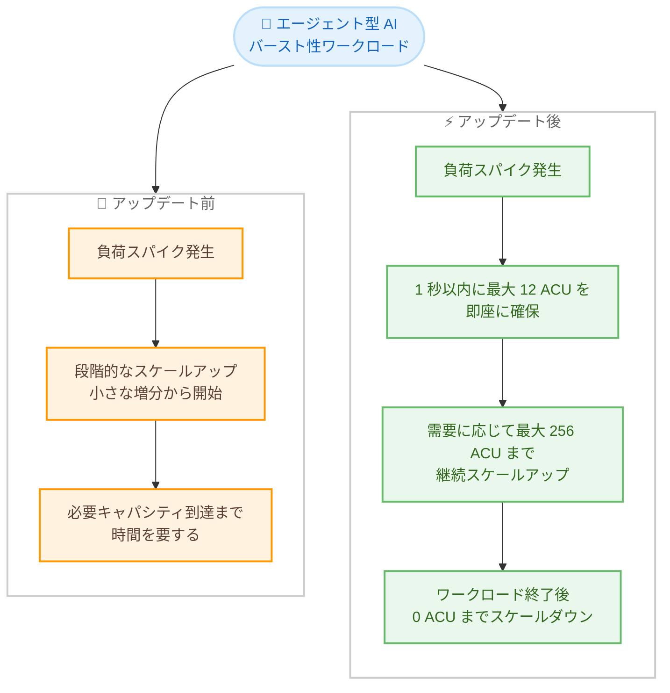

# Amazon Aurora - Aurora Serverless の高速スケーリング (瞬時に最大 12 ACU)

**リリース日**: 2026 年 8 月 5 日
**サービス**: Amazon Aurora
**機能**: Aurora Serverless の高速スケールアップ (エージェント型 AI などのバースト性ワークロード向け)

📊 [このアップデートのインフォグラフィックを見る](https://takech9203.github.io/aws-news-summary/20260805-aurora-serverless-instant-12-acu-scaling.html)

## 概要

Amazon Aurora Serverless のスケールアップが高速化され、スケールアップイベント時により高い初期キャパシティを即座に提供できるようになりました。1 秒以内に最大 12 ACU (Aurora Capacity Unit) まで到達し、需要の増加に応じて最大 256 ACU まで継続的にスケールアップします。ワークロードが終了すると、キャパシティは 0 ACU までスケールダウンします。

この機能強化は、活動のバースト、長いアイドル期間、予測不可能なトラフィックパターンを特徴とするエージェント型 AI (Agentic AI) アプリケーションに特に適しています。AI エージェントは必要なときに突発的にデータベースへ大量のクエリを発行し、その後長時間アイドル状態になることが多いため、瞬時のスケールアップと 0 までのスケールダウンの組み合わせがコストとパフォーマンスの両面で効果を発揮します。

本機能は、プラットフォームバージョン 3 または 4 で稼働するすべての Aurora Serverless クラスターでデフォルトで有効化されており、設定変更は不要です。プラットフォームバージョン 1 または 2 のクラスターは、プラットフォームバージョン 4 に直接アップグレードすることで利用できます。

**アップデート前の課題**

- 以前はスケールアップが段階的な増分で行われるため、突発的な負荷スパイクの発生直後に十分なキャパシティへ到達するまで時間を要する場合があった
- 現在のキャパシティが小さいほどスケーリング増分も小さいため、0 ACU や低キャパシティからの急激な負荷増加への追従が課題だった
- バースト性の高いワークロードでは、スケールアップの待ち時間を回避するために最小 ACU を高めに設定する必要があり、アイドル期間のコストが増加していた

**アップデート後の改善**

- スケールアップイベント時に 1 秒以内で最大 12 ACU の初期キャパシティを即座に確保できるようになった
- 需要の増加に応じて最大 256 ACU まで継続してスケールアップし、ワークロード終了後は 0 ACU までスケールダウンするため、コスト効率を維持できる
- プラットフォームバージョン 3 または 4 のクラスターでは設定変更なしでデフォルト有効となり、追加作業なしで恩恵を受けられる

## アーキテクチャ図



エージェント型 AI などのバースト性ワークロードに対して、アップデート後は 1 秒以内に最大 12 ACU の初期キャパシティを即座に提供し、その後も需要に応じて最大 256 ACU までスケールする流れを示しています。

## サービスアップデートの詳細

### 主要機能

1. **瞬時の初期キャパシティ確保 (最大 12 ACU / 1 秒以内)**
   - スケールアップイベント時に、1 秒以内で最大 12 ACU まで即座にキャパシティを引き上げる
   - 従来の段階的なスケーリングと比較して、突発的な負荷スパイクへの初動が大幅に高速化
   - 1 ACU は約 2 GiB のメモリと対応する CPU、ネットワークリソースの組み合わせ

2. **最大 256 ACU までの継続的なスケールアップ**
   - 初期の高速スケールアップ後も、需要の増加に応じて最大 256 ACU まで継続してスケール
   - スケーリングはデータベース接続が開いている間、SQL トランザクションの実行中でも中断なく実行される

3. **0 ACU へのスケールダウン (自動一時停止)**
   - ワークロードが終了すると 0 ACU までスケールダウンし、アイドル期間中のコンピューティングコストをゼロにできる
   - 長いアイドル期間を持つエージェント型 AI アプリケーションのコスト最適化に有効

4. **デフォルト有効 (設定変更不要)**
   - プラットフォームバージョン 3 または 4 のすべての Aurora Serverless クラスターでデフォルトで有効
   - アプリケーションコードや接続文字列の変更も不要

## 技術仕様

### Aurora Serverless プラットフォームバージョン

| プラットフォームバージョン | ACU 範囲 | パフォーマンス | 本機能 |
|------|------|------|------|
| 1 | 0-128 | ベースライン | 対象外 (バージョン 4 へアップグレード可能) |
| 2 | 0-256 | ベースライン | 対象外 (バージョン 4 へアップグレード可能) |
| 3 | 0-256 | バージョン 2 比で最大 30% 向上 | デフォルト有効 |
| 4 | 0-256 | バージョン 3 比で最大 30% 向上 | デフォルト有効 |

### スケーリング仕様

| 項目 | 詳細 |
|------|------|
| 初期スケールアップ | 1 秒以内に最大 12 ACU |
| 最大キャパシティ | 256 ACU |
| 最小キャパシティ | 0 ACU (自動一時停止対応バージョン) |
| ACU の構成 | 約 2 GiB メモリ + 対応する CPU およびネットワーク |
| 有効化方法 | プラットフォームバージョン 3 / 4 でデフォルト有効、設定変更不要 |
| プラットフォームバージョン確認 | マネジメントコンソールのインスタンス設定セクション、または API の `ServerlessV2PlatformVersion` パラメータ |

### プラットフォームバージョンの確認方法

```bash
aws rds describe-db-clusters \
  --db-cluster-identifier my-aurora-cluster \
  --query "DBClusters[0].ServerlessV2PlatformVersion"
```

上記コマンドは、指定した Aurora クラスターの Serverless プラットフォームバージョンを取得します。

## 設定方法

### 前提条件

1. Aurora Serverless クラスター (Aurora MySQL または Aurora PostgreSQL) が存在すること
2. 本機能を利用するにはプラットフォームバージョン 3 または 4 で稼働していること
3. 0 ACU へのスケールダウンを利用する場合は、対応エンジンバージョン (Aurora MySQL 3.08.0 以上、Aurora PostgreSQL 13.15 / 14.12 / 15.7 / 16.3 以上) であること

### 手順

#### ステップ 1: 現在のプラットフォームバージョンを確認する

```bash
aws rds describe-db-clusters \
  --db-cluster-identifier my-aurora-cluster \
  --query "DBClusters[0].ServerlessV2PlatformVersion"
```

クラスターが稼働しているプラットフォームバージョンを確認します。「3」または「4」が返される場合、本機能はすでに有効です。

#### ステップ 2: プラットフォームバージョン 1 / 2 の場合はアップグレードする

```bash
# 保留中のメンテナンスアクションを確認
aws rds describe-pending-maintenance-actions \
  --resource-identifier arn:aws:rds:ap-northeast-1:123456789012:cluster:my-aurora-cluster
```

プラットフォームバージョン 1 または 2 のクラスターは、保留中のメンテナンスの適用、クラスターの停止と再起動、またはブルー / グリーンデプロイのいずれかの方法でプラットフォームバージョン 4 に直接アップグレードできます。

#### ステップ 3: キャパシティ範囲を確認する

```bash
aws rds describe-db-clusters \
  --db-cluster-identifier my-aurora-cluster \
  --query "DBClusters[0].ServerlessV2ScalingConfiguration"
```

最小 / 最大 ACU の設定を確認します。バースト性ワークロードでコストを最小化したい場合は最小キャパシティを 0 ACU に、ピーク需要に対応するため最大キャパシティを十分な値 (最大 256 ACU) に設定します。

## メリット

### ビジネス面

- **コスト効率の向上**: 瞬時のスケールアップにより、スパイク対策として最小 ACU を高めに維持する必要性が減り、アイドル期間は 0 ACU まで下げてコストを削減できる
- **追加作業ゼロ**: プラットフォームバージョン 3 / 4 ではデフォルト有効のため、既存クラスターは自動的に恩恵を受ける
- **AI アプリケーションの俊敏な展開**: エージェント型 AI のような新しいワークロードパターンに対して、キャパシティプランニングなしでデータベースを提供できる

### 技術面

- **応答性の向上**: 1 秒以内に最大 12 ACU へ到達するため、コールドスタートやスパイク直後のレイテンシー悪化を軽減できる
- **中断のないスケーリング**: 接続やトランザクションを維持したままスケーリングが実行され、アプリケーション側の変更は不要
- **広いスケーリングレンジ**: 0 ACU から 256 ACU まで、単一クラスターでバーストとアイドルの両極端に対応できる

## デメリット・制約事項

### 制限事項

- 本機能はプラットフォームバージョン 3 または 4 のクラスターが対象。バージョン 1 / 2 のクラスターはプラットフォームバージョン 4 へのアップグレードが必要
- プラットフォームバージョン 4 の利用可能リージョンは限定されている (東京、大阪を含む主要リージョンで利用可能)
- クラスターの実際のスケーリング範囲は、エンジンバージョンとプラットフォームバージョンの両方のうち、能力が低い方によって決まる

### 考慮すべき点

- 0 ACU からの再開 (自動一時停止からの復帰) には再開処理の時間が発生するため、レイテンシー要件が厳しい場合は最小キャパシティの設定値を検討する必要がある
- 瞬時に 12 ACU まで到達することで、従量課金のキャパシティ消費が短時間で増える可能性があるため、`ServerlessDatabaseCapacity` や `ACUUtilization` メトリクスでの監視を推奨
- バッファプールはスケールダウン時に縮小されるため、ワーキングセットを保持したい場合は最小 ACU をワークロードに合わせて設定する

## ユースケース

### ユースケース 1: エージェント型 AI アプリケーションのバックエンド

**シナリオ**: AI エージェントがユーザーのリクエストに応じて自律的にタスクを実行し、データベースへ突発的に大量のクエリを発行する。タスク完了後は長時間アイドル状態になる。

**実装例**:
```bash
aws rds create-db-cluster \
  --db-cluster-identifier agentic-ai-db \
  --engine aurora-postgresql \
  --engine-version 16.3 \
  --serverless-v2-scaling-configuration MinCapacity=0,MaxCapacity=64
```

**効果**: エージェントのタスク開始時に 1 秒以内で最大 12 ACU まで即座にスケールし、タスク完了後は 0 ACU までスケールダウンするため、応答性とコスト効率を両立できる。

### ユースケース 2: 不定期に実行されるバッチ・レポート処理

**シナリオ**: 月次レポートや不定期の集計バッチなど、実行タイミングが予測しにくく、実行時には大きなキャパシティが必要な処理を行う。

**実装例**:
```bash
aws rds modify-db-cluster \
  --db-cluster-identifier reporting-db \
  --serverless-v2-scaling-configuration MinCapacity=0,MaxCapacity=256
```

**効果**: バッチ開始直後に高い初期キャパシティが確保され、処理時間の短縮が期待できる。処理完了後は 0 ACU まで下がり、待機コストが発生しない。

### ユースケース 3: トラフィックが予測不能な新規アプリケーション

**シナリオ**: リリース直後でトラフィックパターンが読めない新規 Web アプリケーションや SaaS で、急激なユーザー増加に備えたい。

**実装例**:
```bash
aws rds describe-db-clusters \
  --db-cluster-identifier new-app-db \
  --query "DBClusters[0].ServerlessV2PlatformVersion"
```

**効果**: プラットフォームバージョン 3 / 4 であれば設定変更なしで高速スケーリングが有効となり、突発的なトラフィックスパイクにもデータベースがボトルネックになりにくい。

## 料金

Aurora Serverless は従量課金制で、データベースがアクティブな間に消費したキャパシティに対して ACU 時間単位 (秒単位の課金) で料金が発生します。今回のアップデートによる追加料金はなく、実際に消費したキャパシティ分のみが課金されます。0 ACU までスケールダウンしている間は、コンピューティング料金は発生しません (ストレージおよび I/O 料金は別途発生)。

詳細は [Amazon Aurora 料金ページ](https://aws.amazon.com/rds/aurora/pricing/) を参照してください。

## 利用可能リージョン

本機能はプラットフォームバージョン 3 または 4 のクラスターで利用できます。プラットフォームバージョン 4 は以下のリージョンで利用可能です。

米国東部 (バージニア北部)、米国東部 (オハイオ)、米国西部 (北カリフォルニア)、米国西部 (オレゴン)、アジアパシフィック (香港)、アジアパシフィック (ハイデラバード)、アジアパシフィック (ジャカルタ)、アジアパシフィック (マレーシア)、アジアパシフィック (メルボルン)、アジアパシフィック (ムンバイ)、アジアパシフィック (大阪)、アジアパシフィック (ソウル)、アジアパシフィック (シンガポール)、アジアパシフィック (シドニー)、アジアパシフィック (東京)、カナダ (中部)、欧州 (フランクフルト)、欧州 (アイルランド)、欧州 (ロンドン)、欧州 (パリ)、欧州 (スペイン)、欧州 (ストックホルム)、欧州 (チューリッヒ)、南米 (サンパウロ)、AWS GovCloud (US-East)、AWS GovCloud (US-West)

プラットフォームバージョン 3 は、Aurora Serverless がサポートされるすべてのリージョンで利用可能です。最新のリージョン情報は [Amazon Aurora 料金ページ](https://aws.amazon.com/rds/aurora/pricing/) を参照してください。

## 関連サービス・機能

- **Amazon Aurora (プロビジョンドクラスター)**: 定常的なワークロード向けの構成。同一クラスター内で Serverless インスタンスとプロビジョンドインスタンスを混在させる混合構成も可能
- **Amazon Bedrock / AgentCore**: エージェント型 AI アプリケーションの構築基盤。エージェントのデータストアとして Aurora Serverless を組み合わせることで、バースト性のあるアクセスに対応できる
- **Amazon CloudWatch**: `ServerlessDatabaseCapacity` および `ACUUtilization` メトリクスでスケーリング動作とキャパシティ消費を監視できる
- **Aurora ブルー / グリーンデプロイ**: プラットフォームバージョン 1 / 2 から 4 へのアップグレード手段の 1 つとして利用可能

## 参考リンク

- 📊 [インフォグラフィック](https://takech9203.github.io/aws-news-summary/20260805-aurora-serverless-instant-12-acu-scaling.html)
- [公式発表 (What's New)](https://aws.amazon.com/about-aws/whats-new/2026/08/aurora-serverless-instant-12-acu-scaling)
- [Amazon Aurora Serverless 製品ページ](https://aws.amazon.com/rds/aurora/serverless/)
- [ドキュメント: Aurora Serverless の仕組み](https://docs.aws.amazon.com/AmazonRDS/latest/AuroraUserGuide/aurora-serverless-v2.how-it-works.html)
- [ドキュメント: Aurora Serverless v2](https://docs.aws.amazon.com/AmazonRDS/latest/AuroraUserGuide/aurora-serverless-v2.html)
- [料金ページ](https://aws.amazon.com/rds/aurora/pricing/)

## まとめ

Aurora Serverless が 1 秒以内に最大 12 ACU まで瞬時にスケールアップできるようになり、エージェント型 AI をはじめとするバースト性ワークロードへの適合性が大きく向上しました。プラットフォームバージョン 3 / 4 のクラスターでは設定変更なしでデフォルト有効のため、まず `ServerlessV2PlatformVersion` で自クラスターのバージョンを確認し、バージョン 1 / 2 の場合はプラットフォームバージョン 4 へのアップグレードを検討することを推奨します。
