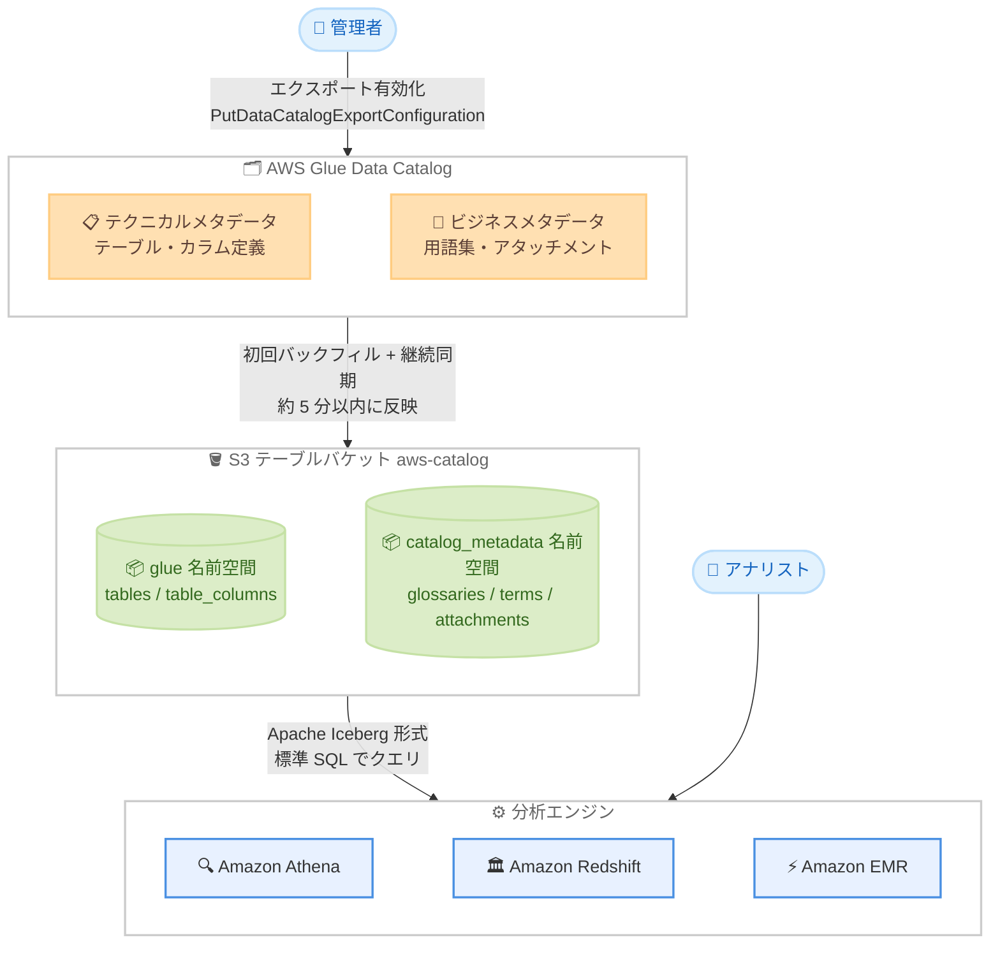

# AWS Glue Data Catalog - S3 Tables へのメタデータエクスポート (プレビュー)

**リリース日**: 2026 年 8 月 5 日
**サービス**: AWS Glue (Glue Data Catalog)
**機能**: AWS Glue Data Catalog metadata exports to S3 Tables (Preview)

📊 [このアップデートのインフォグラフィックを見る](https://takech9203.github.io/aws-news-summary/20260805-aws-glue-data-catalog-s3-tables.html)

## 概要

AWS Glue Data Catalog が、カタログメタデータを Amazon S3 Tables へエクスポートする機能をプレビューとして発表しました。エクスポートを有効化すると、テクニカルメタデータとビジネスメタデータ (ビジネス用語集、カスタムメタデータのアタッチメント、アセットの説明など) が、AWS マネージドのテーブルバケット `aws-catalog` 内の読み取り専用システムテーブルに書き込まれます。データは Apache Iceberg 形式で保存されるため、Amazon Athena、Amazon Redshift、Amazon EMR、Amazon QuickSight などの Iceberg 互換エンジンから標準 SQL でクエリでき、監査やタイムトラベルクエリによる履歴分析も可能です。

あわせて、セマンティック検索プレビューの対象が拡大され、AWS KMS カスタマーマネージドキー (CMK) で暗号化されたカタログでもセマンティック検索とビジネスコンテキストエンリッチメントが利用できるようになりました。

データガバナンス担当者やデータプラットフォームチームにとって、カタログメタデータを SQL で横断的に分析し、用語集の利用状況やメタデータ変更の追跡といったガバナンス業務を自動化できる点が主要な価値です。

**アップデート前の課題**

- カタログメタデータを一括で分析するには、`GetTables` などの API を繰り返し呼び出して自前でデータを収集・整形する必要があった
- ビジネス用語集やカスタムメタデータの利用状況を SQL で横断的に集計する標準的な手段がなかった
- メタデータの変更履歴を追跡・監査する仕組みを独自に構築する必要があった
- KMS カスタマーマネージドキーで暗号化されたカタログではセマンティック検索プレビューを利用できなかった

**アップデート後の改善**

- エクスポートを有効化するだけで、カタログメタデータが Apache Iceberg 形式のシステムテーブルとして自動的に維持される (初回バックフィル後、更新は約 5 分以内に反映)
- Athena、Redshift、EMR などから標準 SQL でメタデータをクエリでき、他の AWS サービスのデータと結合した分析が可能になった
- Iceberg のタイムトラベルクエリにより、メタデータの履歴分析や監査が可能になった
- KMS CMK で暗号化されたカタログでもセマンティック検索とビジネスコンテキストエンリッチメントが利用可能になった

## アーキテクチャ図



エクスポートを有効化すると、Glue Data Catalog のメタデータが AWS マネージドテーブルバケット `aws-catalog` 内の Iceberg システムテーブルに同期され、各種分析エンジンから SQL でクエリできます。

## サービスアップデートの詳細

### 主要機能

1. **S3 Tables へのメタデータエクスポート**
   - アカウントレベルの設定で、有効化すると既存メタデータの一括バックフィルを実行し、その後は変更を継続的に同期
   - 新規作成・更新されたメタデータは通常約 5 分以内にシステムテーブルへ反映
   - システムテーブルは読み取り専用の Apache Iceberg テーブルとして AWS マネージドテーブルバケット `aws-catalog` に格納
   - 該当する種類のメタデータがカタログに初めて存在した時点で、対応するシステムテーブルが作成される (例: 用語集テーブルは最初の用語集作成後に出現)

2. **7 種類のシステムテーブル**
   - `glue` 名前空間: `tables` (テーブルのテクニカル/ビジネスメタデータ)、`table_columns` (カラム定義)
   - `catalog_metadata` 名前空間: `glossaries` (用語集)、`glossary_terms` (用語)、`associated_glossary_terms` (用語とアセットの関連付け)、`attachments` (アセットレベルのカスタムフォーム)、`item_attachments` (カラムなどアイテムレベルのカスタムフォーム)
   - 全テーブルに `ingestion_time` (取り込み時刻) と `schema_version` (スキーマバージョン) のシステムカラムを含む

3. **標準 SQL によるクエリ・監査・タイムトラベル**
   - Amazon Athena、Amazon Redshift、Amazon EMR、Amazon QuickSight などの Iceberg 互換エンジンからクエリ可能
   - Iceberg のタイムトラベルクエリによる履歴分析に対応
   - カタログメタデータを他の AWS サービスのデータと結合し、用語集の利用状況追跡やメタデータ変更の監査などに活用可能

4. **セマンティック検索プレビューの対象拡大**
   - AWS KMS カスタマーマネージドキーで暗号化されたカタログでも、セマンティック検索とビジネスコンテキストエンリッチメントが利用可能に

## 技術仕様

### システムテーブル構成

| 名前空間 | システムテーブル | 内容 |
|------|------|------|
| `glue` | `tables` | カタログ内の各テーブルの名前、データベース、説明、保存場所、フォーマットなど |
| `glue` | `table_columns` | 各テーブルのカラム名、データ型、説明、パーティションキー判定 |
| `catalog_metadata` | `glossaries` | ビジネス用語集の名前、説明、ステータス |
| `catalog_metadata` | `glossary_terms` | 用語の名前、説明、親用語集、ステータス |
| `catalog_metadata` | `associated_glossary_terms` | 用語とアセットの関連付け (アセット ID と用語 ID) |
| `catalog_metadata` | `attachments` | アセットレベルのカスタムフォームメタデータ (フォームタイプと JSON コンテンツ) |
| `catalog_metadata` | `item_attachments` | カラムなどアイテムレベルのカスタムフォームメタデータ |

### エクスポートの動作仕様

| 項目 | 詳細 |
|------|------|
| 設定スコープ | アカウントレベル (AWS CLI で有効化/無効化) |
| 保存先 | AWS マネージドテーブルバケット `aws-catalog` |
| 保存形式 | Apache Iceberg (読み取り専用) |
| 初回同期 | 既存メタデータの一括バックフィル |
| 反映速度 | 通常約 5 分以内 |
| 暗号化 | デフォルトで SSE-S3、オプションで SSE-KMS (対称キーのみ対応) |
| テーブルメンテナンス | S3 Tables による自動コンパクションと未参照ファイル削除 |

### API変更履歴

| 日付 | サービス | 変更内容 |
|------|----------|----------|
| 2026/08/05 | [AWS Glue](https://awsapichanges.com/archive/changes/f0f528-glue.html) | 2 new api methods - `PutDataCatalogExportConfiguration` および `GetDataCatalogExportConfiguration` を追加。Glue Data Catalog メタデータを S3 Tables のシステムテーブルへエクスポートする設定を管理 |

### 必要な IAM 権限

エクスポート設定の操作には、`glue:PutDataCatalogExportConfiguration`、`glue:GetDataCatalogExportConfiguration`、`s3tables:CreateTable` の権限が必要です。

```json
{
    "Version": "2012-10-17",
    "Statement": [
        {
            "Effect": "Allow",
            "Action": [
                "glue:PutDataCatalogExportConfiguration",
                "glue:GetDataCatalogExportConfiguration"
            ],
            "Resource": "*"
        }
    ]
}
```

SSE-KMS でエクスポートを暗号化する場合は、追加で以下の設定が必要です。

- サービスプリンシパル `systemtables.catalog.amazonaws.com` (暗号化されたメタデータのエクスポート) と `maintenance.s3tables.amazonaws.com` (テーブルの自動メンテナンス) に KMS キーポリシーで `kms:DescribeKey`、`kms:GenerateDataKey`、`kms:Decrypt` を許可
- エクスポートを実行する IAM プリンシパルに、`glue_catalog_id` 暗号化コンテキストでスコープした `kms:Decrypt` と `kms:GenerateDataKey` を許可

## 設定方法

### 前提条件

1. 対象リージョンがプレビュー提供リージョン (バージニア北部、オハイオ、オレゴン、アイルランド) であること
2. IAM 権限 (`glue:PutDataCatalogExportConfiguration`、`glue:GetDataCatalogExportConfiguration`、`s3tables:CreateTable`) が付与されていること
3. クエリを実行する場合は、`aws-catalog` テーブルバケットの分析サービス統合と AWS Lake Formation 権限の設定が完了していること

### 手順

#### ステップ1: メタデータエクスポートの有効化

```bash
aws glue put-data-catalog-export-configuration \
    --export-setting ENABLED
```

Glue Data Catalog のメタデータエクスポートをアカウントレベルで有効化します。有効化後、既存メタデータの初回バックフィルが開始されます。

#### ステップ2: 設定状態の確認

```bash
aws glue get-data-catalog-export-configuration
```

エクスポート設定の状態を確認します。`Status` フィールドは初回バックフィルの進行に応じて `ENABLING` から `ENABLED` に遷移します。レスポンスには保存先テーブルバケットの ARN (`arn:aws:s3tables:us-east-1:111122223333:bucket/aws-catalog` など) が含まれます。

#### ステップ3: システムテーブルのクエリ

Athena などの分析サービスから `aws-catalog` テーブルバケットをクエリするには、事前に S3 Tables の分析サービス統合を有効化し、Lake Formation 権限を設定します。その後、以下のような SQL でメタデータを分析できます。

```sql
-- すべてのカタログテーブルをデータベース・フォーマットとともに一覧表示
SELECT id, name, database_name, table_format
FROM aws_catalog.glue.tables;

-- 特定の用語集の用語とアセットの関連を確認
SELECT t.name, t.database_name, gt.name AS term_name
FROM aws_catalog.glue.tables t
JOIN aws_catalog.catalog_metadata.associated_glossary_terms agt
    ON agt.asset_id = t.id
JOIN aws_catalog.catalog_metadata.glossary_terms gt
    ON gt.id = agt.glossary_term_id;
```

なお、エクスポートを無効化する場合は `--export-setting DISABLED` を指定して同じコマンドを実行します。

## メリット

### ビジネス面

- **データガバナンスの可視化**: ビジネス用語集の利用状況、メタデータの記述充足率、データオーナーの割り当て状況などを SQL で定量的に把握でき、ガバナンス施策の効果測定が可能になる
- **監査対応の効率化**: Iceberg のタイムトラベルクエリでメタデータの変更履歴を追跡でき、コンプライアンス監査への対応工数を削減できる
- **既存 BI 資産の活用**: Amazon QuickSight などの BI ツールからメタデータを直接可視化でき、ガバナンスダッシュボードを低コストで構築できる

### 技術面

- **API ポーリングの排除**: `GetTables` などの API を繰り返し呼び出す独自のメタデータ収集パイプラインが不要になり、運用負荷とスロットリングリスクを削減できる
- **標準 SQL での分析**: Apache Iceberg というオープンフォーマットで提供されるため、Athena、Redshift、EMR、サードパーティツールなど幅広いエンジンから同じテーブルをクエリできる
- **フルマネージドな同期**: バックフィルと約 5 分以内の継続同期、コンパクションなどのテーブルメンテナンスがすべて AWS 側で自動実行される

## デメリット・制約事項

### 制限事項

- プレビュー機能であり、一般提供 (GA) までに仕様が変更される可能性がある
- 提供リージョンは米国東部 (バージニア北部)、米国東部 (オハイオ)、米国西部 (オレゴン)、欧州 (アイルランド) の 4 リージョンに限定される
- システムテーブルは読み取り専用であり、S3 Tables 側からメタデータを変更することはできない
- SSE-KMS 暗号化を使用する場合、対称 KMS キーのみがサポートされる
- 有効化/無効化は AWS CLI (API) 経由のアカウントレベル設定であり、特定のデータベースやテーブルのみを対象にする細かい制御はできない

### 考慮すべき点

- S3 Tables のリクエストとストレージには S3 の料金が発生するため、カタログ規模が大きい場合はコストを試算しておく必要がある
- 分析サービスからクエリするには、`aws-catalog` テーブルバケットの分析統合の有効化と Lake Formation 権限設定という追加の準備作業が必要
- メタデータの反映には約 5 分の遅延があるため、リアルタイム性が求められる用途には向かない
- SSE-KMS を使用する場合、2 つのサービスプリンシパルへのキーポリシー付与と実行プリンシパルへの権限付与が必要で、設定の複雑さが増す

## ユースケース

### ユースケース1: データガバナンスダッシュボードの構築

**シナリオ**: データガバナンスチームが、ビジネス用語集の整備状況と各データアセットへの適用状況を継続的にモニタリングしたい。

**実装例**:
```sql
-- 有効な用語集と用語の一覧
SELECT g.name AS glossary_name,
       t.name AS term_name,
       t.short_description
FROM aws_catalog.catalog_metadata.glossary_terms t
JOIN aws_catalog.catalog_metadata.glossaries g
    ON t.glossary_id = g.id
WHERE g.status = 'ENABLED';
```

**効果**: 用語集の定義数や適用率を QuickSight ダッシュボードで可視化でき、ガバナンス活動の進捗を定量的に管理できる。

### ユースケース2: メタデータ記述の充足率監査

**シナリオ**: データプラットフォームチームが、説明 (description) が未記入のテーブルやカラムを定期的に洗い出し、データオーナーに改善を促したい。

**実装例**:
```sql
-- 説明が未記入のカラムを特定のテーブルから抽出
SELECT column_name, type, description
FROM aws_catalog.glue.table_columns
WHERE asset_id = '<table-id>'
  AND (description IS NULL OR description = '');
```

**効果**: メタデータ品質の低いアセットを SQL 一発で特定でき、ドキュメンテーション改善サイクルを自動化できる。

### ユースケース3: カスタムメタデータによるデータオーナー管理

**シナリオ**: カスタムフォームでデータオーナー情報をアセットに付与しており、組織全体のオーナー割り当て状況を横断的に集計したい。

**実装例**:
```sql
-- カスタムフォームアタッチメントからオーナー情報を抽出
SELECT asset_id,
       attachment_name,
       json_extract_scalar(content_json, '$.owner') AS data_owner
FROM aws_catalog.catalog_metadata.attachments
WHERE form_type_id = '<your-form-type-id>';
```

**効果**: JSON 形式のカスタムメタデータを SQL で展開し、オーナー不在のアセット検出や部門別の資産棚卸しに活用できる。

## 料金

メタデータエクスポート機能自体の追加料金は発表されていませんが、エクスポート先の S3 Tables のリクエストとストレージに対して Amazon S3 の料金が発生します。また、Athena などの分析エンジンでクエリを実行する際は、各サービスの料金が別途適用されます。

詳細は [Amazon S3 の料金ページ](https://aws.amazon.com/s3/pricing/) を参照してください。

## 利用可能リージョン

プレビューは以下の 4 リージョンで利用可能です。

- 米国東部 (バージニア北部)
- 米国東部 (オハイオ)
- 米国西部 (オレゴン)
- 欧州 (アイルランド)

## 関連サービス・機能

- **Amazon S3 Tables**: エクスポート先となる Apache Iceberg ネイティブのマネージドテーブルストレージ。自動コンパクションなどのメンテナンスを提供
- **Amazon Athena**: エクスポートされたシステムテーブルを標準 SQL でクエリするサーバーレス分析エンジン
- **Amazon Redshift / Amazon EMR**: Iceberg 互換エンジンとしてシステムテーブルのクエリに利用可能
- **AWS Lake Formation**: `aws-catalog` テーブルバケットへのクエリアクセスを制御する権限管理レイヤー
- **AWS KMS**: エクスポートデータの SSE-KMS 暗号化とカタログ暗号化 (セマンティック検索の CMK 対応) に使用

## 参考リンク

- 📊 [インフォグラフィック](https://takech9203.github.io/aws-news-summary/20260805-aws-glue-data-catalog-s3-tables.html)
- [公式発表 (What's New)](https://aws.amazon.com/about-aws/whats-new/2026/08/aws-glue-data-catalog-s3-tables/)
- [ドキュメント: Export metadata to S3 Tables (preview)](https://docs.aws.amazon.com/glue/latest/dg/catalog-export-s3-tables.html)
- [ドキュメント: Integrating Amazon S3 Tables with AWS analytics services](https://docs.aws.amazon.com/AmazonS3/latest/userguide/s3-tables-integrating-aws.html)
- [料金ページ (Amazon S3)](https://aws.amazon.com/s3/pricing/)

## まとめ

AWS Glue Data Catalog のメタデータを Apache Iceberg 形式のシステムテーブルとして S3 Tables へ自動エクスポートできるようになり、カタログメタデータの分析・監査・履歴追跡が標準 SQL で実現可能になりました。データガバナンスの可視化や自動化に取り組むチームは、プレビュー対象リージョンで `put-data-catalog-export-configuration` を有効化し、Athena などから実際のクエリを試すことを推奨します。プレビュー機能のため、GA までの仕様変更には注意が必要です。
