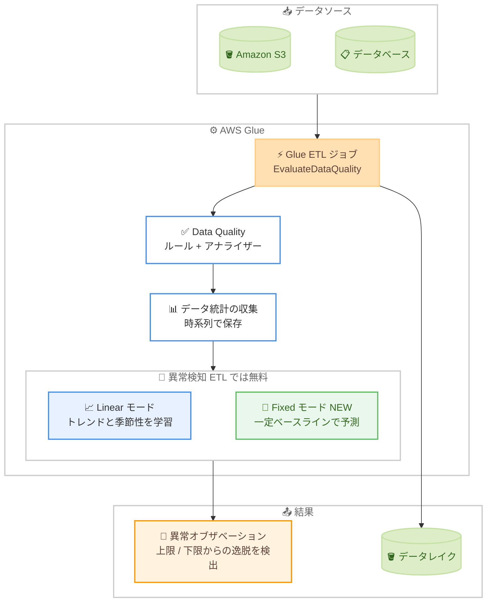

# AWS Glue Data Quality - ETL 異常検知の無料化と異常予測の改善

**リリース日**: 2026 年 8 月 5 日
**サービス**: AWS Glue (AWS Glue Data Quality)
**機能**: ETL ジョブにおける異常検知 (Anomaly Detection) の無料化と、新しい観測モード (Fixed モード) による異常予測の改善

📊 [このアップデートのインフォグラフィックを見る](https://takech9203.github.io/aws-news-summary/20260805-aws-glue-data-quality-anomaly-detection-free.html)

## 概要

AWS Glue Data Quality の異常検知 (Anomaly Detection) 機能が強化され、誤検知 (false anomaly) を削減する新しい観測モードが追加されるとともに、AWS Glue ETL ジョブにおける異常検知の料金が無料化されました。これにより、すべての Glue パイプラインでコストを気にすることなくデータ品質の異常を監視できるようになります。

新しい観測モード (Fixed モード) は、線形トレンドではなく一定のベースラインを使用することでトレンドの過剰な外挿を回避し、より正確なアラートとノイズの削減を実現します。特に、ノートブックベースの探索的ワークフローや、不規則な間隔でデータが到着するケースで効果を発揮します。データエンジニアやアナリティクスチームは、本物の異常に集中できるようになります。

このアップデートは、AWS Glue Data Quality を利用してデータレイクやデータパイプラインの品質を監視しているすべてのユーザーが対象であり、すべての AWS 商用リージョンと AWS GovCloud (US) リージョンで利用可能です。

**アップデート前の課題**

- 以前は、AWS Glue ETL ジョブで異常検知を有効化すると、統計 (statistic) ごとに 1 DPU の追加料金が発生し、大規模なパイプラインではコストが懸念事項だった
- 異常検知アルゴリズムは線形トレンドとシーズナリティを前提としていたため、フラットなデータやランダムに変動するデータ、不規則なスケジュールで実行されるワークロードでは、トレンドを過剰に外挿して誤検知が発生しやすかった
- ノートブックなどのインタラクティブ環境で不定期にデータ品質チェックを実行すると、実行間隔のばらつきにより不正確な予測レンジが算出され、ノイズとなるアラートが増加していた

**アップデート後の改善**

- AWS Glue ETL ジョブにおける異常検知が追加コストなしで利用可能になり、すべての Glue パイプラインで異常監視を有効化しやすくなった
- 新しい観測モード (Fixed モード) により、線形トレンドの代わりに一定のベースラインを使用して予測を行い、誤検知を削減できるようになった
- 不規則なデータ到着間隔を適切に処理できるようになり、探索的データ分析やノートブック環境でも精度の高い異常検知が可能になった

## アーキテクチャ図



Glue ETL ジョブがデータ品質評価で収集した統計を時系列で保存し、機械学習ベースの異常検知が予測レンジからの逸脱を検出する流れを示しています。今回のアップデートで、ETL ジョブでの異常検知が無料になり、Fixed モード (一定ベースライン) が選択可能になりました。

## サービスアップデートの詳細

### 主要機能

1. **ETL ジョブにおける異常検知の無料化**
   - AWS Glue ETL ジョブでの異常検知が追加コストなしで利用可能になった
   - 従来は統計ごとに 1 DPU の追加課金が発生していたが、ETL ジョブではこの課金が撤廃された
   - すべての Glue パイプラインで、料金を気にせずデータ品質の異常監視を有効化できる

2. **新しい観測モード (Fixed モード) の追加**
   - 実行間隔の実際の時間差に関係なく、すべてのデータポイントを等間隔として扱う
   - 時間ベースの増加や減少を仮定せず、観測値から一定のベースラインを確立して予測する
   - 線形トレンドの過剰な外挿を回避し、誤検知を削減してアラートの精度を向上させる

3. **従来モード (Linear モード) との使い分け**
   - Linear モード (デフォルト) はデータのトレンドとシーズナリティ (週次・日次パターン) を学習して外挿する
   - Fixed モードはフラットまたはランダムに変動するデータ、不規則な実行間隔、ノートブックでの探索的分析に適する
   - モードは評価実行時にパラメータで指定でき、未指定の場合は Linear モードが使用される

## 技術仕様

### 異常検知モードの比較

| 項目 | Linear モード (デフォルト) | Fixed モード (新規) |
|------|--------------------------|---------------------|
| 予測方法 | トレンドと季節性を学習して外挿 | 一定のベースラインから予測 |
| 時間間隔の扱い | 実行間隔の時間差を考慮 | すべてのデータポイントを等間隔として扱う |
| 適したデータ | 一貫した増加・減少トレンド、季節パターンのあるデータ | フラットまたはランダムに変動するデータ |
| 適した実行パターン | 定期的なスケジュール実行 | 不規則・予測不能な間隔での実行 |
| 適したユースケース | 確立されたトレンドの逸脱検出 | ノートブックでの探索的分析、ユーザー主導のデータ変更 |

### 異常検知の基本仕様

| 項目 | 詳細 |
|------|------|
| 最小データポイント数 | 異常検知には最低 3 つのデータポイントが必要 |
| 統計の保存上限 | アカウントあたり 100,000 統計 |
| 統計の保存期間 | 最大 2 年間 (保存自体は無料) |
| 暗号化 | AWS KMS キーによる統計の暗号化に対応 |
| 対象 | AWS Glue ETL および AWS Glue Data Catalog の異常検知 |
| ETL ジョブ設定 | `observations.scope` / `observations.mode` オプション |
| Data Catalog 設定 | `AdditionalRunOptions` の `ObservationScope` / `ObservationMode` フィールド |

### API 変更履歴

| 日付 | サービス | 変更内容 |
|------|----------|----------|
| 2026/07/27 | [glue](https://awsapichanges.com/archive/changes/1ea078-glue.html) | 1 new 8 updated api methods - 異常検知用の `ObservationScope` / `ObservationMode` パラメータの追加、複数の評価実行を一括取得する `BatchGetDataQualityRulesetEvaluationRun` API の追加など |

### 設定例

ETL ジョブでは、`EvaluateDataQuality` の追加オプションで観測モードを指定します。

```python
additional_options = {
    "observations.scope": "ALL",
    "observations.mode": "FIXED"
}

result = EvaluateDataQuality.process_rows(
    frame=dynamic_frame,
    ruleset=ruleset,
    publishing_options=publishing_options,
    additional_options=additional_options
)
```

## 設定方法

### 前提条件

1. AWS Glue Data Quality のルールまたはアナライザーが設定済みであること
2. Glue ジョブまたは評価実行に使用する IAM ロールに適切な権限が付与されていること
3. 異常検知には最低 3 回分のデータ統計 (データポイント) が蓄積されている必要があること

### 手順

#### ステップ 1: ルールとアナライザーの定義

```
Rules = [
    RowCount > 0,
    IsComplete "passenger_count"
]

Analyzers = [
    AllStatistics "fare_amount",
    DistinctValuesCount "pulocationid",
    RowCount
]
```

DQDL (Data Quality Definition Language) でデータへの期待値をルールとして定義します。具体的なルールを書けない列は、アナライザーで統計のみを収集して異常検知の対象にできます。

#### ステップ 2: ETL ジョブで異常検知を有効化

```python
additional_options = {
    "observations.scope": "ALL",
    "observations.mode": "FIXED"
}

result = EvaluateDataQuality.process_rows(
    frame=dynamic_frame,
    ruleset=ruleset,
    publishing_options=publishing_options,
    additional_options=additional_options
)
```

`observations.scope` を `ALL` に設定して異常検知を有効化し、`observations.mode` でモードを指定します。定期実行でトレンドのあるデータには `LINEAR` (デフォルト)、不規則実行やフラットなデータには `FIXED` を選択します。

#### ステップ 3: Data Catalog テーブルでの評価実行 (オプション)

```bash
aws glue start-data-quality-ruleset-evaluation-run \
  --data-source '{
    "GlueTable": {
      "DatabaseName": "my_database",
      "TableName": "my_table"
    }
  }' \
  --role "arn:aws:iam::123456789012:role/GlueServiceRole" \
  --ruleset-names '["my_ruleset"]' \
  --additional-run-options '{
    "ObservationScope": "ALL",
    "ObservationMode": "FIXED"
  }'
```

Data Catalog に登録されたテーブルに対して、異常検知を有効化 (`ObservationScope: ALL`) した品質評価実行を開始するコマンドです。`ObservationMode` で Fixed モードを指定しています。

#### ステップ 4: 異常オブザベーションの確認とフィードバック

AWS Glue Studio の Data Quality 画面で検出された異常 (Anomaly Observation) を確認します。検出された異常値は以降のモデル学習で正常値として扱われるため、真の異常については明示的に除外 (exclude) のフィードバックを行い、モデルの精度を維持します。

## メリット

### ビジネス面

- **監視コストの削減**: ETL ジョブでの異常検知が無料になったことで、これまでコストを理由に異常検知を限定的にしか使えなかったチームも、全パイプラインへの適用を検討できる
- **データ品質インシデントの早期発見**: 固定しきい値のルールでは検出できないビジネス環境の変化やパイプライン障害による異常を、機械学習ベースで自動検出できる
- **アラート疲れの軽減**: 誤検知の削減により、担当者が本物の異常への対応に集中でき、運用負荷が軽減される

### 技術面

- **不規則な実行パターンへの対応**: Fixed モードにより、ノートブックでのアドホックな実行や不定期なスケジュールでも精度の高い異常検知が可能
- **過剰外挿の回避**: 一定のベースラインを使用することで、フラットまたはランダムなデータに対して線形トレンドを誤って当てはめる問題を解消
- **導入の容易さ**: 既存の `EvaluateDataQuality` 変換にオプションを 1 つ追加するだけでモードを切り替えられ、既存パイプラインへの影響が最小限

## デメリット・制約事項

### 制限事項

- 異常検知には最低 3 つのデータポイント (過去の統計) が必要であり、導入直後は異常を検出できない
- 統計の保存はアカウントあたり 100,000 統計が上限で、保存期間は最大 2 年間
- 無料化の対象は AWS Glue ETL ジョブにおける異常検知であり、Data Catalog での異常検知は引き続き統計ごとに 1 DPU の課金が発生する (料金ページの記載に基づく)

### 考慮すべき点

- 検出された異常値は以降のモデルで正常値として学習されるため、真の異常は明示的に除外するフィードバック運用が必要
- Fixed モードは時間ベースのトレンドや季節性を学習しないため、明確なトレンドや週次・日次パターンを持つデータには Linear モードの方が適する
- モード未指定時は Linear モードが使用されるため、探索的ワークフローでは明示的に `FIXED` を指定する必要がある

## ユースケース

### ユースケース 1: 全 ETL パイプラインへの異常監視の標準適用

**シナリオ**: 数百の Glue ETL パイプラインを運用するデータプラットフォームチームが、コストの制約からこれまで重要パイプラインのみに異常検知を適用していた。無料化を機に全パイプラインへ展開する。

**実装例**:
```python
# 共通の Data Quality 設定を全ジョブに適用
additional_options = {
    "observations.scope": "ALL"
    # 定期実行ジョブのためデフォルトの LINEAR モードを使用
}
result = EvaluateDataQuality.process_rows(
    frame=dynamic_frame,
    ruleset=common_ruleset,
    publishing_options=publishing_options,
    additional_options=additional_options
)
```

**効果**: 追加コストなしで全パイプラインの行数・完全性などの統計を継続監視でき、上流システムの障害による静かなデータ欠損を早期に検出できる。

### ユースケース 2: ノートブックでの探索的データ分析における品質チェック

**シナリオ**: データサイエンティストが Glue Studio ノートブックや Interactive Sessions で不定期にデータセットを検証している。実行間隔がばらばらのため、従来の線形トレンドベースの予測では誤検知が多発していた。

**実装例**:
```python
additional_options = {
    "observations.scope": "ALL",
    "observations.mode": "FIXED"
}
result = EvaluateDataQuality.process_rows(
    frame=exploration_frame,
    ruleset=ruleset,
    publishing_options=publishing_options,
    additional_options=additional_options
)
```

**効果**: 実行間隔に依存しない一定ベースラインでの予測により、ノイズとなるアラートが減り、実際のデータ品質問題のみに注目できる。

### ユースケース 3: フラットな参照データ・マスタデータの監視

**シナリオ**: 店舗マスタや商品カテゴリなど、通常はほぼ一定件数で推移し、ユーザー主導の更新で変化する参照データを監視したい。自然な増加トレンドがないため、Linear モードではトレンドの過剰外挿が発生していた。

**実装例**:
```bash
aws glue start-data-quality-ruleset-evaluation-run \
  --data-source '{"GlueTable": {"DatabaseName": "master", "TableName": "stores"}}' \
  --role "arn:aws:iam::123456789012:role/GlueServiceRole" \
  --ruleset-names '["master_ruleset"]' \
  --additional-run-options '{"ObservationScope": "ALL", "ObservationMode": "FIXED"}'
```

**効果**: 一定ベースラインからの逸脱のみを異常として検出するため、マスタデータの大量欠損や重複投入といった本当に対応が必要な変化を的確に捉えられる。

## 料金

今回のアップデートにより、**AWS Glue ETL ジョブにおける異常検知は追加料金なし**で利用できるようになりました。ETL ジョブ内のデータ品質チェック自体は、従来どおりジョブの実行時間・DPU 消費の増加分として課金されます。

AWS Glue Data Catalog での異常検知については、料金ページの記載に基づくと、引き続き統計ごとに 1 DPU で異常検知にかかった時間分の課金が発生します (1 統計あたり平均 10〜20 秒程度)。また、モデルの再学習 (統計の除外・包含) にも 1 DPU の課金があります。統計の保存自体は無料です。

### 料金例

| 使用量 | 月額料金 (概算) |
|--------|-----------------|
| ETL ジョブ (6 DPU、20 分、日次実行) + 異常検知有効 | 6 DPU × 1/3 時間 × $0.44 × 30 日 = 約 $7.92 (異常検知の追加料金は $0) |
| Data Catalog 評価 (20 統計、異常検知 15 秒/統計、日次実行) | 異常検知分: 20 × 1 DPU × 15/3600 時間 × $0.44 × 30 日 = 約 $1.10 |

最新の料金は [AWS Glue 料金ページ](https://aws.amazon.com/glue/pricing/) を参照してください。

## 利用可能リージョン

すべての AWS 商用リージョンおよび AWS GovCloud (US) リージョンで利用可能です。

## 関連サービス・機能

- **AWS Glue Data Catalog**: Data Catalog に登録されたテーブルに対しても、評価実行時に `ObservationScope: ALL` を指定することで異常検知を有効化できる
- **AWS Glue Studio**: 検出された異常オブザベーションの可視化 (実測値、導出トレンド、上限・下限) と、異常の除外・承認によるモデルへのフィードバックが可能
- **Amazon CloudWatch / Amazon EventBridge**: データ品質結果や異常検知結果をもとにアラート通知や後続処理の自動化を構成できる
- **AWS KMS**: Glue サービス内に保存されるデータ品質統計を KMS キーで暗号化できる

## 参考リンク

- 📊 [インフォグラフィック](https://takech9203.github.io/aws-news-summary/20260805-aws-glue-data-quality-anomaly-detection-free.html)
- [公式発表 (What's New)](https://aws.amazon.com/about-aws/whats-new/2026/08/aws-glue-data-quality-anomaly-detection-free)
- [ドキュメント: Anomaly detection in AWS Glue Data Quality](https://docs.aws.amazon.com/glue/latest/dg/data-quality-anomaly-detection.html)
- [AWS Glue 料金ページ](https://aws.amazon.com/glue/pricing/)
- [API 変更履歴 (awsapichanges.com)](https://awsapichanges.com/archive/changes/1ea078-glue.html)

## まとめ

AWS Glue ETL ジョブでの異常検知が無料化されたことで、コストを理由に異常監視を見送っていたパイプラインにも気軽に適用できるようになりました。あわせて追加された Fixed モードにより、ノートブックでの探索的分析や不規則な実行間隔のワークロードでも誤検知を抑えた精度の高い監視が可能です。まずは主要な ETL ジョブで `observations.scope: ALL` を設定して異常検知を有効化し、データ特性に応じて Linear / Fixed モードを使い分けることを推奨します。
